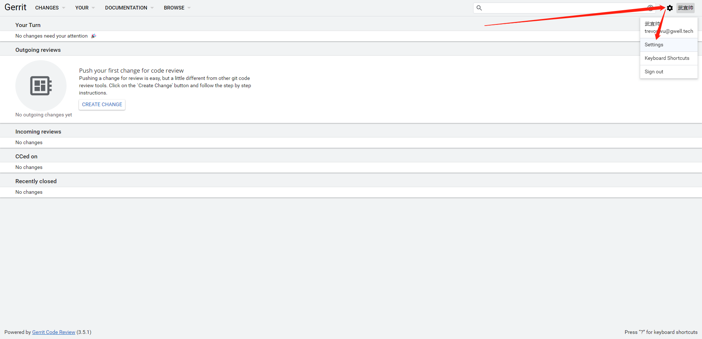
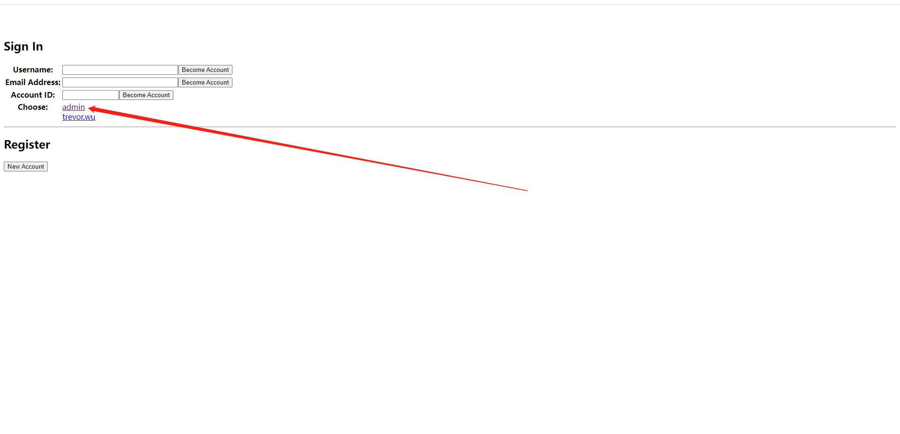
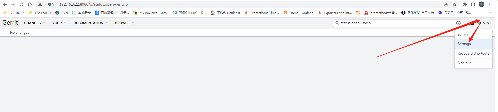
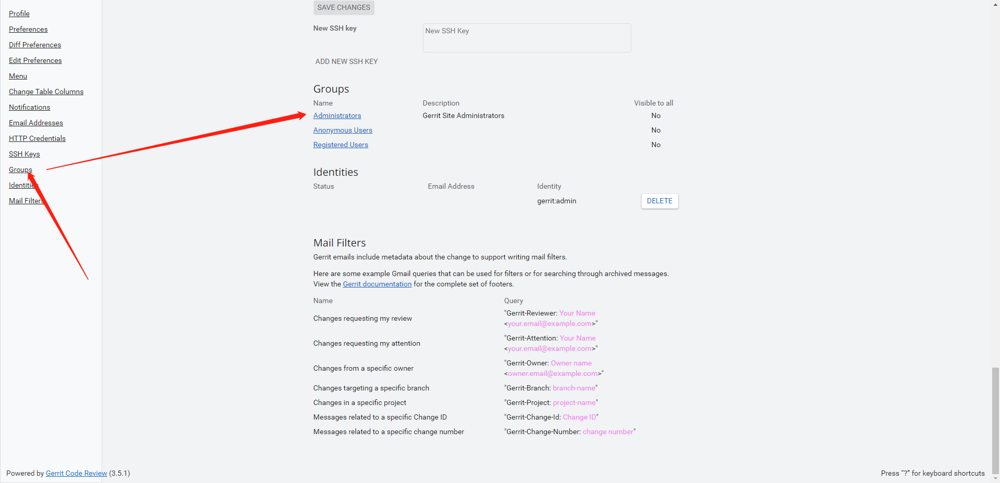
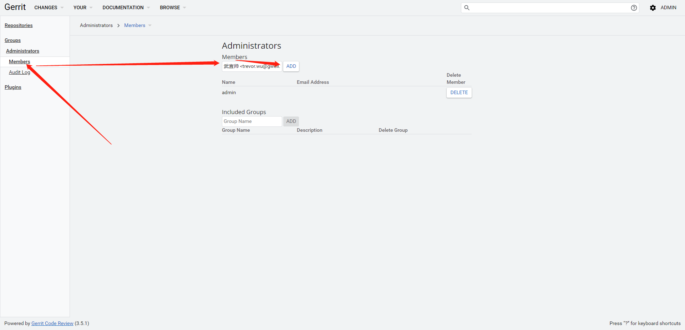
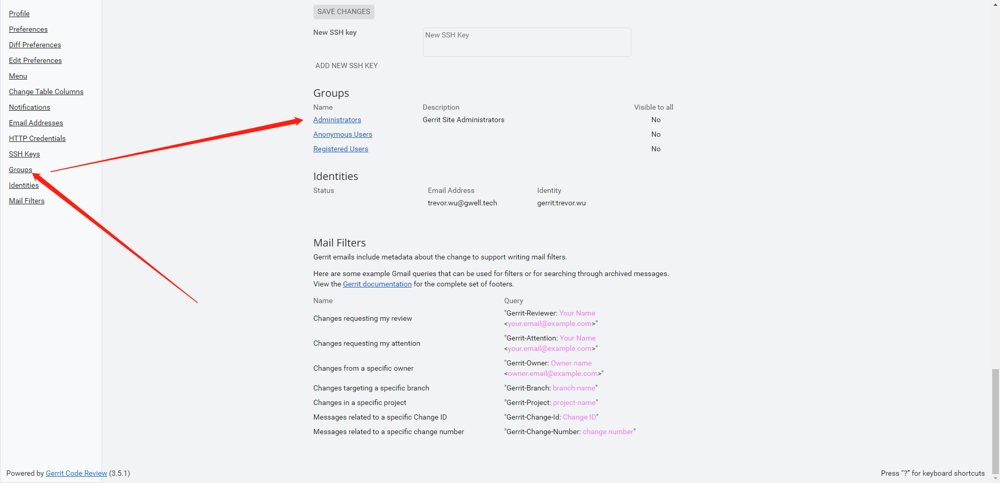

# gerrit+Ldap验证

## 一、停止gerrit

```bash
cd /home/gerrit2/gerrit_site/bin
bash gerrit.sh stop
systemctl stop gerrit
```

## 二、修改gerrit配置，验证ldap登录

### 1、原配置备份

```bash
cd /home/gerrit2/gerrit_site/etc
cp gerrit.config gerrit.config`date +%Y-%m-%d`
```

### 2、修改配置文件

#### 1.gerrit.config

```bash
vim gerrit.config
...
[auth]
        type = ldap
        gitBasicAuthPolicy = HTTP
[ldap]
        server = ldap://172.16.0.90
        username = cn=ldapadmin,ou=trevor,dc=trevor,dc=local
        accountBase = ou=研发中心,ou=trevor,dc=trevor,dc=local
        accountFullName = displayName
        accountEmailAddress = mail
        accountSshUserName = sAMAccountName
        accountMemberField = memberOf
        accountPattern = (&(objectClass=person)(sAMAccountName=${username}))
        groupBase = ou=研发中心,ou=trevor,dc=trevor,dc=local
        groupPattern = ((&(objectClass=group)(cn=${groupname}))
        groupName = cn
        groupsVisibleToAll = true
        referral = follow
        fetchMemberofEagerly = true
...
[httpd]
        listenUrl = http://*:8080/
```

#### 2.secure.config

```bash
vim secure.config
...
[ldap]
	    password = ldapadmin@666
```


### 3、启动gerrit

```bash
systemctl start gerrit
```

## 三、对账户进行授权

### 1、**点击设置，你会发现jason没有管理员权限**



### 2、**使用"development_become_any_account"进行认证，然后把对应用户用户加入到管理员组**

#### 1.修改配置文件

```bash
[auth]
        type = development_become_any_account
        gitBasicAuthPolicy = HTTP
```

#### 2.重启gerrit

```bash
systemctl restart gerrit.service
```

#### 3.登录管理员账户



#### 4.点击设置



#### 5.进入管理员组



#### 6.搜索用户，加入管理员组中



#### 7.认证方式改回ldap

```bash
[auth]
        type = ldap
        gitBasicAuthPolicy = HTTP
```

#### 8.重启gerrit

```bash
systemctl restart gerrit.service
```

#### 9.登录gerrit查看用户组




