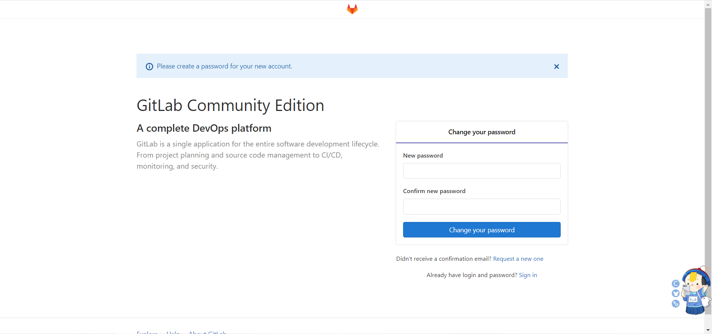

# Gitlab安装

## 一、介绍


```bash
	GitLab 是一个用于仓库管理系统的开源项目，使用Git作为代码管理工具，并在此基础上搭建起来的
web服务。
	GitLab和GitHub一样属于第三方基于Git开发的作品（私有仓库），GITLAB免费且开源(基于MIT协议)，与Github类似， 可以注册用户，任意提交你的代码，添加SSHKey等等。不同的是，GitLab是可以部署到自己的服务器 上，数据库等一切信息都掌握在自己手上，适合团队内部协作开发，你总不可能把团队内部的智慧总放 在别人的服务器上吧?简单来说可把GitLab看作个人版的GitHub。
	Gitlab是依赖于Git的远程代码仓库，类似于GitHub、Gitee,不同的是GitHub、Gitee的公网上代码仓库, Gitlab是可以私有化部署的免费远程代码仓库
```

## 二、Centos部署

### 1、准备服务器

| IP            | CPU核心 | 内存 |
| ------------- | ------- | ---- |
| 192.168.15.60 | 2       | 3    |

### 2、下载安装包

```bash
wget https://mirrors.tuna.tsinghua.edu.cn/gitlab-ce/yum/el7/gitlab-ce-13.0.3-ce.0.el7.x86_64.rpm
```


### 3、解决依赖

```bash
yum install -y policycoreutils openssh-server openssh-clients postfix perl policycoreutils-python curl
```


### 4、关闭防火墙

```bash
systemctl disable --now firewalld
```


### 5、关闭selinux

```bash
sed -i 's#enforcing#disabled#g' /etc/sysconfig/selinux
setenforce 0
```


### 6、安装

```bash
yum localinstall -y gitlab-ce-13.0.3-ce.0.el7.x86_64.rpm 
```


### 7、修改配置文件

```bash
vim /etc/gitlab/gitlab.rb
...
external_url 'http://192.168.15.60'
...
nginx['listen_port'] = 80
...
```


### 8、刷新配置（默认启动）

```bash
gitlab-ctl reconfigure
```


### 9、启动

```bash
gitlab-ctl start
```


### 10、页面访问

http://192.168.15.60/



## 三、Debian-docker部署

### 1、docker-compose

```yaml
version: '3.8'

services:
  gitlab:
    image: gitlab/gitlab-ce:18.3.1-ce.0
    container_name: gitlab
    restart: always
    hostname: gitlab.gmbaifa.online  # 修改为你的域名或主机名
    ports:
      - "8443:443"
      - "8080:80"
      - "8022:22"
    volumes:
      - ./etc:/etc/gitlab
      - ./log:/var/log/gitlab
      - ./opt:/var/opt/gitlab
    networks:
      - gitlab_net

  gitlab-runner:
    image: gitlab/gitlab-runner:v18.3.0
    container_name: gitlab-runner
    restart: always
    depends_on:
      - gitlab
    privileged: true   # 必须，加上才能用 dind
    volumes:
#      - /var/run/docker.sock:/var/run/docker.sock
      - ./runner:/etc/gitlab-runner
    networks:
      - gitlab_net

  docker-dind:
    image: docker:28.3.3-dind
    container_name: docker-dind
    restart: always
    privileged: true
    environment:
      DOCKER_TLS_CERTDIR: ""   # 关闭 TLS，runner 里好用
    volumes:
      - ./dind:/var/lib/docker
    networks:
      - gitlab_net

networks:
  gitlab_net:
    driver: bridge
```

## 四、K8s部署

### 1、Deployment.yaml

```yaml
apiVersion: apps/v1
kind: Deployment
metadata:
  name: gitlab
spec:
  replicas: 1
  strategy:
    type: Recreate
  selector:
    matchLabels:
      app: gitlab
  template:
    metadata:
      labels:
        app: gitlab
    spec:
      containers:
        - name: gitlab
          image: gitlab/gitlab-ce:18.3.1-ce.0
          ports:
            - containerPort: 8022
            - containerPort: 80
            - containerPort: 443
          env:
            - name: GITLAB_OMNIBUS_CONFIG
              value: |
                external_url 'http://gitlab-devops-k8s-local.gmbaifa.online'
                gitlab_rails['gitlab_shell_ssh_port'] = 8022
            - name: TZ
              value: Asia/Shanghai
          volumeMounts:
            - name: etc
              mountPath: /etc/gitlab
            - name: log
              mountPath: /var/log/gitlab
            - name: opt
              mountPath: /var/opt/gitlab
      volumes:
        - name: etc
          nfs:
            server: 192.168.6.108
            path: /cephfs/k8s-nfs/01_gitlab/etc
        - name: log
          nfs:
            server: 192.168.6.108
            path: /cephfs/k8s-nfs/01_gitlab/log
        - name: opt
          nfs:
            server: 192.168.6.108
            path: /cephfs/k8s-nfs/01_gitlab/opt
```

### 2、K8s服务暴漏

#### 1.service.yaml

```yaml
apiVersion: v1
kind: Service
metadata:
  name: gitlab-service
spec:
  selector:
    app: gitlab
  ports:
    - name: http-port
      protocol: TCP
      port: 80
      targetPort: 80
---
apiVersion: v1
kind: Service
metadata:
  name: gitlab-service-ssh
spec:
  selector:
    app: gitlab
  ports:
    - name: ssh-port
      protocol: TCP
      port: 8022
      targetPort: 8022
      nodePort: 8022
  type: NodePort
```

#### 2.Ingress.yaml

```yaml
apiVersion: apisix.apache.org/v2
kind: ApisixRoute
metadata:
  name: gitlab
spec:
  ingressClassName: apisix
  http:
  - name: gitlab
    match:
      hosts:
      - gitlab-devops-k8s-local.gmbaifa.online
      paths:
      - /*
    backends:
    - serviceName: gitlab-service
      servicePort: 80
    plugins:
      - name: redirect
        enable: true
        config:
          http_to_https: true
```

