# Gitlab页面操作

## 一、设置超管密码

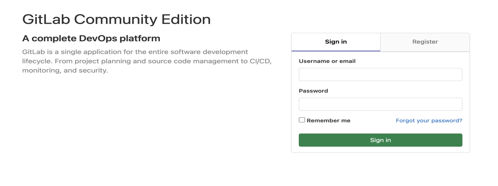

## 二、登录

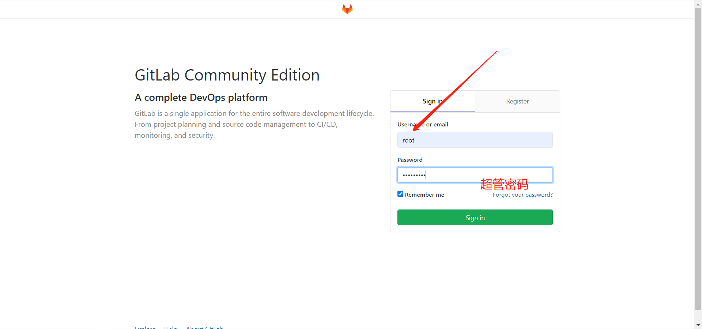


## 三、设置中文界面

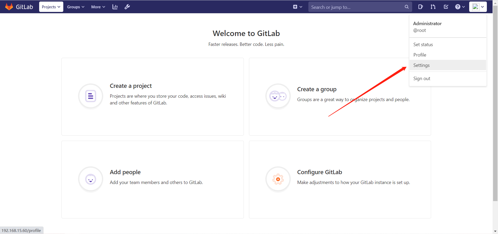

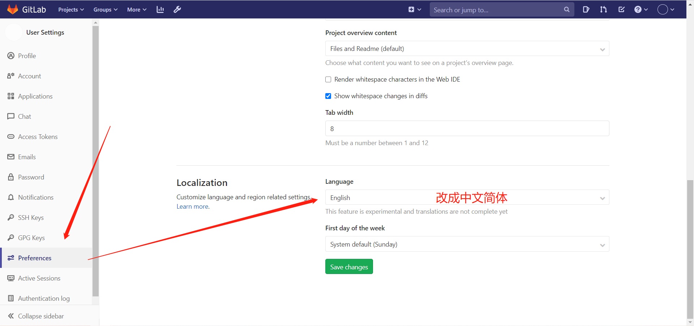


**Save 然后刷新页面，可以根据自己需要修改其他设置**


## 四、创建组

```bash
	使用管理员 root 创建组，一个组里面可以有多个项目分支，可以将开发添加到组里面进行设置权限， 不同的组就是公司不同的开发项目或者服务模块，不同的组添加不同的开发即可实现对开发设置权限的管理。
```

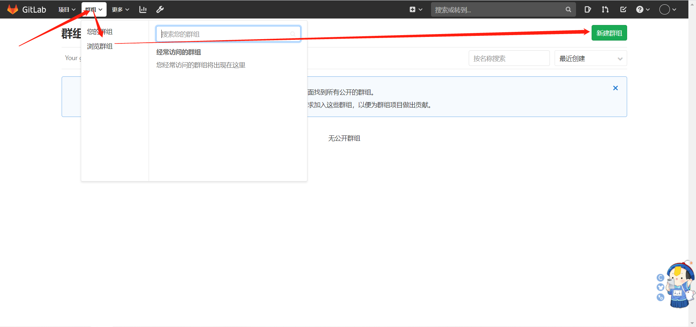

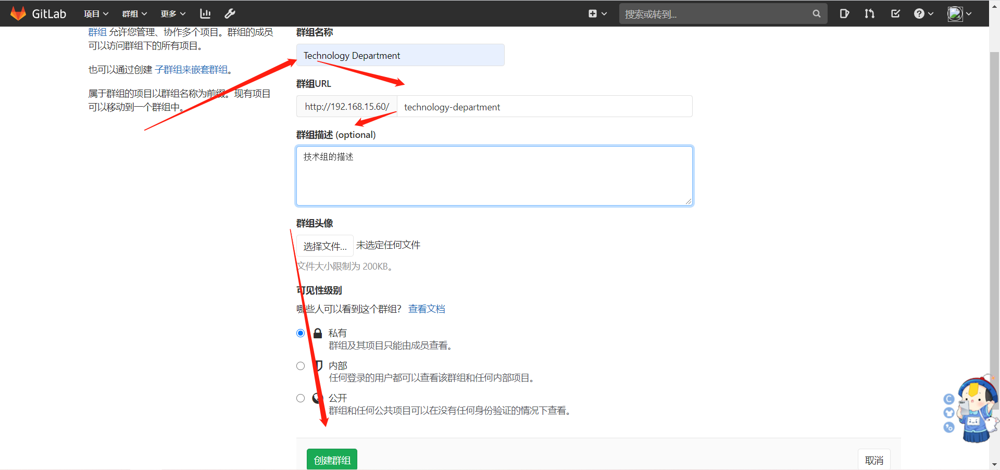


## 五、创建用户

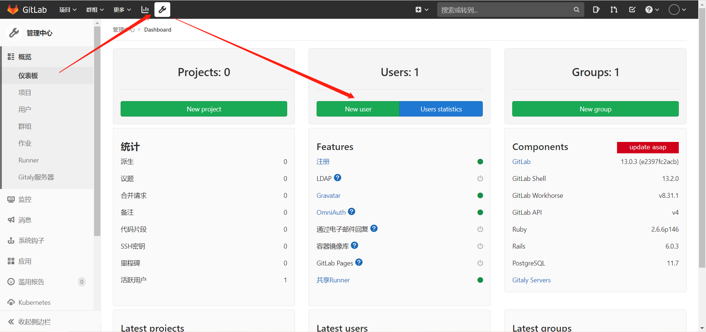

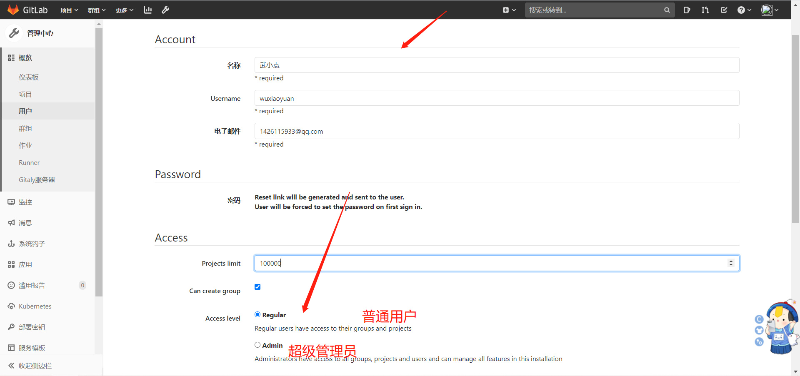

**相关信息输入后点击创建就行**


## 六、将用户添加到指定组

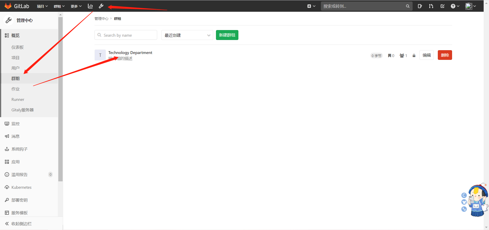

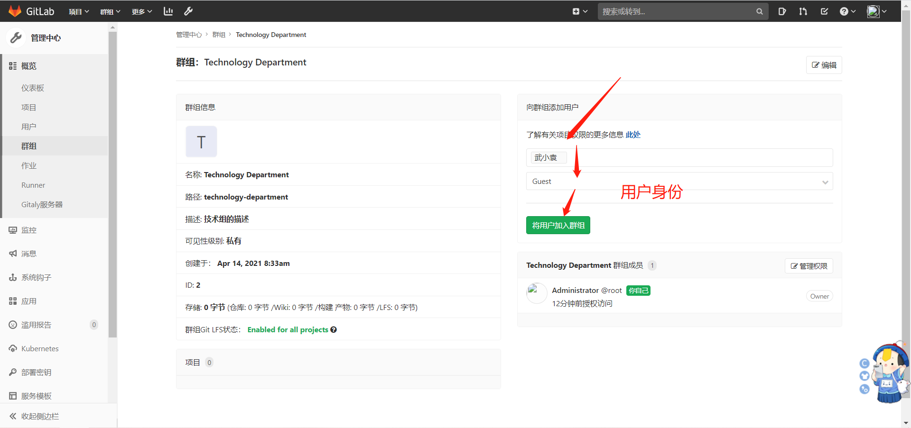

### 1、**用户的五种身份**

| 分身       | 解释                                                         |
| ---------- | ------------------------------------------------------------ |
| Guest      | 游客：可以提问、发表评论，不能读写版本库                     |
| Reporter   | 普通用户：可以克隆代码，不能提交，QA、PM 可以赋予这个权限    |
| Developer  | 开发者：可以克隆代码、开发、提交、push，普通开发可以赋予这个权限 |
| Maintainer | 维护者：可以创建项目、添加tag、保护分支、添加项目成员、编辑项目，核心开发可以赋予这个 权限 |
| Owner      | 所有者：可以设置项目访问权限 - Visibility Level、删除项目、迁移项目、管理组成员，开发组组长可以赋予这个权限 |

### 2、权限修改

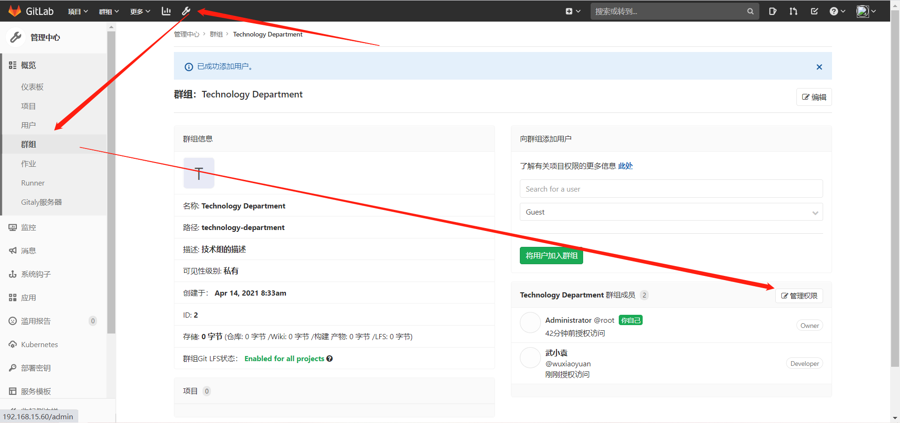

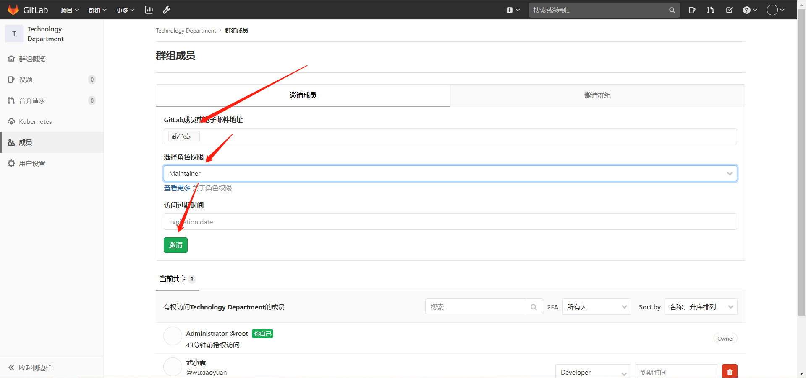


## 七、创建项目

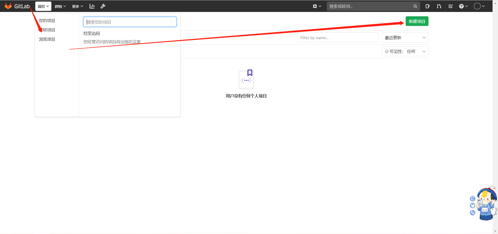

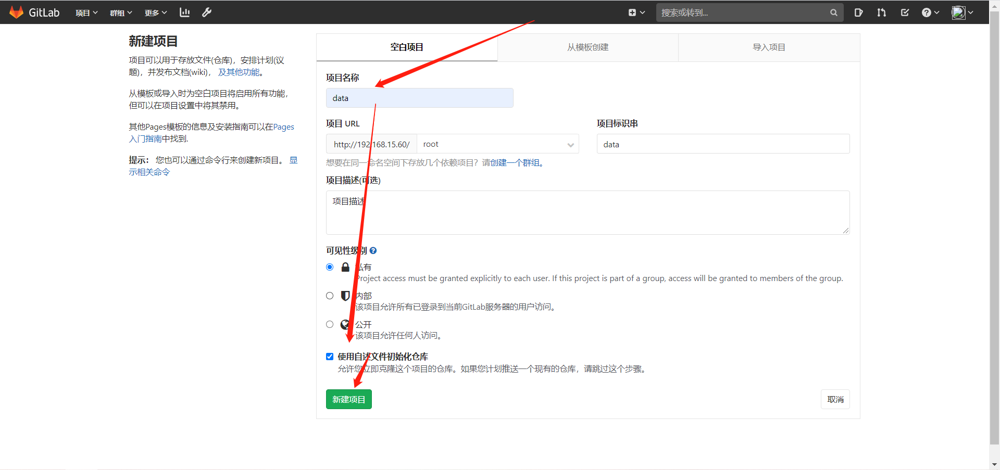

