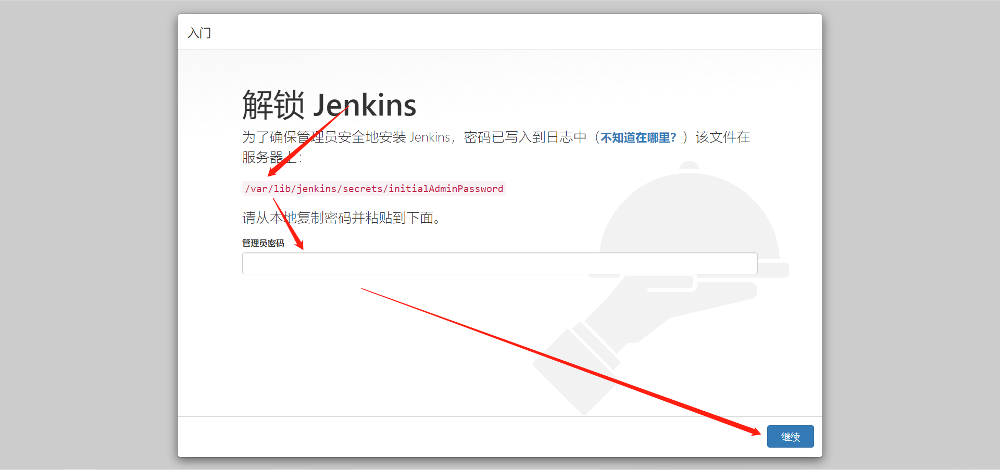
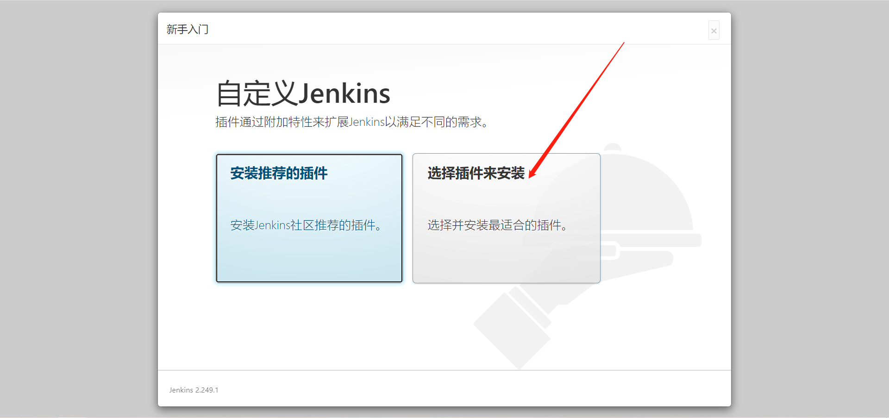
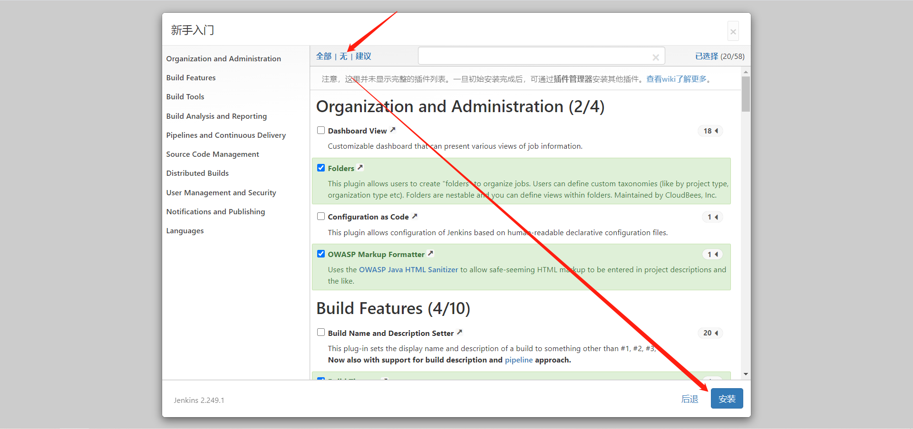
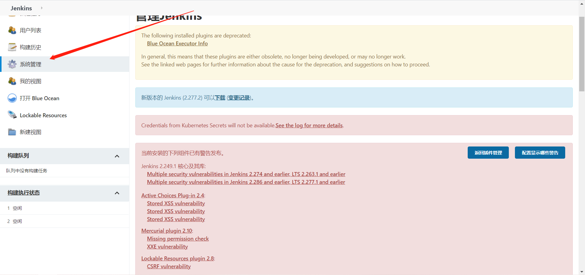
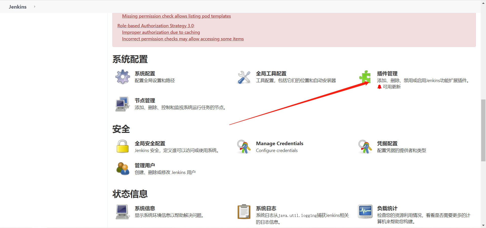
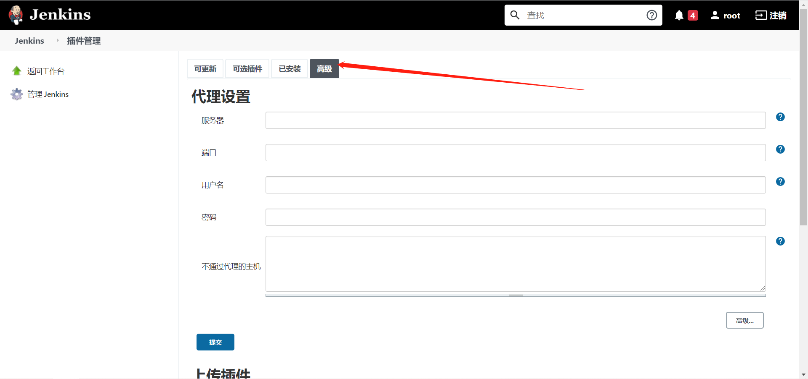
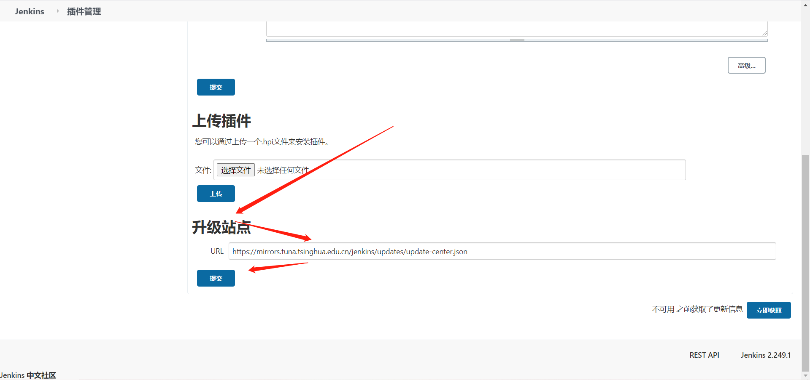

# Jenkins安装及优化

```bash
Jenkins是一个自动化部署的工具。依赖于Java开发的，由各种组件组成的一个自动化部署工具。
```


## 一、安装

### 1、环境规划

| ip地址      | 服务                       | 内存 |
| ----------- | -------------------------- | ---- |
| 172.16.0.60 | jenkins(tomcat + jdk) 8080 | 24G  |

### 2、安装java环境

```bash
sudo apt-get install openjdk-8-jdk
java -version
```


### 3、安装daemon依赖

```bash
sudo apt-get install -y daemon
```


### 4、获取jenkins安装包

```bash
cd /tmp
sudo wget https://mirrors.tuna.tsinghua.edu.cn/jenkins/debian-stable/jenkins_2.303.1_all.deb
```


### 5、安装jenkins

```bash
sudo dpkg -i jenkins_2.303.1_all.deb
```


### 6、启动Jenkins

**ubuntu默认安装好了jenkins**

```bash
sudo systemctl start jenkins
sudo systemctl enable jenkins
```


## 二、页面访问并修改密码

访问

http://172.16.0.60:8080/

### 1、输入自动生成的密码

```bash
sudo cat /var/lib/jenkins/secrets/initialAdminPassword
6f37c2b9cb014747a39d2b81e691b1f6
```





### 2、自己选择插件安装




### 3、不安装插件，等会手动安装




### 4、设置用户名和密码

略


### 5、登录

略


## 三、手动安装插件

```bash
#进入指定目录
cd /tmp

#上传
sudo rz

# 安装插件
sudo tar -xf plugins.tar.gz  -C /var/lib/jenkins/

#重启Jenkins
sudo systemctl restart jenkins
```


## 四、优化

### 1、修改更新和搜索URL

```bash
cd /var/lib/jenkins/updates
sudo sed -i 's/http:\/\/updates.jenkinsci.org\/download/https:\/\/mirrors.tuna.tsinghua.edu.cn\/jenkins/g' default.json
sudo sed -i 's/http:\/\/www.google.com/https:\/\/www.baidu.com/g' default.json
```


### 2、修改站点升级为国内下载地址









```bash
https://mirrors.tuna.tsinghua.edu.cn/jenkins/updates/update-center.json
```

**根据自己需要下载更新插件**


## 五、安装git

```bash
sudo apt-get install git -y
sudo apt-get install subversion -y
```


## 六、处理管理账户密码丢失问题

```bash
sudo vim /var/lib/jenkins/users/admin_7050982324762688703/config.xml 

<passwordHash>#jbcrypt:$2a$10$CEFbiUohDtWimNh4o3TBje2EEXgljqA/frbwED0Go5X533dd.jk6W</passwordHash>
替换成
<passwordHash>#jbcrypt:$2a$10$MiIVR0rr/UhQBqT.bBq0QehTiQVqgNpUGyWW2nJObaVAM/2xSQdSq</passwordHash>

然后密码使用123456登录
```

## 七、更新最新插件


## 八、与汉化插件冲突问题

```bash
卸载“Translation Assistance plugin”插件
```

