# 用户管理

## 一、创建用户

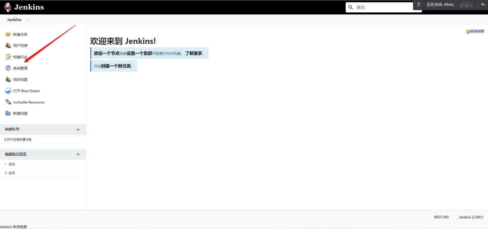

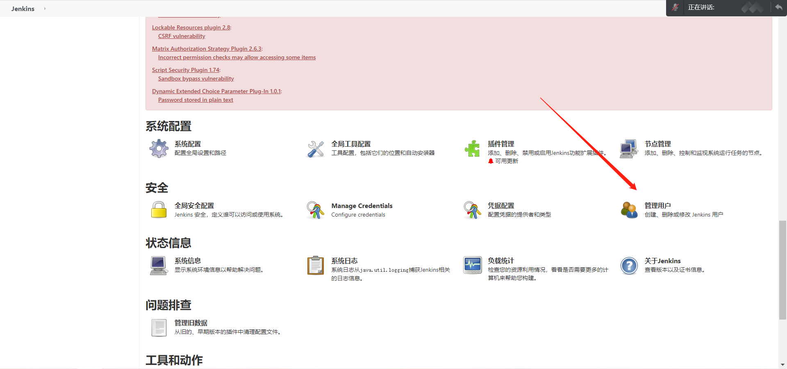

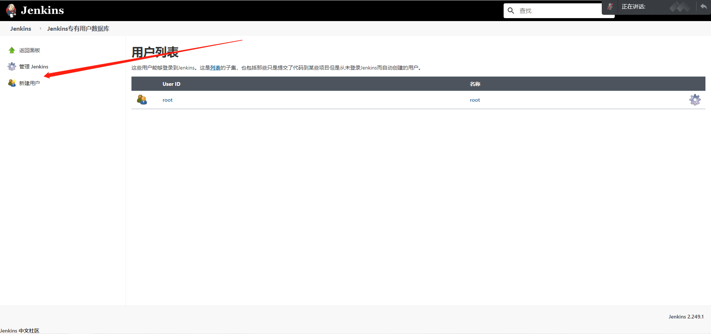

**输入相关信息，然后创建**


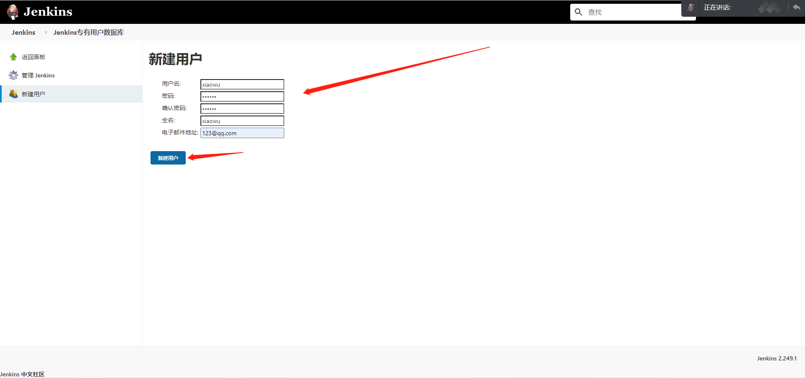


## 二、用户权限

**我们可以利用Role-based Authorization Strategy 插件来管理Jenkins用户权限**

### 1、配置安全授权策略

```bash
由于jenkins默认是任何人可以访问该系统，相当于裸奔，所以需要配置安全策略
```


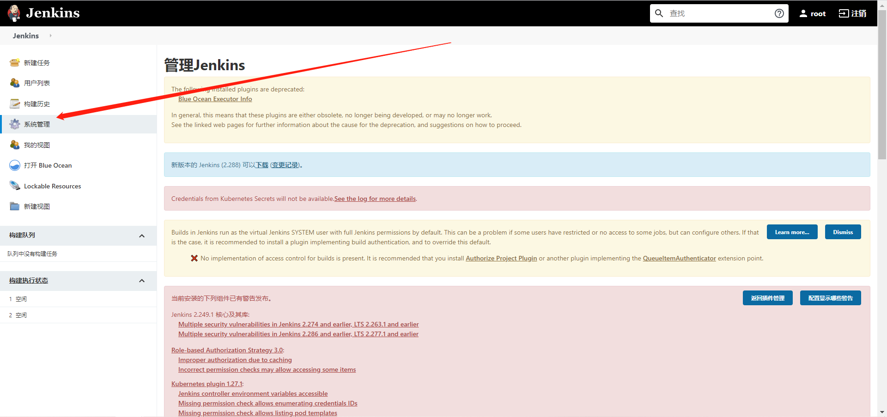

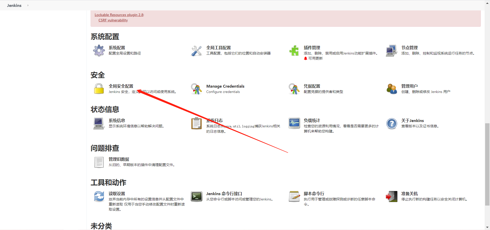

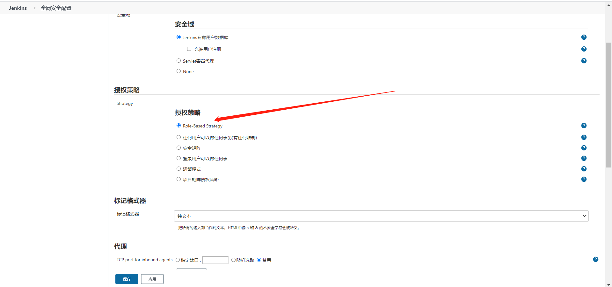


### 2、创建角色

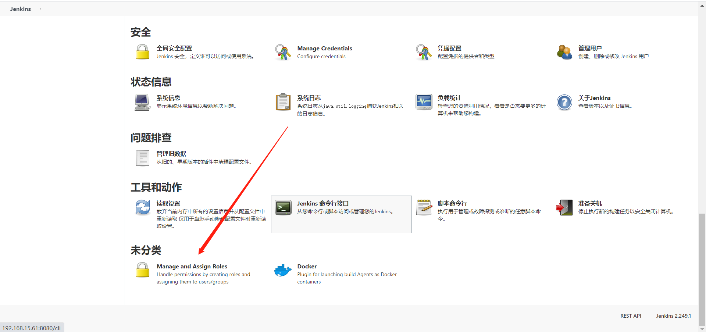

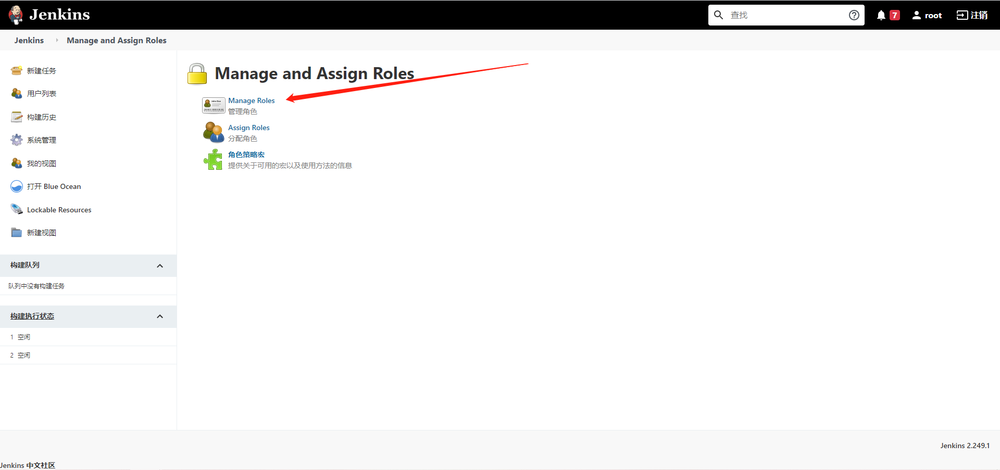

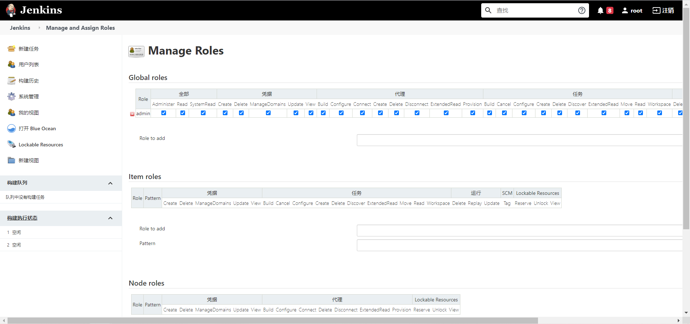


```bash
Global roles(全局角色):管理员等高级用户可以创建基于全局的角色 
Item roles(项目角色): 针对某个或者某些项目的角色 
Node roles(节点角色):节点相关的权限
```


#### 1）添加全局角色

```bash
创建Base users基础角色，所有用户都有查看的权限
```

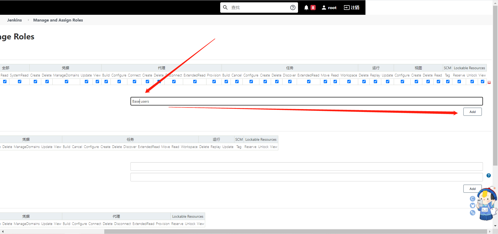

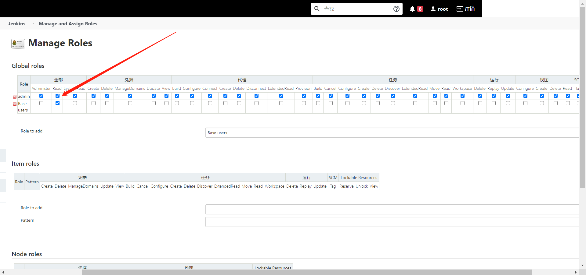


#### 2）创建项目角色

```bash
创建Project role项目角色，对project项目的相应权限
```

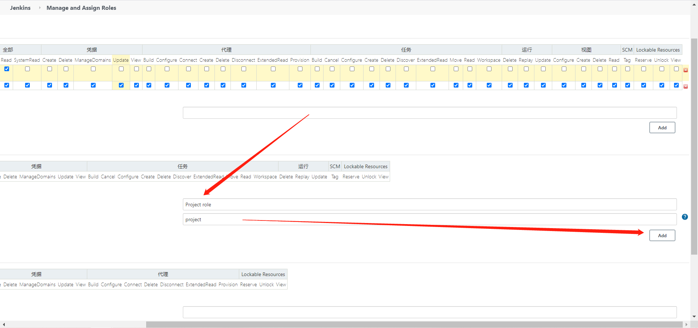

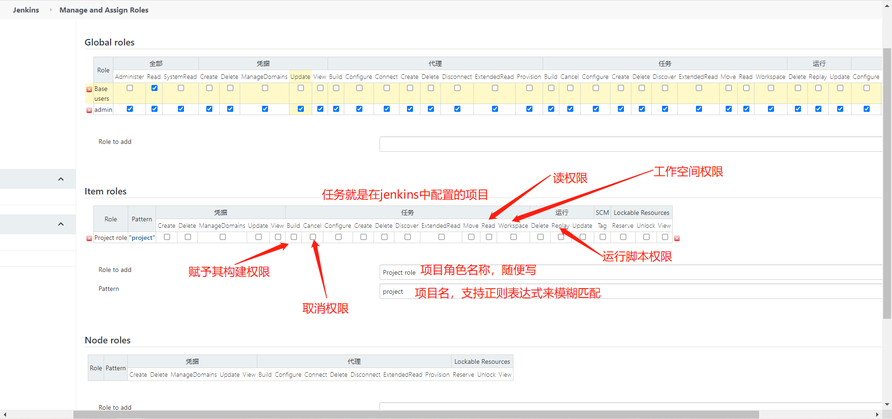

**pattern处的填写**

```bash
支持正则表达式，
	Roger-.表示所有以Roger-开头的项目，
	(?i)roger-.*表示以roger-开头的项目并且不区分大小写，
	如以ABC开头的项目可以配置为ABC|ABC.*，
```


### 3、分配角色

#### 1）全局角色分配

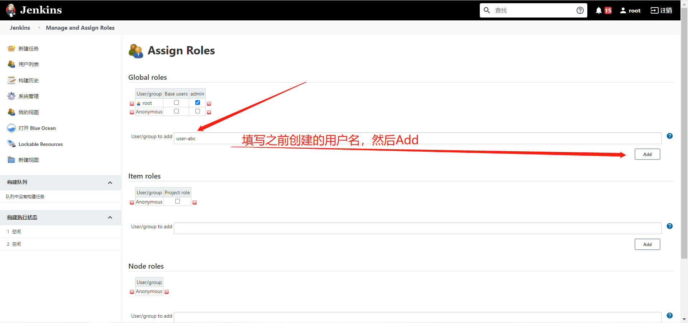

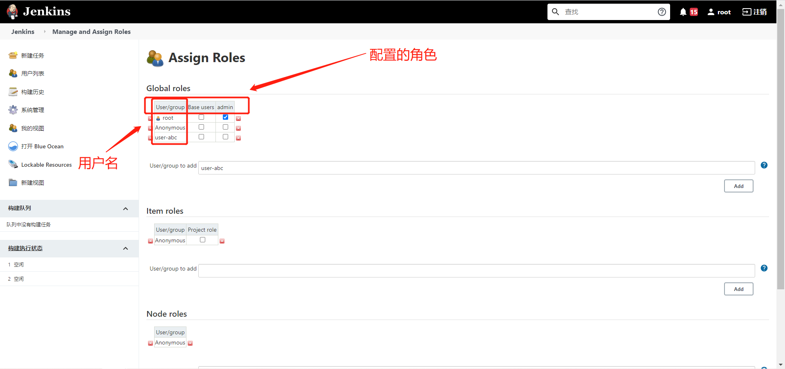


#### 2）项目角色分配

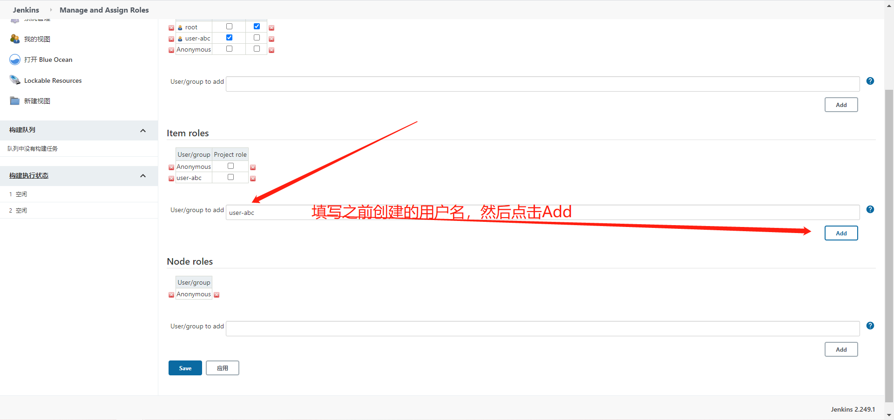

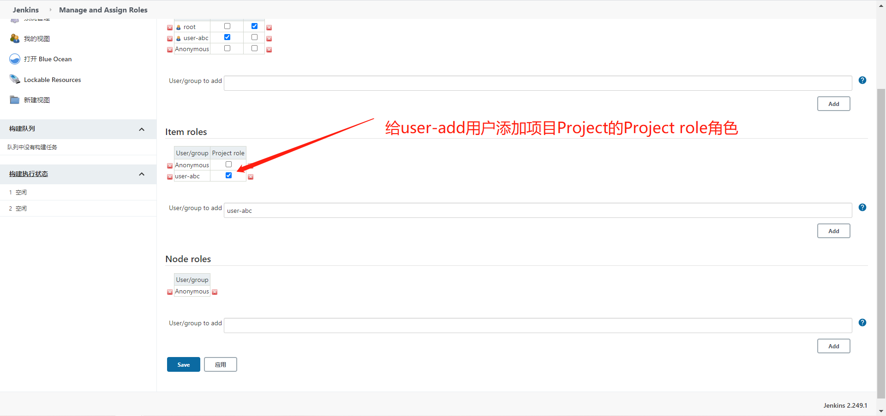


### 4、jenkins权限详解

 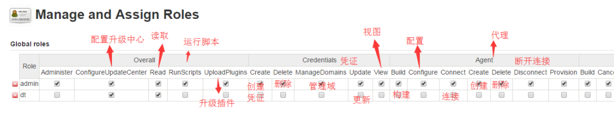

