## 凭证管理

### 1、配置全局凭证连接gitlab

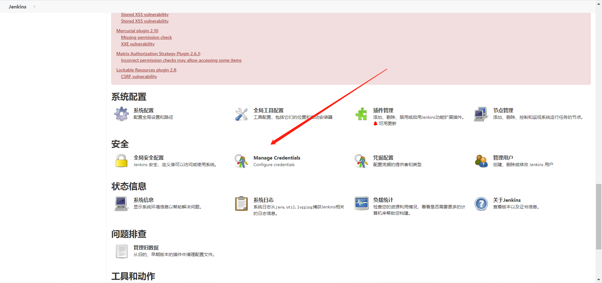

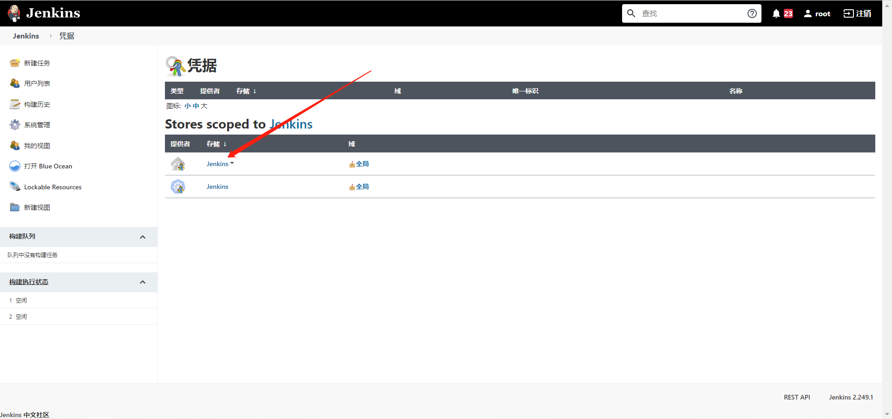

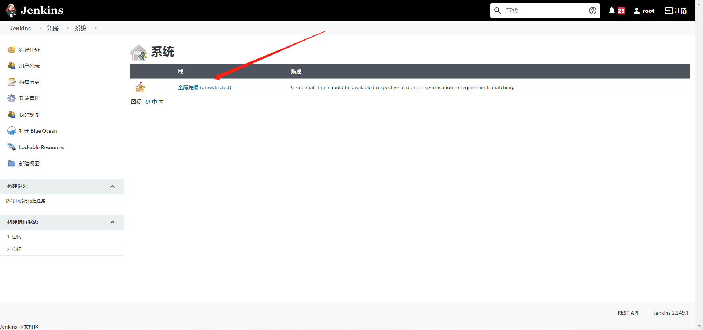

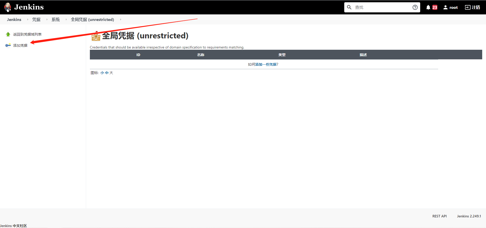

#### 1）http类型

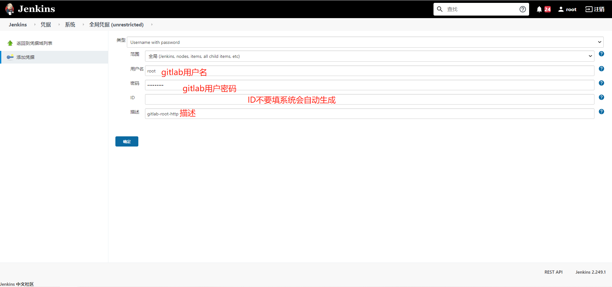


#### 2）SSH秘钥类型

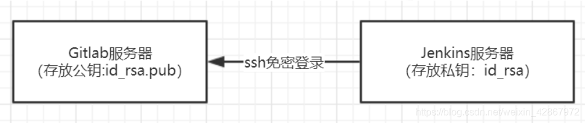


##### ①在jenkins服务器创建秘钥对

```bash
ssh-keygen -t rsa
[root@jenkins ~]# cd /root/.ssh/
[root@jenkins ~/.ssh]# ll
total 8
-rw------- 1 root root 1679 Apr 15 16:43 id_rsa
-rw-r--r-- 1 root root  393 Apr 15 16:43 id_rsa.pub

id_rsa：私钥文件
id_rsa.pub：公钥文件
```


##### ②把生成的公钥放在Gitlab中

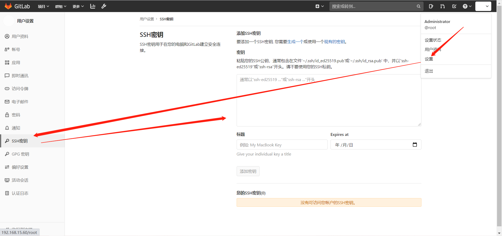

##### ③jenkins配置凭证添加私钥

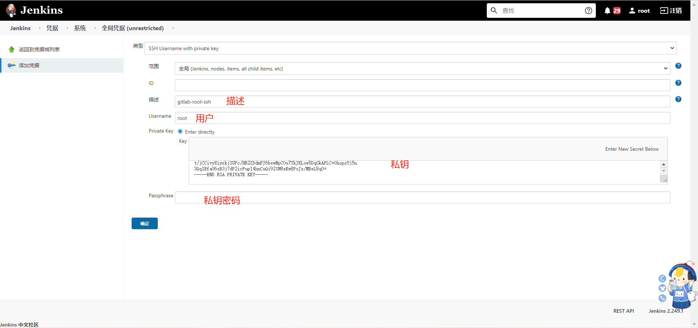

#### 3）验证

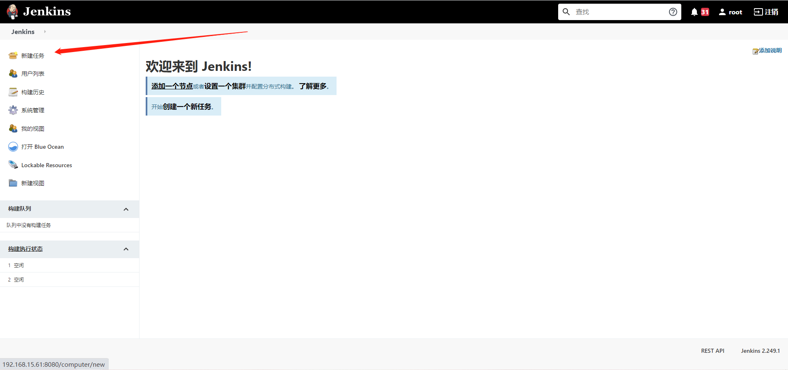

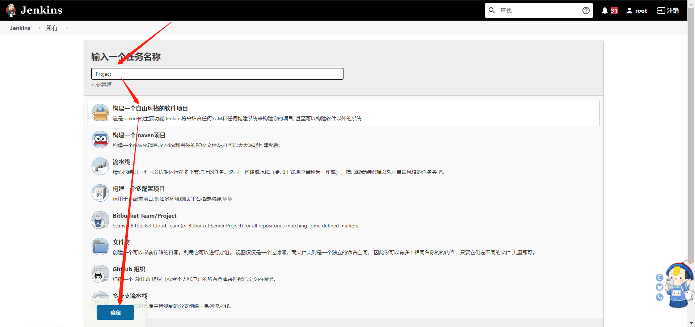

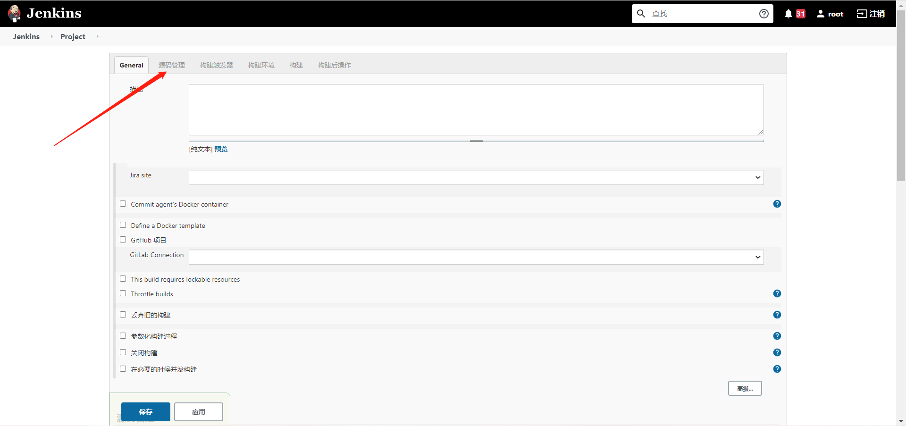

**ssh验证**

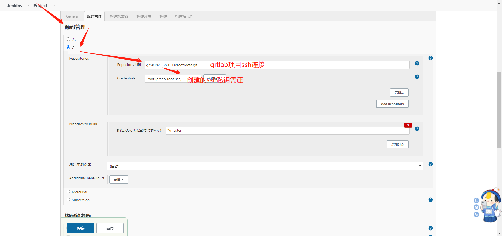

**http验证**

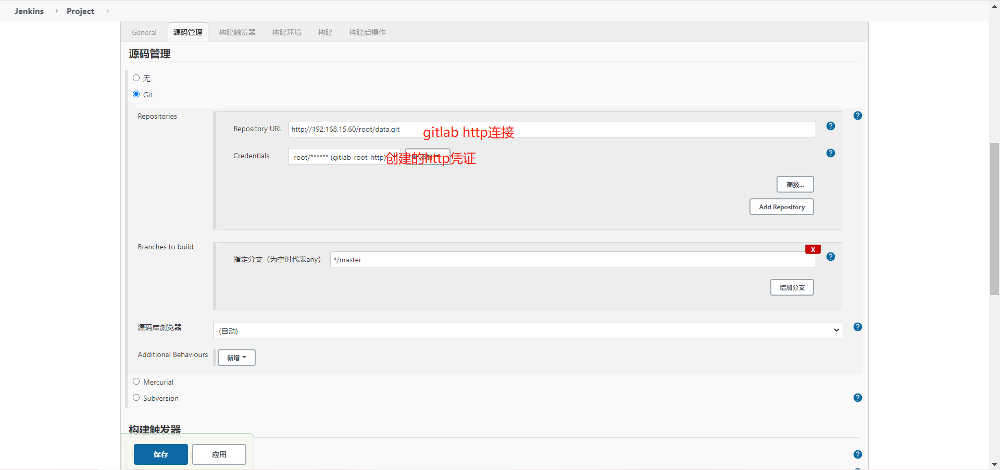

