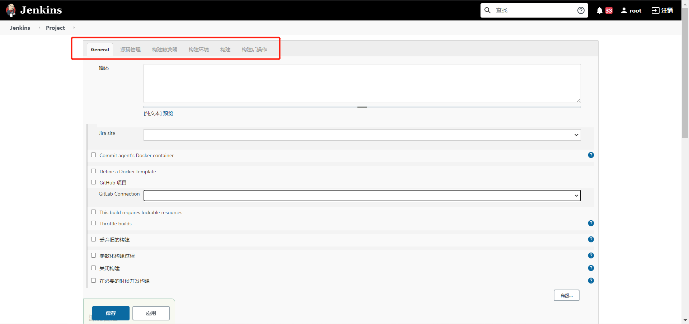
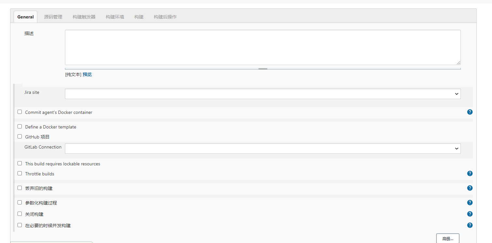
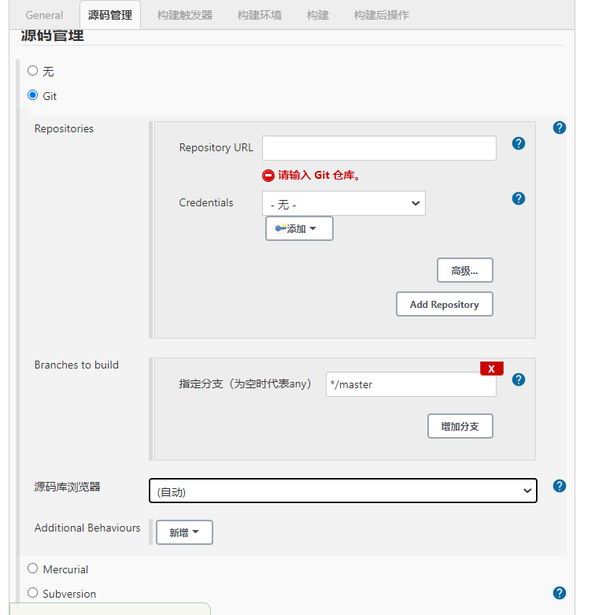
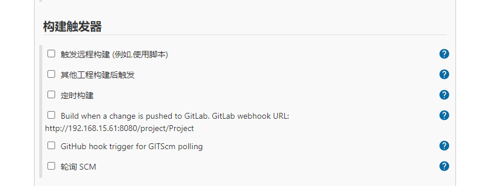
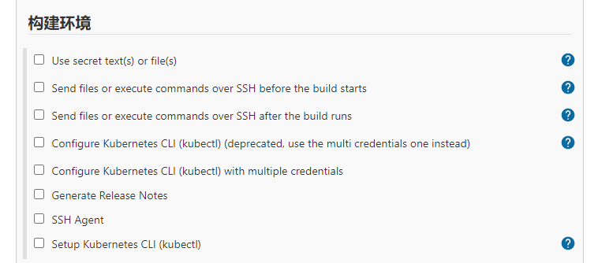
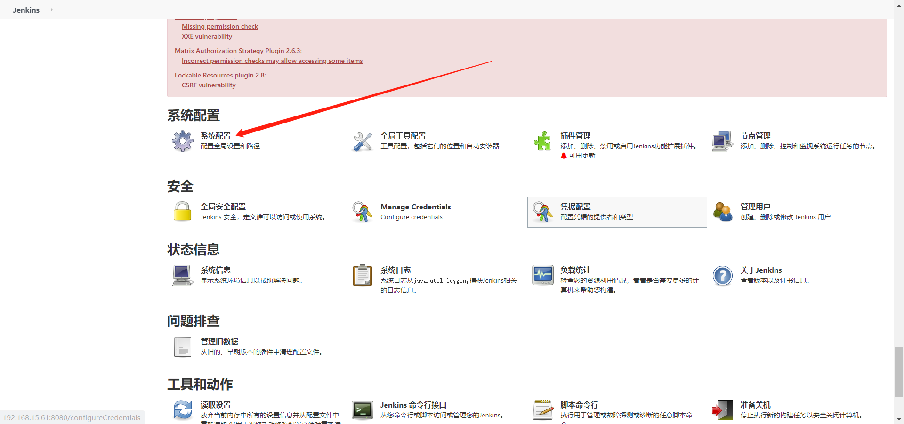
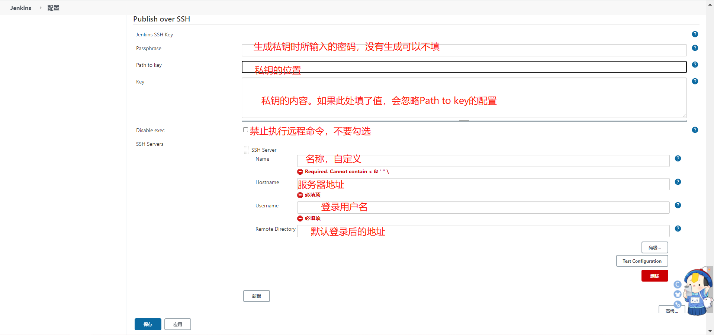
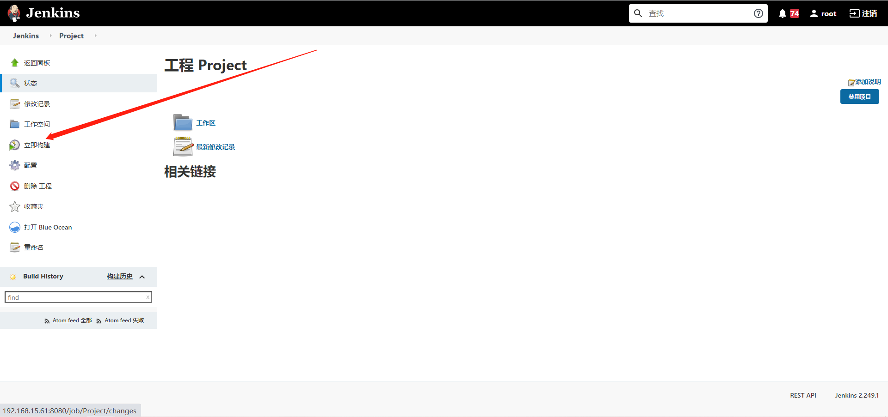

# 自由风格构建配置


## 一、自由项目选项介绍

```bash
下图是构建项目设置界面，可以看到上方的几个选项"General", "源码管理"， "构建触发器"，"构建环境"， "构建"， "构建后操作"。下面逐一介绍。
```




### 1、General基本配置



#### 1）描述

```bash
对构建任务的描述。
```


#### 2）丢弃旧的构建**Discard old builds**

```bash
服务器资源是有限的，有时候保存了太多的历史构建，会导致Jenkins速度变慢，并且服务器硬盘资源也会被占满。当然下方的"保持构建天数" 和 保持构建的最大个数是可以自定义的，需要根据实际情况确定一个合理的值。

    - Days to keep builds：如果其值为非空的N，就留N天之内的构建文件
    - Max # of builds to keep：如果#为非空，就公保留最多#个最近构建的相关文件
    - days to keep artifcts 产品保留时间,但是log,历史记录会保留
    - builds to keep with artifacts 保留最近几个构建的产品	
```


#### 3）参数化构建**This project is parameterized**

```bash
可以设置用户可输入的参数,没有输入则使用默认值,有字符串,多行字符串,布尔值等可以设置
```


#### 4）关闭构建**Disable this project**

```bash
停止这个job,当例如源码不可用时,可以暂时勾选这个停止build
```


#### 5）必要的时候并发构建**Execute concurrent builds if necessary**

```bash
如果可以会并发执行build.勾选上后.如果有足够的线程池则会并发,否则不会.并发构建会在不同的workspace中.如果用户自己设置的workspace则不会分开,这个是有风险的.
```


### 2、源码管理Source Code Management



**Git支持主流的github 和gitlab代码仓库。因我使用的是gitlab，所以下面我只会对该项进行介绍。**

#### 1）**Repository URL**：仓库地址


#### 2）**Credentials**：凭证

```bash
以使用HTTP方式的用户名密码，也可以使用SSH了解。 但要通过后面的"ADD"按钮添加凭证或通过设置提前添加好。
```


#### 3）**Branches to build**：构建的分支

```bash
*/master表示master分支，也可以设置为其他分支。
```


#### 4）源码浏览器

```bash
你所使用的代码仓库管理工具，如github, gitlab.  
```


### 3、构建触发器



#### 1）触发远程构建 (例如,使用脚本)**Trigger builds remotely (e.g., from scripts)**

```bash
外部通过url命令触发,拼接token和url就可以进行远程触发了
```


#### 2）其他工程构建后触发

```bash
监控其他job的构建状态,触发此job.如监听代码提交,然后触发UITest,静态分析等.
```


#### 3）定时构建**Build periodically**

```bash
定时触发.选择 Build periodically,在 Schedule 中填写 0 * * * *
第一个参数代表的是分钟 minute,取值 0~59;
第二个参数代表的是小时 hour,取值 0~23;
第三个参数代表的是天 day,取值 1~31;
第四个参数代表的是月 month,取值 1~12;
最后一个参数代表的是星期 week,取值 0~7，0 和 7 都是表示星期天。
所以 0 * * * 表示的就是每个小时的第 0 分钟执行一次构建。举个例子:每周六10点构建 0 10 * * 6,0-0分钟, 10-10点 -任意天 -任务月份 6-周六, 0可以改为H.
```


#### 4）**Build when a change is pushed to GitLab**

```bash
当有更改push到gitlab代码仓库，即触发构建。后面会有一个触发构建的地址，一般被称为webhooks。需要将这个地址配置到gitlab中，webhooks如何配置后面介绍。这个是常用的构建触发器。
```


#### 5）GitHub hook trigger for GITScm polling

```bash
hookplugin检测到源码的push操作触发构建,感觉Poll SCM更方便些,如果提交频繁,则这个触发就会频繁,看业务需要设置.
```


#### 6）轮询SCM PollSCM

```bash
定时感知代码分支是否有变化,如果有变化的话,执行一次构建.示例：H/5 * * * * 每五分钟去检查一下远程仓库,看代码是否发生变化。
```


### 4、构建环境Build Environment




| 选项                                                         | 解释                                                      |
| ------------------------------------------------------------ | --------------------------------------------------------- |
| Use secret text(s) or file(s)                                | 使用秘密文本或文件                                        |
| Send files or execute commands over SSH before the build starts | More Actions在构建开始之前通过SSH发送文件或执行命令       |
| Send files or execute commands over SSH after the build runs | 构建运行后通过SSH发送文件或执行命令                       |
| Configure Kubernetes CLI (kubectl) (deprecated, use the multi credentials one instead) | 配置Kubernetes CLI（kubectl）（已弃用，请改为使用多凭证） |
| Configure Kubernetes CLI (kubectl) with multiple credentials | 使用多个凭证配置Kubernetes CLI（kubectl）                 |
| Generate Release Notes                                       | 生成发行说明                                              |
| SSH Agent                                                    | SSH客户端                                                 |
| Setup Kubernetes CLI (kubectl)                               | 设置Kubernetes CLI（kubectl）                             |


### 5、Build构建

```bash
这个可以执行多种命令,如window的批处理,shell等一般shell就可以了.平时的自定义编译命令,打包等等,都可以写在这里.jenkins推荐将过长的命令写到下载的源码里,由这个里面的shell命令调用.jenkins执行的时候会默认把所有的命令都打印出来,这样方便调试.可以创建多个build step,这些step是串行的,一个faile,,后面的step都不会执行了.
```

**Send files or execute commands over SSH：**发送文件到远程主机或执行命令(脚本)

#### 1）**Name**: SSH Server的名称。

```bash
SSH Server可以在jenkins-系统设置中配置。
```


#### 2）**source files**: 需要发送给远程主机的源文件。


#### 3）**Remove prefix:** 移除前面的路径

```bash
如果不设置这个参数，则远程主机会自动创建构建源 source files 包含的那个路径。
```


#### 4）**Remote directory**: 远程主机目录。


#### 5）**Exec command**：在远程主机上执行的命令，或者执行的脚本。


### 6、构建后操作

```bash
构建后操作，针对于工作业务节点，就是对project构建完成后的一些后续操作，比如生成相应的代码测试报告。
```


## 二、Publish over SSH jenkins通过SSH发布的服务器






## 六、执行项目立即构建

```bash
第一次配置好jenkins project之后，会自动触发一次构建。此后，每当有commit 提交到master分支（前面设置的是master分支，也可以设置为其他分支），就会触发一次构建。当然也可以在project页面手动触发构建。点击左边的"立即构建" 手动触发构建。
```




## 六、构建结果说明

### 1、构建状态

```bash
Successful蓝色：构建完成，并且被认为是稳定的。

Unstable黄色：构建完成，但被认为是不稳定的。

Failed红色：构建失败。

Disable灰色：构建已禁用
```


### 2、构建稳定性

```bash
构建稳定性用天气表示：晴、晴转多云、多云、小雨、雷阵雨。天气越好表示构建越稳定，反之亦然。
```


