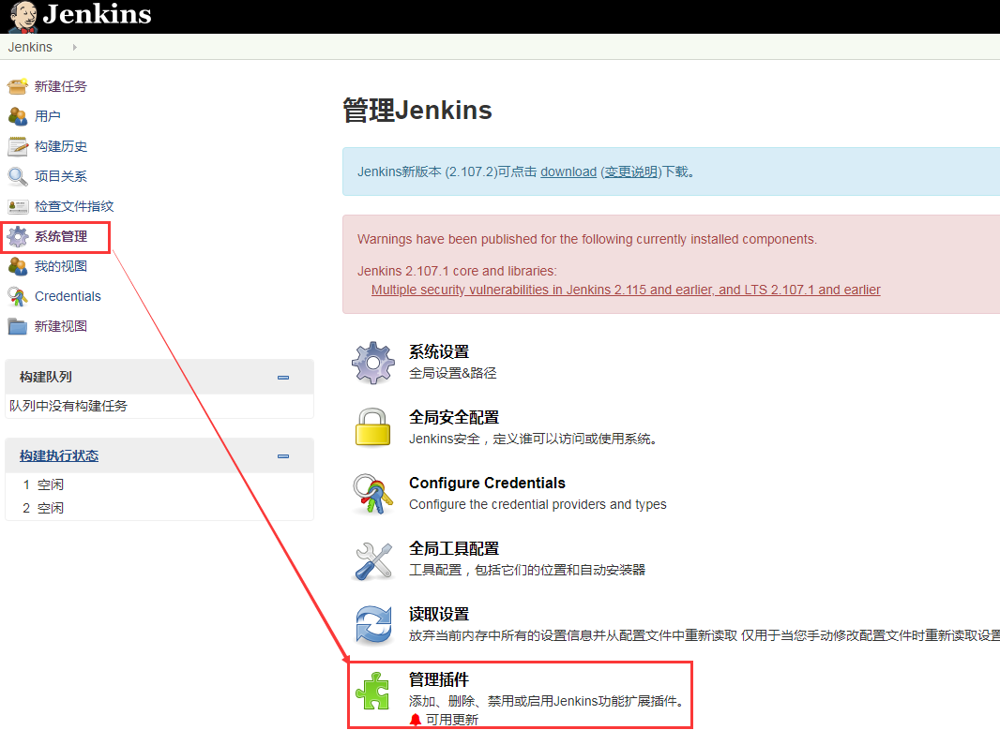
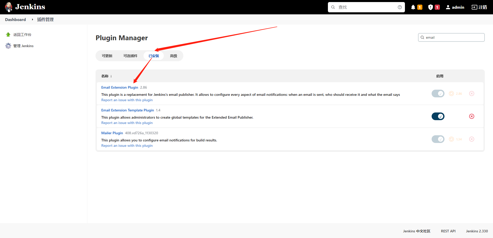
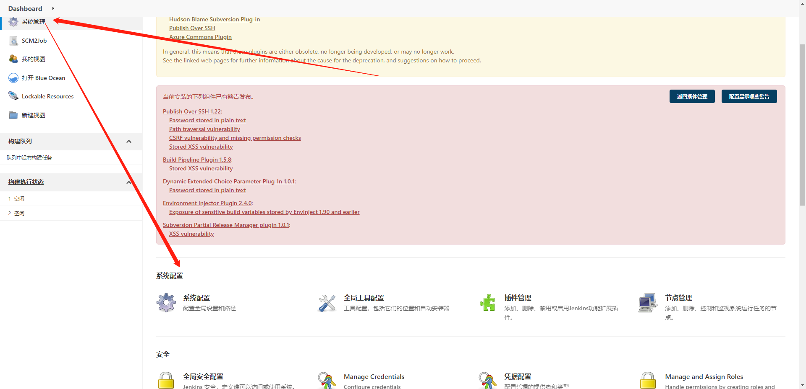
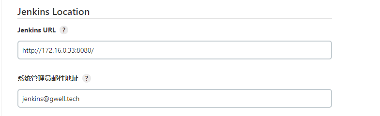
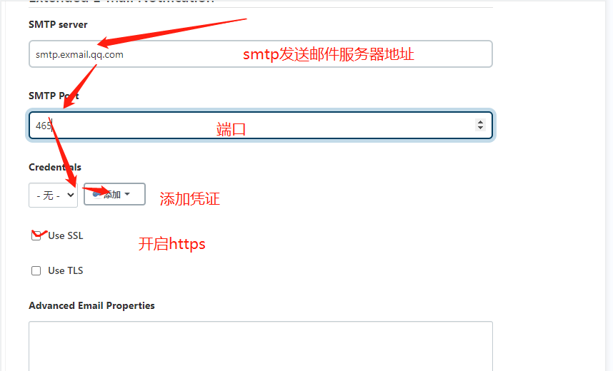
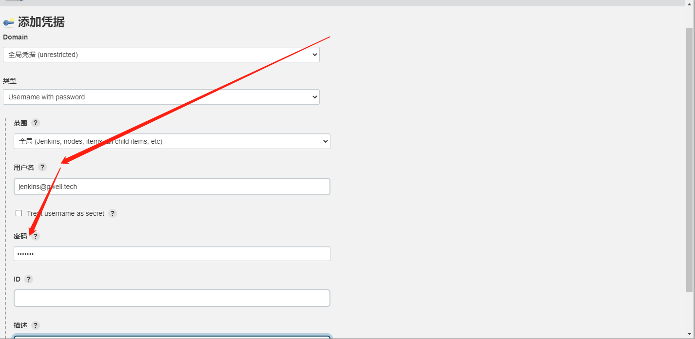

# jenkins配置邮件通知

## 背景

> 完成基于jenkins的持续集成部署后，任务构建执行完成，测试结果需要通知到相关人员。这篇博客，介绍如何在jenkins中配置邮件通知的方法。。。

## 一、安装邮件插件

>由于Jenkins自带的邮件功能比较鸡肋，因此这里推荐安装专门的邮件插件，不过下面也会顺带介绍如何配置Jenkins自带的邮件功能作用。
>
>可以通过系统管理→管理插件→可选插件，选择**Email Extension Plugin**插件进行安装：

> 由于我已经安装了该插件，因此这里显示在已安装目录下,还未安装的童鞋可以通过右上角的搜索框搜索改插件，然后在线安装，安装好之后重启Jenkins。

## 二、系统设置

### 1、配置管理员邮件地址

### 2、设置发件人信息

>PS：这里的发件人邮箱地址切记要和系统管理员邮件地址保持一致（当然，也可以设置专门的发件人邮箱，不过不影响使用，根据具体情况设置即可）

**添加凭证**

