# Jenkins基础入门

## 一、账户接入-接入LDAP

### 1、安装LDAP插件

### 2、系统管理->全局安全配置

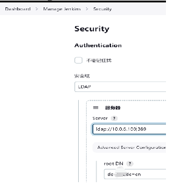

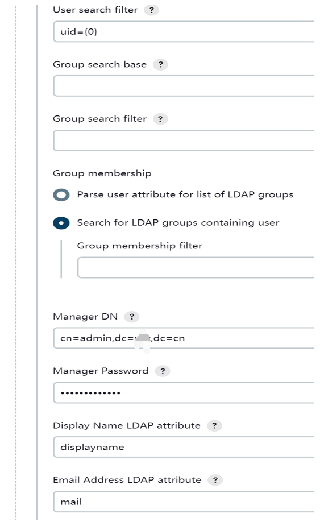


## 二、基础配置

### 1、视图

>视图（Views）：Jenkins的视图用于组织和展示项目

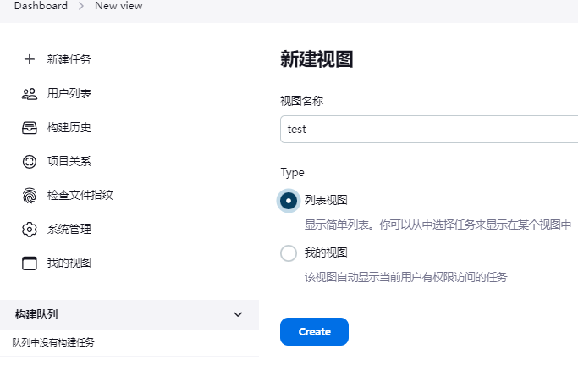

### 2、凭据

>凭据（Credentials）：Jenkins提供了凭据管理功能，用于安全地存储和管理敏感信息，如用户名、密码、API密钥、证书等
>
>主要使用的凭据有Username with Pass与 SSH Username with private key

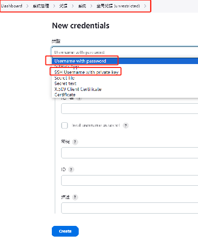

### 3、系统配置

>系统配置主要用于系统全局配置

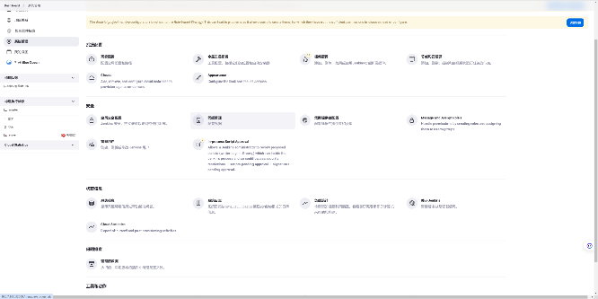

### 4、创建文件夹

>通过创建文件夹对不同的项目进行分类

**创建文件夹方式**

>创建新任务->输入名字->选择文件夹

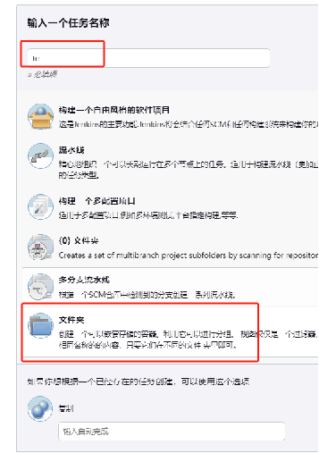

#### 项目规范

##### 1）通过项目环境分类

>一级分类：可通过将测试、预发、生产等环境进行视图分类
>
>二级分类：通过在视图分类下创建文件夹进行分类，不同文件夹代表不同项目
>
>三级分类：在文件夹下再通过视图进行不同类型的分类

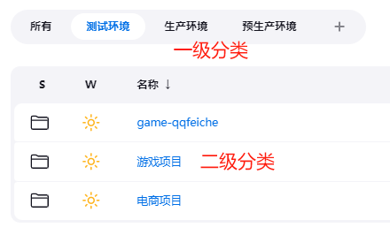

##### 2）通过不同项目进行分类

>通过对视图对项目进行分类，一个企业包含有一个到多个项目，一个项目包含有dev、test、pre、pro等多个环境

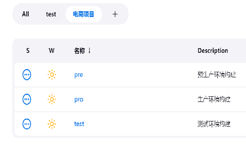

## 三、权限配置

### 1、安装插件

>Role-based Authorization Strategy

### 2、系统管理->全局安全配置->授权策略

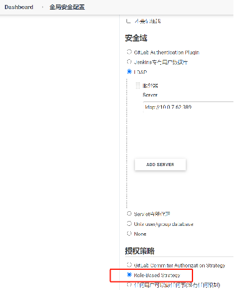

### 3、创建全局角色并分配查看权限

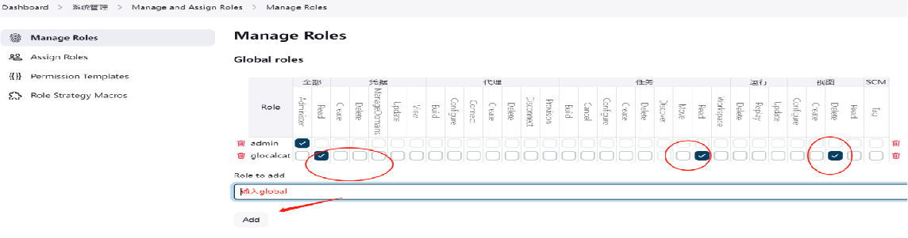

### 4、给用户分配global角色查看权限

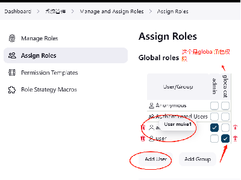

### 5、添加构建角色并分配权限

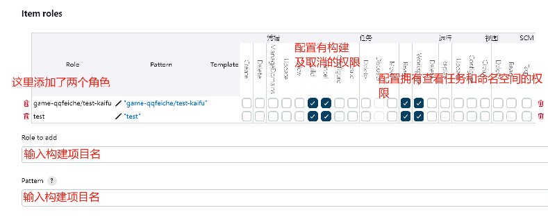

### 6、分配构建角色权限给用户

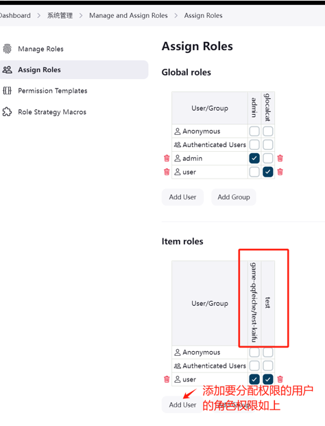

## 四、语法入门

### 1、什么是Jenkins Pipeline

>一、Pipeline 项目：使用 Pipeline DSL 编写的 Pipeline 脚本更加结构化和可读性更高，便于理解和维护。
>
>二、Pipeline 项目：提供了更强大的灵活性和可扩展性，可以定义多个阶段（如构建、测试、部署等），并且支持并行执行
>
>三、Pipeline 项目：Pipeline 脚本可以存储在版本控制系统中，便于团队协作和版本控制。

### 2、jenkins自由式项目和pipeline项目区别

>Pipeline 项目更适合现代的持续集成和持续交付实践，提供了更强大的灵活性、可读性和可维护性。然而，自由式项目仍然适用于一些简单的构建需求或不需要复杂 Pipeline 的场景。

### 3、创建流水线

>新建任务->输入任务名称->流水线

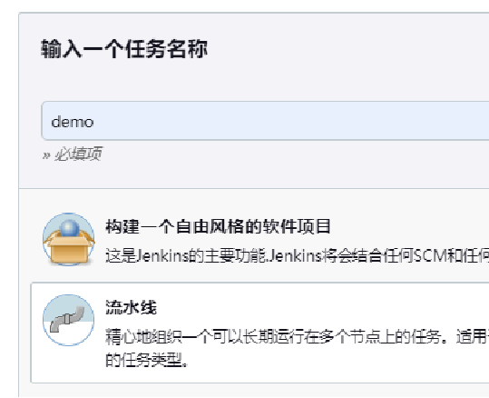

### 4、单阶段与多阶段流水线

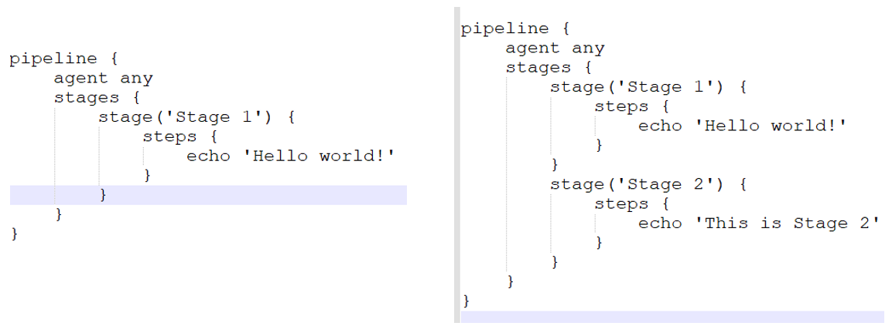

```yaml
pipeline {
    agent any 
    stages {
        stage('Stage 1') {
            steps {
                echo 'Hello world!' 
            }
        }
    }
}
```

```yaml
pipeline {
    agent any 
    stages {
        stage('Stage 1') {
            steps {
                echo 'Hello world!' 
            }
        }        
        stage('Stage 2') {
            steps {
                echo 'This is Stage 2' 
            }
        }
    }
}
```

### 5、构建代理

#### 1.介绍

>一、在 Jenkins Pipeline 中，agent 块用于指定构建的代理（Agent），也就是指定在哪个节点上执行 Pipeline 脚本。
>
>二、通过使用 agent 块，你可以控制 Pipeline 脚本内容在哪个节点上执行
>
>三、agent 块是可选的。如果没有提供 agent 块，Jenkins 将默认使用 any 代理，这意味着脚本将在任何可用的节点上执行。

#### 2.使用

>示例：agent { node { label 'labelName' } }
>
>注意：agent { node { label 'labelName' } }行为与相同agent { label 'labelName' }，但node允许其他选项（例如customWorkspace）

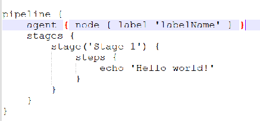

#### 3.any和none使用

>一、当你在 Jenkins Pipeline 中使用 agent any 时，它表示构建可以在任何可用的代理节点上执行。
>
>二、具体来说，Jenkins会根据配置的代理节点的可用性和负载情况选择一个可用的节点来执行构建。
>
>三、none不使用任何代理，局部需配置代理

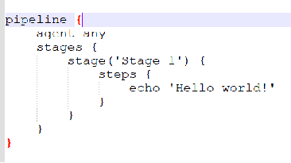

#### 4.定义构建代理

>通过agent配置代理

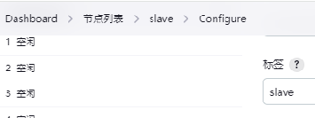

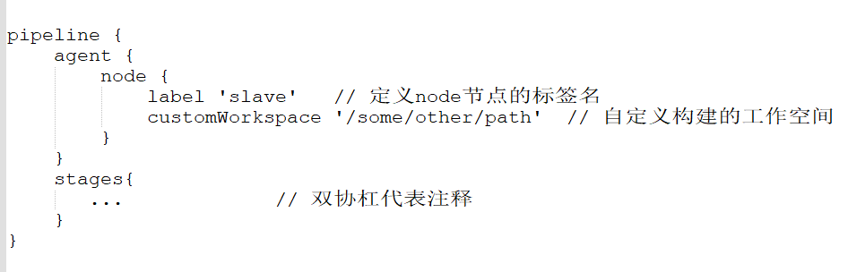

#### 5.全局代理和局部代理

>全局代理和局部代理共同配置的情况下，局部代理优先生效

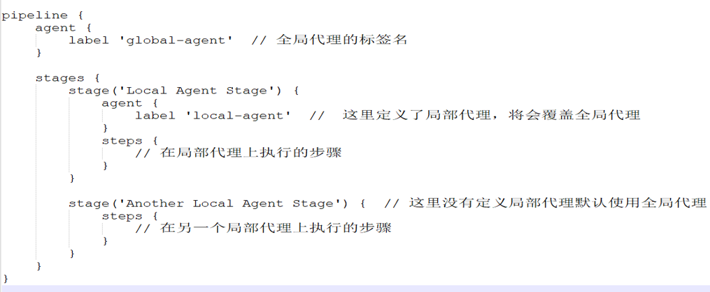

```yaml
agent any
agent none
agent { node { label 'labelName' } }
agent { label 'labelName' }
agent {
    node {
        label 'my-defined-label'
        customWorkspace '/some/other/path'
    }
}

pipeline {
    agent none
    stages {
        stage('Example Build') {
            agent { 
            	docker {
            		label 'slave'
            		'maven:3.9.3-eclipse-temurin-17' 
            		// 如果需要加参数
            		// args '-v /path/to/mount:/tmp'
            	}
            }
            steps {
                echo 'Hello, Maven'
                sh 'mvn --version'
            }
        }
        stage('Example Test') {
            agent { docker 'openjdk:17-jre' }
            steps {
                echo 'Hello, JDK'
                sh 'java -version'
            }
        }
    }
}
```

### 6、options

#### 1.介绍

>在Jenkins中，options是用于配置构建流水线的一种方式。它允许您定义一些全局选项，以自定义构建流程的行为

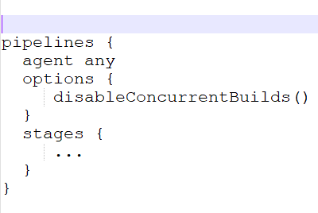

#### 2.使用

```
# 失败时，重试整个管道指定的次数
retry(3) 

# 整个管理的执行超时，其他单位MINUTES，SECONDS
timeout(time: 1, unit: 'HOURS') 

# 控制台日志添加时间戳，全局配置在系统配置中配置
timestamps() 

# 并行执行步骤的时候，有一个失败则注水线马上退出
parallelsAlwaysFailFast()

# 终止旧构建只保留最新的构建
disableConcurrentBuilds(abortPrevious: true) 

# 只保存最近十个构建
buildDiscarder(logRotator(numToKeepStr: '10'))

# 跳过自动检出代码。默认自动检出代码，
禁止后需要手动 checkout scm
skipDefaultCheckout() 

```

#### 3.局部配置

>非在options全局配置，只针对某个步骤生效

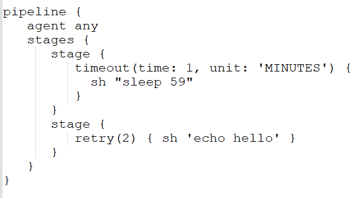

```yaml
// 全局配置
options {
    retry(3) 
	timeout(time: 1, unit: 'HOURS') //MINUTES, SECONDS
	timestamps()
	parallelsAlwaysFailFast()
	disableConcurrentBuilds(abortPrevious: true)
	buildDiscarder(logRotator(numToKeepStr: '10'))
	skipDefaultCheckout()
}

// 局部配置
pipeline {
    agent any 
    stages {
        stage('Stage 1') {
            steps {
                timeout(time: 3, unit: 'SECONDS'){
                    sh 'sleep 4'
                }
            }
        }        
        stage('Stage 2') {
            steps {
                retry(2){ sh 'echo hello' }
            }
        }
    }
}
```

### 7、sh的三种用法

```bash
# sh ''：表示Shell命令将以字面上的方式进行解析，
steps { sh 'echo "Hello,\nworld!"' }

# sh ""：表示Shell命令将进行变量替换和转义字符解释。
steps { sh "echo \"Hello,\nworld!\"" }

# sh ''' '''和sh """ """：可以进行变量替换和转义字符解释。并且不需要使用转义字符来表示多行Shell命令
```

### 8、Groovy沙盒

#### 1.介绍

>Jenkins的Groovy沙盒是一种安全机制，用于限制Jenkins Pipeline中Groovy脚本的权限，它提供了一种沙盒环境，其中Groovy脚本只能访问受限的API和功能。

#### 2.配置

>当未勾选使用Groovy沙盒时，则可看到截图圆圈位置需要批准脚本，此脚本才允许被执行

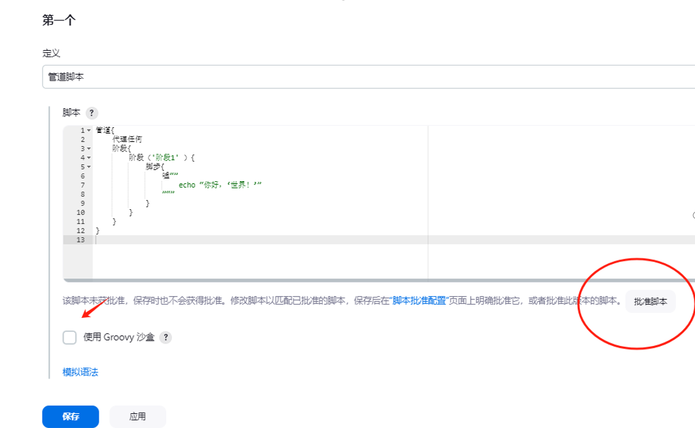

#### 3.批准脚本

>系统管理->ScriptApproval 点击Approve

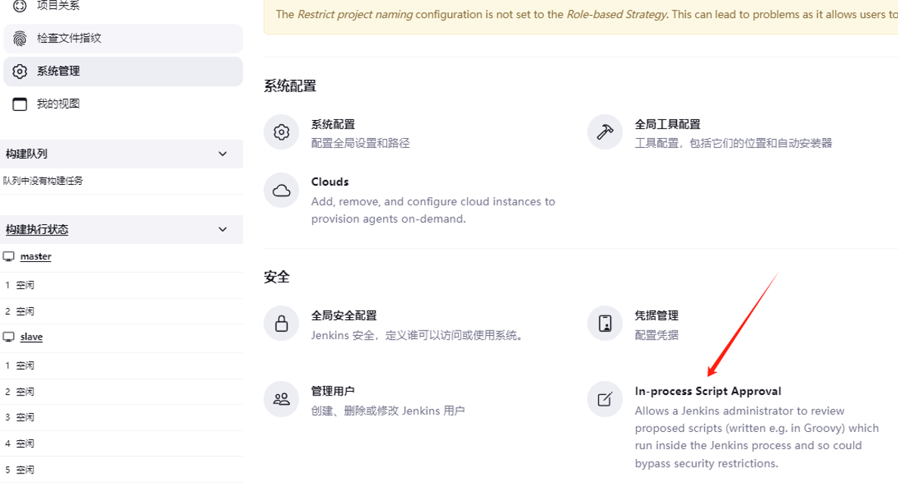

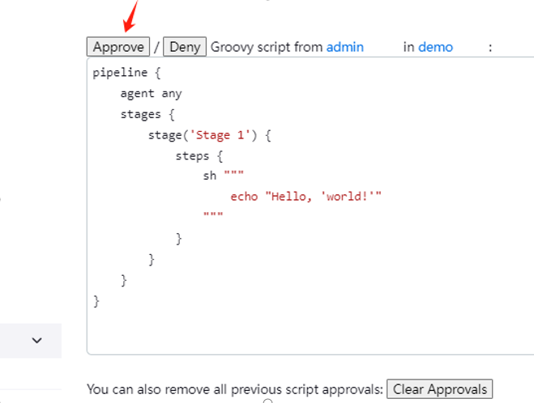

### 9、环境变量

#### 1.介绍

>Jenkins Pipeline 提供了多种方式来定义和使用环境变量。这些环境变量可以在整个 Pipeline 的不同阶段和步骤中被引用和修改。

#### 2.环境变量配置

##### 1）全局

>在 Pipeline 脚本中使用 environment 块来定义环境变量。可以在 Pipeline 的任何阶段和步骤中使用。

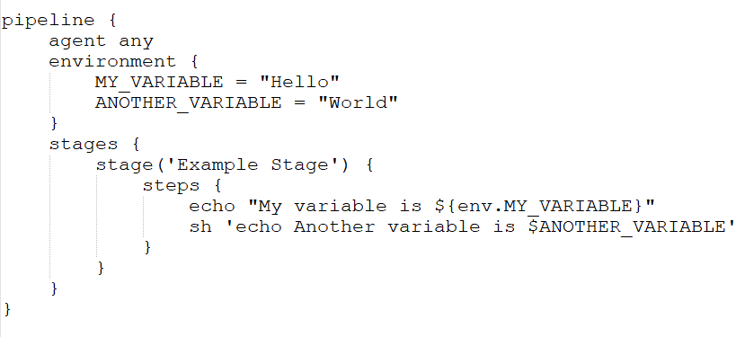

##### 2）局部

>只在stage步骤使用的环境变量

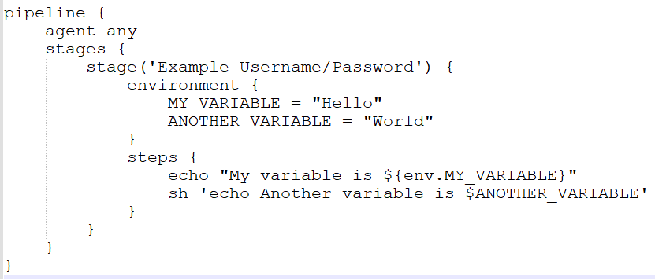

##### 3）临时变量

>使用 withEnv 步骤可以在特定的阶段或步骤中定义临时的环境变量。这些变量只在 withEnv 块内部有效，并在块外部恢复到原始值。

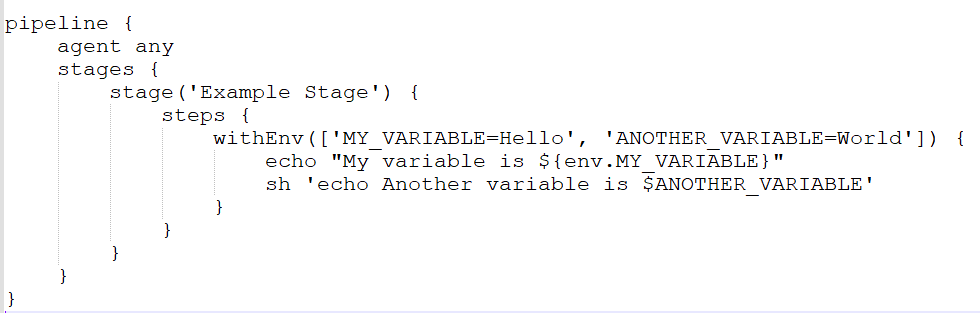

##### 4）Groovy定义全局

>使用 script 块可以在 Pipeline 中执行 Groovy 脚本来动态定义环境变量。在 script 块内部定义的变量可以在块外部使用。

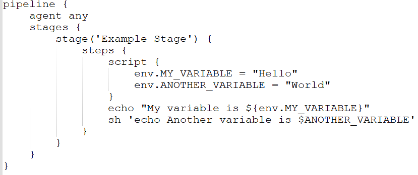

```yaml
pipeline {
    agent any
    environment {
        CC = 'clang'  // 全局环境变量
    }
    stages {
        stage('Example') {
            // 局部环境变量，只能够在stage中使用
            environment {
               bb = 'golang'
            }			          
            steps {
            	withEnv(['name1=join','name2=jack']){ 
                	echo "my name is ${env.name1}"
                	sh 'my name is ${name2}'
                }
                script {
                      env.name3 = "peter"                 
                      env.name4 = "lisha"
                }
                echo "my name is ${env.name3}"
                sh 'my name is ${name4}'
            }
        }
    }
}
```


### 10、凭据

#### 1.介绍

>在Jenkins中，凭据（Credentials）用于存储和管理敏感信息，如用户名、密码、API密钥等。
>
>Jenkins提供了多种凭据类型：用户名和密码凭据、SSH凭据、证书凭据、密钥对凭据、令牌凭据

#### 2.配置

##### 1）添加凭据

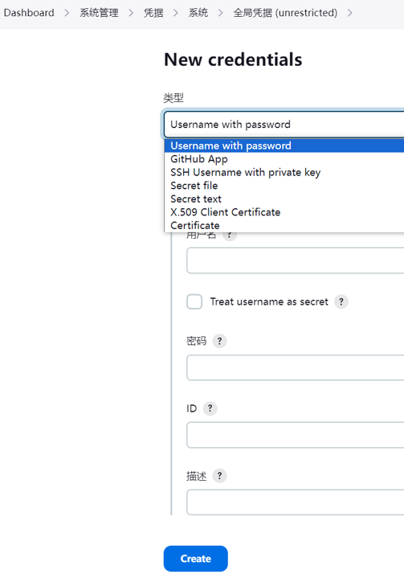

##### 2）凭据在流水线中使用

>使用credentials方法访问预定义凭据。
>
>调用变量$SERVICE_CREDS可获得账户和密码，格式 user:password
>
>调用用户名变量方法在原变量加`_USR`,$SERVICE_CREDS_USR
>
>调用密码变量方法在原变量加`_PSW`,$SERVICE_CREDS_PSW

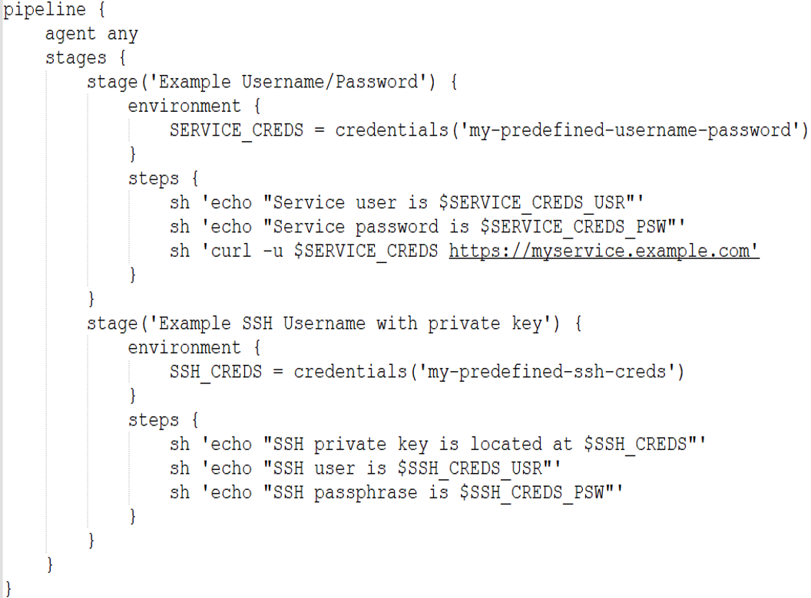

```yaml
pipeline {
    agent any
    stages {
        stage('Example Username/Password') {
            environment {
                SERVICE_CREDS = credentials('my-predefined-username-password')
            }
            steps {
                sh 'echo "Service user is $SERVICE_CREDS_USR"'
                sh 'echo "Service password is $SERVICE_CREDS_PSW"'
                sh 'curl -u $SERVICE_CREDS https://myservice.example.com'
            }
        }
        stage('Example SSH Username with private key') {
            environment {
                SSH_CREDS = credentials('my-predefined-ssh-creds')
            }
            steps {
                sh 'echo "SSH private key is located at $SSH_CREDS"'
                sh 'echo "SSH user is $SSH_CREDS_USR"'
                sh 'echo "SSH passphrase is $SSH_CREDS_PSW"'
            }
        }
    }
}
```


### 11、post

#### 1.介绍

>post介绍：定义了在管道或阶段运行完成时运行的post一个或多个附加步骤。
>
>常用条件块包含有如下：always、aborted、failure、success

#### 2.语法

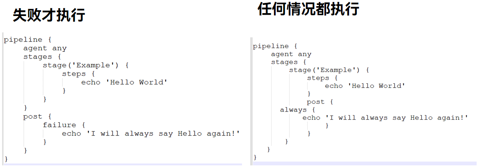

```yaml
pipeline {
    agent any
    stages {
        stage('Example') {
            steps {
                echo 'Hello World'
            }
        }
    }
    post { 
        always { 
            echo 'always'
        }
        success { 
            echo 'success'
        }
        failure { 
            echo 'failure'
        }
        aborted { 
            echo 'aborted'
        }
        unstable { 
            echo 'unstable'
        }        
    }
}
```


### 12、清理工作空间

>清理工作空间的方法为cleanWs()

```
...
          script {		
              cleanWs()  
          }
...
```

### 13、内置变量

>访问Jenkins内置变量http://jenkins地址:端口/env-vars.html/

```
          部署项目: ${JOB_NAME}
          构建数: ${BUILD_NUMBER} 
          部署阶段：${STAGE_NAME}
```

### 14、构建页面信息展示

>1、当前的构建用户，安装插件：build user varswrap([$class: 'BuildUser']) { echo "${BUILD_USER}"} 
>
>2、显示当前构建的描述信息currentBuild.description = "这个是自定义的构建搭述信息"
>
>3、显示当前构建的显示名称currentBuild.displayName = 'Build #123'

### 15、生成声明性指令

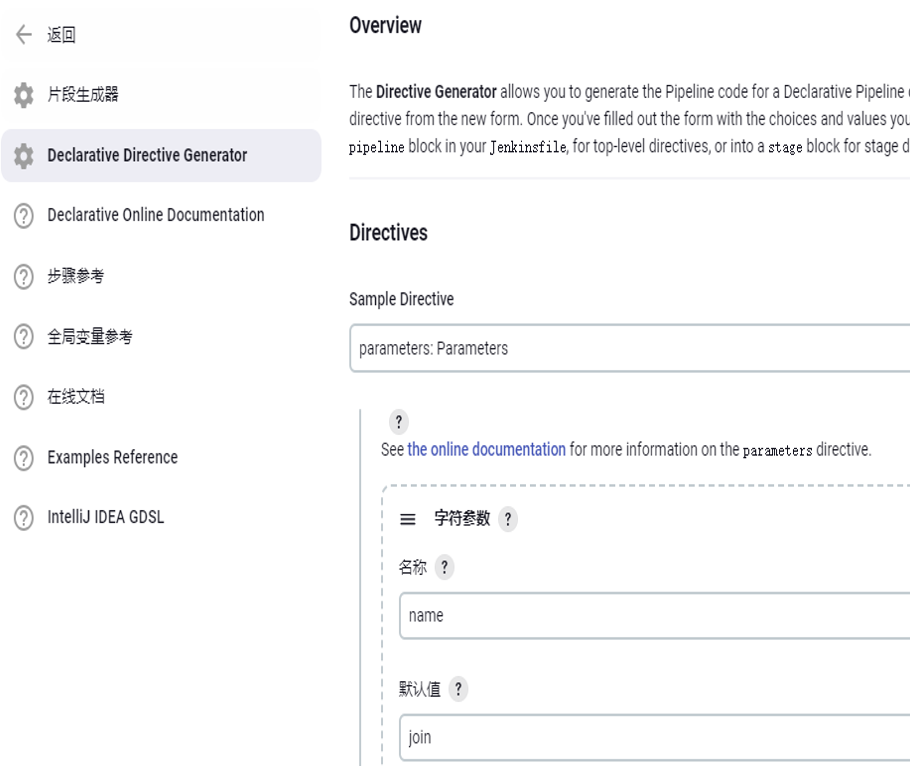

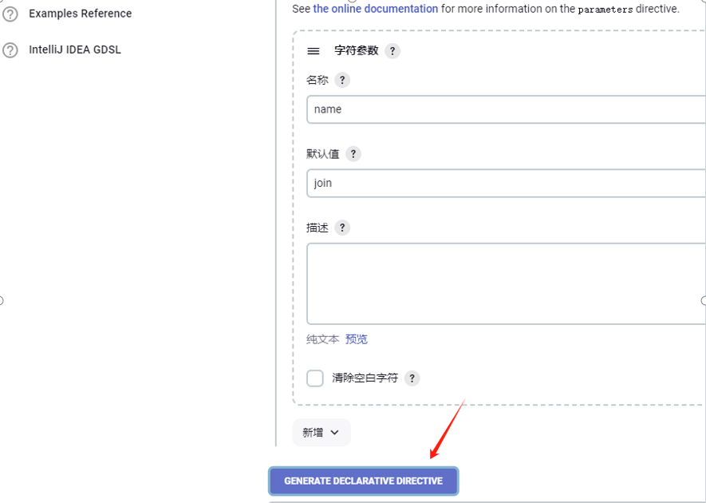

### 16、计划任务

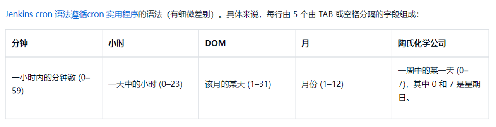

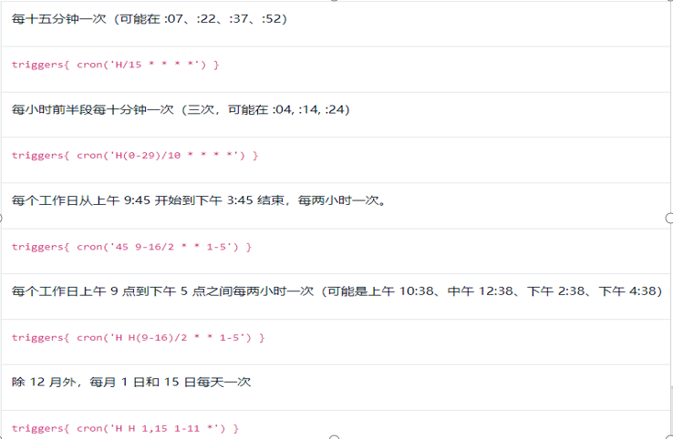

```yaml
// Declarative //
pipeline {
    agent any
    triggers {
        cron('H */4 * * 1-5')
        //triggers{ cron('H H(9-16)/2 * * 1-5') }
    }
    stages {
        stage('Example') {
            steps {
                echo 'Hello World'
            }
        }
    }
}
```


### 17、并行执行

>并行执行使用parallel语法

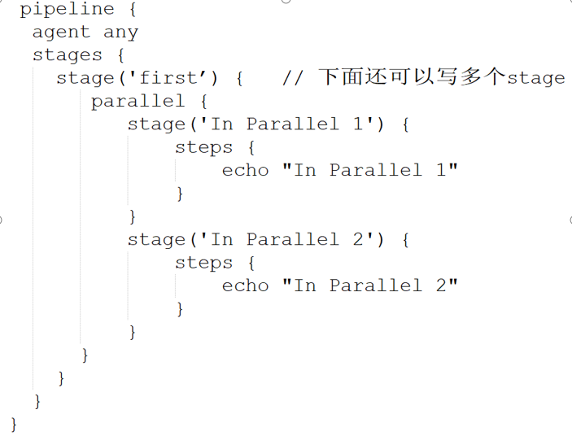

```yaml
pipeline {
    agent any
    stages {
        stage('Non-Parallel Stage') {
            steps {
                echo 'This stage will be executed first.'
            }
        }
        stage('Parallel Stage') {
            parallel {
                stage('Branch A') {
                    steps {
                        echo "On Branch A"
                    }
                    }
                stage('Branch B') {
                    steps {
                        echo "On Branch B"
                    }
                }
            }
        }
    }
}
```


### 18、蓝海项目

>安装插件blue ocean

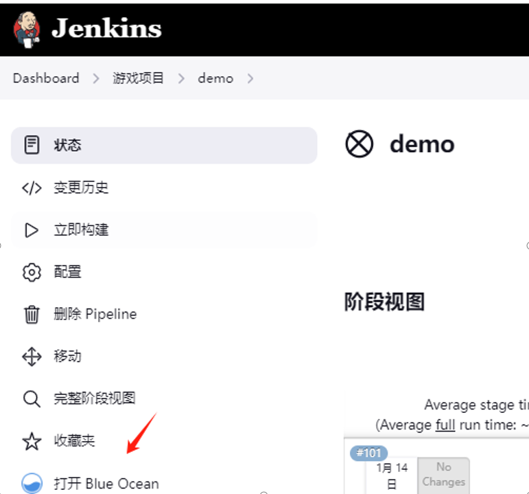

### 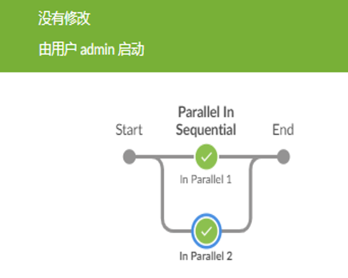19、when语法

>根据条件判断流水线的执行
>
>anyOf: 多个条件中任意一个满足时则执行相应的操作
>
>expression: 用于执行自定义表达式并检查其返回值是否为真
>
>equals expected: 用于比较两个值是否相等

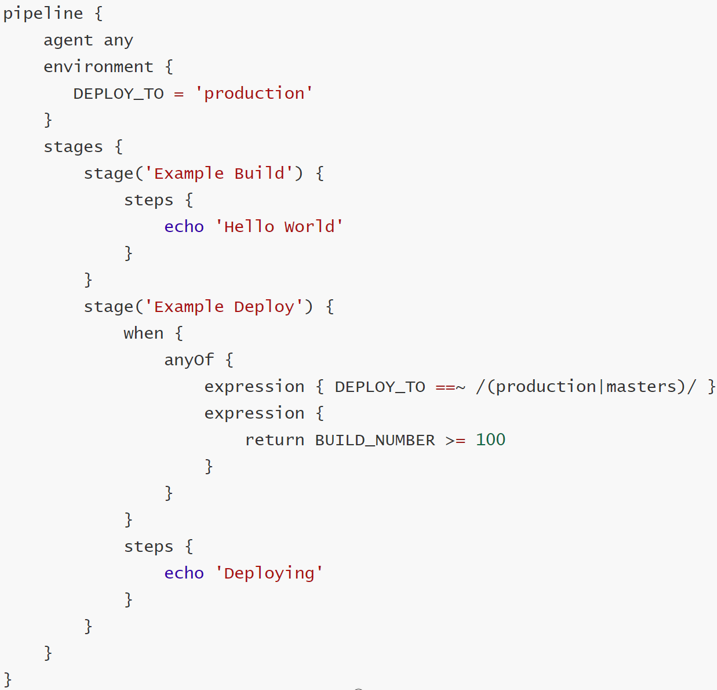

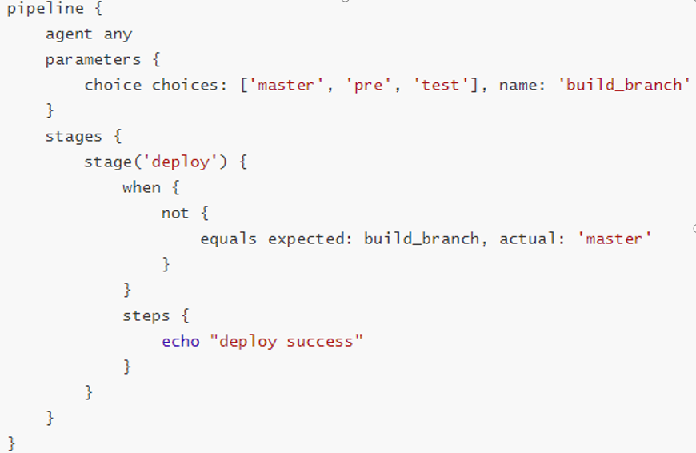

```yaml
pipeline {
    agent any
    environment {
       DEPLOY_TO = 'production'
    }		    
    stages {
        stage('Example Build') {
            steps {
                echo 'Hello World'
            }
        }
        stage('Example Deploy') {
            when {
                anyOf {
                    environment name: 'DEPLOY_TO', value: 'production'
                    expression { BRANCH_NAME ==~ /(production|master)/ }
                    expression {
                        return params.BUILD.NUMBER >= 1
                    }
                }
            }
            steps {
                echo 'Deploying'
            }
        }
    }
}
pipeline {
    agent any
    parameters {
        choice choices: ['master', 'pre', 'test'], name: 'build_branch'
    }
    stages {
        stage('deploy') {
            when {
                not {
                    equals expected: build_branch, actual: 'master'
                }
            }
            steps {
                echo "deploy success"
            }
        }
    }
}
```


### 20、input使用

>使用input可以对构建进行审核发布

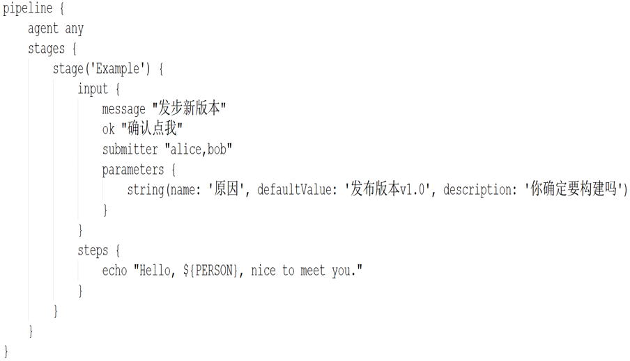

```yaml
pipeline {
    agent any
    stages {
        stage('Example') {
            input {
                message "这个构建你自已确认吗?"
                ok "是的，我确认."
                parameters {
                    string(name: 'PERSON', defaultValue: '我要发布', description: '你是为什么什么原因要构建呢?')
                }
            }
            steps {
                echo "Hello, ${PERSON}, nice to meet you."
            }
        }
    }
}
```


### 21、Groovy postbuild

>安装插件Groovy postbuild

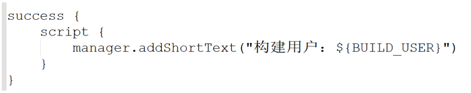

```yaml
pipeline {
    agent any
    stages {
        stage('test') {
            steps {
                echo "success"
            }
        }
    }
    post {
        success {
            script {
                manager.addShortText("构建用户：${BUILD_USER}")
            }
        }
    }
}
```


### 22、jenkinsfile的存储方式

>一、将Jenkinsfile与业务代码存放于一个仓库
>
>二、Jenkinsfile与业务代码仓库分离

### 23、jenkins cli

>http://10.0.7.101:32000/manage/cli/

>cli运行job
>
>```ba
>java -jar jenkins-cli.jar -s http://10.0.7.101:32000/  -auth test:123 build t1 -p build_branch=pre
>```

### 24、将构建状态发送到gitlab

#### 1.配置接入

>gitlab：账户头像->偏好设置->访问令牌
>
>jenkins：1、安装GitLab插件2、管理Jenkins->系统配置

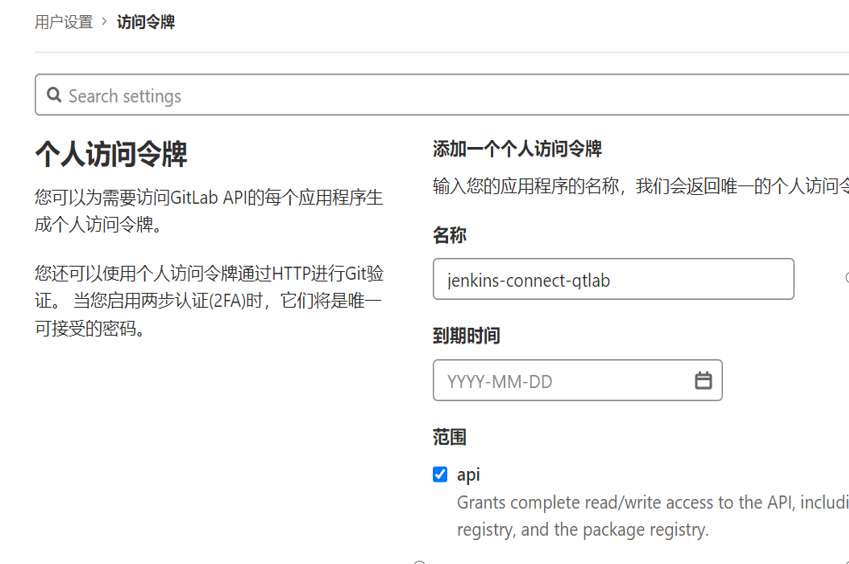

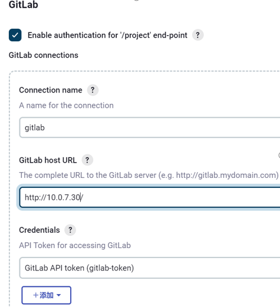

#### 2.更新流水线状态

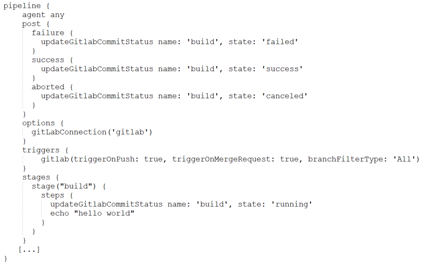

```yaml
pipeline {
    agent any
    options {
      gitLabConnection('your-gitlab-connection-name')
    }  
    stages {
      stage("build") {
        steps {
          updateGitlabCommitStatus name: 'build', state: 'running'
          echo "hello world"
        }
      }
    }    
    post {
      failure {
        updateGitlabCommitStatus name: 'build', state: 'failed'
      }
      success {
        updateGitlabCommitStatus name: 'build', state: 'success'
      }
      aborted {
        updateGitlabCommitStatus name: 'build', state: 'canceled'
      }
    }
}
```


### 25、webhook触发

> 安装插件Generic Webhook Trigger

#### 1.jenkins配置webhook触发

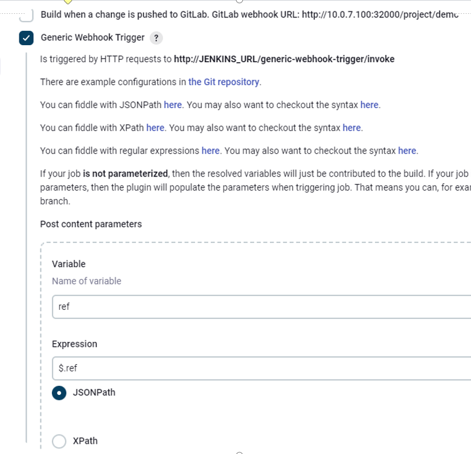

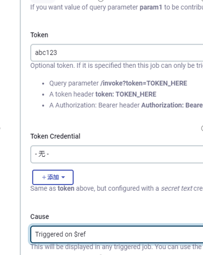

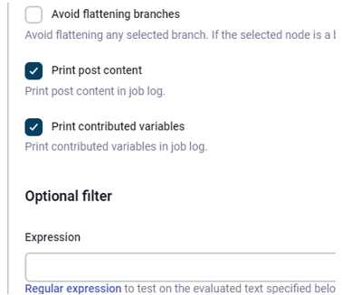

#### 2.gitlab配置jenkins-webhook

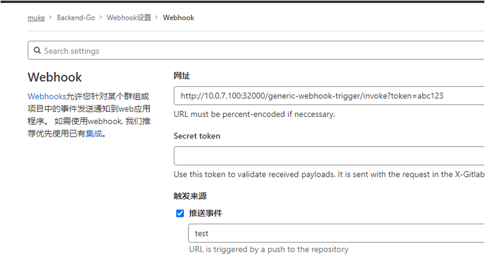

```yaml
#!groovy

pipeline {
    agent any
    
    parameters {
      choice choices: ['refs/heads/pre', 'refs/heads/main', 'refs/heads/test'], name: 'branch_name'
      string defaultValue: 'http://10.0.7.30/jenkins/jenkinsfile.git', name: 'giturl'
    }
    
    triggers {
      GenericTrigger( 
          causeString: 'Generic Cause', 
          genericVariables: 
          [[defaultValue: '', key: 'branch_name', regexpFilter: '', value: '$.ref'],
          [defaultValue: '', key: 'giturl', regexpFilter: '', value: '$.project.git_http_url']], 
          printContributedVariables: true,
          printPostContent: true, 
          regexpFilterExpression: '',
          regexpFilterText: '', 
          token: 'abc123', 
          tokenCredentialId: ''
      )
    }

    stages {     
        stage('Stage 1') {
            steps {
                cleanWs()
                script {
                    branch = branch_name - 'refs/heads/'
                    //print "$branch"
                    checkout changelog: false, poll: false, scm: scmGit(
                    branches: [[name: "${branch}"]], extensions: [], 
                    userRemoteConfigs: [[credentialsId: 'gitlab', url: "${giturl}"]])
                    sh "cat README.md"
                }
            }
        }
    }
}
```


### 26、多分支流水线

#### 1.介绍

>通过自动扫描仓库被匹配到的分支自动创建流水线
>
>被扫描到的分支第一次创建的时候会自动运行一次流水线

#### 2.配置多分支扫描

>新建项目-选择多分支流水线

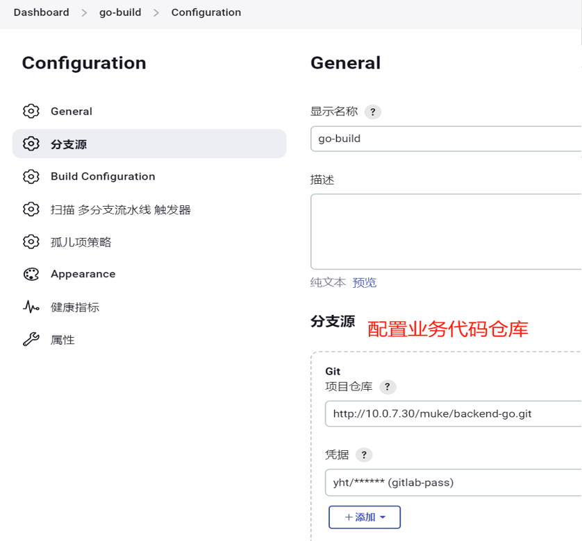

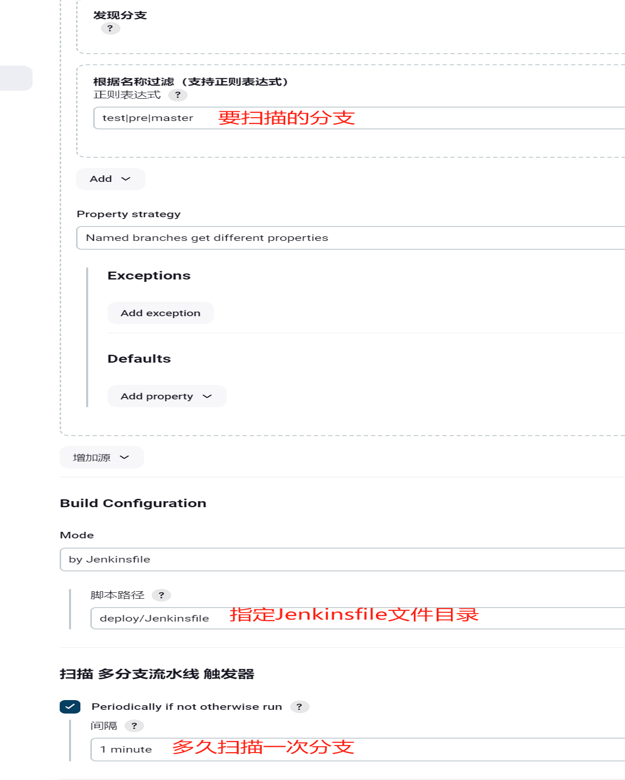

### 27、基于容器构建

```yaml
pipeline {
    agent {
        node {
            label 'slave-docker'
        } 
    }
    environment {
		images_head = "registry.cn-hangzhou.aliyuncs.com"
    }  

    stages { 
        stage('Build') {
            agent {
                docker {
                    image 'maven:3.9.3-eclipse-temurin-17'
                    args '-v $HOME/.m2:/root/.m2'
                }
            }        
            steps {
                sh 'mvn;touch a.txt;touch /root/.m2/cache.txt'
            }
        }        
        stage('Hello') {
            agent {
                docker { 
                    label 'slave-docker'
                    image 'alpine:3.14' 
                }
            }
            steps {
                script {
                    sh """
                        ls -la
                        pwd
                        hostname
                        echo "#########################"
                    """
                }
            }
        }         
        stage('build-2') {          
            steps {
                script {
                    sh """
                    ls -la 
                    pwd
                    hostname
                    """
                    docker.withRegistry("https://${images_head}", 'aliyun-images-registry') {
                        def customImage = docker.build("${images_head}/tool-bucket/xiaowu:${BUILD_TAG}-${GIT_COMMIT}")
                        customImage.push()                                              
                    }                        
                }                
            }
        }
                                        
    }
}
```

>```yaml
>// 	test-image从位于 的 Dockerfile构建./dockerfiles/test/Dockerfile
>def testImage = docker.build("test-image", "./dockerfiles/test")
>
>// 可以docker build通过将其他参数添加到方法的第二个参数来传递其他参数build()。以这种方式传递参数时，字符串中的最后一个值必须是 docker 文件的路径，并且应以用作构建上下文的文件夹结尾
>def dockerfile = 'Dockerfile.test'
>def customImage = docker.build("my-image:${env.BUILD_ID}",
>                                "-f ${dockerfile} ./dockerfiles")
>```

### 28、triggers

```yaml
pipeline {
    agent any 

    triggers {
        GenericTrigger (
            causeString: 'Generic Cause', 
            genericVariables: 
            [[defaultValue: '', key: 'branch_name', regexpFilter: '', value: '$.ref'],
            [defaultValue: '', key: 'giturl', regexpFilter: '', value: '$.project.git_http_url']], 
            printContributedVariables: true, 
            printPostContent: true, 
            regexpFilterExpression: '', 
            regexpFilterText: '', 
            token: 'xiaowu', 
            tokenCredentialId: ''
        )
    }

    options {        
        timestamps() 
        parallelsAlwaysFailFast()
        disableConcurrentBuilds(abortPrevious: true) 
        buildDiscarder(logRotator(numToKeepStr: '10'))
        skipDefaultCheckout() 
    }	

    parameters {
        choice choices: ['refs/heads/main', 'refs/heads/pre', 'refs/heads/test'], name: 'branch_name'
        string defaultValue: 'http://10.0.7.30/golang/go.git', name: 'giturl'
    }
	
    stages {
        stage('branch-gitrul'){
            steps {
                script {
                    branch = branch_name - 'refs/heads/'
                    print "${branch}"
                    print "${giturl}"    
                    checkout scmGit(branches: [[name: "${branch}"]], 
                    extensions: [], 
                    userRemoteConfigs: [[credentialsId: 'gitlab', url: "${giturl}"]])    
                }
            }
        }
        stage('clone') {
            steps {
				script{
                     //cleanWs()  
                     sh "ls -la"
                     
				}
            }
        }	
    }
}

```


