# jenkins快速进阶

## 一、节点控制

### 1、jenkins slave节点概述

>1、Jenkins的从节点，用于执行主节点分配的构建任务。
>
>2、从节点的作用是协助主节点执行构建任务，这样可以实现并行构建和分布式构建
>
>3、主节点可以为每个从节点分配不同的标签（labels），然后将具有相应标签的构建任务分发到相应的从节点上执行

### 2、slave节点接入配置

#### 1.slave节点创建家目录

```bash
mkdir -p /home/jenkins/
```

#### 2.配置slave节点

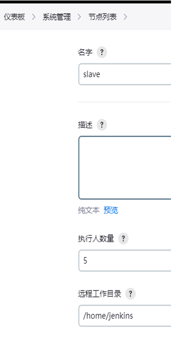

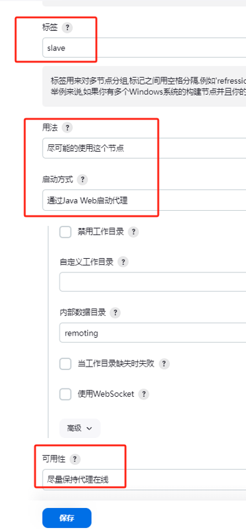

#### 3.配置slave节点端口

> 代理端口配置成与容器代理端口一致

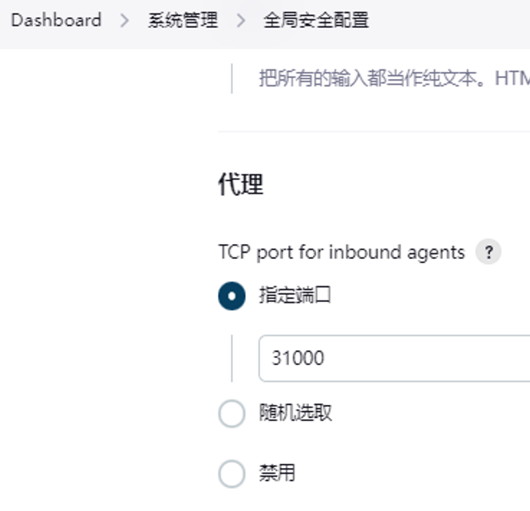

#### 4.运行Slave节点

>根据如下命令运行Slave节点。首先需要安装java环境

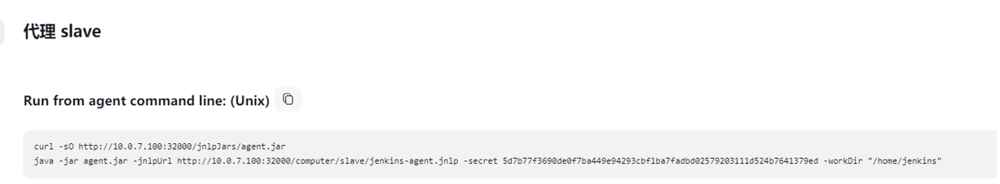

```yaml
pipeline {
    agent {
        node {
            label 'slave'
        }
    }

    stages {
        stage('Hello') {
            steps {
                script {
                  sh 'hostname;pwd;free -h;touch a.txt'   
                }
            }
        }
    }
}

```

### 3、配置docker流水线

#### 1.安装插件-Docker Pipeline

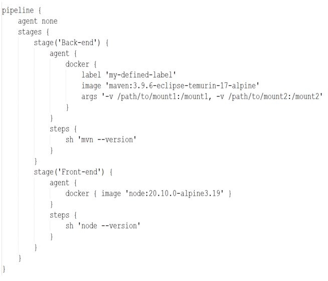

#### 2.使用build()创建镜像

> 配置build创建镜像并push到仓库

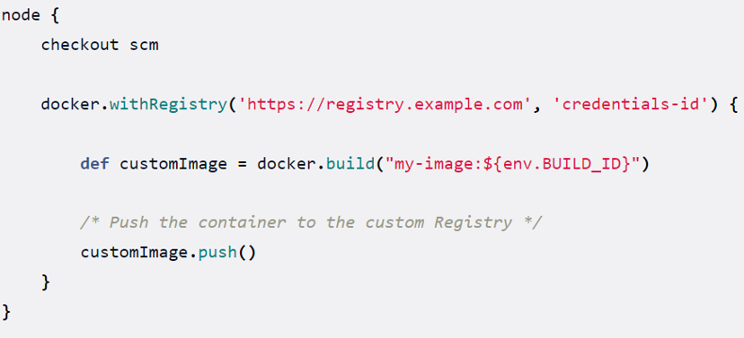

##### 1)指定Dockerfile文件路径

>./dockerfiles/test/Dockerfile

```yaml
def testImage = docker.build("test-image", "./dockerfiles/test")
```

##### 2)指定Dockerfile文件名与路径

```yaml
def dockerfile = 'Dockerfile.test'
def customImage = docker.build("my-image:${env.BUILD_ID}","-f ${dockerfile} ./dockerfiles")
```

#### 3.实操记录

```yaml
pipeline {
    agent {
        node {
            label 'slave'
        } 
    }
    stages { 
        stage('Build') {
            agent {
                docker {
					label 'slave'
                    image 'maven:3.9.3-eclipse-temurin-17'
                    args '-v $HOME/.m2:/root/.m2'
                }
            }        
            steps {
                sh 'mvn --version;touch a.txt;ls -l /root/.m2/build.txt'
            }
        }        
        stage('alpine ls') {
            agent {
                docker {
					label 'slave'
                    image 'alpine:3.14'
                    args '-v $HOME/.m2:/root/.m2'
                }
            }             
            steps {
                script {
                    sh """
						ls -la;pwd
                        ls -la /root/.m2/build.txt
                        echo "#########################"
                    """
                }
            }
        }  
		stage('slave-test') {
            steps {
                script {
                    sh """
                        ls -la;pwd
                        echo "#########################"
                    """
                }
            }
        } 
	}
}	

```

```yaml
pipeline {
    agent {
        node {
            label 'slave'
        } 
    }
    environment {
		images_head = "registry.cn-hangzhou.aliyuncs.com"
    }  

    stages { 
        stage('Build') {
            agent {
                docker {
                    label 'slave'
                    image 'maven:3.9.3-eclipse-temurin-17'
                    args '-v $HOME/.m2:/root/.m2'
                }
            }        
            steps {
                sh 'mvn --version'
            }
        }        
        stage('Hello') {
            agent {
                docker { 
                    label 'slave'
                    image 'alpine:3.14' 
                }
            }
            steps {
                script {
                    sh """
                        ls -la
                        pwd
                        hostname
                        echo "#########################"
                    """
                }
            }
        }         
        stage('build-2') {          
            steps {
                script {
                    sh """
                    ls -la 
                    pwd
                    hostname
                    """
                    docker.withRegistry("https://${images_head}", 'aliyun-images-registry') {
                        def customImage = docker.build("${images_head}/tool-bucket/xiaowu:${BUILD_TAG}-${GIT_COMMIT}")
                        customImage.push()                                              
                    }                        
                }                
            }
        }
                                        
    }
}
```


### 4、配置K8S动态节点

>https://www.cnblogs.com/panwenbin-logs/p/17299430.html

#### 1.安装插件-kubernetes

#### 2.配置节点

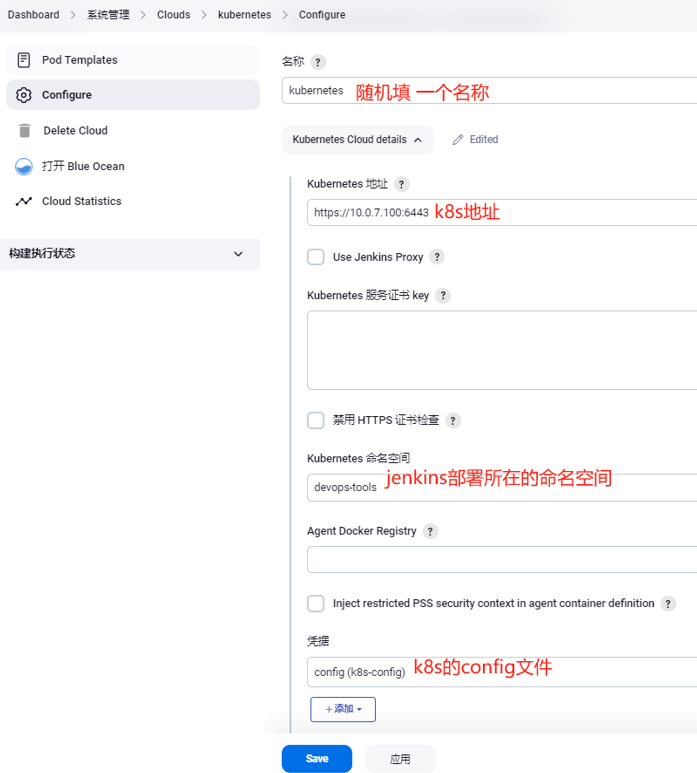

#### 3.配置pod模版

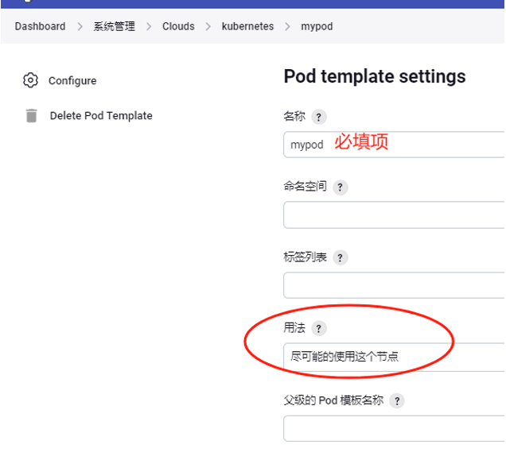

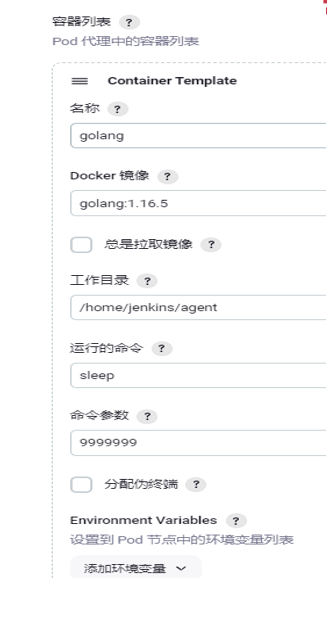

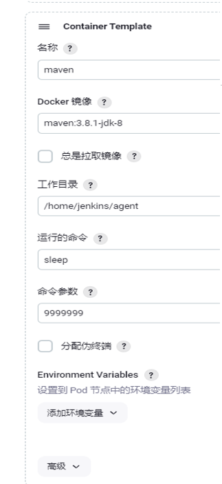

#### 4.配置jenkinsfile

>如果注释inheritFrom则使用yaml的pod作为pod模板使用

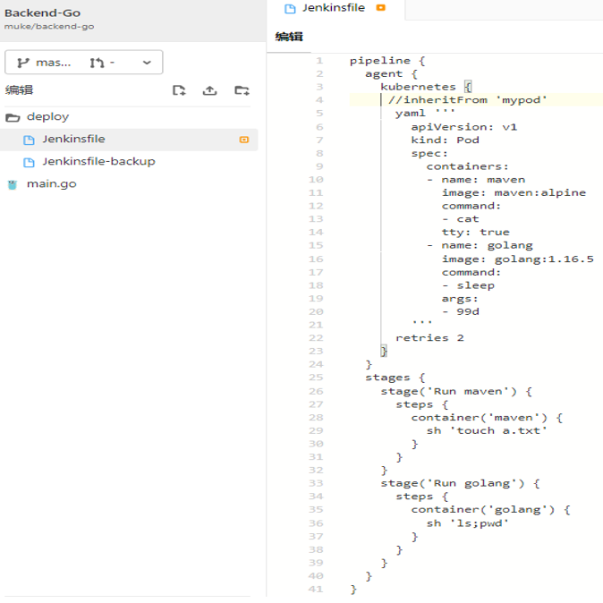

```yaml
pipeline {
  agent {
    kubernetes {
     //inheritFrom 'mypod'
      yaml '''
        apiVersion: v1
        kind: Pod
        spec:
          containers:
          - name: maven
            image: maven:alpine
            command:
            - cat
            tty: true   
          - name: golang
            image: golang:1.16.5
            command:
            - sleep
            args:
            - 99d                          
        '''
      retries 2
    }
  }
  stages {
    stage('Run maven') {
      steps {
        container('maven') {
          sh 'touch a.txt'
        }
      }
    }
    stage('Run golang') {
      steps {
        container('golang') {
          sh 'ls;pwd'
        }
      }
    }  
    stage('Run alpine') {
      agent {
        node {
          label 'slave'
        }
      }
      steps {
        sh 'hostname;pwd'
      }
    }
  }     
}

```


## 二、Groovy入门

### 1、def关键字定义变量

```java
def num = 11 
def name1= 'xiaowu'
def age = [18, 25, 30]
def bool = true
def name2 = ['girl','boy','lisha']
print "${num},${name1},${age},${bool},${name2}"
```

### 2、获取当前时间

>调用Date类的构造函数

```java
def year = new Date().format("yyyy") 
def month = new Date().format("MMdd") 
def day = new Date().format("HHmm") 
def second = new Date().format("ss")
print "${second} ${day} ${month} ${year}"
```

### 3、for循环

```java
def browsers = ['chrome', 'firefox']
print "${browsers.size()}"
for (int i = 0; i < browsers.size(); ++i) {
  print "Testing the ${browsers[i]} browser"
}

```

### 4、if条件判断

```java
def BRANCH_NAME = 'test' 
if (BRANCH_NAME == 'master') {
  print 'I only execute on the master branch'
} else if (BRANCH_NAME == 'test') {
  print 'I execute elsewhere'
} else {
  print 'success'
}

```

### 5、异常捕获

```java
try{...}catch(error){...}
```

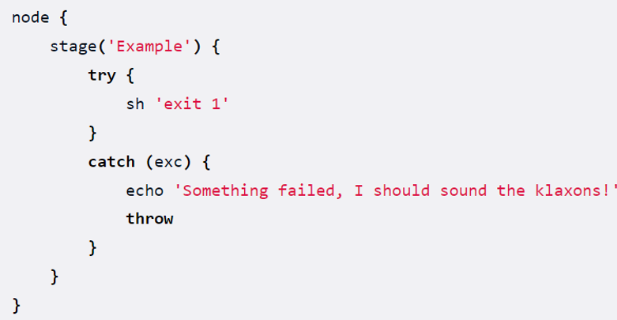

### 6、函数

>定义一个函数，两个变量

```java
def greet(name,age) {
    println "My name is $name!,age $age"
}
greet("Alice",18)
```

## 三、共享库

>实现基于共享库进行CI/CD流程的优化

### 1、配置连接共享库

>第一步: gitlab创建一个共享库
>
>第二步jenkins配置连接共享库

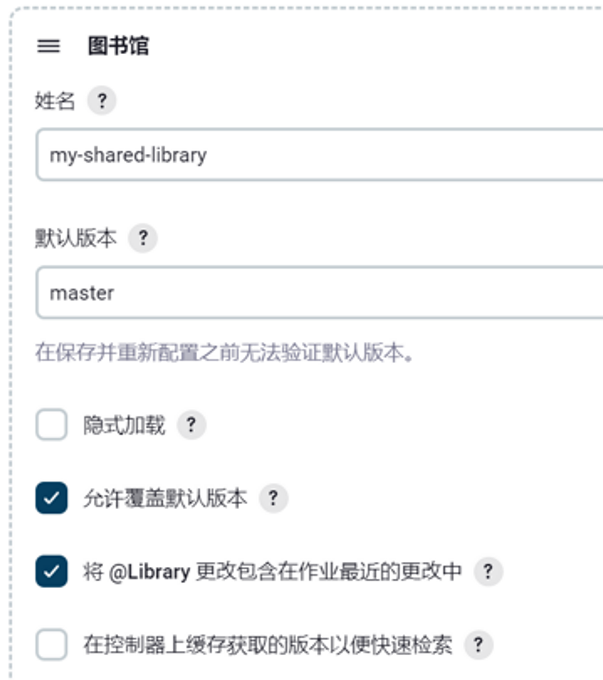

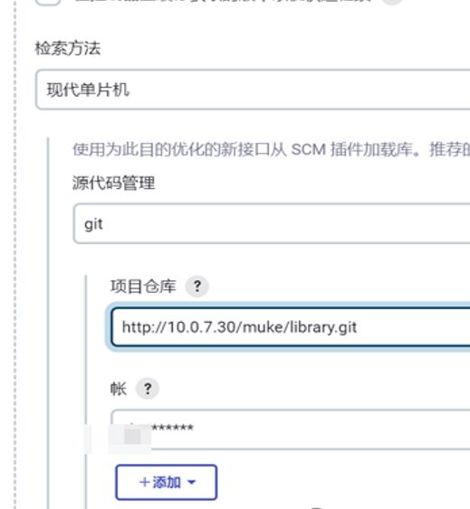

### 2、目录结构介绍

>vars 目录用于存放 Jenkins Pipeline 的全局共享步骤。这些步骤在 Jenkinsfile 或其他 Pipeline 脚本中可以直接作为命令调用

>src/org 目录通常用于存放共享库中的 Groovy 脚本和类。这里的 org 是一个常见的包名前缀，用于组织代码。你可以在 src/org 下创建多层级的目录结构，以进一步细分你的代码

### 3、编写共享库脚本

>src源目录结构
>
>vars公开的脚本文件

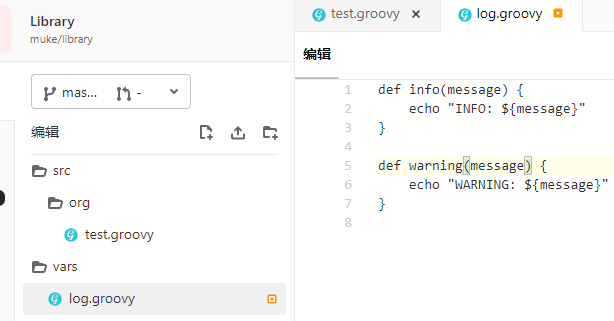

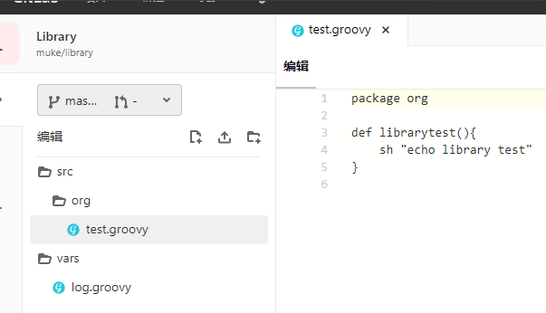

### 4、引用共享库

```yaml
#!groovy

@Library('jenkins-shared-library@main') _

def test = new org.test()

pipeline {
    agent any
    stages {     
        stage('Stage 1') {
            steps {
                script {
                    test.librarytest()
                    log.info('Starting')
                    log.warning('11','22')
                }
            }
        }                      
    }
}

```

## 四、参数化构建

### 1、字符串类型

```yaml
parameters { string(name: 'DEPLOY_ENV', defaultValue: 'staging', description: '') }
```

### 2、文本参数，可以包含多行

```yaml
parameters { text(name: 'DEPLOY_TEXT', defaultValue: 'One\nTwo\nThree\n', description: '') }
```

### 3、布尔参数

```yaml
parameters { booleanParam(name: 'DEBUG_BUILD', defaultValue: true, description: '') }
```

### 4、选择参数

```yaml
parameters { choice(name: 'CHOICES', choices: ['one', 'two', 'three'], description: '') }
```

### 5、密码参数

```yaml
parameters { password(name: 'PASSWORD', defaultValue: 'SECRET', description: 'A secret password') }
```

### 6、扩展选择参数插件

>Extended Choice Parameter
>
>单选、多选、复选框、多级单选、多级多选

### 7、时间参数

>Date Parameter Plugin

### 8、主动选择插件

>Active Choices
>
>https://github.com/jenkinsci/active-choices-plugin

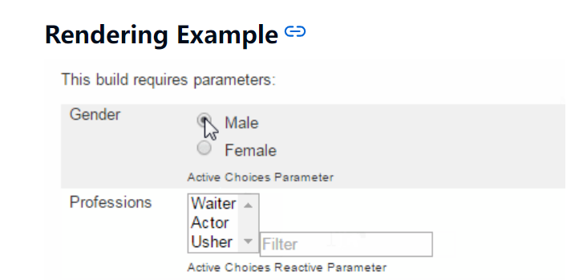

```yaml
pipeline {
    agent any 
            
    parameters {
        activeChoice choiceType: 'PT_MULTI_SELECT', description: '这是一个构建项目', filterLength: 1, filterable: true, name: 'build_project', randomName: 'choice-parameter-1472486600783191', script: groovyScript(fallbackScript: [classpath: [], oldScript: '', sandbox: true, script: 'return ["error"]'], script: [classpath: [], oldScript: '', sandbox: true, script: 'return ["neo4j","mysql","es"]'])
        reactiveChoice choiceType: 'PT_SINGLE_SELECT', description: '这是一个giturl地址', filterLength: 1, filterable: false, name: 'giturl', randomName: 'choice-parameter-1472486603282618', referencedParameters: 'build_project', script: groovyScript(fallbackScript: [classpath: [], oldScript: '', sandbox: true, script: 'return ["error"]'], script: [classpath: [], oldScript: '', sandbox: true, script: 
        '''if (build_project.equals("neo4j")){
            return ["http://neo4j.git"]
        } else if  (build_project.equals("mysql")){
            return ["http://mysql.git"]
        } '''])
        string defaultValue: 'peter', name: 'name' 
    }

    stages {
        stage('test') {
            steps {
                echo "${build_project} ${giturl}"
            }
        }
    }
}
```

## 五、kaniko

### 1、介绍

>kaniko 是一种在容器或 Kubernetes 集群内从 Dockerfile 构建容器镜像的工具。
>
>kaniko 不依赖于 Docker 守护进程，而是完全在用户空间中执行 Dockerfile 中的每个命令。这使得在无法轻松或安全地运行 Docker 守护程序的环境中构建容器镜像成为可能，例如标准的 Kubernetes 集群。
>
>https://github.com/GoogleContainerTools/kaniko

### 2、为什么

>其主要原因由于 kaniko 不依赖于 Docker 守护进程，并且完全在用户空间中执行 Dockerfile 中的每个命令，这使得能够在轻松或安全地运行在无Docker环境守护程序（如标准Kubernetes集群 V1.24.x）中构建容器映像。
>在 Kubernetes V1.24.x 版本之后默认采用 http://containerd.io 作为缺省的cri，不在支持 docker-shim 意味着我们不需要安装 docker 环境。

### 3、工作流程

>- 1、读取指定的 Dockerfile。
>- 2、将基本映像（在FROM指令中指定）提取到容器文件系统中。
>- 3、在独立的Dockerfile中分别运行每个命令。
>- 4、每次运行后都会对用户空间文件系统的做快照。
>- 5、每次运行时，将快照层附加到基础层。
>- 6、最后推送镜像。

### 4、参数介绍

```bash
--context：指定构建上下文的路径。默认情况下，上下文是Dockerfile所在的目录。可简写 -c
--dockerfile：指定要使用的Dockerfile的路径。默认情况下，Kaniko会在上下文中查找名为Dockerfile的文件。可简写 -f
--destination：指定构建完成后的Docker镜像名称，可以包括标签。例如：myregistry/myimage:tag。可简写 -d
--cache：启用或禁用Kaniko的构建缓存功能。默认情况下，缓存是启用的。
--cache-ttl：设置构建缓存的生存时间。例如，–cache-ttl=10h表示缓存在构建完成后的10小时内有效。
--cache-repo：指定用于存储构建缓存的Docker仓库。默认情况下，缓存存储在本地。
--cache-dir：指定用于存储构建缓存的本地目录路径。
--skip-tls-verify：跳过TLS证书验证，用于不安全的Docker仓库。
--build-arg：传递构建参数给Dockerfile中的ARG指令。例如：–build-arg key=value。
--insecure：允许从不受信任的Registry拉取基础镜像。
--insecure-registry：允许连接到不受信任的Registry。
--verbosity：设置构建的详细程度，可以是panic、error、warning、info、debug或trace。
--digest-file：指定一个文件，用于存储构建生成的镜像的摘要（Digest）。
--oci-layout-path：指定OCI（Open Container Initiative）布局文件的路径，用于存储构建过程的元数据。
--cache-copy-layers: 设置此标志以缓存复制层。
```

### 5、使用

#### 生成凭据

```bash
echo "Harbor666" | docker login -u "admin" --password-stdin myharbor.harbor.com
```

```bash
docker run --rm \
     -v `pwd`:/workspace \
     -v /root/.docker/config.json:/kaniko/.docker/config.json:ro \
          gcr.io/kaniko-project/executor:latest \
          --dockerfile=Dockerfile \
          --destination=${docker_image} \
          --cache-copy-layers \
          --cache=true \
          --cache-repo=${image_prefix} 
```

### 6、调试镜像

>kaniko 执行器镜像基于scratch，不包含shell。我们提供了gcr.io/kaniko-project/executor:debug一个调试映像，其中包含 kaniko 执行器映像以及要输入的 busybox shell。

```bash
docker run -it --entrypoint=/busybox/sh gcr.io/kaniko-project/executor:debug
```

### 7、pipeline-1

```yaml
#!groovy

pipeline {

	agent { 
		node { 
			label "slave"
		}
	}

    environment {
        String year = new Date().format("yyyy") 
        String month = new Date().format("MMdd") 
        String day = new Date().format("HHmm") 
        String second = new Date().format("ss")
		image_prefix = "registry.cn-hangzhou.aliyuncs.com/tool-bucket/xiaowu"        
    }

    stages {
        stage('1. 构建镜像'){ 
            steps{
                script{
                    try{       
                        env.docker_image = "${image_prefix}:main-${year}${month}${day}${second}-${BUILD_ID}"
                        retry(3) {
                            sh """
                                docker run --rm \
                                    -v `pwd`:/workspace \
                                    -v /root/.docker/config.json:/kaniko/.docker/config.json:ro \
                                    gcr.io/kaniko-project/executor:latest \
                                    --dockerfile=Dockerfile \
                                    --destination=${docker_image} \
                                    --cache-copy-layers \
                                    --cache=true \
                                    --cache-repo=${image_prefix} \
                            """
                        }
                    }catch (error){
                        env.error = sh (returnStdout: true, script: "echo 第1步构建镜像失败：${error}").trim()
                        echo "Caught: ${error}"
                        sh "exit 1"
                    }
                }
            }
        }
    }
}

```

### 8、kaniko构建上下文

| Source             | Prefix                                                       | Example                                                      |
| ------------------ | ------------------------------------------------------------ | ------------------------------------------------------------ |
| Local Directory    | `dir://[path to a directory in the kaniko container]`        | `dir:///workspace`                                           |
| Local Tar Gz       | `tar://[path to a .tar.gz in the kaniko container]`          | `tar:///path/to/context.tar.gz`                              |
| Standard Input     | `tar://[stdin]`                                              | `tar://stdin`                                                |
| GCS Bucket         | `gs://[bucket name]/[path to .tar.gz]`                       | `gs://kaniko-bucket/path/to/context.tar.gz`                  |
| S3 Bucket          | `s3://[bucket name]/[path to .tar.gz]`                       | `s3://kaniko-bucket/path/to/context.tar.gz`                  |
| Azure Blob Storage | `https://[account].[azureblobhostsuffix]/[container]/[path to .tar.gz]` | `https://myaccount.blob.core.windows.net/container/path/to/context.tar.gz` |
| Git Repository     | `git://[repository url][#reference][#commit-id]`             | `git://github.com/acme/myproject.git#refs/heads/mybranch#<desired-commit-id>` |

>- kaniko 的构建上下文与您将发送 Docker 守护程序以进行映像构建的构建上下文非常相似；它代表一个包含 Dockerfile 的目录，kaniko 将使用该目录构建您的映像。例如，COPY Dockerfile 中的命令应该引用构建上下文中的文件
>
>- 关于 Local Directory的注意事项：此选项是指 kaniko 容器内的目录。如果您希望使用此选项，则需要在构建上下文中将其作为目录挂载到容器中
>- 关于本地 Tar 的注意事项：此选项指的是 kaniko 容器中的 tar gz文件。如果您希望使用此选项，则需要在构建上下文中将其作为文件挂载到容器中。
>- 如果使用 GCS 或 S3 存储桶，您首先需要创建构建上下文的压缩 tar 并将其上传到您的存储桶。运行后，kaniko 将在开始映像构建之前下载并解压构建上下文的压缩 tar。

#### 1.创建压缩tar

```bash
#  tar -C <path to build context> -zcvf context.tar.gz . 
$ ls cache/
Dockerfile

# 压缩上下文目录
$ tar -C cache/ -zcvf context.tar.gz .
./
./Dockerfile

# 查看压缩文件
$ tar -ztvf context.tar.gz
drwxr-xr-x root/root         0 2023-11-27 13:03 ./
-rw-r--r-- root/root        52 2023-11-27 13:04 ./Dockerfile
```

#### 2.上传压缩tar

>我们可以使用 gsutil 将压缩的 tar 复制到 GCS 存储桶： `gsutil cp context.tar.gz gs://<bucket name>`

#### 3.使用

>例如，要使用名为 kaniko-bucket 的 GCS 存储桶，您需要传入 --context=gs://kaniko-bucket/path/to/context.tar.gz 。
>温馨提示：kaniko 允许的唯一标准输入是 .tar.gz 格式, 如果要创建压缩 tar，您可以运行 `tar -C <path to build context> -zcvf context.tar.gz . `命令。
>运行 kaniko 时，使用 --context 带有适当前缀的标志指定构建上下文的位置, 如果您不指定前缀 kaniko 将假定一个本地目录, 

### 9、k8s中使用

#### 1.创建secret

```bash
$ kubectl -n jenkins create secret docker-registry kaniko-secret \
--docker-server=https://index.docker.io/v1/ \
--docker-username=<dockerhub-username> \
--docker-password=<dockerhub-password>

$ kubectl  get secret kaniko-secret
NAME            TYPE     DATA   AGE
kaniko-secret   Opaque   1      23s
```

#### 2.准备demo程序

```bash
$ cd /root/python
$ pip3 install Flask
$ pip3 freeze | grep Flask >> requirements.txt

$ vim app.py
#!/usr/bin/python3
from flask import Flask
app = Flask(__name__)

@app.route('/')
def hello_world():
    return 'Hello, Kaniko!'

if __name__ == '__main__':
    app.run(host='0.0.0.0', port=8080)
```

#### 3.dockerfile准备

```bash
$ cat Dockerfile 
FROM python:3.8-slim-buster

WORKDIR /app

COPY requirements.txt requirements.txt
RUN pip3 install -r requirements.txt

COPY . .

CMD [ "python3", "app.py"]
```

#### 4.编排kaniko pod

##### 1）项目目录

```bash
# tree /root/python
|____ app.py
|____ requirements.txt
|____ Dockerfile
```

##### 2）kaniko pod

```yaml
apiVersion: v1
kind: Pod
metadata:
  name: kaniko
spec:
  containers:
 - name: kaniko
    image: gcr.io/kaniko-project/executor:latest
    args:
    - "--dockerfile=/python/Dockerfile"
    - "--context=gs:/python/"
    - "--destination=myharbor.harbor.com/library/python-docker:v1.0"
    volumeMounts:
    - name: kaniko-secret
      mountPath: /secret
    - name: python-docker
      mountPath: /python
      subPath: Dockerfile    
    env:
    - name: GOOGLE_APPLICATION_CREDENTIALS
      value: /secret/kaniko-secret.json
  restartPolicy: Never
  volumes:
 - name: kaniko-secret
    secret:
      secretName: kaniko-secret
 - name: python-docker
   hostPath: 
     path: /root/python
```

### 10、集成到流水线

```yaml
pipeline {
    agent {
        kubernetes {
      yaml """
kind: Pod
metadata:
  name: kaniko
spec:
  containers:
  - name: kaniko
    image: gcr.io/kaniko-project/executor:latest
    imagePullPolicy: Always
    command:
    - cat
    tty: true
"""
      }
    }
   
    stages {
        stage('拉代码') {
            steps {
                ...
            }
        }
       
        stage('构建镜像') {
            steps {
                // 使用 kaniko 来构建镜像
                container(name: 'kaniko') {
                    Dockerfile 内容...
                    sh "kaniko -f Dockerfile -c ./ -d myharbor.harbor.com/myapp/:$BUILD_NUMBER --force"
                }
            }
        }
         
        stage('部署') {
            steps {
              container(name: 'helm') {
                ...
              }
            }
        }
         
    }
}

```

