# jenkins接入其他工具

## 一、部署配置SonarQube并集成到Jenkins扫描代码

### 1、Sonar介绍

>SonarQube是一个用于持续检查代码质量的开源平台。用于分析和衡量软件项目中的技术债务。SonarQube帮助开发人员和团队识别问题、漏洞、错误和代码质量问题。

### 2、docker-compose快速部署

#### 1.配置内存映射区域最大数量

```bash
vim /etc/sysctl.conf
...
vm.max_map_count=262144
...


sysctl -p
```

#### 2.docker-compose

```bash
version: "3"

services:
  sonarqube:
    image: sonarqube:community
    depends_on:
      - db
    environment:
      SONAR_JDBC_URL: jdbc:postgresql://db:5432/sonar
      SONAR_JDBC_USERNAME: sonar
      SONAR_JDBC_PASSWORD: sonar
    volumes:
      - sonarqube_data:/opt/sonarqube/data
      - sonarqube_extensions:/opt/sonarqube/extensions
      - sonarqube_logs:/opt/sonarqube/logs
    ports:
      - "9000:9000"
  db:
    image: postgres:12
    environment:
      POSTGRES_USER: sonar
      POSTGRES_PASSWORD: sonar
    volumes:
      - postgresql:/var/lib/postgresql
      - postgresql_data:/var/lib/postgresql/data

volumes:
  sonarqube_data:
  sonarqube_extensions:
  sonarqube_logs:
  postgresql:
  postgresql_data:

```

#### 3.登录系统

>默认用户: admin
>
>默认密码: admin

### 3、安装中文插件

>需要科学上网

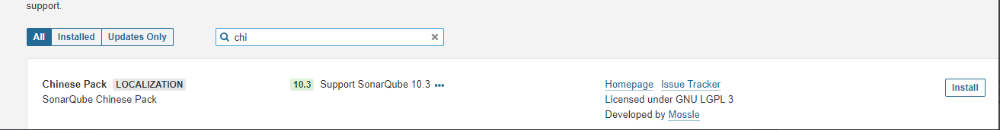

### 4、接入LDAP

```bash
vim /var/lib/docker/volumes/sonarqube_sonarqube_conf/_data/sonar.properties
...
# LDAP configuration
# General Configuration
sonar.security.realm=LDAP
ldap.url=ldap://10.0.7.30:389
ldap.bindDn=cn=admin,dc=xiaowu,dc=cn
ldap.bindPassword=xiaowu6666
  
# User Configuration
ldap.user.baseDn=ou=user,dc=xiaowu,dc=cn
ldap.user.request=(&(objectClass=inetOrgPerson)(uid={login}))
ldap.user.realNameAttribute=cn
ldap.user.emailAttribute=mail
```

### 5、代码行为配置

> 配置新代码周期

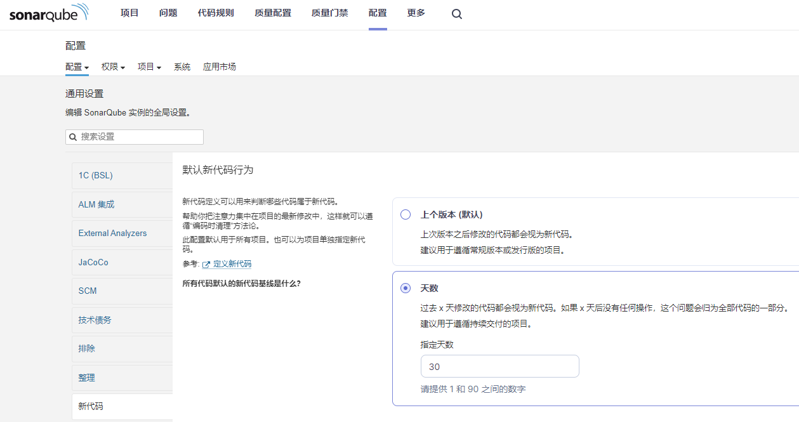

### 6、权限配置

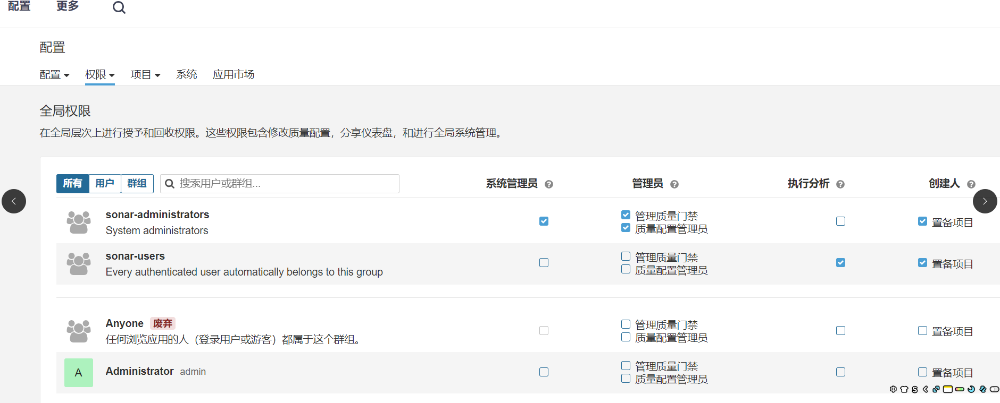

### 7、质量门禁

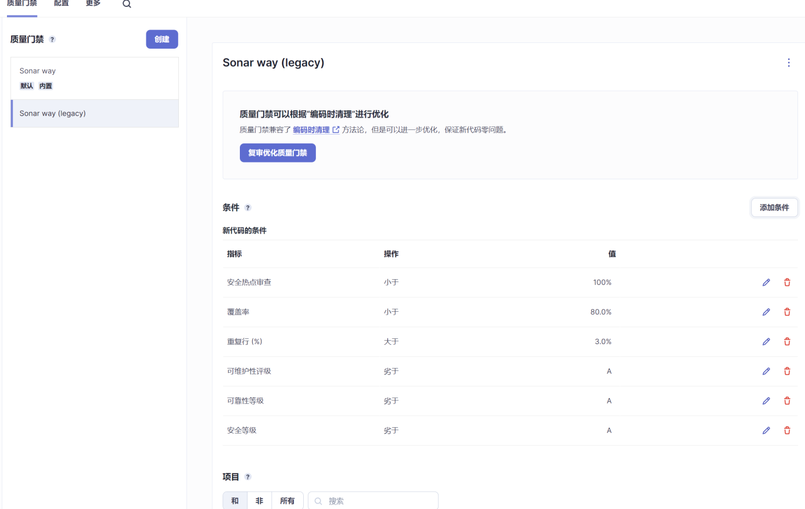

### 8、配置令牌接入jenkins

#### 1.sonar创建令牌

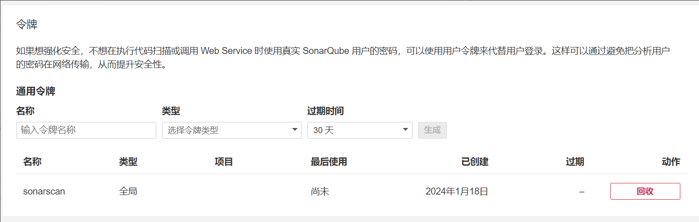

#### 2.jenkins配置凭据

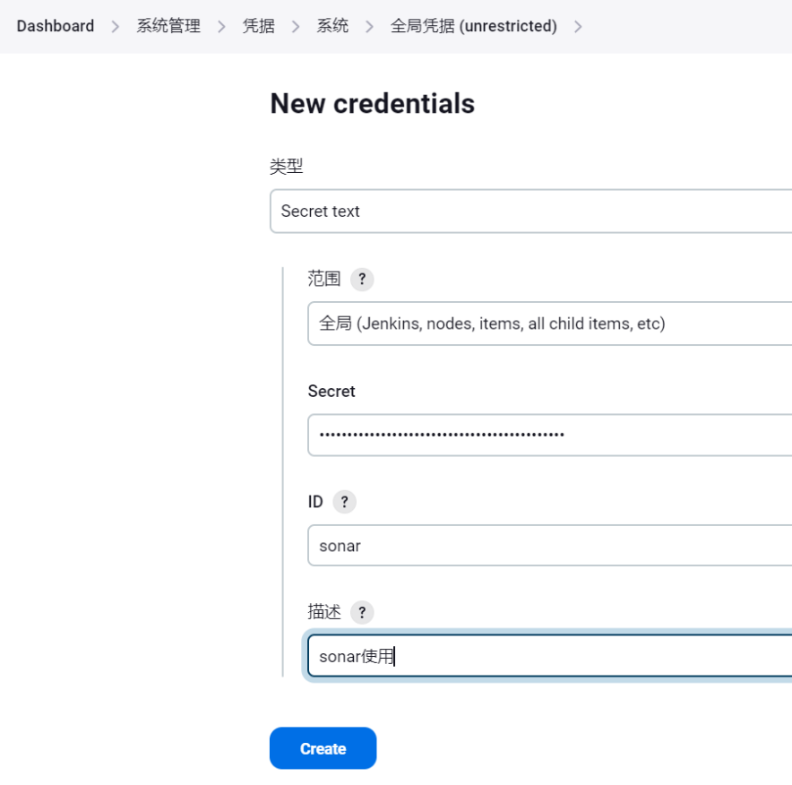

#### 3.jenkins接入

>安装插件SonarQube Scanner for Jenkins

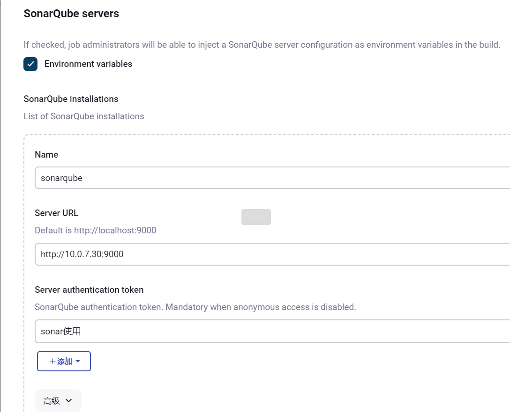

### 9、流水线使用sonar扫描

```yaml
#!groovy

@Library('jenkins-shared-library@main') _

def tools = new org.color()
def checkout = new org.checkout()

pipeline {

	agent {
        label 'slave'
    }

    options {
      timestamps()      
      parallelsAlwaysFailFast()
      timeout(time: 600, unit: 'SECONDS') 
      disableConcurrentBuilds(abortPrevious: true) 
      buildDiscarder(logRotator(numToKeepStr: '30'))
      skipDefaultCheckout() 
    }

    environment {
        String year = new Date().format("yyyy") 
        String month = new Date().format("MMdd") 
        String day = new Date().format("HHmm") 
        String second = new Date().format("ss")
		images_head = "registry.cn-hangzhou.aliyuncs.com"   
        giturl = "http://10.0.7.30/golang/go.git"           
    }

    parameters {
        choice choices: ['main', 'pre', 'test'], name: 'branch_name'
    }

    stages {
        stage('克隆代码') {
            agent {
                docker {
                    label 'slave'
                    image 'registry.cn-hangzhou.aliyuncs.com/tool-bucket/tool:git'
                }
            }   
            steps {
                script {
                    cleanWs() 
                    tools.PrintMessage("1.克隆代码","blue")   
                    checkout.scm(branch_name,giturl)
                }
            }
        }        
        stage('sonar扫描') {
            agent {
                docker {
                    label 'slave'
                    image 'sonarsource/sonar-scanner-cli'
                }
            }        
            steps {
                script {
                    tools.PrintMessage("1.sonar扫描","blue")              
                    withSonarQubeEnv('sonarqube') {
                        sh """
                        sonar-scanner \
                        -Dsonar.projectKey=test-go \
                        -Dsonar.projectName=test-go \
                        -Dsonar.projectVersion=test-go-${BUILD_NUMBER} \
                        -Dsonar.ws.timeout=30 \
                        -Dsonar.sources=. \
                        -Dsonar.sourceEncoding=UTF-8
                        sleep 3
                    """
                    }
                }  
            }
        }
        stage("Quality Gate"){           
            steps {
                script {      
                    tools.PrintMessage("2.Quality Gate","blue")
                    timeout(time: 10, unit: 'SECONDS') { 
                        def qg = waitForQualityGate('sonarqube') 
                        if (qg.status != 'OK') {
                            error "未通过Sonarqube的代码质量阈检查，请及时修改！failure: ${qg.status}"
                        }
                    }
                }
            }
        }
    }
} 

```

## 二、部署配置MeterSphere并集成到Jenkins做接口测试

### 1、介绍

>MeterSphere 是一站式的开源持续测试平台，涵盖测试管理、接口测试、UI 测试和性能测试等功能，全面兼容 JMeter 等主流开源标准，有效助力开发和测试团队充分利用云弹性进行高度可扩展的自动化测试，加速高质量的软件交付。

### 2、k8s部署

#### 1.deployment

```yaml
kind: Deployment
apiVersion: apps/v1
metadata:
  name: metersphere
  namespace: metersphere
  labels:
    app: metersphere
spec:
  replicas: 1
  strategy:
    type: Recreate
  selector:
    matchLabels:
      app: metersphere
  template:
    metadata:
      labels:
        app: metersphere
    spec:
      containers:
        - name: metersphere
          image: metersphere/metersphere-ce-allinone:v3.4.0
          ports:
            - name: tcp-8081
              containerPort: 8081
              protocol: TCP
          env:
          - name: TZ
            value: Asia/Shanghai
          resources:
            requests:
              cpu: 10m
              memory: 10Mi
          volumeMounts:
            - name: data
              mountPath: /opt/metersphere/data
      volumes:
        - name: data
          nfs:
            server: 192.168.100.47
            path: /nfs/k8s-app/metersphere/data
```

#### 2.svc

```yaml
apiVersion: v1
kind: Service
metadata:
  name: metersphere
  namespace: metersphere
  labels:
    app: metersphere
spec:
  type: NodePort
  ports:
  - name: tcp-8081
    port: 8081
    protocol: TCP
    targetPort: 8081
    nodePort: 8081
  selector:
    app:  metersphere
```

### 3、物理机部署

```bash
curl -sSL   https://resource.fit2cloud.com/metersphere/metersphere/releases/latest/download/quick_start.sh | bash
```

>访问MeterSphere
>
>地址: http://目标服务器IP地址:8081
>
>用户名: admin
>
>密码: metersphere

### 4、配置LDAP

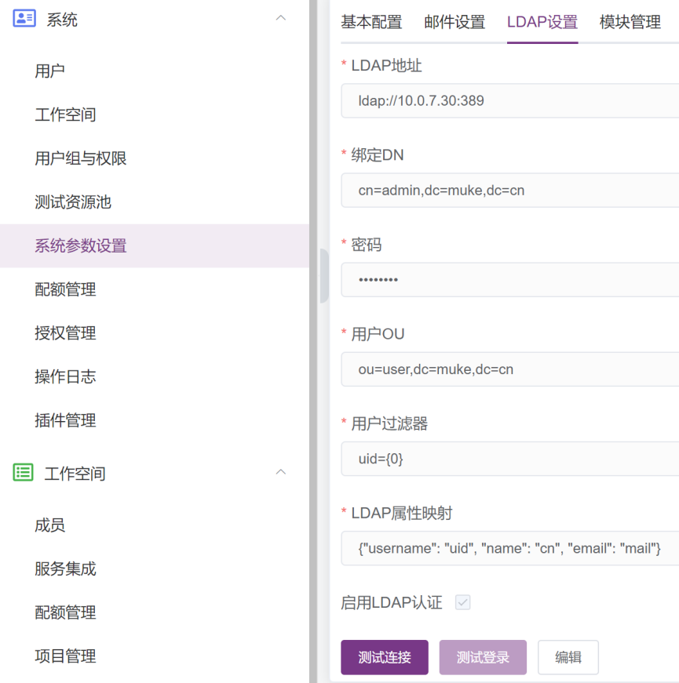

### 5、创建AKSK

>创建AKSK用于Jenkins接入MeterShpere

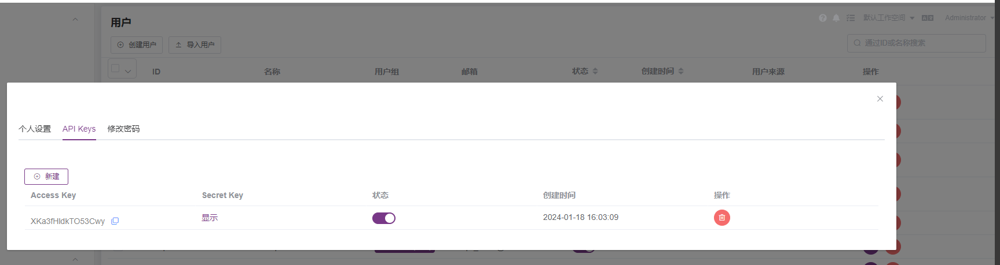

### 6、项目环境配置

#### 1.项目配置

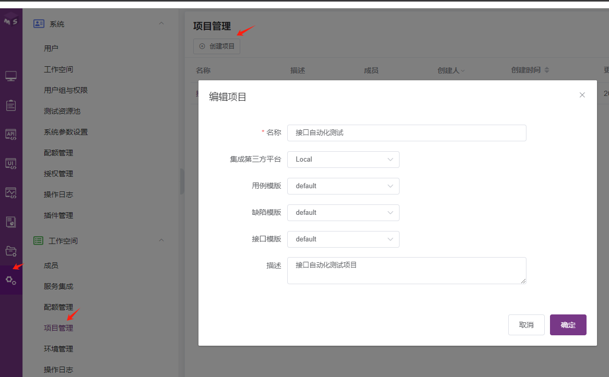

#### 2.环境配置

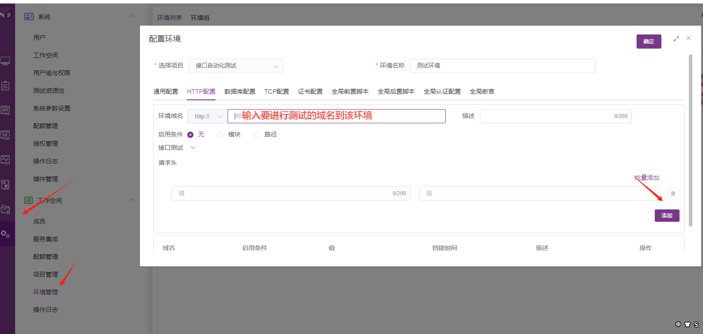

#### 3.定义接口

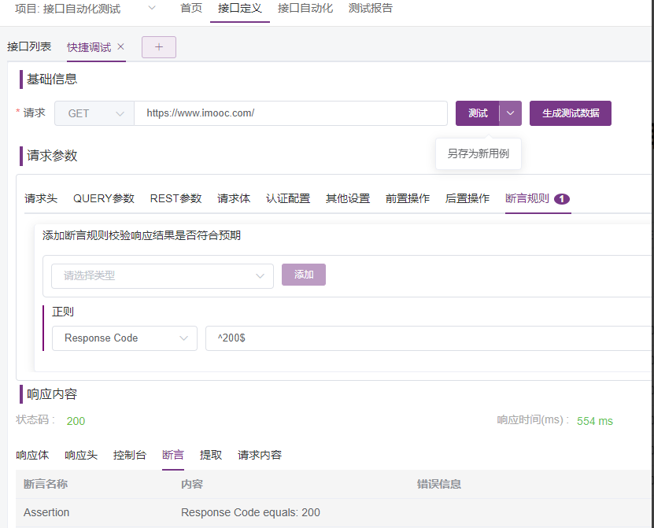

#### 4.关联测试计划

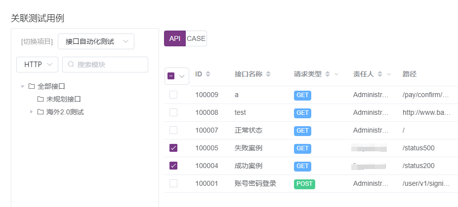

### 7、用户权限与告警配置

#### 1.配置用户权限

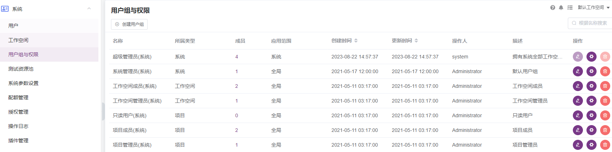

#### 2.配置发送告警

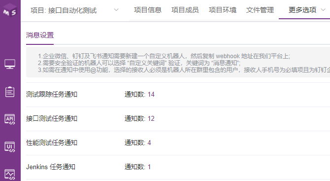

### 8、jenkins集成

#### 1.安装插件

>安装插件，插件下载地址:https://github.com/metersphere/jenkins-plugin/releases

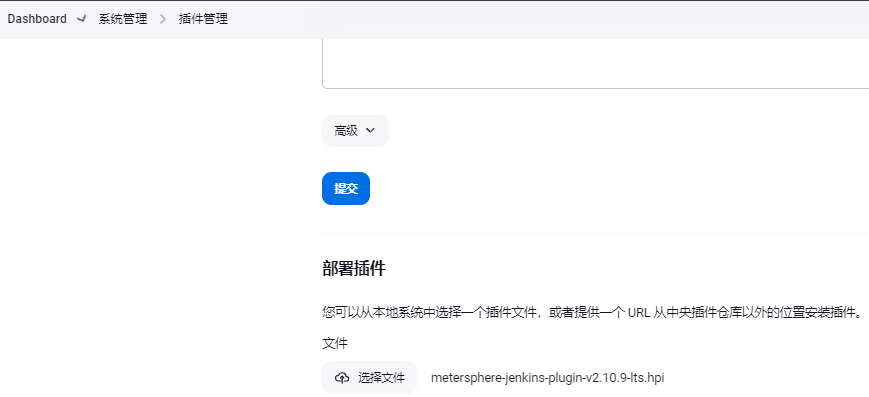

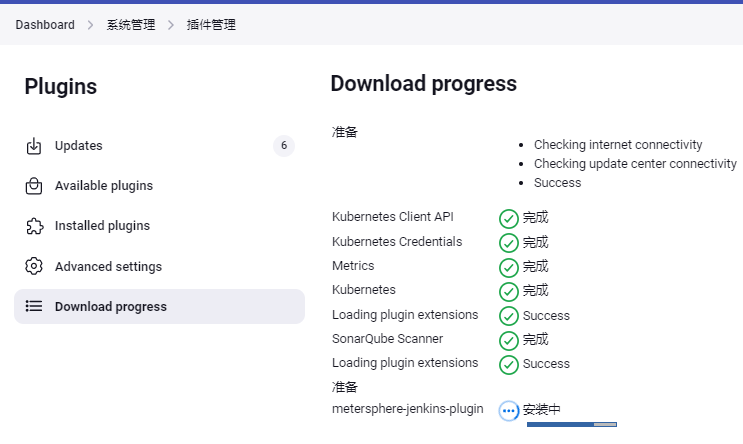

#### 2.输入metershpere访问地址及AKSK进行账户验证

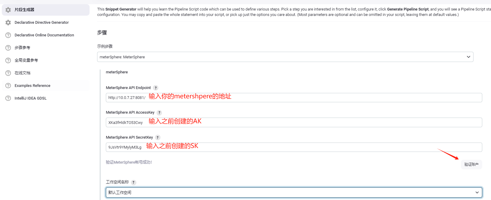

#### 3.生成流水线脚本

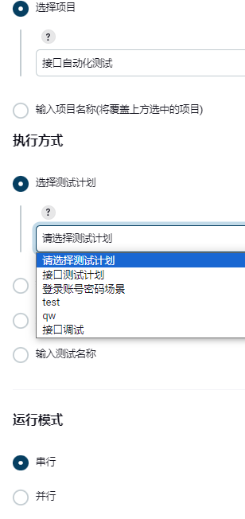

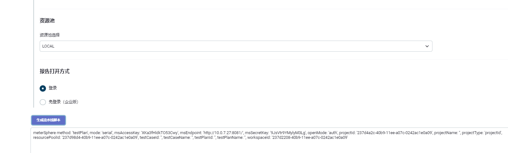

#### 4.Jenkinsfile定义接口测试扫描步骤

```yaml
#!groovy

pipeline {

	agent {
        label 'slave'
    }

    options {
      timestamps()      
      parallelsAlwaysFailFast()
      timeout(time: 600, unit: 'SECONDS') 
      disableConcurrentBuilds(abortPrevious: true) 
      buildDiscarder(logRotator(numToKeepStr: '30'))
      skipDefaultCheckout() 
    }
    
    stages {
        stage('metershpere测试') {
            steps {
                    meterSphere method: 'testPlan',
                    mode: 'serial', 
                    msAccessKey: 'OYPWJwNk9vi6JNiF', 
                    msEndpoint: 'http://10.0.7.27:8081/', 
                    msSecretKey: '7D0UlTZXXTZMt0fD', 
                    openMode: 'auth', 
                    projectId: 'a6ad182f-f6f1-44de-bdc7-3e6aef7c9e84', 
                    projectName: '', 
                    projectType: 'projectId', 
                    resourcePoolId: '237d98d4-40b9-11ee-a07c-0242ac1e0a09', 
                    testCaseId: '', testCaseName: '', 
                    testPlanId: '99355526-981f-4927-bd6d-b37e54eb00c1', 
                    testPlanName: '', 
                    workspaceId: '4d144486-dc2a-4282-acd6-9b449869eeae'
                }  
            }
        }
} 

```

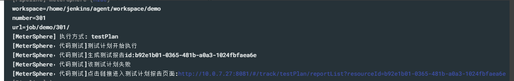


