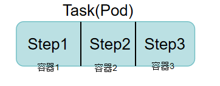
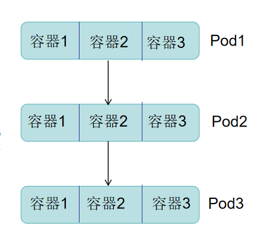
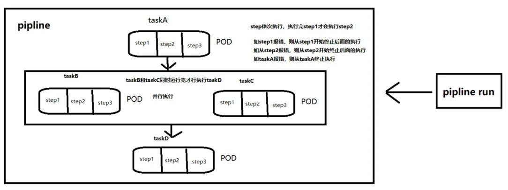

# Tekton介绍

## 一、是什么？

>Tekton是一个开源的Kubernetes原生持续集成和持续交付框架
>
>它通过Kubernetes原生的自定义资源来定义流水线的各个组件和任务

## 二、为什么？

>云原生应用程序与Kubernetes紧密集成
>
>声明式流水线
>
>可扩展性和灵活性、活跃的社区

## 三、概念介绍

>Task：一个Task即一个任务，一个任务运行一个Pod。
>
>Step：一个Task包含多个Step，一个Step就是一个容器。
>
>Taskrun:  Task引用Taskrun来运行Task。
>
>Pipeline：由多个Task组成的Pipeline。
>
>Pipelinerun：Pipeline引用Pipelinerun运行Pipline。
>
>总结：Pipelinerun用于运行Pipeline，并且会创建Taskrun去运行Task，不需要再单独创建Taskrun

## 四、运行流程

### 1、Task运行流程

>1、创建声明式Task
>
>2、创建声明式Taskrun
>
>3、执行Taskrun运行Task

### 2、Pipeline运行流程

>1、创建声明式Task
>
>2、创建声明式Pipeline
>
>3、创建声明式Piplinerun，执行Pipelinerun运行Pipeline

## 五、Pipeline架构

>Pod内的容器从第1个开始依次执行
>
>Pod内可以配置多个容器
>
>Pod1的容器执行完了才会执行Pod2的容器
>
>一旦有容器执行失败，流水线则从该步终止

## 六、完整流水线架构

