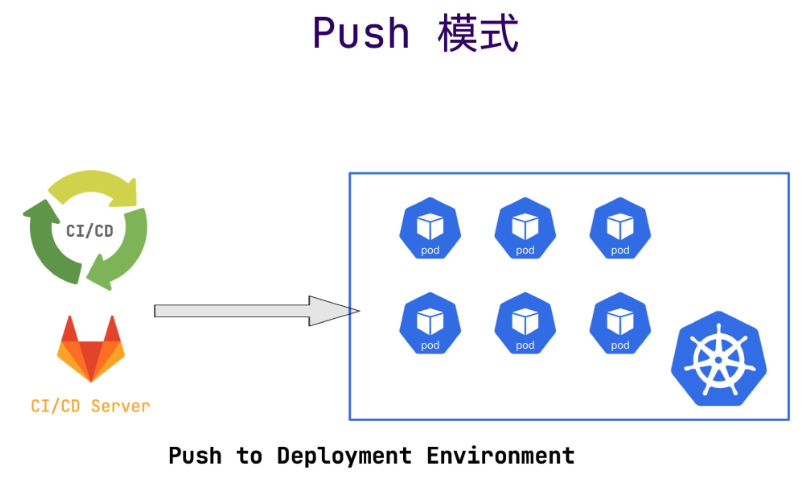
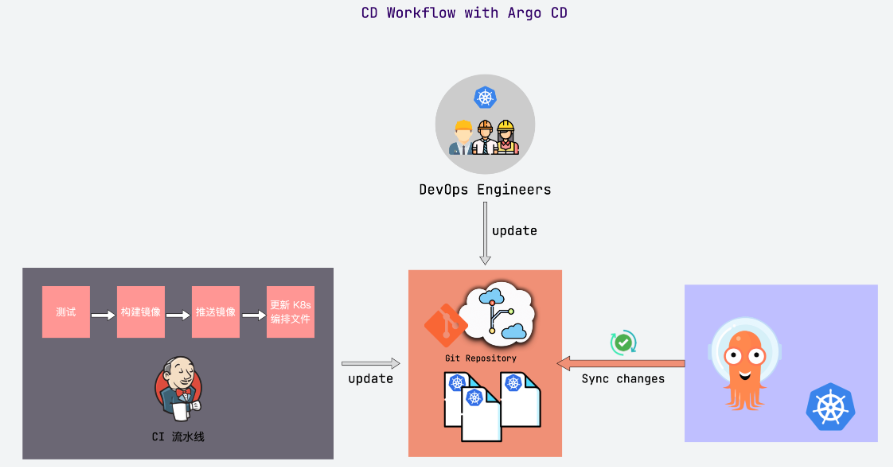
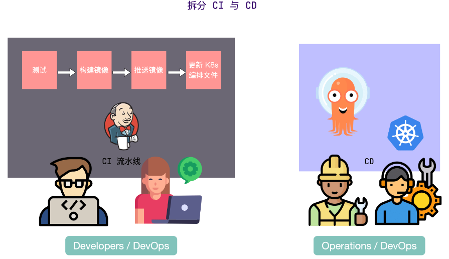
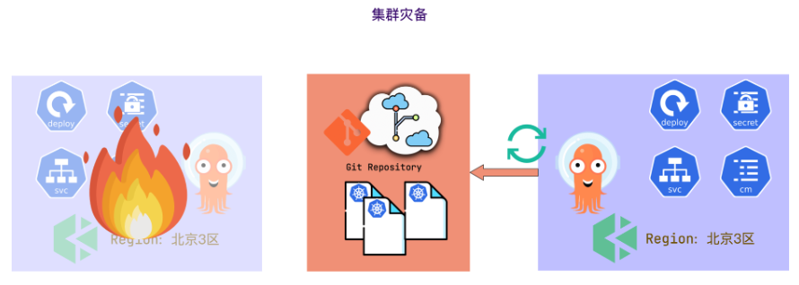
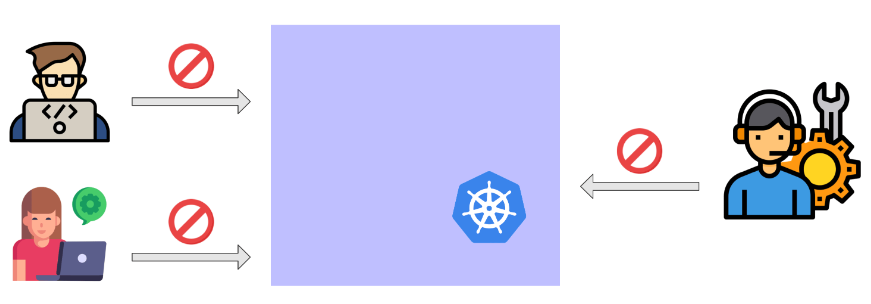
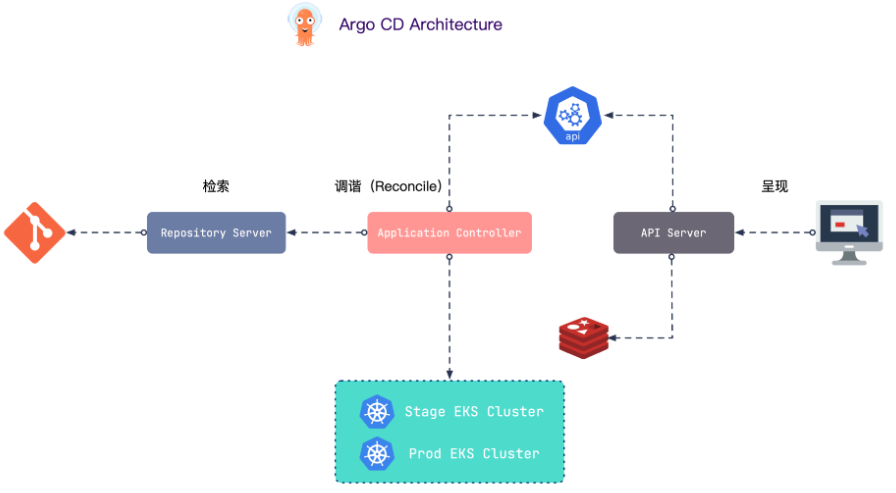
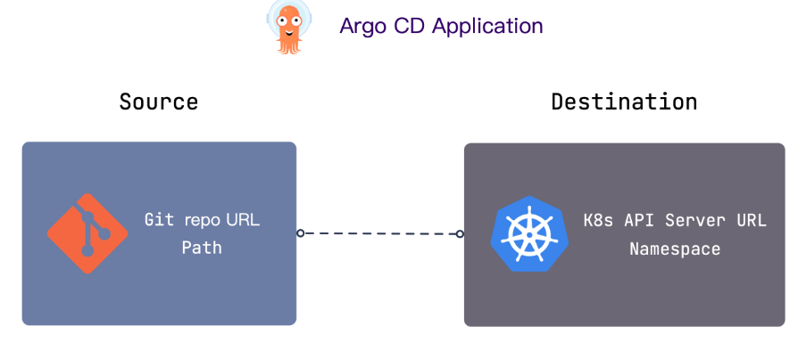
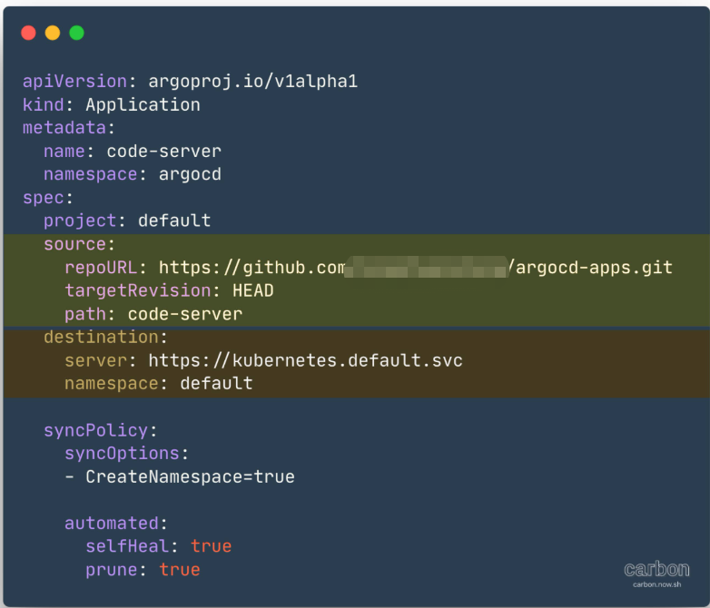

# ArgoCD介绍

## 一、前言

>​    在上一篇『 [GitOps 介绍](https://icloudnative.io/posts/what-is-gitops/)』中，我介绍了什么是 GitOps，包括 GitOps 的原则和优势，以及 GitOps 与 DevOps 的区别。本文将介绍用于实施 GitOps 的工具 Argo CD。
>
>​    Argo CD 是以 Kubernetes 作为基础设施，遵循声明式 GitOps 理念的持续交付（continuous delivery, CD）工具，支持多种配置管理工具，包括 ksonnet/jsonnet、kustomize 和 Helm 等。它的配置和使用非常简单，并且自带一个简单易用的可视化界面。
>
>​    按照官方定义，Argo CD 被实现为一个 Kubernetes 控制器，它会持续监控正在运行的应用，并将当前的实际状态与 Git 仓库中声明的期望状态进行比较，如果实际状态不符合期望状态，就会更新应用的实际状态以匹配期望状态。
>
>​    在正式开始解读和使用 Argo CD 之前，我们需要先搞清楚为什么需要 Argo CD？它能给我们带来什么价值？

## 二、传统CD工作流

> ​    前大多数 CI/CD 工具都使用基于 Push 的部署模式，例如 Jenkins、CircleCI 等。这种模式一般都会在 CI 流水线运行完成后执行一个命令（比如 kubectl）将应用部署到目标环境中。

>这种 CD 模式的缺陷很明显：
>
>- 需要安装配置额外工具（比如 kubectl）；
>- 需要 Kubernetes 对其进行授权；
>- 需要云平台授权；
>- 无法感知部署状态。也就无法感知期望状态与实际状态的偏差，需要借助额外的方案来保障一致性。
>
>下面以 Argo CD 为例，来看看遵循声明式 GitOps 理念的 CD 工具是怎么实现的。

## 三、使用 Argo CD 的 CD 工作流

>​    和传统 CI/CD 工具一样，CI 部分并没有什么区别，无非就是测试、构建镜像、推送镜像、修改部署清单等等。重点在于 CD 部分。
>
>​    Argo CD 会被部署在 Kubernetes 集群中，使用的是基于 Pull 的部署模式，它会周期性地监控应用的实际状态，也会周期性地拉取 Git 仓库中的配置清单，并将实际状态与期望状态进行比较，如果实际状态不符合期望状态，就会更新应用的实际状态以匹配期望状态。

>​     无论是通过 CI 流水线触发更新 K8s 编排文件，还是 DevOps 工程师直接修改 K8s 编排文件，Argo CD 都会自动拉取最新的配置并应用到 K8s 集群中。
>
>​     最终会得到一个相互隔离的 CI 与 CD 流水线，CI 流水线通常由研发人员（或者 DevOps 团队）控制，CD 流水线通常由集群管理员（或者 DevOps 团队）控制。

## 四、ArgoCD的优势

### 1、Git作为应用的唯一真实来源

>​    所有 K8s 的声明式配置都保存在 Git 中，并把 Git 作为应用的唯一事实来源，我们不再需要手动更新应用（比如执行脚本，执行 kubectl apply 或者 helm install 命令），只需要通过统一的接口（Git）来更新应用。
>
>​    此外，Argo CD 不仅会监控 Git 仓库中声明的期望状态，还会监控集群中应用的实际状态，并将两种状态进行对比，只要实际状态不符合期望状态，实际状态就会被修正与期望状态一致。所以即使有人修改了集群中应用的状态（比如修改了副本数量），Argo CD 还是会将其恢复到之前的状态。**这就真正确保了 Git 仓库中的编排文件可以作为集群状态的唯一真实来源。**
>
>​    当然，有时候我们需要快速更新应用并进行调试，通过 Git 来触发更新还是慢了点，这也不是没有办法，我们可以修改 Argo CD 的配置，使其不对手动修改的部分进行覆盖或者回退，而是直接发送告警，提醒管理员不要忘了将更新提交到 Git 仓库中。

### 2、快速回滚

>​    Argo CD 会定期拉取最新配置并应用到集群中，一旦最新的配置导致应用出现了故障（比如应用启动失败），我们可以通过 Git History 将应用状态快速恢复到上一个可用的状态。
>
>​    如果你有多个 Kubernetes 集群使用同一个 Git 仓库，这个优势会更明显，因为你不需要分别在不同的集群中通过 `kubectl delete` 或者 `helm uninstall` 等手动方式进行回滚，只需要将 Git 仓库回滚到上一个可用的版本，Argo CD 便会自动同步。

### 3、集群灾备

>​    如果你在 [青云](https://www.qingcloud.com/)北京3区中的 [KubeSphere](https://kubesphere.com.cn/) 集群出现故障，且短期内不可恢复，可以直接创建一个新集群，然后将 Argo CD 连接到 Git 仓库，这个仓库包含了整个集群的所有配置声明。最终新集群的状态会与之前旧集群的状态一致，完全不需要人工干预。

### 4、使用 Git 实现访问控制

>​    通常在生产环境中是不允许所有人访问 Kubernetes 集群的，如果直接在 Kubernetes 集群中控制访问权限，必须要使用复杂的 RBAC 规则。在 Git 仓库中控制权限就比较简单了，例如所有人（DevOps 团队，运维团队，研发团队，等等）都可以向仓库中提交 Pull Request，但只有高级工程师可以合并 Pull Request。
>
>​    这样做的好处是，除了集群管理员和少数人员之外，其他人不再需要直接访问 Kubernetes 集群，只需访问 Git 仓库即可。对于程序而言也是如此，类似于 Jenkins 这样的 CI 工具也不再需要访问 Kubernetes 的权限，因为只有 Argo CD 才可以 apply 配置清单，而且 Argo CD 已经部署在 Kubernetes 集群中，必要的访问权限已经配置妥当，这样就不需要给集群外的任意人或工具提供访问的证书，可以提供更强大的安全保障。

### 5、扩展 Kubernetes

>​    虽然 Argo CD 可以部署在 Kubernetes 集群中，享受 Kubernetes 带来的好处，但这不是 Argo CD 专属的呀！Jenkins 不是也可以部署在 Kubernetes 中吗？Argo CD 有啥特殊的吗？
>
>​    那当然有了，没这金刚钻也不敢揽这瓷器活啊，Argo CD 巧妙地利用了 Kubernetes 集群中的很多功能来实现自己的目的，例如所有的资源都存储在 Etcd 集群中，利用 Kubernetes 的控制器来监控应用的实际状态并与期望状态进行对比，等等。
>
>​    这样做最直观的好处就是**可以实时感知应用的部署状态**。例如，当你在 Git 仓库中更新配置清单中的镜像版本后，Argo CD 会将集群中的应用更新到最新版本，你可以在 Argo CD 的可视化界面中实时查看更新状态（比如 Pod 创建成功，应用成功运行并且处于健康状态，或者应用运行失败需要进行回滚操作）。

## 五、Argo CD 架构

>从功能架构来看，Argo CD 主要有三个组件：API Server、Repository Server 和 Application Controller。从 GitOps 工作流的角度来看，总共分为 3 个阶段：检索、调谐和呈现。

### 1、检索 – Repository Server

>   检索阶段会克隆应用声明式配置清单所在的 Git 仓库，并将其缓存到本地存储。包含 Kubernetes 原生的配置清单、Helm Chart 以及 Kustomize 配置清单。履行这些职责的组件就是 **Repository Server**。

### 2、调谐 – Application Controller

>    调谐（Reconcile）阶段是最复杂的，这个阶段会将 **Repository Server** 获得的配置清单与反映集群当前状态的实时配置清单进行对比，一旦检测到应用处于 `OutOfSync` 状态，**Application Controller** 就会采取修正措施，使集群的实际状态与期望状态保持一致。

### 3、呈现 – API Server

>最后一个阶段是呈现阶段，由 Argo CD 的 **API Server** 负责，它本质上是一个 gRPC/REST Server，提供了一个无状态的可视化界面，用于展示调谐阶段的结果。同时还提供了以下这些功能：
>
>- 应用管理和状态报告；
>- 调用与应用相关的操作（例如同步、回滚、以及用户自定义的操作）；
>- Git 仓库与集群凭证管理（以 Kubernetes Secret 的形式存储）；
>- 为外部身份验证组件提供身份验证和授权委托；
>- RBAC 增强；
>- Git Webhook 事件的监听器/转发器。

## 六、Argocd重要组件

### 1、API服务

>API 服务是一个 gRPC/REST 服务，它暴露了 Web UI、CLI 和 CI/CD 系统使用的接口，主要有以下几个功能：
>
>- 应用程序管理和状态报告
>
>- 执行应用程序操作（例如同步、回滚、用户定义的操作）
>
>- 存储仓库和集群凭据管理（存储为 K8S Secrets 对象）
>
>- 认证和授权给外部身份提供者
>
>- RBAC
>
>- Git webhook 事件的侦听器/转发器

### 2、仓库服务

>存储仓库服务是一个内部服务，负责维护保存应用程序清单 Git 仓库的本地缓存。当提供以下输入时，它负责生成并返回 Kubernetes 清单：
>
>- 存储 URL
>
>- revision 版本（commit、tag、branch）
>
>- 应用路径
>
>- 模板配置：参数、ksonnet 环境、helm values.yaml 等

### 3、应用控制器

>应用控制器是一个 Kubernetes 控制器，它持续 watch 正在运行的应用程序并将当前的实时状态与所期望的目标状态（ repo 中指定的）进行比较。它检测应用程序的 OutOfSync 状态，并采取一些措施来同步状态，它负责调用任何用户定义的生命周期事件的钩子（PreSync、Sync、PostSync）。

## 七、支持的清单

>- kustomize
>
>- helm charts
>
>- ksonnet applications
>
>- jsonnet files
>
>- Plain directory of YAML/json manifests
>
>- Any custom config management tool configured as a config management plugin

## 八、功能

>- 自动部署应用程序到指定的目标环境
>
>- 支持多种配置管理/模板工具（Kustomize、Helm、Ksonnet、Jsonnet、plain-YAML）
>
>- 能够管理和部署到多个集群
>
>- SSO 集成（OIDC、OAuth2、LDAP、SAML 2.0、GitHub、GitLab、Microsoft、LinkedIn）
>
>- 用于授权的多租户和 RBAC 策略
>
>- 回滚/随时回滚到 Git 存储库中提交的任何应用配置
>
>- 应用资源的健康状况分析
>
>- 自动配置检测和可视化
>
>- 自动或手动将应用程序同步到所需状态
>
>- 提供应用程序活动实时视图的 Web UI
>
>- 用于自动化和 CI 集成的 CLI
>
>- Webhook 集成（GitHub、BitBucket、GitLab）
>
>- 用于自动化的 AccessTokens
>
>- PreSync、Sync、PostSync Hooks，以支持复杂的应用程序部署（例如蓝/绿和金丝雀发布）
>
>- 应用程序事件和 API 调用的审计
>
>- Prometheus 监控指标
>
>- 用于覆盖 Git 中的 ksonnet/helm 参数

## 九、核心概念

>- Application：应用，一组由资源清单定义的 Kubernetes 资源，这是一个 CRD 资源对象
>
>- Application source type：用来构建应用的工具
>
>- Target state：目标状态，指应用程序所需的期望状态，由 Git 存储库中的文件表示
>
>- Live state：实时状态，指应用程序实时的状态，比如部署了哪些 Pods 等真实状态
>
>- Sync status：同步状态表示实时状态是否与目标状态一致，部署的应用是否与 Git 所描述的一样？
>
>- Sync：同步指将应用程序迁移到其目标状态的过程，比如通过对 Kubernetes 集群应用变更
>
>- Sync operation status：同步操作状态指的是同步是否成功
>
>- Refresh：刷新是指将 Git 中的最新代码与实时状态进行比较，弄清楚有什么不同
>
>- Health：应用程序的健康状况，它是否正常运行？能否为请求提供服务？
>
>- Tool：工具指从文件目录创建清单的工具，例如 Kustomize 或 Ksonnet 等
>
>- Configuration management tool：配置管理工具
>
>- Configuration management plugin：配置管理插件

### 1、Argo CD Application

>​    Argo CD 中的 Application 定义了 Kubernetes 资源的**来源**（Source）和**目标**（Destination）。来源指的是 Git 仓库中 Kubernetes 资源配置清单所在的位置，而目标是指资源在 Kubernetes 集群中的部署位置。
>
>​    来源可以是原生的 Kubernetes 配置清单，也可以是 Helm Chart 或者 Kustomize 部署清单。
>
>​    目标指定了 Kubernetes 集群中 API Server 的 URL 和相关的 namespace，这样 Argo CD 就知道将应用部署到哪个集群的哪个 namespace 中。
>
>​    简而言之，**Application 的职责就是将目标 Kubernetes 集群中的 namespace 与 Git 仓库中声明的期望状态连接起来**。

### 2、Argo CD Project

> 如果有多个团队，每个团队都要维护大量的应用，就需要用到 Argo CD 的另一个概念：**项目**（Project）。
>
> Argo CD 中的项目（Project）可以用来对 Application 进行分组，不同的团队使用不同的项目，这样就实现了多租户环境。项目还支持更细粒度的访问权限控制：
>
> - 限制部署内容（受信任的 Git 仓库）；
> - 限制目标部署环境（目标集群和 namespace）；
> - 限制部署的资源类型（例如 RBAC、CRD、DaemonSets、NetworkPolicy 等）；
> - 定义项目角色，为 Application 提供 RBAC（例如 OIDC group 或者 JWT 令牌绑定）。

