# Argocd使用

## 一、登录注销

>对argoCD的操作需要先登录。

```bash
root@k8s-isvc-master-01:~/kubeconfig/8-CICD/1-Argocd# argocd login grpc.argocd.k8s.local
WARNING: server certificate had error: x509: certificate is valid for ingress.local, not grpc.argocd.k8s.local. Proceed insecurely (y/n)? y
Username: admin
Password:
'admin:login' logged in successfully
Context 'grpc.argocd.k8s.local' updated
```

```bash
argocd login 10.0.7.101:30295
argocd logout 10.0.7.101:30295
```


## 二、集群管理

### 1、添加集群

```bash
argocd cluster add context-cluster1 --kubeconfig ~/.kube/rd-k8s-config --name rd
argocd cluster add 集群context名字 --kubeconfig k8s-api配置文件 --name 集群在argocd中的名字
```

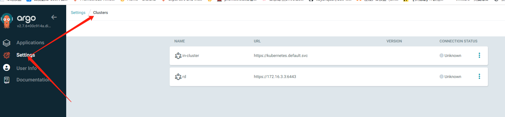

>第一次添加集群可能会无法显示集群的健康状态，创建一个应用之后就可以显示出来。

### 2、查看集群

```bash
root@k8s-isvc-master-01:~/.kube# argocd cluster list
SERVER                          NAME        VERSION  STATUS   MESSAGE                                                  PROJECT
https://172.16.2.23:6443        isvc                 Unknown  Cluster has no applications and is not being monitored.
https://172.16.3.3:6443         rd                   Unknown  Cluster has no applications and is not being monitored.
https://kubernetes.default.svc  in-cluster           Unknown  Cluster has no applications and is not being monitored.
```

### 3、删除集群

```bash
argocd cluster rm rd
```

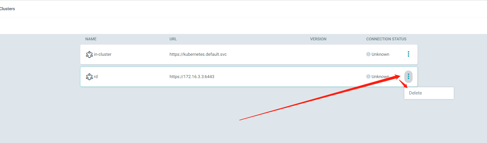

## 三、备份与恢复

>官方的方法简单粗暴，使用会直接报错；需要给出argoCD部署所在集群的config文件和所在的命名空间。导出的内容为所有资源信息的yaml 资源配置清单。

```bash
argocd admin export --kubeconfig .kube/config -n argo > argocd_$(date +%F).conf_bak
argocd admin import --kubeconfig .kube/config -n argo < argocd_$(date +%F).conf_bak
```

## 四、用户管理

### 1、查看用户

```bash
root@k8s-isvc-master-01:~/.kube# argocd account list
NAME   ENABLED  CAPABILITIES
admin  true     login
```

### 2、添加用户

#### 1.老版本

>在argoCD的命名空间里面直接编辑cm。

```bash
# kubectl get cm -n gitops
NAME                        DATA   AGE
argocd-cm                   7      7d21h    # 对用户的创建和删除
argocd-gpg-keys-cm          0      7d21h
argocd-notifications-cm     1      7d21h
argocd-rbac-cm              2      7d21h    # 用户对资源的鉴权
argocd-ssh-known-hosts-cm   1      7d21h
argocd-tls-certs-cm         0      7d21h
kube-root-ca.crt            1      7d21h
```

>argocd-cm包含对admin的管理和普通用户的创建。下面的内容一共创建了三个accounts。非admin用户即使在rbac中全部放行了全部resource的权限但是还是无法操作全部的资源。

```bash
# kubectl -n gitops edit cm argocd-cm 
apiVersion: v1
...
data:
  accounts.dev-user: login
  accounts.pre-user: login
  accounts.system: login
  application.instanceLabelKey: argocd.argoproj.io/instance
  exec.enabled: "false" 
  server.rbac.log.enforce.enable: "false"

# 解释
exec.enabled: "false"     # 命令终端
admin.enabled: "false"      # 是否启用admin用户，在创建好账户配置好环境后设置
accounts.pre-user: login    # 新建pre-user的用户，允许从UI登录
```

#### 2.新版本-不好用

```bash
kubectl -n argocd patch secret argocd-secret \
  -p '{"stringData": {"accounts.deploy": "password"}}'
```

### 3、修改密码

```bash
argocd account update-password --account admin --current-password 旧密码 --new-password 新密码
```

```bash
root@k8s-isvc-master-01:~/.kube# argocd account update-password --account system
*** Enter password of currently logged in user (admin):
*** Enter new password for user system:
*** Confirm new password for user system:
Password updated
```

```bash
argocd account update-password --account system --current-password argocd-server-ABCDEFG 
```

```bash
argocd account update-password --account dev-user --new-password dev-user
argocd account update-password --account pre-user --new-password pre-user
```

### 4、鉴权

```bash
# kubectl -n gitops edit cm argocd-rbac-cm
data:
  policy.csv: |
    p, system, *, *, */*, allow
```

#### 1.deploy账户

argocd-rbac-cm

```yaml
apiVersion: v1
kind: ConfigMap
metadata:
  name: argocd-rbac-cm
  namespace: argocd
data:
  policy.csv: |
    p, deploy, applications, get, */*, allow
    p, deploy, applications, sync, */*, allow
  # 给 deploy 用户 apiKey 权限
  scope.accounts.deploy: apiKey
```

**解释**

```bash
p           # policy
dev-user    # 用户
*           # 集群
*           # 动作
*/*         # 项目/app
allow       # 允许 拒绝/deny

# 如果用户没有在组中或者是关联特定的role，默认使用这条策略，对资源只有只读的权限且无法修改资源。
policy.default: role:readonly

# 此策略展示了test role对test 环境的应用权限。
p, role:test-admins, applications, create, test-*/*, allow
p, role:test-admins, applications, delete, test-*/*, allow
p, role:test-admins, applications, get, test-*/*, allow
p, role:test-admins, applications, override, test-*/*, allow
p, role:test-admins, applications, sync, test-*/*, allow
p, role:test-admins, applications, update, test-*/*, allow
p, role:test-admins, logs, get, test-*/*, allow
p, role:test-admins, exec, create, test-*/*, allow
p, role:test-admins, projects, get, test-*, allow
g, test-admin, role:test-admins

# g test-admin用户 绑定test-admins的role。
```

>里面的clusters字段指对argoCD中集群功能的管理，无法做到用户对单一集群的鉴权。* 表示支持正则匹配。
>
>资源：clusters``projects``applications``repositories``certificates``accounts``gpgkeys``logs``exec
>
>动作：get``create``update``delete``sync``override``action/<group/kind/action-name>

### 5、ldap登录

```bash
kubectl edit cm argocd-cm -n argocd
```

```yaml
data:
  dex.config: |
    connectors:
      - type: ldap
        name: ldap用户登陆
        id: ldap
        config:
          host: 10.0.7.30:389
          insecureNoSSL: true
          insecureSkipVerify: true
          bindDN: "$dex.ldap.bindDN"
          bindPW: "$dex.ldap.bindPW"
          usernamePrompt: username
          userSearch:
            baseDN: ou=user,dc=xiaowu,dc=cn
            filter: ""
            username: cn
            idAttr: uid
            emailAttr: mail
          groupSearch: 
            baseDN: ou=group,dc=xiaowu,dc=cn
            filter: "(cn=argocd)" 
            userMatchers:
            - userAttr: DN
              groupAttr: uniqueMember
            nameAttr: cn
  url: https://10.0.7.101:30295  
```

修改账户密码

```bash
kubectl -n argocd patch secrets argocd-secret --patch "{\"data\":{\"dex.ldap.bindPW\":\"$(echo youer-password | base64 -w 0)\"}}"
kubectl -n argocd patch secrets argocd-secret --patch "{\"data\":{\"dex.ldap.bindDN\":\"$(echo cn=admin,dc=xiaowu,dc=cn | base64 -w 0)\"}}"
```

## 五、项目管理

### 1、新建项目

>setting -> projects->NEW PROJECT

>几个重要的信息，项目的基础信息，可以添加名称和描述，添加label用来过滤。


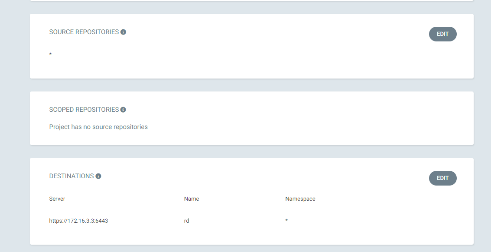

## 六、git仓库配置

### 1、配置已知主机

#### 1.获取已知主机known_hosts证书

```bash
root@skytree:~# ssh-keyscan 172.16.0.34
# 不是#开头的行都是需要添加的
```

#### 2.添加

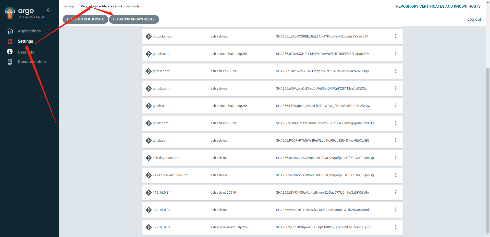

#### 3.查看结果

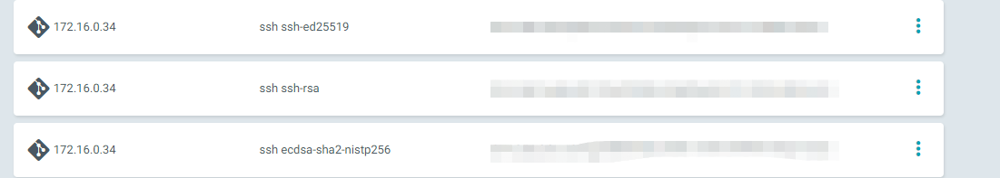

### 2、配置git仓库

>网上很多教程都是公开仓库使用，不需要配置ssh证书。但是实际上我们很多仓库都是私有。所以还是要配置ssh证书

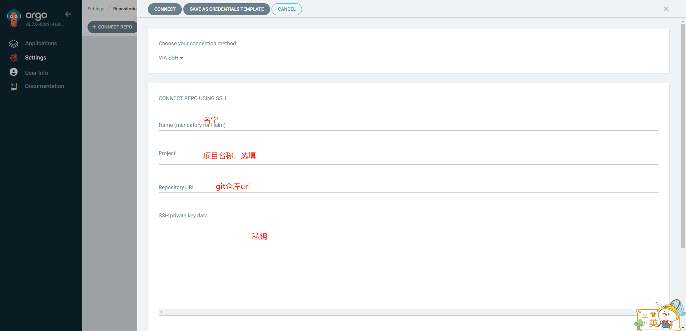

>如果报错未知主机什么的，点下面的钩试试


>结果


### 3、命令

#### 1.添加gitlab仓库

```bash
argocd repo add http://10.0.7.30/argocd/appconfig.git  --username=test1 --password=123 --name configrepo
```

#### 2.仓库操作

```bash
argocd repo list
argocd repo get http://10.0.7.30/argocd/appconfig.git
argocd repo rm http://10.0.7.30/argocd/appconfig.git
```

#### 3.添加git仓库

```bash
argocd repo add git@codeup.aliyun.com:618e50b14d2b371c479a84be/devops/argocd-app.git  --ssh-private-key-path ~/.ssh/id_ed25519 --name codeup-repo
```

## 七、Application引入

### 1、介绍

>ArgoCD的Application是ArgoCD中的一个核心概念，它代表了一组由资源清单定义的Kubernetes资源。这些资源可以是原生的Kubernetes配置清单，也可以是Helm Chart或Kustomize部署清单。

>Application的主要职责是定义Kubernetes资源的来源（Source）和目标（Destination）。来源指的是Git仓库中Kubernetes资源配置清单所在的位置，而目标则是指资源在Kubernetes集群中的部署位置。

### 2、ArgoCD Application与Git和K8S的关系图

>GIT仓库存放的是应用的配置清单文件（K8S YAML或Helm Chart）

>一个Applicatoin对应一个应用，多个应用需要配置多个Applicaton

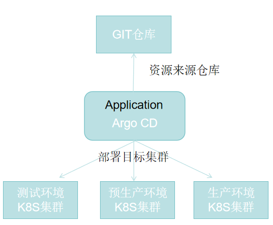

### 3、应用资源清单文件存储方法

#### 1.对应分支

>对应分支：一个仓库对应一个部署环境，一个分支对应一个应用

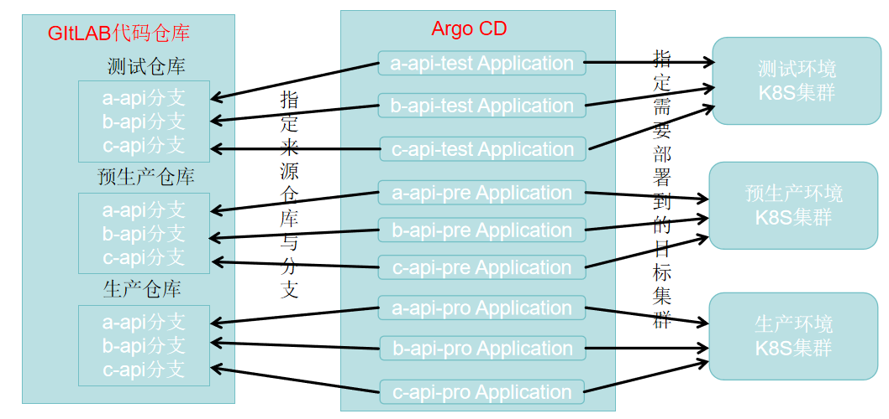

#### 2.对应目录

>对应目录：多个部署环境的应用配置都存放在同一个仓库，仓库的一个根目录对应一个应用，一个目录下存在多个环境的配置

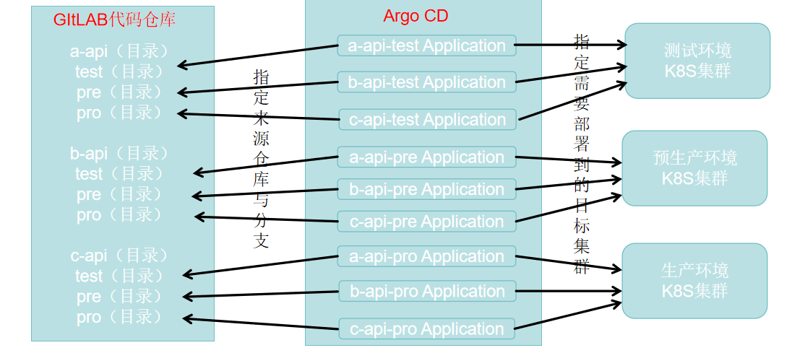


### 4、准备demo资源清单

#### 1.编写一个yaml到git仓库

**service.yaml**

```yaml
apiVersion: v1
kind: Service
metadata:
  name: myapp-service
spec:
  selector:
    app: myapp
  ports:
  - port: 80
    protocol: TCP
    targetPort: 80
```

**deployment.yaml**

```yaml
apiVersion: apps/v1
kind: Deployment
metadata:
  name: myapp
spec:
  selector:
    matchLabels:
      app: myapp
  replicas: 2
  template:
    metadata:
      labels:
        app: myapp
    spec:
      containers:
      - name: myapp
        image: nginx:latest
        ports:
        - containerPort: 80
```


#### 2.通过ui创建

>Application Name app的名称。
>
>Project Name app属于哪个项目的。
>
>SYNC POLICY 同步的策略，可以选择手动或者自动。

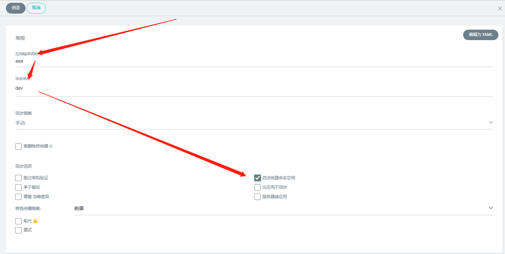

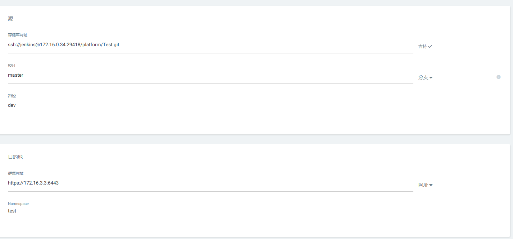

**创建结果**

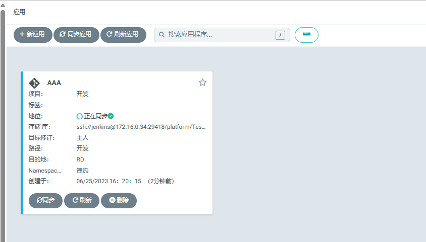

#### 3.通过配置文件创建

>argocd-Application.yaml

```yaml
apiVersion: argoproj.io/v1alpha1
kind: Application
metadata:
  name: myapp-argo-application
  namespace: gitops
spec:
  project: default
  source:
    repoURL: ssh://jenkins@172.16.0.34:29418/platform/Test.git
    targetRevision: HEAD
    path: dev
  destination: 
    server: 'https://172.16.3.3:6443'
    namespace: default

  syncPolicy:
    syncOptions:
    - CreateNamespace=true

    automated:
      selfHeal: true
      prune: true
```

**参数解释**

```yaml
syncPolicy : 指定自动同步策略和频率，不配置时需要手动触发同步。
syncOptions : 定义同步方式。
CreateNamespace=true : 如果不存在这个 namespace，就会自动创建它。
automated : 检测到实际状态与期望状态不一致时，采取的同步措施。
selfHeal : 当集群世纪状态不符合期望状态时，自动同步。
prune : 自动同步时，删除 Git 中不存在的资源
```

>Argo CD 默认情况下**每 3 分钟**会检测 Git 仓库一次，用于判断应用实际状态是否和 Git 中声明的期望状态一致，如果不一致，状态就转换为 `OutOfSync`。默认情况下并不会触发更新，除非通过 `syncPolicy` 配置了自动同步。
>
>如果嫌周期性同步太慢了，也可以通过设置 Webhook 来使 Git 仓库更新时立即触发同步。

### 5、命令

```bash
# 列出app 
argocd app list

# 查看guestbook示例的详细信息
argocd app get my-app
  
# Delete an app
argocd app delete my-app
  
# 执行同步
argocd app sync my-app
   
启用自动同步
argocd app setmy-app --sync-pold$d$icy automated
  
启动自动修剪
argocd app set my-app --auto-prune
  
自动自我修复
argocd app set my-app --self-heal
```


## 八、Application进阶

### 1、接入多个来源应用

>第一个源为Helm Chart库
>
>第二个源为GitLab仓库

```yaml
apiVersion: argoproj.io/v1alpha1
kind: Application
metadata:
  name: guestbook-2
  namespace: argocd
spec:
  project: default
  destination:
    server: https://kubernetes.default.svc
    namespace: default
  sources:
    - chart: elasticsearch
      repoURL: https://helm.elastic.co
      targetRevision: 8.5.1
    - repoURL: https://github.com/argoproj/argocd-example-apps.git
      path: guestbook
      targetRevision: HEAD

```

### 2、引用外部Git存储库的Helm值文件

>定义Helm的目录路径定义存储values.yaml的Git仓库地址

```yaml
apiVersion: argoproj.io/v1alpha1
kind: Application
spec:
  project: default
  destination:
    server: https://kubernetes.default.svc
    namespace: default
  sources:
  - repoURL: 'https://prometheus-community.github.io/helm-charts'
    chart: prometheus
    targetRevision: 15.7.1
    helm:
      valueFiles:
      - $values/charts/prometheus/values.yaml
  - repoURL: 'https://git.example.com/org/value-files.git'
    targetRevision: dev
    ref: values
```

## 九、ApplicationSet

>Argo CD的ApplicationSet是一个用于实现GitOps自动多环境管理的工具。通过ApplicationSet，用户能够定义、部署和管理一组基于某种模式或模板的Kubernetes应用
>
>ApplicationSet的核心组件是“生成器”（Generators），生成器可以根据不同的需求和环境差异来定制应用程序的生成和部署过程
>
>通过使用ApplicationSet，用户可以更高效地管理多个类似但又有细微差别的应用实例，从而实现代码即环境的效果。这有助于简化Kubernetes应用的部署和管理过程，提高效率和可靠性。

### 1、列表生成器

>列表生成器：根据集群名称/URL 值的固定列表生成参数，如下所示

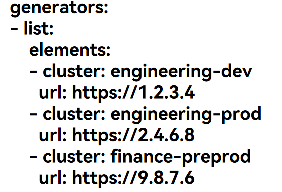


### 2、使用

```yaml
apiVersion: argoproj.io/v1alpha1
kind: ApplicationSet
metadata:
  name: guestbook
spec:
  generators:
  - list:
      elements:
      - cluster: engineering-dev
        url: https://1.2.3.4
      - cluster: engineering-prod
        url: https://2.4.6.8
      - cluster: finance-preprod
        url: https://9.8.7.6
  template:
    metadata:
      name: '{{cluster}}-guestbook'
    spec:
      project: default
      source:
        repoURL: https://github.com/argoproj/argo-cd.git
        targetRevision: HEAD
        path: applicationset/examples/list-generator/guestbook/{{cluster}}
      destination:
        server: '{{url}}'
        namespace: guestbook
```

## 十、实现同步选项配置

### 1、忽略差异

>ignoreDifferences（忽略差异）：这个配置项用于定义在应用程序同步期间需要忽略的资源差异。

```yaml
  ignoreDifferences:
  - group: apps
    kind: Deployment
    jsonPointers:
    - /spec/replicas
```

### 2、同步策略

```bash
- syncPolicy:
这个配置项定义了应用程序的同步策略
- automated：启动自动同步策略
- prune（清理）：允许自动清理不再需要的资源。
- selfHeal（自愈）：自动修复应用程序中出现的问题。
- allowEmpty（允许空）：允许同步空的资源定义。
```

```yaml
  syncPolicy:
    automated:
      prune: true
      selfHeal: false
      allowEmpty: false
```

### 3、同步选项

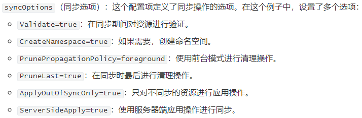

```yaml
    syncOptions:
    - Validate=true
    - CreateNamespace=true
    - PrunePropagationPolicy=foreground
    - PruneLast=true
    - ApplyOutOfSyncOnly=true
    - ServerSideApply=true
    - RespectIgnoreDifferences=true
```

### 4、重试策略

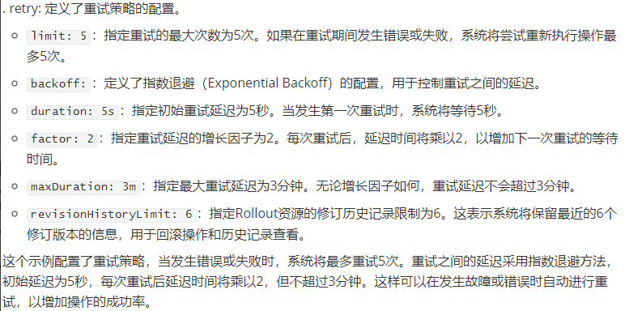

```yaml
    retry:
      limit: 5
      backoff:
        duration: 5s
        factor: 2
        maxDuration: 3m
  revisionHistoryLimit: 6
```

### 5、同步状态和健康状态

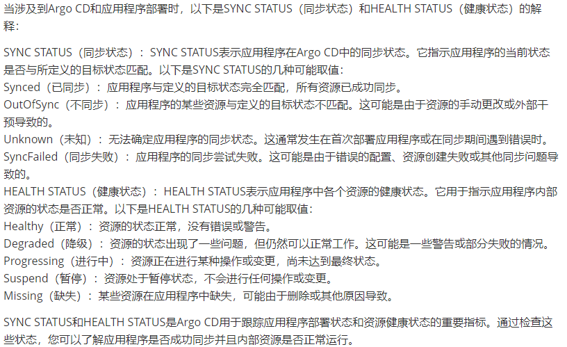

## 十一、UI介绍

### 1、回滚

>进入应用->点击HISTORY AND ROLLBACK->选中版本点Rollback

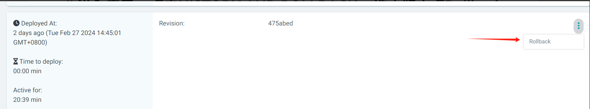

### 2、查看pod日志

>进入应用->点击rs->点击Log可以同时查看多个POD的日志

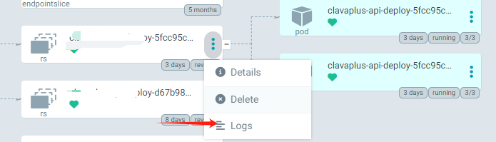

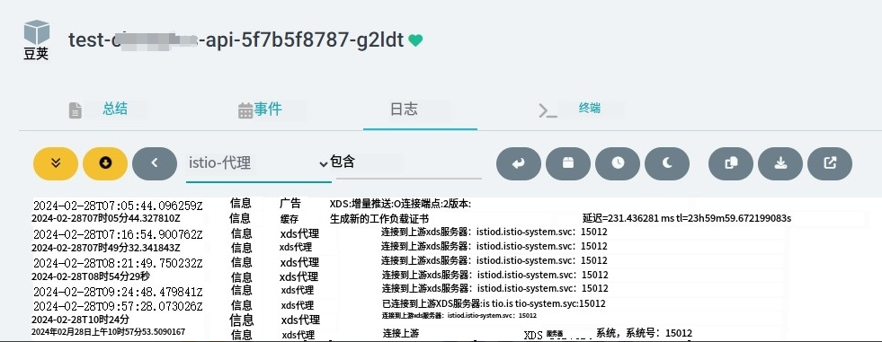

### 3、同步

#### 1.全局同步

>所有已更改的资源都进行同步

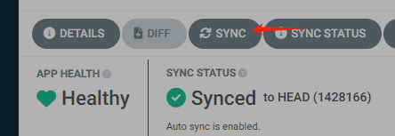

#### 2.局部同步

>只针对某个资源同步

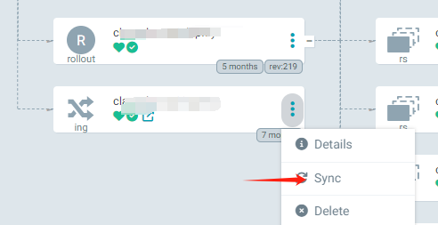

### 4、webhook触发同步

>GitLAB配置：http://argocd登录地址/api/webhook

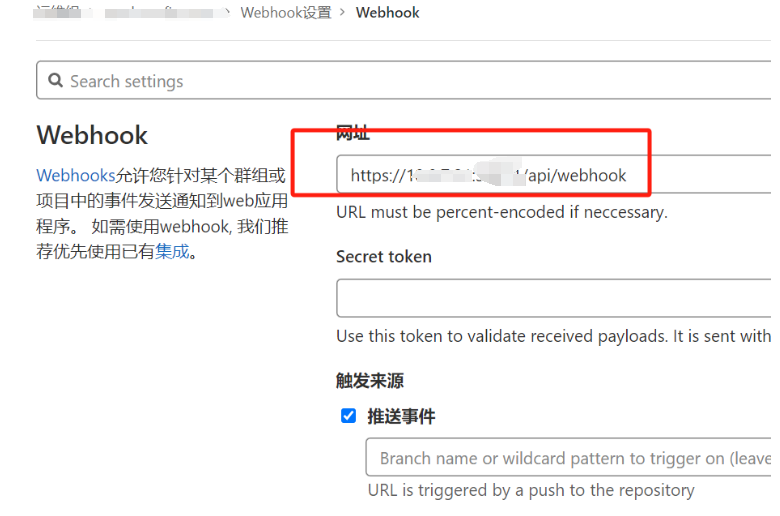

### 5、配置Secret

>填写Webhook secret token，可选配置

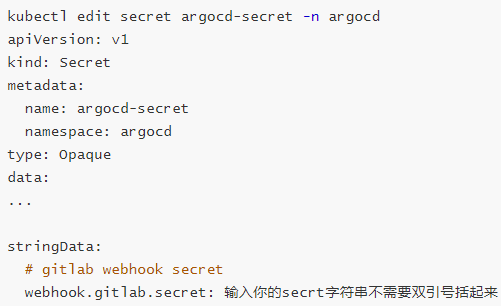

### 6、Application应用删除

#### 1.页面删除

>会将ArgoCD应用以及K8S应用都删除

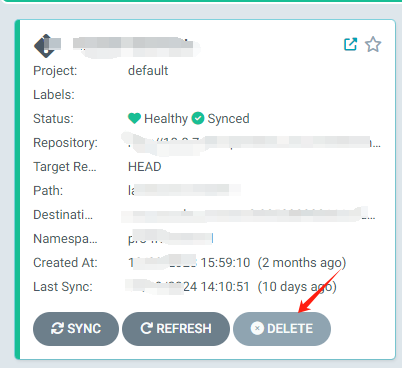

#### 2.终端删除

>只会删除ArgoCD应用，不会删除K8S应用

```bash
kubectl delete -f  Applicaton.yaml
```

### 7、ApplicatonSet应用删除

#### 1.页面删除

>页面无法直接删除ApplicatSet创建的应用

#### 2.终端删除

>会批量删除所有应用

```bash
kubectl delete -f  ApplicatonSET.yaml
```

## 十二、页面横幅与容器终端

### 1、配置横幅

```bash
提示的内容：ui.bannercontent: "Banner message"
跳转链接：ui.bannerurl: "http://www.bannerlink.com"
横幅粘性（永久）：ui.bannerpermanent: "true"
更改为底部：ui.bannerposition: "bottom"
```

```yaml
# kubectl edit cm argocd-cm -n argocd
data:
  ui.bannercontent: "Banner message linked to a URL"
  ui.bannerurl: "http://www.bannerlink.com"
  ui.bannerpermanent: "true"
  ui.bannerposition: "bottom"
```

### 2、开启容器终端

```yaml
# kubectl edit cm argocd-cm -n argocd
data:
  exec.enabled: "true"
  exec.shells: bash,sh,powershell,cmd
```

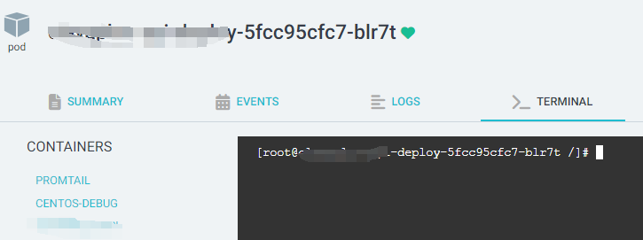

## 十三、用户权限控制

### 1、格式

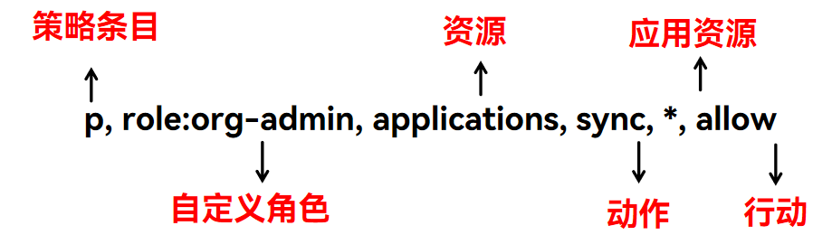

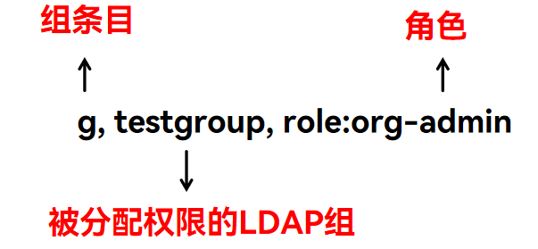

### 2、RBAC资源和动作

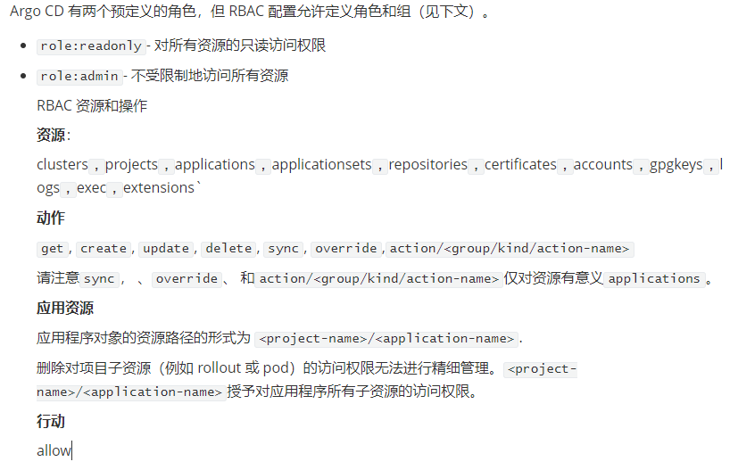

### 3、实战

```yaml
# kubectl edit cm argocd-rbac-cm -n argocd
apiVersion: v1
data:
  policy.csv: | 
    p, role:org-admin, applications, sync, *, allow
    p, role:org-admin, applications, update, *, allow
    p, role:org-admin, logs, get, *, allow
    p, role:org-admin, exec, create, */*, allow
    g, testgroup, role:readonly
    g, testgroup, role:org-admin
```

## 十四、CLI客户端操作

```bash
# 列出app 
argocd app list

# 查看guestbook示例的详细信息
argocd app get my-app
  
# Delete an app
argocd app delete my-app
  
# 执行同步
argocd app sync my-app
   
启用自动同步
argocd app setmy-app --sync-pold$d$icy automated
  
启动自动修剪
argocd app set my-app --auto-prune
  
自动自我修复
argocd app set my-app --self-heal
```


## 十五、发布方式介绍

### 1、滚动发布

> k8s默认升级方式


> ​    那么万一发布失败了呢？此时就得回滚，因为不同的上线是不一样的，有时候你仅仅是对代码做一些微调，大多数时候是针对新需求有上线，加了新的代码/接口，有时候是架构重构，实现机制和技术架构都变了
>
> 所以回滚的话，也不太一样，比如你如果是加了一些新的接口，结果上线失败了，此时新接口没人访问，直接代码回滚到旧版本重新部署就行了；
>
> 如果你是做技术架构升级，此时失败了，可能很多请求已经处理失败，数据丢失，严重的时候会导致公司丢失订单，或者是数据写入了但是都错了。
>
> 
>
> 滚动发布的话，风险还是比较大的，因为一旦你用了自动化的滚动发布，那么发布系统会自动把你的所有机器都部署新版本的代码，这个时候中间很有可能会出现问题，导致大规模的异常和损失

### 3、蓝绿发布

>​    蓝绿发布需要对服务的新版本进行冗余部署，一般新版本的机器规格和数量与旧版本保持一致，相当于该服务有两套完全相同的部署环境，只不过此时只有旧版本在对外提供服务，新版本作为热备。
>
>​    当服务进行版本升级时，我们只需将流量全部切换到新版本即可，旧版本作为热备。
>
>​    由于冗余部署的缘故，所以不必担心新版本的资源不够。
>
>​    如果新版本上线后出现严重的程序 BUG，那么我们只需将流量全部切回至旧版本，大大缩短故障恢复的时间。待新版本完成 BUG 修复并重新部署之后，再将旧版本的流量切换到新版本。
>
>​    蓝绿发布通过使用额外的机器资源来解决服务发布期间的不可用问题，当服务新版本出现故障时，也可以快速将流量切回旧版本。

> 如图，某服务旧版本为 v1，对新版本 v2 进行冗余部署。版本升级时，将现有流量全部切换为新版本 v2。


> 当新版本 v2 存在程序 BUG 或者发生故障时，可以快速切回旧版本 v1。


#### 1.蓝绿部署的优点：

1、部署结构简单，运维方便；

2、服务升级过程操作简单，周期短。


#### 2.蓝绿部署的缺点：

1、资源冗余，需要部署两套生产环境；

2、新版本故障影响范围大。

### 4、A/B测试

>   相比于蓝绿发布的流量切换方式，A/B 测试基于用户请求的元信息将流量路由到新版本，这是一种基于请求内容匹配的灰度发布策略。
>
>   只有匹配特定规则的请求才会被引流到新版本，常见的做法包括基于 Http Header 和 Cookie。
>
>   ​       基于 Http Header 方式的例子，
>
>   ​           例如 User-Agent 的值为 Android 的请求 （来自安卓系统的请求）可以访问新版本，其他系统仍然访问旧版本。
>
>   ​       基于 Cookie 方式的例子，
>
>   ​           Cookie 中通常包含具有业务语义的用户信息，例如普通用户可以访问新版本，VIP 用户仍然访问旧版本。

> 如图，某服务当前版本为 v1，现在新版本 v2 要上线。希望安卓用户可以尝鲜新功能，其他系统用户保持不变。


>通过在监控平台观察旧版本与新版本的成功率、RT 对比，当新版本整体服务预期后，即可将所有请求切换到新版本 v2，最后为了节省资源，可以逐步下线到旧版本 v1。


#### 1.A/B 测试的优点：

1、可以对特定的请求或者用户提供服务新版本，新版本故障影响范围小；

2、需要构建完备的监控平台，用于对比不同版本之间请求状态的差异。

#### 2.A/B 测试的缺点：

1、仍然存在资源冗余，因为无法准确评估请求容量；

2、发布周期长。

### 5、金丝雀发布

>​    在蓝绿发布中，由于存在流量整体切换，所以需要按照原服务占用的机器规模为新版本克隆一套环境，相当于要求原来1倍的机器资源。
>
>​    在 A/B 测试中，只要能够预估中匹配特定规则的请求规模，我们可以按需为新版本分配额外的机器资源。
>
>​    相比于前两种发布策略，金丝雀发布的思想则是将少量的请求引流到新版本上，因此部署新版本服务只需极小数的机器。
>
>​    验证新版本符合预期后，逐步调整流量权重比例，使得流量慢慢从老版本迁移至新版本，期间可以根据设置的流量比例，对新版本服务进行扩容，同时对老版本服务进行缩容，使得底层资源得到最大化利用。


#### 1.金丝雀发布的优点：

1、按比例将流量无差别地导向新版本，新版本故障影响范围小；

2、发布期间逐步对新版本扩容，同时对老版本缩容，资源利用率高。


#### 2.金丝雀发布的缺点：

1、流量无差别地导向新版本，可能会影响重要用户的体验；

2、发布周期长。

### 6、总结

- 蓝绿发布：简单理解就是流量切换，依据热备的思想，冗余部署服务新版本。
- A/B 测试：简单理解就是根据请求内容（header、cookie）将请求流量路由到服务的不同版本。
- 金丝雀发布：是一种基于流量比例的发布策略，部署一个或者一小批新版本的服务，将少量（比如 1%）的请求引流到新版本，逐步调大流量比重，直到所有用户流量都被切换新版本为止。

好用的金丝雀和A/B发布的方式使用istio或微服务网关更好实现

## 十六、ArgoRollout

### 1、介绍

>Argo Rollout它为Kubernetes提供了更加高级的部署能力，如蓝绿交付、金丝雀交付、流量分析自动回滚等功能。这些功能使得云原生应用和服务能够实现自动化、基于GitOps的逐步交付。在大型的生产环境中，Argo Rollouts尤为重要，因为它可以帮助降低对生产环境的影响和风险

### 2、Argo Rollout蓝绿发布介绍

>Argo Rollout在部署的时候会创建一套新的POD，当新环境的POD启动没问题后。旧版本的POD流量则会切换到新版本的POD中。当流量切换过来后。旧版本会根据设置的保留时间进行倒数。时间到则旧版本的POD会自动删除

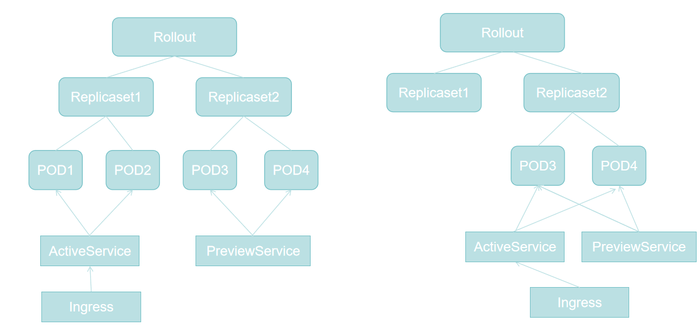

### 3、Argo Rollout金丝雀发布介绍

>是一种逐步将新版本的应用程序推送给用户的方法，可以由运维人员精细控制用户流量比例

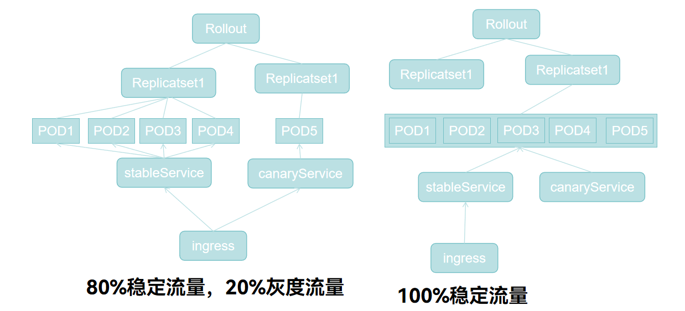

### 4、部署

#### 1.服务部署

```bash
kubectl create namespace argo-rollouts
kubectl apply -n argo-rollouts -f https://github.com/argoproj/argo-rollouts/releases/latest/download/install.yaml
kubectl get pods -n argo-rollouts
kubectl get svc -n argo-rollouts
```

#### 2.界面部署

```bash
kubectl apply -n argo-rollouts -f https://github.com/argoproj/argo-rollouts/releases/latest/download/dashboard-install.yaml
kubectl get svc -n argo-rollouts argo-rollouts-dashboard -o jsonpath='{.spec.ports[0].nodePort}'
```

#### 3.命令安装

```bash
wget -c https://github.com/argoproj/argo-rollouts/releases/download/v1.6.2/kubectl-argo-rollouts-linux-amd64
mv kubectl-argo-rollouts-linux-amd64 /usr/bin/kubectl-argo-rollouts
chmod +x /usr/bin/kubectl-argo-rollouts
kubectl argo rollouts
```

### 5、蓝绿发布配置

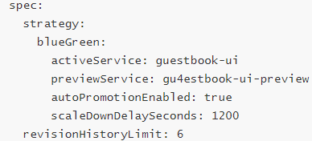

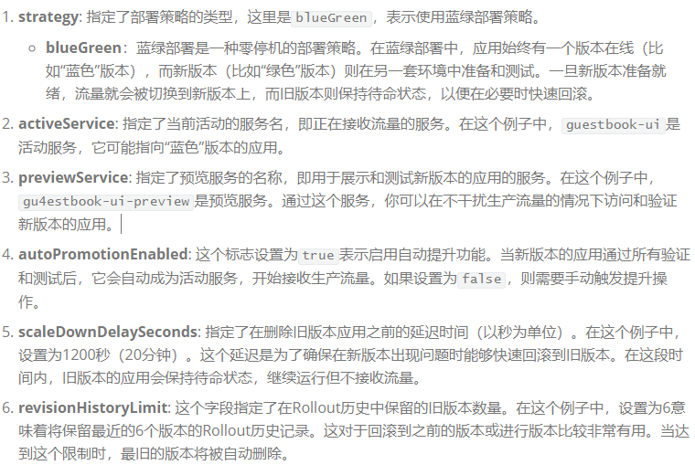

#### 1.蓝绿发布应用资源清单准备

>放到git仓库里面

```yaml
apiVersion: argoproj.io/v1alpha1
kind: Rollout
metadata:
  name: pro-store
  namespace: pro-fronted-intl
spec:
  strategy:
    blueGreen:
      activeService: guestbook-ui
      previewService: guestbook-ui-preview
      autoPromotionEnabled: true
      scaleDownDelaySeconds: 1200
  revisionHistoryLimit: 6
  replicas: 1
#  revisionHistoryLimit: 3
  selector:
    matchLabels:
      app: guestbook-ui
  template:
    metadata:
      labels:
        app: guestbook-ui
    spec:
      containers:
      - image: gcr.io/heptio-images/ks-guestbook-demo:0.2
        name: guestbook-ui
        ports:
        - containerPort: 80
---        
apiVersion: v1
kind: Service
metadata:
  name: guestbook-ui
spec:
  ports:
  - port: 80
    targetPort: 80
  selector:
    app: guestbook-ui
---
apiVersion: v1
kind: Service
metadata:
  name: guestbook-ui-preview
spec:
  ports:
  - port: 80
    targetPort: 80
  selector:
    app: guestbook-ui
```

#### 2.Application准备

```yaml
apiVersion: argoproj.io/v1alpha1
kind: Application
metadata:
  name: guestbook-blue-green
  namespace: argocd
spec:
  destination:
    namespace: default
    server: https://kubernetes.default.svc
  project: default
  source:
    path: guestbook-blue-green
    repoURL: http://10.0.7.63/argocd/appconfig.git
    targetRevision: HEAD
```

### 6、金丝雀发布配置

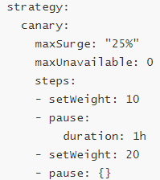

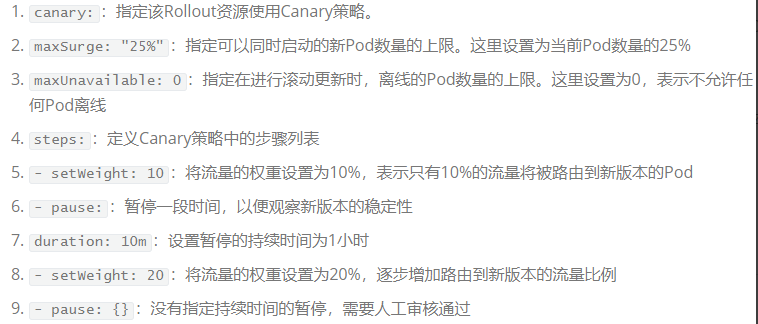

#### 1.金丝雀发布应用资源清单准备

```yaml
apiVersion: argoproj.io/v1alpha1
kind: Rollout
metadata:
  name: go-api-canary
spec:
  replicas: 10
  selector:
    matchLabels:
      app: go-api-canary
  template:
    metadata:
      labels:
        app: go-api-canary
    spec:
      containers:
      - name: go-api
        image: nginx:1.15.4
        ports:
        - containerPort: 80
  minReadySeconds: 30
  revisionHistoryLimit: 3
  strategy:
    canary: 
      maxSurge: "25%"
      maxUnavailable: 0
      steps:
      - setWeight: 10
      - pause:
          duration: 1h
      - setWeight: 20
      - pause: {}
```

#### 2.Application准备

```yaml
apiVersion: argoproj.io/v1alpha1
kind: Application
metadata:
  name: guestbook-canary
  namespace: argocd
spec:
  destination:
    namespace: default
    server: https://kubernetes.default.svc
  project: default
  source:
    path: nginx-canary
    repoURL: http://10.0.7.63/argocd/appconfig.git
    targetRevision: HEAD
```

## 十七、分析模版

### 1、介绍

>定义了分析模板，会根据分析模板中定义的规则收集和处理度量数据，如果所有分析都成功通过，那么部署就会继续进行；如果有任何分析失败，那么部署会回滚到之前的版本

>分析模板需要依赖Argo Rollout+Istio+Prometheus实现

#### 1.角色分工

>ISTIO：通过 Istio 的服务网格，捕获服务的所有流量数据，这包括请求量、延迟、错误率等
>
>Prometheus：从 Istio 收集到的流量数据中提取指标，并通过其查询语言 PromQL 进行复杂的分析和可视化
>
>Argo Rollouts： 实现自动回滚的关键组件

### 2、Isito

#### 1.介绍

>Istio是一个用于服务治理的开放平台，是一个Service Mesh形态的解决方案。它提供了连接、保护、控制和观测四个方面的功能
>
>在Istio中，Envoy是一个关键的组件，它以边车（sidecar）代理的形式部署在每个微服务实例旁边
>
>Istio的指标收集从sidecar代理（Envoy）开始。每个代理为通过它的所有流量（入站和出站）生成一组丰富的指标

#### 2.架构

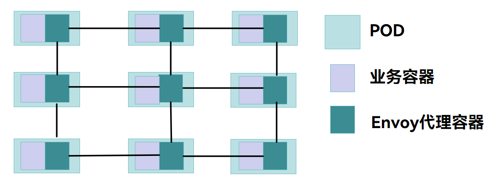

#### 3.部署

```bash
cd /usr/local/src
curl -L https://istio.io/downloadIstio | sh -
ln -s /usr/local/istio-1.xx.x /usr/local/istio
istioctl profile dump default > /root/default.yml
kubectl get pods -n istio-system
```

#### 4.配置自动注入Envoy

```bash
kubectl label namespace default istio-injection=enabled
kubectl get namespace default --show-labels
```

### 3、Prometheus

#### 1.介绍

>Prometheus是一个功能强大且灵活的系统监控和警报工具，适用于云原生环境和容器化应用程序

#### 2.部署

>详见Prometheus安装章节

### 4、分析模版配置

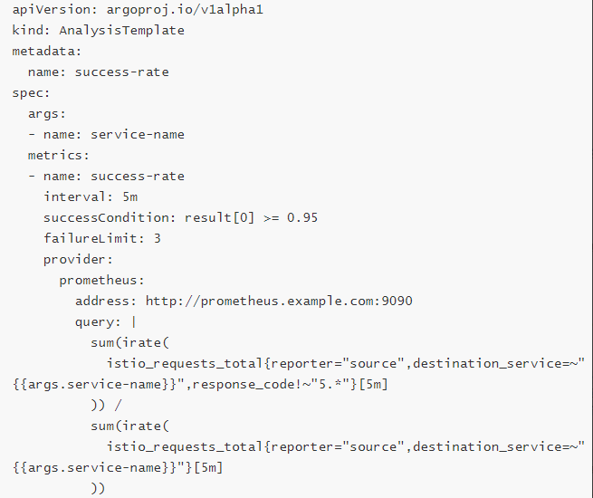

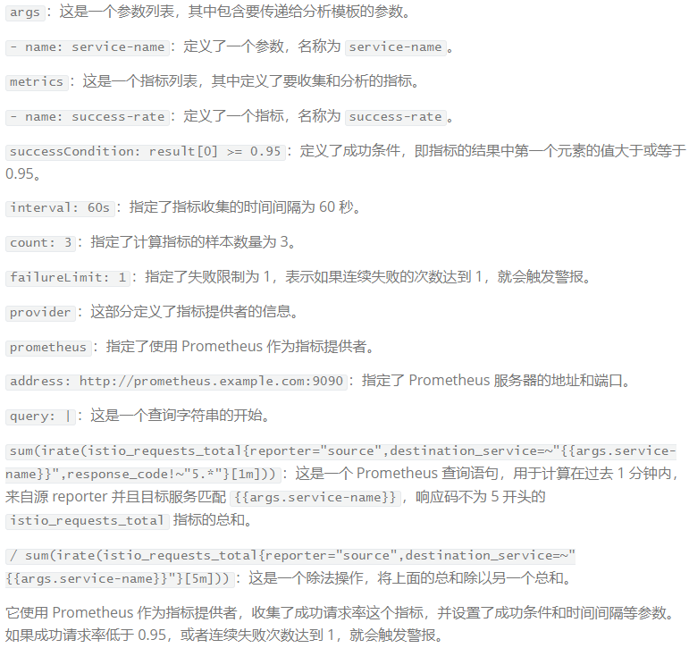

### 5、引用分析模版

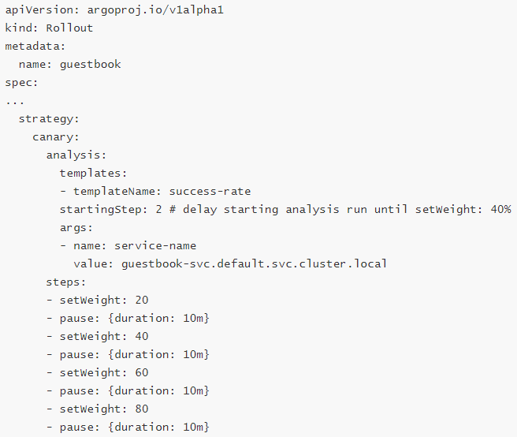

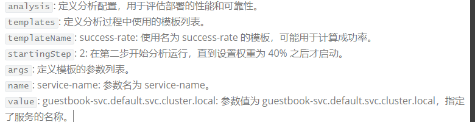

## 十八、蓝绿发布流量分析自动回滚实战

### 1、资源清单准备

```yaml
apiVersion: argoproj.io/v1alpha1
kind: AnalysisTemplate
metadata:
  name: go-api-blus-green-analysis
spec:
  args:
  - name: service-name
  metrics:
  - name: go-api-blus-green-metrics
  # 注意：当前没有请求的时候，由于没有数据，访问result[0]将会引发索引越界错误，所以会报message: 'metric "success-rate" assessed Error due to consecutiveErrors (5) > consecutiveErrorLimit(4): "Error Message: reflect: slice index out of range"'。
  #   # value: '[NaN]'  # 没有数据的时候会出现的第一种情况，使用result[0] != result[0] <== NaN不等于任何数，可判断为NaN
  #     # value: '[]' # 没有数据的时候会出现的第一种情况，当为空值的时候，使用len(result) == 0
    successCondition: (len(result) == 0 or result[0] != result[0] or result[0] >= 0.95 )
    interval: 60s
    count: 3
    failureLimit: 1
    provider:
      prometheus:
        address: http://prometheus.istio-system.svc.cluster.local:9090
        query: |
          sum(irate(
            istio_requests_total{reporter="source",destination_service=~"{{args.service-name}}",response_code!~"5.*"}[1m]
          )) /
          sum(irate(
            istio_requests_total{reporter="source",destination_service=~"{{args.service-name}}"}[1m]
          ))
---
apiVersion: argoproj.io/v1alpha1
kind: Rollout
metadata:
  name: go-api-blus-green
spec:
  strategy:
    blueGreen: 
      activeService: go-api-blus-green-service
      previewService: go-api-blus-green-service-preview
      autoPromotionEnabled: true
      scaleDownDelaySeconds: 1200
      postPromotionAnalysis:
        templates:
        - templateName: go-api-blus-green-analysis
        args:
        - name: service-name
          value: go-api-blus-green-service.default.svc.cluster.local
  revisionHistoryLimit: 6    
  replicas: 1
  selector:
    matchLabels:
      app: go-api-blus-green-selector
  template:
    metadata:
      labels:
        app: go-api-blus-green-selector   
    spec:
      containers:
      - name: go-api-blus-green
        #image: oamdev/testapp:v1
        image: registry.cn-hangzhou.aliyuncs.com/tool-bucket/tool:gotest
        imagePullPolicy: IfNotPresent
        ports:
        - containerPort: 8080
          protocol: TCP
---
kind: Service
apiVersion: v1
metadata:
  name: go-api-blus-green-service-preview
spec:
  type: ClusterIP
  ports:
  - name: go-api-blus-green-service-port-preview
    port: 80
    protocol: TCP
    targetPort: 8080
  selector:
    app: go-api-blus-green-selector
---
kind: Service
apiVersion: v1
metadata:
  name: go-api-blus-green-service
spec:
  type: ClusterIP
  ports:
  - name: go-api-blus-green-service-port
    port: 80
    protocol: TCP
    targetPort: 8080
  selector:
    app: go-api-blus-green-selector
```

### 2、Application准备

```yaml
apiVersion: argoproj.io/v1alpha1
kind: Application
metadata:
  name: golang-blue-green-analysis
  namespace: argocd
spec:
  project: default
  destination:
    namespace: default
    server: https://kubernetes.default.svc
  source:
    path: go-blue-green
    repoURL: http://10.0.7.63/argocd/appconfig.git
    targetRevision: HEAD
  ignoreDifferences:
  - group: apps
    kind: Deployment
    jsonPointers:
    - /spec/replicas
  - group: ""
    kind: Service
    jsonPointers:
    - /spec/selector/rollouts-pod-template-hash
  syncPolicy:
    automated:
      prune: true
      selfHeal: false
      allowEmpty: false
    syncOptions:
    - Validate=true
    - CreateNamespace=true
    - PrunePropagationPolicy=foreground
    - PruneLast=true
    - ApplyOutOfSyncOnly=true
    - ServerSideApply=true
    - RespectIgnoreDifferences=true
    retry:
      limit: 5
      backoff:
        duration: 5s
        factor: 2
        maxDuration: 3m
  revisionHistoryLimit: 6
```

### 3、查看验证

```bash
kubectl get analysisrun
kubectl describe analysisrun xxx

kubectl get analysisrun
kubectl describe analysisrun xxx

kubectl run -it --rm temp-container --image=alpine:3.16 --restart=Never sh
apk add curl 
# 请求正常接口
while true;do sleep 1;curl -I go-api-blus-green-service.default.svc.cluster.local/status200 ;done
# 请求故障接口
while true;do sleep 1;curl -I go-api-blus-green-service.default.svc.cluster.local/status500 ;done
```

## 十九、金丝雀发布流量分析自动回滚实战

### 1、资源清单准备

```bash
apiVersion: argoproj.io/v1alpha1
kind: AnalysisTemplate
metadata:
  name: go-api-gray-analysis
spec:
  args:
  - name: service-name
  metrics:
  - name: go-api-gray-metrics
    # 注意：当前没有请求的时候，由于没有数据，访问result[0]将会引发索引越界错误，所以会报message: 'metric "success-rate" assessed Error due to consecutiveErrors (5) > consecutiveErrorLimit(4): "Error Message: reflect: slice index out of range"'。
      #   # value: '[NaN]'  # 没有数据的时候会出现的第一种情况，使用result[0] != result[0] <== NaN不等于任何数，可判断为NaN
      #     # value: '[]' # 没有数据的时候会出现的第一种情况，当为空值的时候，使用len(result) == 0
    successCondition: (len(result) == 0 or result[0] != result[0] or result[0] >= 0.95 )
    interval: 60s
    count: 3
    failureLimit: 3
    provider:
      prometheus:
        address: http://prometheus.istio-system.svc.cluster.local:9090
        query: |
          sum(irate(
            istio_requests_total{reporter="source",destination_service=~"{{args.service-name}}",response_code!~"5.*"}[1m]
          )) /
          sum(irate(
            istio_requests_total{reporter="source",destination_service=~"{{args.service-name}}"}[1m]
          ))
---
apiVersion: argoproj.io/v1alpha1
kind: Rollout
metadata:
  name: go-api-gray
spec:
  minReadySeconds: 30
  revisionHistoryLimit: 6
  strategy:
    canary:
      maxSurge: "25%"
      maxUnavailable: 0
      steps:
      - setWeight: 10
      - pause:
          duration: 1m # 1 hour
      - setWeight: 20
      - pause: {}
      - setWeight: 40
      - pause: {duration: 60s}
      - setWeight: 60
      - pause: {duration: 60s}
      - setWeight: 80
      - pause: {duration: 60s} 
      - pause: {} 
      maxSurge: "25%"
      maxUnavailable: 0      
      analysis:
        templates:
        - templateName: go-api-gray-analysis
        startingStep: 2 # 在第二个步骤使用流量分析模板
        args:
        - name: service-name
          value: go-api-service.default.svc.cluster.local      
  revisionHistoryLimit: 6    
  replicas: 1
  selector:
    matchLabels:
      app: go-api-gray-selector
  template:
    metadata:
      labels:
        app: go-api-gray-selector   
    spec:
      containers:
      - name: go-api-gray
        image: registry.cn-hangzhou.aliyuncs.com/tool-bucket/tool:gotest
        imagePullPolicy: IfNotPresent
        ports:
        - containerPort: 8080
          protocol: TCP
---
kind: Service
apiVersion: v1
metadata:
  name: go-api-service
spec:
  type: ClusterIP
  ports:
  - name: go-api-service-port
    port: 80
    protocol: TCP
    targetPort: 8080
  selector:
    app: go-api-selector
```

### 2、Application准备

```yaml
apiVersion: argoproj.io/v1alpha1
kind: Application
metadata:
  name: golang-canary-analysis
  namespace: argocd
spec:
  project: default
  destination:
    namespace: default
    server: https://kubernetes.default.svc
  source:
    path: Golang-Canary
    repoURL: http://10.0.7.63/argocd/appconfig.git
    targetRevision: HEAD
  ignoreDifferences:
  - group: apps
    kind: Deployment
    jsonPointers:
    - /spec/replicas
  - group: ""
    kind: Service
    jsonPointers:
    - /spec/selector/rollouts-pod-template-hash
  syncPolicy:
    automated:
      prune: true
      selfHeal: false
      allowEmpty: false
    syncOptions:
    - Validate=true
    - CreateNamespace=true
    - PrunePropagationPolicy=foreground
    - PruneLast=true
    - ApplyOutOfSyncOnly=true
    - ServerSideApply=true
    - RespectIgnoreDifferences=true
    retry:
      limit: 5
      backoff:
        duration: 5s
        factor: 2
        maxDuration: 3m
  revisionHistoryLimit: 6
```

### 3、查看验证

```bash
kubectl get analysisrun
kubectl describe analysisrun xxx    


kubectl get analysisrun
kubectl describe analysisrun xxx
kubectl run -it --rm temp-container --image=alpine:3.16 --restart=Never sh
apk add curl 
# 请求正常接口
while true;do sleep 1;curl -I go-api-service.default.svc.cluster.local/status200 ;done
# 请求故障接口
while true;do sleep 1;curl -I go-api-service.default.svc.cluster.local/status500 ;done
```

## 二十、获取部署状态

```bash
#!/bin/bash
username=${1}
password=${2}
branch=${3}
projectName=${4}

argocd login 10.0.7.101:32471 --insecure --username ${username} --password ${password}
counter=0
max_attempts=60
branch=`echo ${branch} | awk -F'/' '{print $NF}'`
while [ $counter -lt $max_attempts ]
do
    sync_status=`argocd app get argocd/${branch}-${projectName} -o json | jq -r '.status.sync.status'`
    app_health=`argocd app get argocd/${branch}-${projectName} -o json | jq -r '.status.health.status'`
    if [ "$sync_status" = "Synced" ] && [ "$app_health" = "Healthy" ]
    then
        echo "### ${branch}-${projectName} deploy success ###"
        echo "argocd/${branch}-${projectName} current sync_status is $sync_status and app_health is $app_health"
        break
    else
        sleep 1
        echo "argocd/${branch}-${projectName} current sync_status is $sync_status and app_health is $app_health, Walting ${counter}s..."
        counter=$((counter+1))
        if [ $counter -eq $max_attempts ]
        then
            echo "Timeout: argocd/${branch}-${projectName}  Deploy has exceeded the maximum limit time, please review, timeout ${counter}s"
            exit 1
        fi
        if [ "$sync_status" = "Error" ] || [ "$sync_status" = "Unknown" ] || [ "$app_health" = "Unknown" ] || [ "$app_health" = "Degraded" ]
        then
            echo "failed: argocd/${branch}-${projectName}  Deploy failed，current sync_status is $sync_status and app_health is $app_health"
            exit 1
        fi
    fi
done
```


