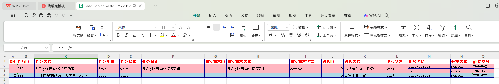
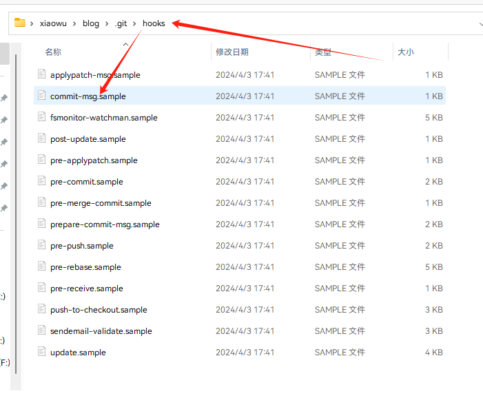
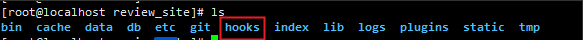
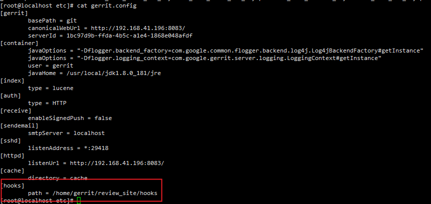
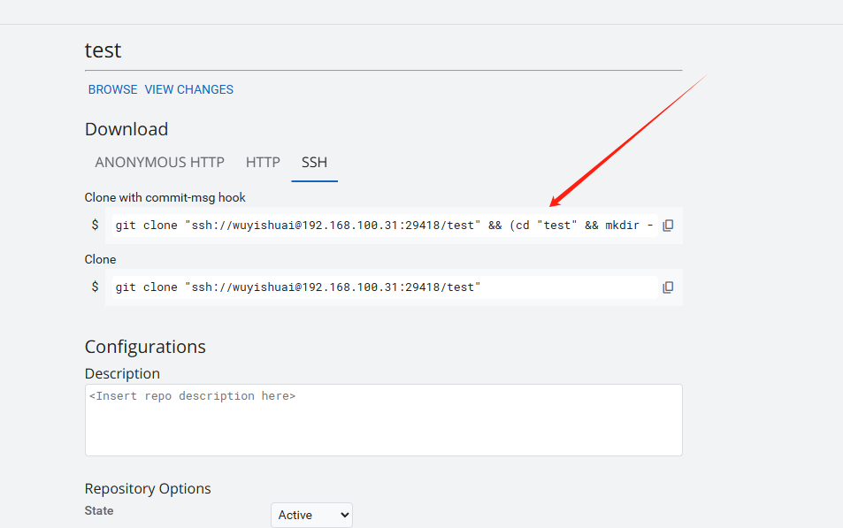
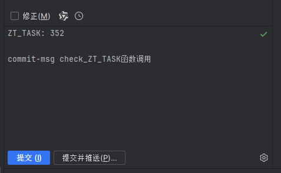

## 一、背景

### 1、通过规范commit提交之后，可以联动禅道或jira，打印相关需求信息



### 2、在gitlab对应的项目里面可以通过commit搜索


## 二、为什么？

>生产发版本有时候周期比较长，或者涉及到代码分支合并、挑单、回滚等操作，开发也忘记了那些改动点。
>
>需要一种机制能够提下代码差异，能够和禅道或jira联动。
>
>市面上很多工具其实已经集成此功能，但需要付费，使用效果也不理想，配置困难。

## 三、原理

>1.git在commit的时候需要用户输入commit信息，并且可以触发钩子，可以实现commit规范检查。
>
>2.git本身就是版本控制，有修订号
>
>3.我们是否可以规定一种commit规范，commit内容必须包含体现jira或禅道唯一性的信息，再通过git log获取唯一性信息，再拿着唯一性信息去禅道或jira的api查询、评论、评分等。



## 四、commit脚本准备

### 1、jira与gerrit检查

```bash
#!/bin/sh
# From Gerrit Code Review 3.2.0
#
# Part of Gerrit Code Review (https://www.gerritcodereview.com/)
#
# Copyright (C) 2009 The Android Open Source Project
#
# Licensed under the Apache License, Version 2.0 (the "License");
# you may not use this file except in compliance with the License.
# You may obtain a copy of the License at
#
# http://www.apache.org/licenses/LICENSE-2.0
#
# Unless required by applicable law or agreed to in writing, software
# distributed under the License is distributed on an "AS IS" BASIS,
# WITHOUT WARRANTIES OR CONDITIONS OF ANY KIND, either express or implied.
# See the License for the specific language governing permissions and
# limitations under the License.

# avoid [[ which is not POSIX sh.
if test "$#" != 1 ; then
  echo "$0 requires an argument."
  exit 1
fi

if test ! -f "$1" ; then
  echo "file does not exist: $1"
  exit 1
fi

# Do not create a change id if requested
if test "false" = "`git config --bool --get gerrit.createChangeId`" ; then
  exit 0
fi

# $RANDOM will be undefined if not using bash, so don't use set -u
random=$( (whoami ; hostname ; date; cat $1 ; echo $RANDOM) | git hash-object --stdin)
dest="$1.tmp.${random}"

trap 'rm -f "${dest}"' EXIT

if ! git stripspace --strip-comments < "$1" > "${dest}" ; then
   echo "cannot strip comments from $1"
   exit 1
fi

if test ! -s "${dest}" ; then
  echo "file is empty: $1"
  exit 1
fi

# Avoid the --in-place option which only appeared in Git 2.8
# Avoid the --if-exists option which only appeared in Git 2.15
if ! git -c trailer.ifexists=doNothing interpret-trailers \
      --trailer "Change-Id: I${random}" < "$1" > "${dest}" ; then
  echo "cannot insert change-id line in $1"
  exit 1
fi

if ! mv "${dest}" "$1" ; then
  echo "cannot mv ${dest} to $1"
  exit 1
fi


# Judge whether JIRA format is correct
check_JIRA() {
    MSG=./.git/COMMIT_EDITMSG
    COMMIT_MSG=$(cat $MSG)
    JIRA_ID=$(echo "$COMMIT_MSG" | awk 'NR == 1' | grep -Eo "JIRA: [A-Za-z]+[-][0-9]+")
    if [ -z "$JIRA_ID" ];then
        echo "[Format Error]: JIRA must be on the first line or Please add JIRA JIRA-ID format like 'JIRA: MTY-9999'"
        exit 1
    else
        echo "[INFO] JIRA StoryId=["$JIRA_ID"]"
    fi
}

# Judge whether Type format is correct
check_Type() {
    MSG=./.git/COMMIT_EDITMSG
    COMMIT_MSG=$(cat $MSG)
    Type=$(echo "$COMMIT_MSG" | awk 'NR == 2' | grep -Eo "Type: [A-Za-z]+")
    Type2=$(echo "$COMMIT_MSG" | awk -F [:\ ] 'NR == 2 {print $3}')
    if [ -z "$Type" ];then
        echo "[Format Error]: Type is not in the second line or Please add Type format like 'Type: Feature'"
        exit 1
    else
        if [ $Type2 == "Feature" ];then
            echo "[INFO] Type StoryId=["$Type"]"
        elif [ $Type2 == "Bugfix" ];then
            echo "[INFO] Type StoryId=["$Type"]"
        elif [ $Type2 == "Debt" ];then
            echo "[INFO] Type StoryId=["$Type"]"
        elif [ $Type2 == "Refactor" ];then
            echo "[INFO] Type StoryId=["$Type"]"
        elif [ $Type2 == "Enhance" ];then
            echo "[INFO] Type StoryId=["$Type"]"
        elif [ $Type2 == "Hotfix" ];then
            echo "[INFO] Type StoryId=["$Type"]"
        else
            echo "[Value Error]: Type is not in the second line or Please add Type format like 'Type: Feature'"
            exit 1
        fi
    fi
}

# Judge whether Chenge-Id format is correct
check_ChangeId() {
    MSG=./.git/COMMIT_EDITMSG
    COMMIT_MSG=$(cat $MSG)
    changeid=$(echo "$COMMIT_MSG" | grep -v "^#")
    changeid1=$(echo "$changeid" | awk 'END {print $0}' | grep -Eo "Change-Id: [[:alnum:]]+")
    changeid2=$(echo "$changeid1" | awk -F [:\ ] '{print $3}' | wc -L)

    if [ -z "$changeid" ];then
       echo "[Format Error]: Chenge-Id is not in the last line or Please add Chenge-Id format like 'Chenge-: I4e5b2f15b15b88c51364a0b4758431033137ed70'"
       exit 1
    else
        if [[ $changeid2 -eq 41 ]]; then
            echo "[INFO] Change-Id StoryId=["$changeid1"]"
        else
            echo "[Value Error] Chenge-Id is not in the last line or Please add Chenge-Id format like 'Chenge-: I4e5b2f15b15b88c51364a0b4758431033137ed70'"
            exit 1
        fi
    fi
}

check_JIRA
check_Type
check_ChangeId
```

### 2、禅道检查

```bash
#!/bin/sh

# Judge whether ZT_TASK format is correct
check_ZT_TASK() {
    MSG=./.git/COMMIT_EDITMSG
    COMMIT_MSG=$(cat $MSG)
    ZT_TASK_ID=$(echo "$COMMIT_MSG" | awk 'NR == 1' | grep -Eo "ZT_TASK: [0-9]+")
    if [ -z "$ZT_TASK_ID" ];then
        echo "[Format Error]: ZT_TASK must be on the first line or Please add ZT_TASK_ID format like 'ZT_TASK: 001'"
        exit 1
    else
        echo "[INFO] ZenTao TaskId=["$ZT_TASK_ID"]"
    fi
}

check_ZT_TASK
```

## 五、使用

### 1、gerrit配置（错误方式）

>gerrit支持配置客户端hooks钩子

#### 1.插件安装

>https://gerrit.googlesource.com/plugins/hooks/
>
>先到官网去下载插件的jar包，然后把这个jar包放到gerrit的安装目录plugins里面，然后重启gerrit服务即可(gerrit/etc/bin/gerrit.sh restart)
>
>```
>java -jar gerrit.war init -d <site_path> --install-plugin=hooks
>```

#### 2.准备hooks目录



#### 3.配置hooks配置



#### 4.上传commit-msg脚本


#### 5.gerrit支持clone代码携带commit-msg



```bash
git clone "ssh://wuyishuai@192.168.100.31:29418/test" && (cd "test" && mkdir -p `git rev-parse --git-dir`/hooks/ && curl -Lo `git rev-parse --git-dir`/hooks/commit-msg http://192.168.100.31:8080/tools/hooks/commit-msg && chmod +x `git rev-parse --git-dir`/hooks/commit-msg)
```

### 2、正确姿势

#### 1.gerrit创建hooks仓库


#### 2.获取最新gerrit默认commit-msg配置

>https://gerrit-devops-k8s-local.gmbaifa.online/tools/hooks/


#### 3.commit-msg配置内容

```bash
#!/bin/sh
# From Gerrit Code Review 3.12.1
#
# Part of Gerrit Code Review (https://www.gerritcodereview.com/)
#
# Copyright (C) 2009 The Android Open Source Project
#
# Licensed under the Apache License, Version 2.0 (the "License");
# you may not use this file except in compliance with the License.
# You may obtain a copy of the License at
#
# http://www.apache.org/licenses/LICENSE-2.0
#
# Unless required by applicable law or agreed to in writing, software
# distributed under the License is distributed on an "AS IS" BASIS,
# WITHOUT WARRANTIES OR CONDITIONS OF ANY KIND, either express or implied.
# See the License for the specific language governing permissions and
# limitations under the License.
#

unset GREP_OPTIONS

CHANGE_ID_AFTER="Bug|Depends-On|Issue|Test|Feature|Fixes|Fixed"
MSG="$1"

# Check for, and add if missing, a unique Change-Id
#
add_ChangeId() {
	clean_message=`sed -e '
		/^diff --git .*/{
			s///
			q
		}
		/^Signed-off-by:/d
		/^#/d
	' "$MSG" | git stripspace`
	if test -z "$clean_message"
	then
		return
	fi

	# Do not add Change-Id to temp commits
	if echo "$clean_message" | head -1 | grep -q '^\(fixup\|squash\)!'
	then
		return
	fi

	if test "false" = "`git config --bool --get gerrit.createChangeId`"
	then
		return
	fi

	# Does Change-Id: already exist? if so, exit (no change).
	if grep -i '^Change-Id:' "$MSG" >/dev/null
	then
		return
	fi

	id=`_gen_ChangeId`
	T="$MSG.tmp.$$"
	AWK=awk
	if [ -x /usr/xpg4/bin/awk ]; then
		# Solaris AWK is just too broken
		AWK=/usr/xpg4/bin/awk
	fi

	# Get core.commentChar from git config or use default symbol
	commentChar=`git config --get core.commentChar`
	commentChar=${commentChar:-#}

	# How this works:
	# - parse the commit message as (textLine+ blankLine*)*
	# - assume textLine+ to be a footer until proven otherwise
	# - exception: the first block is not footer (as it is the title)
	# - read textLine+ into a variable
	# - then count blankLines
	# - once the next textLine appears, print textLine+ blankLine* as these
	#   aren't footer
	# - in END, the last textLine+ block is available for footer parsing
	$AWK '
	BEGIN {
		if (match(ENVIRON["OS"], "Windows")) {
			RS="\r?\n" # Required on recent Cygwin
		}
		# while we start with the assumption that textLine+
		# is a footer, the first block is not.
		isFooter = 0
		footerComment = 0
		blankLines = 0
	}

	# Skip lines starting with commentChar without any spaces before it.
	/^'"$commentChar"'/ { next }

	# Skip the line starting with the diff command and everything after it,
	# up to the end of the file, assuming it is only patch data.
	# If more than one line before the diff was empty, strip all but one.
	/^diff --git / {
		blankLines = 0
		while (getline) { }
		next
	}

	# Count blank lines outside footer comments
	/^$/ && (footerComment == 0) {
		blankLines++
		next
	}

	# Catch footer comment
	/^\[[a-zA-Z0-9-]+:/ && (isFooter == 1) {
		footerComment = 1
	}

	/]$/ && (footerComment == 1) {
		footerComment = 2
	}

	# We have a non-blank line after blank lines. Handle this.
	(blankLines > 0) {
		print lines
		for (i = 0; i < blankLines; i++) {
			print ""
		}

		lines = ""
		blankLines = 0
		isFooter = 1
		footerComment = 0
	}

	# Detect that the current block is not the footer
	(footerComment == 0) && (!/^\[?[a-zA-Z0-9-]+:/ || /^[a-zA-Z0-9-]+:\/\//) {
		isFooter = 0
	}

	{
		# We need this information about the current last comment line
		if (footerComment == 2) {
			footerComment = 0
		}
		if (lines != "") {
			lines = lines "\n";
		}
		lines = lines $0
	}

	# Footer handling:
	# If the last block is considered a footer, splice in the Change-Id at the
	# right place.
	# Look for the right place to inject Change-Id by considering
	# CHANGE_ID_AFTER. Keys listed in it (case insensitive) come first,
	# then Change-Id, then everything else (eg. Signed-off-by:).
	#
	# Otherwise just print the last block, a new line and the Change-Id as a
	# block of its own.
	END {
		unprinted = 1
		if (isFooter == 0) {
			print lines "\n"
			lines = ""
		}
		changeIdAfter = "^(" tolower("'"$CHANGE_ID_AFTER"'") "):"
		numlines = split(lines, footer, "\n")
		for (line = 1; line <= numlines; line++) {
			if (unprinted && match(tolower(footer[line]), changeIdAfter) != 1) {
				unprinted = 0
				print "Change-Id: I'"$id"'"
			}
			print footer[line]
		}
		if (unprinted) {
			print "Change-Id: I'"$id"'"
		}
	}' "$MSG" > "$T" && mv "$T" "$MSG" || rm -f "$T"
}
_gen_ChangeIdInput() {
	echo "tree `git write-tree`"
	if parent=`git rev-parse "HEAD^0" 2>/dev/null`
	then
		echo "parent $parent"
	fi
	echo "author `git var GIT_AUTHOR_IDENT`"
	echo "committer `git var GIT_COMMITTER_IDENT`"
	echo
	printf '%s' "$clean_message"
}
_gen_ChangeId() {
	_gen_ChangeIdInput |
	git hash-object -t commit --stdin
}

# Judge whether JIRA format is correct
check_JIRA() {
    MSG=./.git/COMMIT_EDITMSG
    COMMIT_MSG=$(cat $MSG)
    JIRA_ID=$(echo "$COMMIT_MSG" | awk 'NR == 1' | grep -Eo "JIRA: [A-Za-z]+[-][0-9]+")
    if [ -z "$JIRA_ID" ];then
        echo "[Format Error]: JIRA must be on the first line or Please add JIRA JIRA-ID format like 'JIRA: MTY-9999'"
        exit 1
    else
        echo "[INFO] JIRA StoryId=["$JIRA_ID"]"
    fi
}

# Judge whether Type format is correct
check_Type() {
    MSG=./.git/COMMIT_EDITMSG
    COMMIT_MSG=$(cat $MSG)
    Type=$(echo "$COMMIT_MSG" | awk 'NR == 2' | grep -Eo "Type: [A-Za-z]+")
    Type2=$(echo "$COMMIT_MSG" | awk -F [:\ ] 'NR == 2 {print $3}')
    if [ -z "$Type" ];then
        echo "[Format Error]: Type is not in the second line or Please add Type format like 'Type: Feature'"
        exit 1
    else
        if [ $Type2 == "Feature" ];then
            echo "[INFO] Type StoryId=["$Type"]"
        elif [ $Type2 == "Bugfix" ];then
            echo "[INFO] Type StoryId=["$Type"]"
        elif [ $Type2 == "Debt" ];then
            echo "[INFO] Type StoryId=["$Type"]"
        elif [ $Type2 == "Refactor" ];then
            echo "[INFO] Type StoryId=["$Type"]"
        elif [ $Type2 == "Enhance" ];then
            echo "[INFO] Type StoryId=["$Type"]"
        elif [ $Type2 == "Hotfix" ];then
            echo "[INFO] Type StoryId=["$Type"]"
        else
            echo "[Value Error]: Type is not in the second line or Please add Type format like 'Type: Feature'"
            exit 1
        fi
    fi
}

check_JIRA
check_Type
add_ChangeId

```

#### 4.修改gerrit配置并重启

```bash
[gerrit]
        installCommitMsgHookCommand = gitdir=$(git rev-parse --git-dir) && curl -s 'https://gerrit-devops-k8s-local.gmbaifa.online/plugins/gitiles/hooks/+/refs/heads/master/commit-msg?format=TEXT' | base64 -d > ${gitdir}/hooks/commit-msg && chmod a+x ${gitdir}/hooks/commit-msg
```

#### 5.改完之后仓库地址就变成新的了

### 3、gitlab

>目前没找到比较好的方式只能上传到某个仓库手动克隆

```bash
mkdir -p `git rev-parse --git-dir`/hooks/ && curl -Lo `git rev-parse --git-dir`/hooks/commit-msg https://git.local.com.cn/open/tools/raw/master/01_githooks/commit-msg && chmod +x `git rev-parse --git-dir`/hooks/commit-msg
```

## 六、效果

>以gitlab+禅道演示

### 1、规范格式

```bash
ZT_TASK: 352

commit-msg check_ZT_TASK函数调用
```



### 2、提交失败和成功打印


