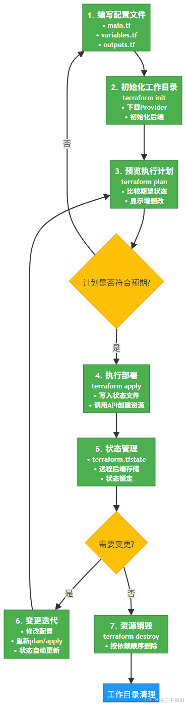
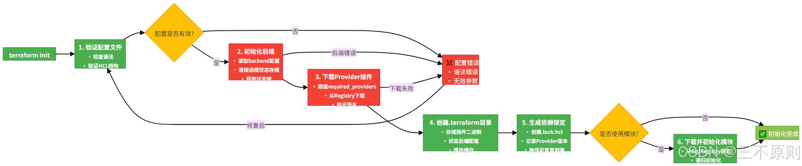
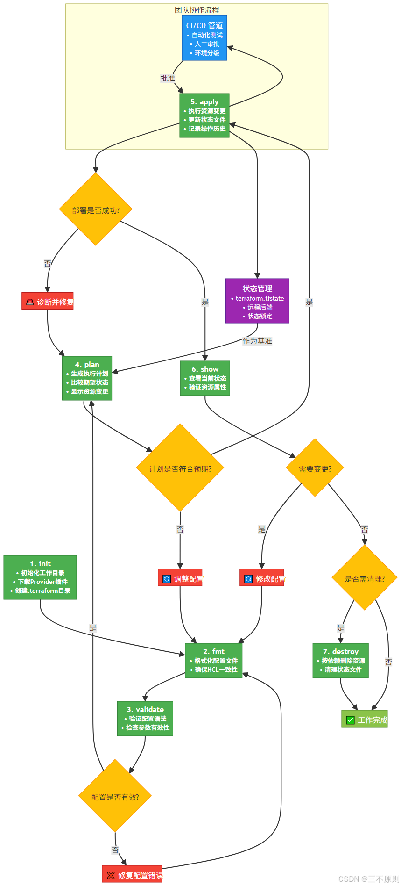
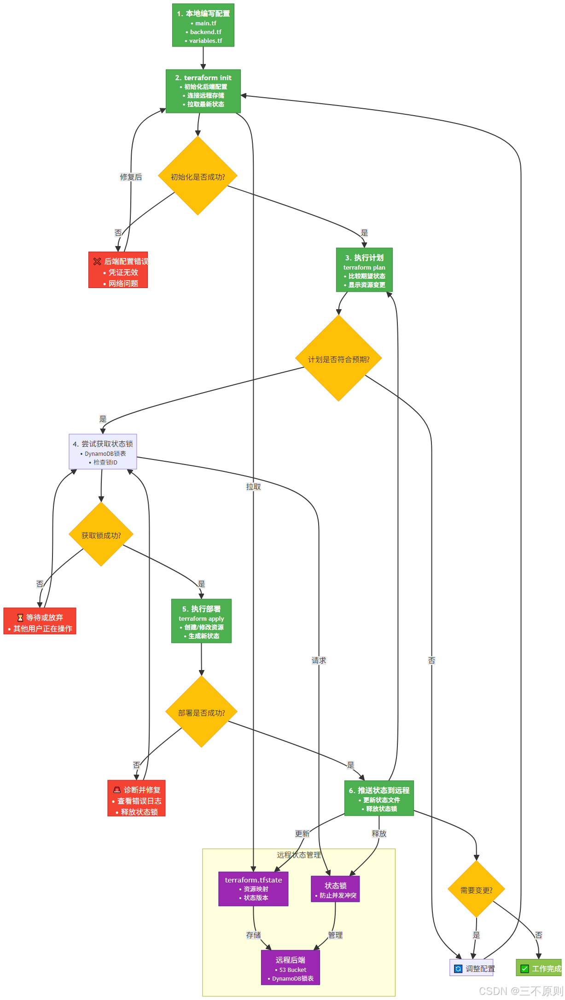
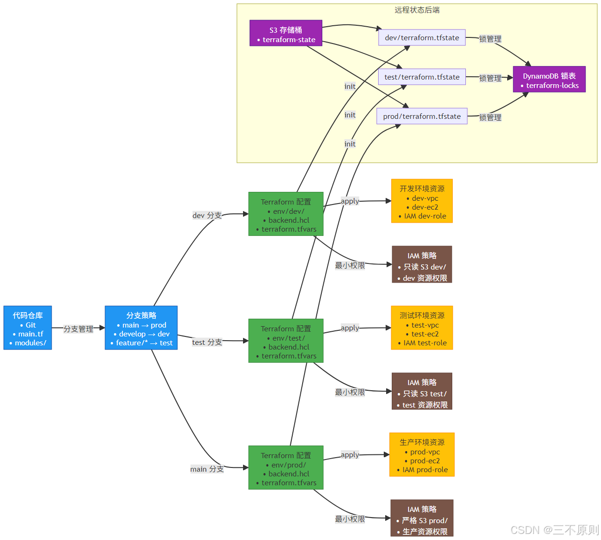

# IaC和Terraform

## 一、如何创建一个云资源

### 1、控制台创建

### 2、调用官方API创建

### 3、IaC创建

#### 1.什么是Infrastructure as Code(IaC)

>- 使用代码定义基础设施（声明式：云资源、配置、工具安装）
>
>- 借助Git实现对基础设施的版本控制
>- 有状态、幂等

#### 2.优势

>- 无论何时何人执行、结果都可重复且一致（与人类复制和粘贴执行指令不同）
>
>- 版本控制（谁改变了什么，回滚到良好状态的能力）
>- 使用Git进行变更管理（批准、安全检查、自动化测试）
>- 清晰的变更行为（而不是由人来理解和描述）
>- 快速配置基础设施（大规模交付，运行一行代码）

#### 3.能做什么？

>- 提供以编码工作流来创建基础设施（创建基础设施就像在写代码）
>- 更改或更新现有的基础设施
>- 安全地更改基础设施（例如在正式应用前先进行试运行）
>- 和CI/CD工具集成，形成DevOps工作流
>- 提供可复用的模块，方便协作和共享
>- 实施安全策略和生产标准
>- 实现基础设施的团队协作

#### 4.市面上主流的IaC工具和支持的云厂商

>Terraform、Pulumi、Crossplane
>
>阿里云、Aws、腾讯云、Azure、华为云、谷歌云

## 二、Terraform了解

### 1、介绍

>Terraform 是一款开源的基础设施即代码（IaC）工具，由 HashiCorp 开发。它允许用户通过声明式配置文件定义和管理云基础设施资源，支持跨云平台操作，包括 AWS、阿里云、Azure 等主流公有云，以及 VMware 等私有云环境。
>
>通过 Terraform，用户可以实现基础设施的版本控制、自动化部署和跨团队协作，大幅提升运维效率和资源管理的一致性。
>
>**HashiCorp** 是一家致力于开发开源软件的公司，专注于提供云计算和基础设施管理工具，特别是面向 DevOps 和 IT 运维团队。其产品广泛应用于自动化、基础设施管理、和多云环境下的应用部署与管理。HashiCorp 通过提供可靠的工具，帮助团队更高效地管理复杂的基础设施和现代化应用。
>
>HashiCorp 的主要产品包括：
>
>1. **Terraform**：用于基础设施即代码 (Infrastructure as Code, IaC) 的工具，允许用户通过声明性配置管理云基础设施（例如 AWS、Azure、Google Cloud 等）。Terraform 可以管理多云环境中的资源，自动化创建、修改和管理基础设施。
>2. **Vault**：一个开源的秘密管理工具，主要用于存储和管理敏感数据，如 API 密钥、密码、证书等。Vault 还支持密钥管理和加密服务。
>3. **Consul**：用于服务发现和配置管理的工具，支持自动化和管理微服务架构。Consul 提供服务注册、健康检查、负载均衡和分布式配置功能。
>4. **Packer**：一个自动化的虚拟机映像创建工具，支持为不同的虚拟化平台（如 AWS AMI、VirtualBox、Docker 等）创建一致的基础映像。
>5. **Vagrant**：一种工具，可以在本地开发环境中轻松管理虚拟机或容器，支持多种操作系统和云平台的配置。
>
>HashiCorp 的产品通常是为了应对现代基础设施自动化的挑战，尤其是在多云环境和微服务架构中，帮助开发者和运维人员以更简化和高效的方式管理复杂的基础设施和部署流程。


>- 全新的配置语言HCL（HashiCorp Configuration Laguage）
>- 可执行的文档
>- 人类和机器可读
>- 简单、易学易用
>- 测试、共享、重用、自动化
>- 适用于几乎所有的云厂商

### 2、什么是HCL

>**HCL**（**HashiCorp Configuration Language**）是由 **HashiCorp** 开发的一种声明性配置语言，旨在简化基础设施和服务的配置管理。HCL 主要用于 HashiCorp 的开源工具（如 **Terraform**、**Vault**、**Consul** 等）的配置文件中，作为一种清晰、易于理解和使用的语言，特别是在处理基础设施自动化时。

#### 1.特点

>**声明式语法**：
>
>- HCL 采用声明式语法，意味着你描述所期望的状态而不是如何实现这个状态。比如在 **Terraform** 中，你描述需要的资源，而不必手动指定每个步骤如何执行。
>
>**易读性和可维护性**：
>
>- HCL 被设计为非常易于人类阅读和理解的语言，它的语法结构与常见的编程语言如 JSON 或 YAML 相比更加简洁、直观。
>- HCL 在视觉上也较为清晰，支持嵌套结构，使配置文件更具可读性。
>
>**灵活的结构**：
>
>- HCL 具有支持块（block）、属性（attribute）和表达式（expression）的结构，可以将复杂的配置逻辑清晰地拆分成独立的部分。
>- 它允许使用条件、循环、变量等来增加配置的灵活性和动态性。
>
>**支持与其他语言的互操作性**：
>
>- 虽然 HCL 是一种专门的配置语言，但它也能够与 JSON 等其他语言兼容，允许用户使用 JSON 作为 HCL 配置文件的输入，方便在现有系统中进行集成。
>
>**强大的类型支持**：
>
>- HCL 支持多种数据类型，包括基本的字符串、数字、布尔值，以及复杂的结构，如列表、字典等。它允许用户定义变量和输出结果，并可以执行一些简单的逻辑操作。

#### 2.示例

>在这个例子中，我们使用 HCL 来配置一个 **AWS EC2 实例**。配置文件描述了：
>
>- 使用的 **AWS 区域**。
>- 创建一个 **EC2 实例**，并指定镜像 ID 和实例类型。
>- 设置标签用于标识该实例。

```tf
provider "aws" {
  region = "us-east-1"
}

resource "aws_instance" "example" {
  ami           = "ami-0c55b159cbfafe1f0"
  instance_type = "t2.micro"

  tags = {
    Name = "ExampleInstance"
  }
}
```

#### 3.HCL 与其他配置语言对比

>**与 JSON 对比**：
>
>- HCL 语法比 JSON 更简洁，尤其是在表达复杂结构时。例如，在 JSON 中，配置文件可能显得冗长且难以阅读，而 HCL 更为直观。
>
>**与 YAML 对比**：
>
>- YAML 也是一种常见的配置语言，但 HCL 在处理复杂配置、动态表达式和结构化数据时更具优势，尤其是在基础设施自动化和跨平台管理时。

### 3、Terraform使用

>可以结合ansible、k8s使用
>
>一条命令 拉起一个环境

### 4、Providers

>在 **HashiCorp Terraform** 中，**Provider** 是一种插件或插件类型，允许 Terraform 与外部系统（如云平台、服务、应用程序、API 等）进行交互和管理资源。Provider 是 Terraform 的核心组件，它使得 Terraform 能够自动化管理和配置多种外部资源（如 AWS、Azure、Google Cloud、Kubernetes、DNS 等）。

#### 1.Providers 的作用

> **提供资源的管理能力**：Provider 为 Terraform 提供了与某个特定平台或服务进行交互的能力。它定义了如何连接到该服务、如何创建、修改和销毁资源。
>
> **资源类型的定义**：每个 Provider 都定义了一组可以管理的资源类型。例如，AWS Provider 允许 Terraform 管理 EC2 实例、S3 存储桶、RDS 数据库等 AWS 资源。
>
> **配置和身份验证**：Provider 还负责配置与外部服务的连接，包括身份验证、权限设置等。

#### 2.Provider 工作原理

>**初始化**：当运行 `terraform init` 时，Terraform 会下载和初始化所需的 Provider 插件。Terraform 会根据配置文件中定义的资源类型，自动选择合适的 Provider（例如 AWS、Azure、Google Cloud）。
>
>**资源管理**：在 Terraform 配置文件中，用户通过 Provider 来定义资源的配置，例如创建、更新或删除云资源。
>
>**执行计划和应用**：Terraform 会使用相应的 Provider 来与外部服务交互，执行资源操作（如创建或销毁资源），并确保基础设施状态符合预期。

#### 3.Providers从哪里获取

>https://registry.terraform.io/browse/providers


#### 4.使用文档

https://registry.terraform.io/providers/aliyun/alicloud/latest/docs


#### 5.版本控制

>- 建议固定版本，防止上游更新导致异常
>
>- 不指定则使用最新版本
>
>- 版本操作符：
>
> - ```bash
>   =
>   !=
>   \>
>   >=
>   <
>   <=
>   `~>`
>   ```


### 5、架构


### 6、工作流程



## 三、Terraform使用

### 1、安装

#### 1.安装

> https://developer.hashicorp.com/terraform/install

#### 2.不同云厂商的providers

>https://registry.terraform.io/browse/providers

>阿里云参数查找：
>
>https://api.aliyun.com/terraform

### 2、云厂商基本配置

>Terraform 通过环境变量或配置文件获取云厂商凭证，比如临时环境变量

#### 1.linux配置

```bash
export AWS_ACCESS_KEY_ID="your_access_key"
export AWS_SECRET_ACCESS_KEY="your_secret_key"

export ALICLOUD_ACCESS_KEY="your_access_key"
export ALICLOUD_SECRET_KEY="your_secret_key"
export ALICLOUD_REGION="cn-shanghai"
```

#### 2.Windows

**用户级别**

```powershell
setx ALICLOUD_ACCESS_KEY "your_access_key"
setx ALICLOUD_SECRET_KEY "your_secret_key"
setx ALICLOUD_REGION "cn-shanghai"
```

**管理员级别**

```powershell
setx ALICLOUD_ACCESS_KEY "your_access_key" /M
setx ALICLOUD_SECRET_KEY "your_secret_key" /M
setx ALICLOUD_REGION "cn-shanghai" /M
```

### 3、编写main.tf,目录初始化

```yaml
variable "region" {
  default = "cn-shanghai"
}

provider "alicloud" {
  region = var.region
}
```

```shell
# 会下载对应云厂商的Provider
terraform init
```



### 4、核心概念与语法

#### 1.资源（Resource）

>资源是 Terraform 管理的基础设施组件，如 EC2 实例、VPC 等：

```bash
# AWS EC2实例示例
resource "aws_instance" "web_server" {
  ami           = "ami-0c55b159cbfafe1f0"
  instance_type = "t2.micro"
  
  tags = {
    Name = "WebServer"
  }
}
```

#### 2.变量（Variable）

>通过变量提高配置灵活性：

```bash
# 定义变量
variable "instance_type" {
  description = "The type of EC2 instance"
  type        = string
  default     = "t2.micro"
}

# 使用变量
resource "aws_instance" "web_server" {
  ami           = "ami-0c55b159cbfafe1f0"
  instance_type = var.instance_type
}
```

#### 3.输出（Output）

>定义部署完成后需要展示的信息：

```bash
output "instance_public_ip" {
  description = "The public IP of the EC2 instance"
  value       = aws_instance.web_server.public_ip
}
```

#### 4.模块（Module）

```bash
# 使用官方VPC模块
module "vpc" {
  source  = "terraform-aws-modules/vpc/aws"
  version = "3.14.0"
  
  name = "my-vpc"
  cidr = "10.0.0.0/16"
  
  azs             = ["us-east-1a", "us-east-1b"]
  private_subnets = ["10.0.1.0/24", "10.0.2.0/24"]
  public_subnets  = ["10.0.101.0/24", "10.0.102.0/24"]
}
```

### 5、常用命令

```bash
# 初始化工作目录
terraform init

# 格式化配置文件
terraform fmt

# 验证配置文件
terraform validate

# 预览执行计划
terraform plan

# 执行部署
terraform apply

# 销毁资源
terraform destroy

# 查看状态
terraform show

# 刷新状态
terraform refresh

# 输出信息
terraform output
```

### 6、命令执行流程



### 7、实战案例

#### 1.部署 AWS EC2 实例与安全组

##### 1）创建main.tf

```yaml
provider "aws" {
  region = "us-east-1"
}

# 安全组配置
resource "aws_security_group" "web_sg" {
  name        = "web-security-group"
  description = "Allow HTTP and SSH access"
  
  ingress {
    from_port   = 80
    to_port     = 80
    protocol    = "tcp"
    cidr_blocks = ["0.0.0.0/0"]
  }
  
  ingress {
    from_port   = 22
    to_port     = 22
    protocol    = "tcp"
    cidr_blocks = ["0.0.0.0/0"]
  }
  
  egress {
    from_port   = 0
    to_port     = 0
    protocol    = "-1"
    cidr_blocks = ["0.0.0.0/0"]
  }
  
  tags = {
    Name = "web-sg"
  }
}

# EC2实例配置
resource "aws_instance" "web_server" {
  ami           = "ami-0c55b159cbfafe1f0"
  instance_type = "t2.micro"
  vpc_security_group_ids = [aws_security_group.web_sg.id]
  
  user_data = <<-EOF
              #!/bin/bash
              yum update -y
              yum install -y httpd
              systemctl start httpd
              systemctl enable httpd
              echo "<h1>Hello from Terraform</h1>" > /var/www/html/index.html
              EOF
  
  tags = {
    Name = "WebServer"
  }
}

output "public_ip" {
  value = aws_instance.web_server.public_ip
}

output "public_dns" {
  value = aws_instance.web_server.public_dns
}
```

##### 2）执行部署

```bash
# 初始化
terraform init

# 预览
terraform plan

# 部署
terraform apply -auto-approve
```

##### 3）访问输出的public_ip,即可看到部署的网页

##### 4）清理资源

```bash
# 初始化
terraform init

# 预览
terraform plan

# 部署
terraform apply -auto-approve
```

#### 2.跨云平台部署（AWS + 阿里云）

```yaml
# AWS配置
provider "aws" {
  region = "us-east-1"
}

resource "aws_s3_bucket" "aws_bucket" {
  bucket = "terraform-cross-cloud-demo-aws"
  tags = {
    Name = "CrossCloudDemo"
  }
}

# 阿里云配置
provider "alicloud" {
  region = "cn-beijing"
}

resource "alicloud_oss_bucket" "ali_bucket" {
  bucket = "terraform-cross-cloud-demo-ali"
  acl    = "private"
  tags = {
    Name = "CrossCloudDemo"
  }
}

output "aws_bucket_url" {
  value = "https://${aws_s3_bucket.aws_bucket.bucket}.s3.amazonaws.com"
}

output "ali_bucket_url" {
  value = "https://${alicloud_oss_bucket.ali_bucket.bucket}.oss-cn-beijing.aliyuncs.com"
}
```

### 8、状态管理

#### 1.状态文件的重要性

>Terraform 的状态文件（terraform.tfstate）是核心组成部分，它记录了当前基础设施的实际状态，是 Terraform 判断资源是否需要变更的依据。状态文件包含以下关键信息：
>
>- 资源的实际属性值（与配置文件中的期望状态对比）
>
>- 资源之间的依赖关系
>
>- 加密的敏感数据（如密码、密钥等）
>
>**注意**：状态文件包含敏感信息，应妥善保管，避免泄露。同时，状态文件需要在团队协作中共享，确保所有人使用相同的状态源。

#### 2.远程状态存储

>默认情况下，状态文件存储在本地，但在团队协作或生产环境中，推荐使用远程状态存储。支持的远程存储包括：
>
>- AWS S3
>
>- Azure Blob Storage
>
>- 阿里云 OSS
>
>- HashiCorp Consul
>
>- Terraform Cloud

##### 1)AWS S3作为远程存储

###### ①创建 S3 桶和 DynamoDB 表（用于状态锁定）：

```yaml
# 远程状态配置示例（存储在s3-backend.tf）
terraform {
  backend "s3" {
    bucket         = "my-terraform-state-bucket"  # 已存在的S3桶
    key            = "terraform/state"            # 状态文件在桶中的路径
    region         = "us-east-1"
    encrypt        = true                         # 加密状态文件
    dynamodb_table = "terraform-state-lock"       # 用于状态锁定的DynamoDB表
  }
}
```

###### ②初始化远程后端

```bash
terraform init
```

###### ③工作流详解



##### 2）状态锁定

>远程状态存储支持状态锁定，防止多人同时修改基础设施导致冲突。当执行terraform apply时，Terraform 会自动锁定状态，操作完成后解锁。如果操作中断导致锁定未释放，可手动解锁：

```bash
terraform force-unlock <lock-id>
```

### 9、高级特性

#### 1.条件判断与循环

##### 1）条件判断（count与for_each）

使用count根据条件创建多个相同资源：

```yaml
resource "aws_instance" "web_servers" {
  count         = var.environment == "production" ? 3 : 1  # 生产环境3个实例，非生产1个
  ami           = "ami-0c55b159cbfafe1f0"
  instance_type = "t2.micro"
  
  tags = {
    Name = "WebServer-${count.index}"  # 索引从0开始
  }
}
```

使用for_each根据映射或列表创建资源：

```yaml
variable "instance_names" {
  type    = list(string)
  default = ["app-1", "app-2", "app-3"]
}

resource "aws_instance" "apps" {
  for_each      = toset(var.instance_names)  # 转换为集合
  ami           = "ami-0c55b159cbfafe1f0"
  instance_type = "t2.micro"
  
  tags = {
    Name = each.key  # each.key为集合中的元素
  }
}
```

##### 2）动态块（dynamic）

动态块用于在资源内部根据条件生成重复的配置块（如安全组规则）：

```bash
resource "aws_security_group" "dynamic_sg" {
  name        = "dynamic-sg"
  description = "Dynamic rules example"
  
  dynamic "ingress" {
    for_each = var.allowed_ports  # 变量为列表：[80, 443, 22]
    content {
      from_port   = ingress.value
      to_port     = ingress.value
      protocol    = "tcp"
      cidr_blocks = ["0.0.0.0/0"]
    }
  }
  
  egress {
    from_port   = 0
    to_port     = 0
    protocol    = "-1"
    cidr_blocks = ["0.0.0.0/0"]
  }
}
```

#### 2.模块开发

>模块是 Terraform 代码复用的核心方式，一个规范的模块应包含：
>
>- [main.tf](http://main.tf/)：核心资源定义
>
>- [variables.tf](http://variables.tf/)：输入变量定义
>
>- [outputs.tf](http://outputs.tf/)：输出变量定义
>
>- [README.md](http://readme.md/)：模块说明文档
>
>- examples/：示例用法

##### 1）示例模块结构

```bash
modules/
  vpc/
    main.tf
    variables.tf
    outputs.tf
    README.md
  ec2/
    main.tf
    variables.tf
    outputs.tf
```

##### 2）使用自定义模块

```yaml
module "my_vpc" {
  source = "./modules/vpc"  # 本地模块路径
  cidr   = "10.0.0.0/16"
  azs    = ["us-east-1a", "us-east-1b"]
}

module "web_servers" {
  source     = "./modules/ec2"
  count      = 2
  instance_type = "t2.micro"
  vpc_id     = module.my_vpc.vpc_id  # 引用模块输出
  subnet_ids = module.my_vpc.public_subnet_ids
}
```

### 10、工作区（Workspaces）

>工作区用于隔离不同环境（如开发、测试、生产）的状态，避免状态文件冲突。

```bash
# 创建工作区
terraform workspace new dev

# 切换工作区
terraform workspace select prod

# 查看工作区列表
terraform workspace list

# 在当前工作区执行命令
terraform plan -var-file=prod.tfvars
```



### 11、常见问题与解决方法

#### 1.状态文件损坏或丢失

>- **问题**：terraform.tfstate文件损坏或丢失，导致无法管理现有资源。
>
>- **解决方法**：
>
>  1. 若使用远程存储，重新初始化拉取远程状态：terraform init
>  2. 若本地状态丢失且无远程备份，需手动导入资源：
>
>  ```bash
>  terraform import aws_instance.web_server i-1234567890abcdef0  # 导入EC2实例
>  ```

#### 2.资源依赖冲突

>- **问题**：资源之间的依赖关系未正确定义，导致部署失败。
>
>- **解决方法**：
>
>      1. 使用depends_on显式定义依赖：
>
>  ```bash
>  resource "aws_instance" "app" {
>    # ...其他配置...
>    depends_on = [aws_db_instance.db]  # 确保数据库先部署
>  }
>  ```

#### 3.敏感数据泄露

>- **问题**：状态文件中包含敏感数据（如密码），可能被意外泄露。
>
>- **解决方法**：
>
>     1. 启用状态文件加密（远程存储如 S3 支持服务器端加密）
>
>     2. 使用sensitive = true标记敏感变量，避免在输出中显示：
>
>        ```bash
>        variable "db_password" {
>          type      = string
>          sensitive = true
>        }
>        ```
>     3. 优先使用云厂商的密钥管理服务（如 AWS KMS、阿里云 KMS）存储敏感数据
>        

#### 4.模块版本管理

>- **问题**：模块版本更新导致配置不兼容。
>
>- **解决方法**：
>
>   1. 在模块引用中指定固定版本：
>
>      ```bash
>      module "vpc" {
>        source  = "terraform-aws-modules/vpc/aws"
>        version = "3.14.0"  # 固定版本，避免自动升级
>      }
>      ```
>   2. 定期测试模块新版本，逐步升级

### 12、最佳实践

#### 1.代码组织

>- 按环境拆分配置（environments/dev、environments/prod）
>
>- 使用模块复用代码，避免重复配置
>
>- 分离变量文件（terraform.tfvars、prod.tfvars）

#### 2.安全管理

>- 禁止将敏感信息硬编码到配置文件
>
>- 使用远程状态存储并启用加密和访问控制
>
>- 定期轮换云厂商凭证

#### 3.协作流程

>- 使用 Git 管理 Terraform 代码，通过 PR 进行代码审查
>
>- 强制使用远程状态和状态锁定
>
>- 执行terraform plan后再apply，确认变更符合预期

#### 4.版本控制

>对 Terraform 版本进行约束

```yaml
terraform {
  required_version = "~> 1.9.0"  # 允许1.9.x系列的小版本更新
  required_providers {
    aws = {
      source  = "hashicorp/aws"
      version = "~> 4.0"
    }
  }
}
```

### 13、总结

>Terraform 作为一款强大的基础设施即代码工具，通过声明式配置、跨云支持和自动化部署，极大简化了云基础设施的管理。本文从基础安装、核心概念到高级特性和最佳实践，全面介绍了 Terraform 的使用方法。
>
>掌握 Terraform 的关键在于理解其状态管理机制和模块化思想，通过规范的代码组织和协作流程，可以有效提升团队的运维效率，确保基础设施的一致性和可追溯性。
>
>随着云原生技术的发展，Terraform 与 Kubernetes、服务网格等工具的结合将更加紧密，成为云时代基础设施管理的核心工具之一。建议在实际项目中不断实践和优化，充分发挥其优势。

