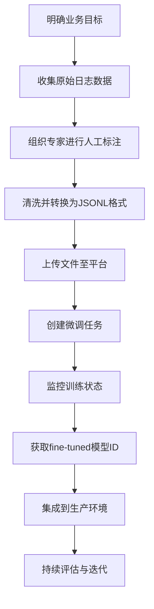

# 大模型微调（Fine-tuning）实战详解

在人工智能领域，尤其是大语言模型（Large Language Models, LLMs）的应用中，**微调（Fine-tuning）** 是一项关键技术。它允许我们将一个通用的预训练大模型，转化为针对特定任务或场景高度优化的专业化模型。本文将从零开始，深入讲解如何进行大模型微调，并以“日志紧急程度分析专家”为例，手把手带你完成整个流程。

## 一、什么是微调？为什么需要微调？

### 1、定义

**微调（Fine-tuning）** 是指在一个已经经过大规模语料预训练的大模型基础上，使用少量**特定领域的标注数据**对模型参数进行进一步训练，使其更好地适应某一具体任务的过程。

> 📌 **类比理解：**
>
> 想象一位医学博士（预训练模型），他拥有广泛的知识。但如果你希望他成为心脏病专家（特定任务），就需要让他专门学习大量心脏病病例（标注数据）。这个过程就是“微调”。

### 2、微调的核心目的

微调主要用于以下四个典型场景：

| 场景                                   | 解释                                                         |
| -------------------------------------- | ------------------------------------------------------------ |
| **1. 控制输出风格/格式**               | 让模型输出固定格式的内容，如 JSON、XML 或指定模板。例如：“只输出 P0、P1、P2”。 |
| **2. 提高输出可靠性**                  | 减少模型“胡说八道”（幻觉）现象，在关键业务中提升准确率和一致性。 |
| **3. 纠正复杂 System Prompt 失效问题** | 当 system prompt 过于复杂时，原生模型可能无法遵循指令，微调可让模型“内化”这些规则。 |
| **4. 教会新技能或执行难以描述的任务**  | 某些任务无法通过文字清晰表达逻辑（如判断日志严重性），需通过示例教会模型。 |

## 二、微调全流程

我们以构建一个“**日志紧急程度分类器**”为例，完整走一遍微调流程。

```text
[原始日志] 
→ [人工标注优先级] 
→ [转换为JSONL格式] 
→ [上传至平台] 
→ [启动微调任务] 
→ [获取新模型ID] 
→ [推理测试]
```

整个微调流程分为五大步骤：数据准备 → 格式转换 → 文件上传 → 创建任务 → 推理验证。

### 1、第一步：准备高质量微调数据

#### 1.数据结构要求

微调数据必须是**输入-输出配对样本**，即每条记录包含：

- 用户输入（User Input）
- 正确答案（Assistant Response）

此外还需定义系统角色（System Prompt），告诉模型“你现在是谁”。

#### 示例原始数据（CSV格式）

| log_content（输入）          | priority（标签） |
| ---------------------------- | ---------------- |
| "数据库连接失败，服务不可用" | P0               |
| "CPU使用率达到85%"           | P1               |
| "缓存命中率下降5%"           | P2               |

>  这是一个典型的运维日志分类数据集。

### 2、第二步：将数据转换为 JSONL 格式

OpenAI 等平台要求微调数据为 `.jsonl`（JSON Lines）格式，每一行是一个独立的 JSON 对象。

#### 转换后的一条训练样本如下：

```json
{
  "messages": [
    {
      "role": "system",
      "content": "你是一个日志告警专家，请根据日志内容识别紧急度，直接输出P0、P1或P2。"
    },
    {
      "role": "user",
      "content": "数据库连接失败，服务不可用"
    },
    {
      "role": "assistant",
      "content": "P0"
    }
  ]
}
```

> ⚠ 注意事项：
>
> - 必须包含 `system`, `user`, `assistant` 三个角色。
> - 每一行是一个完整的对话片段。
> - 文件扩展名为 `.jsonl`，不是 `.json`。

### Python 脚本实现自动转换

```python
import csv
import json

def convert_csv_to_jsonl(csv_file, jsonl_file):
    with open(csv_file, 'r', encoding='utf-8') as f_in, \
         open(jsonl_file, 'w', encoding='utf-8') as f_out:
        reader = csv.DictReader(f_in)
        for row in reader:
            messages = [
                {"role": "system", "content": "你是一个日志告警专家，请根据日志内容识别紧急度，直接输出P0、P1或P2。"},
                {"role": "user", "content": row["log_content"]},
                {"role": "assistant", "content": row["priority"]}
            ]
            f_out.write(json.dumps({"messages": messages}, ensure_ascii=False) + '\n')

# 执行转换
convert_csv_to_jsonl('data_log.csv', 'log_data.jsonl')
```

> 输出文件 `log_data.jsonl` 即可用于上传微调。

### 3、第三步：上传文件并创建微调任务（以 OpenAI 为例）

#### 1.安装 OpenAI SDK

```bash
pip install openai
```

#### 2.初始化客户端并上传文件

```python
from openai import OpenAI

client = OpenAI(api_key="your-api-key")

# 上传微调数据文件
upload_response = client.files.create(
    file=open("log_data.jsonl", "rb"),
    purpose="fine-tune"
)

file_id = upload_response.id
print("上传成功，File ID:", file_id)
```

> 成功后返回 `file_id`，用于后续创建任务。

#### 3.创建微调任务

```python
job_response = client.fine_tuning.jobs.create(
    training_file=file_id,
    model="gpt-3.5-turbo"  # 或 gpt-4o-mini
)

job_id = job_response.id
print("微调任务已创建，Job ID:", job_id)
```

> ⏳ 微调是异步过程，通常耗时几分钟到几小时不等，取决于数据量。

### 4、第四步：监控微调状态

```python
status_response = client.fine_tuning.jobs.retrieve(job_id)
print("当前状态:", status_response.status)
print("使用的模型:", status_response.model)
print("微调后的模型ID:", status_response.fine_tuned_model)
```

| 状态值      | 含义       |
| ----------- | ---------- |
| `created`   | 任务已创建 |
| `queued`    | 排队中     |
| `running`   | 正在训练   |
| `succeeded` | 成功完成   |
| `failed`    | 失败       |

> ✅ 成功后会生成一个新的模型 ID，形如：`ft:gpt-3.5-turbo:my-org::abc123xyz`

### 5、第五步：使用微调后模型进行推理

```python
response = client.chat.completions.create(
    model="ft:gpt-3.5-turbo:my-org::abc123xyz",  # 替换为你的 fine-tuned model ID
    messages=[
        {"role": "system", "content": "你是一个日志告警专家，请根据日志内容识别紧急度，直接输出P0、P1或P2。"},
        {"role": "user", "content": "Dist error: connection timeout"}
    ]
)

print("模型预测结果:", response.choices[0].message.content)
# 输出示例：P0
```

> 模型已学会根据历史标注数据判断日志紧急程度！

## 三、支持微调的模型列表（截至2024年）

| 模型名称                             | 是否支持微调 | 备注                   |
| ------------------------------------ | ------------ | ---------------------- |
| **gpt-3.5-turbo**                    | ✅ 支持       | 最常用，性价比高       |
| **gpt-4o-mini**                      | ✅ 支持       | 新一代轻量级高性能模型 |
| **gpt-4o**                           | ❌ 不公开支持 | 内测阶段可能开放       |
| **其他开源模型（LLaMA、ChatGLM等）** | ✅ 可本地微调 | 需自行部署             |

> 📌 建议选择 `gpt-3.5-turbo` 或 `gpt-4o-mini` 作为基座模型。

## 四、微调的关键成功因素

### 1、数据质量 > 数据数量

| 要素         | 说明                                 |
| ------------ | ------------------------------------ |
| **准确性**   | 每条标注必须正确，错误标签会误导模型 |
| **一致性**   | 不同人员标注标准统一，避免歧义       |
| **覆盖全面** | 包含各种边界情况和典型场景           |

> 示例：P0 应仅用于“系统宕机”类致命错误，不能滥用。

### 2、System Prompt 设计要明确

错误写法：

> “请分析这条日志。”

正确写法：

> “你是一个日志告警专家，请根据日志内容识别紧急度，直接输出P0、P1或P2。”

> 明确角色 + 明确输出格式 = 更好效果

### 3、避免过拟合

如果训练数据太少（<100条），模型可能会“死记硬背”，无法泛化。

**解决方案：**

- 至少准备 200~500 条高质量样本
- 加入噪声数据增强（如同义句替换）
- 使用早停机制（Early Stopping）

## 五、常见问题与解答（FAQ）

### Q1：微调和 Prompt Engineering 有什么区别？

| 对比项     | 微调（Fine-tuning）   | 提示工程（Prompt Engineering） |
| ---------- | --------------------- | ------------------------------ |
| 修改对象   | 模型权重              | 输入提示词                     |
| 成本       | 较高（计算资源+时间） | 极低                           |
| 效果稳定性 | 高，模型“学会”了      | 依赖 prompt 质量               |
| 适用场景   | 长期稳定任务          | 快速实验、临时需求             |

> 结论：先尝试提示工程，不行再考虑微调。

### Q2：微调后的模型能保留原有能力吗？

大部分情况下可以，因为微调是在原有知识基础上的“增量学习”。但在极端情况下可能出现“灾难性遗忘”（Catastrophic Forgetting）。

**缓解方法：**

- 使用较小的学习率
- 混合通用数据一起训练
- 采用 LoRA 等参数高效微调技术

## 六、总结：微调的最佳实践路径



> ✅ 微调不是一次性的，而是一个“标注 → 训练 → 测试 → 优化”的闭环过程。

## 结语

微调是将大模型从“通才”变为“专才”的核心手段。虽然技术门槛逐步降低，但其成败仍高度依赖于**高质量的数据标注**和**清晰的任务定义**。对于运维工程师而言，掌握微调技能意味着可以打造专属的“AI运维助手”，大幅提升故障响应效率与系统稳定性。

未来，随着参数高效微调（如 LoRA、QLoRA）的发展，微调将更加轻量化、低成本，真正实现“人人可用的定制化AI”。