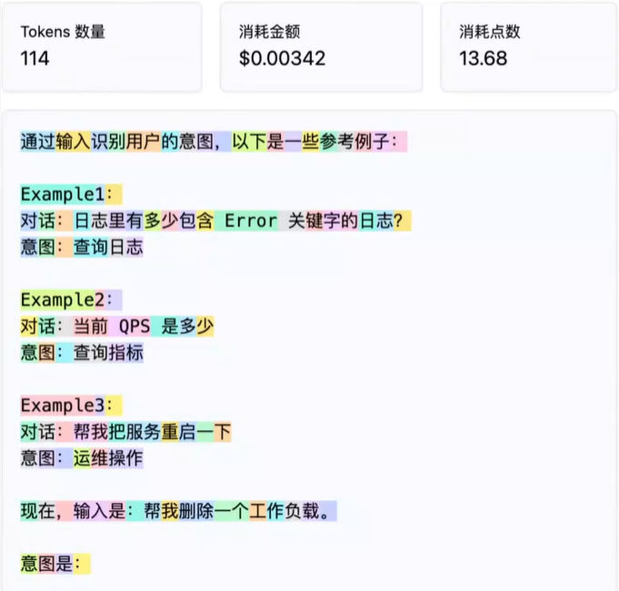
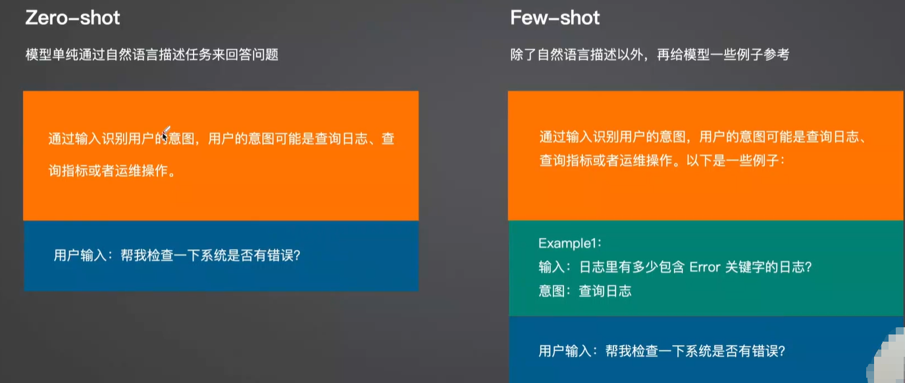

# Prompt Engineering 入门与实战：提升大模型输出质量的关键

## 一、引言

>在本节课中，我们将开启AirOps基础实战模块的学习，重点聚焦于**Prompt Engineering（提示工程）**。作为大模型交互的核心技能之一，掌握如何编写高效、精准的提示语，是提升AI输出质量的关键。本文将带你系统理解什么是Prompt、Token机制、上下文窗口限制，并深入讲解四种编写高质量提示语的最佳实践方法，包括Few-shot、思维链（CoT）和程序辅助等高级技巧。

## 二、背景

>随着大模型（如GPT-4、Llama等）在各行各业的应用日益广泛，如何有效与其交互成为关键技能。Prompt Engineering 就是设计和优化输入提示语的过程，目的是引导模型生成符合预期的输出。它不仅是使用大模型的基础，更是决定输出质量的核心因素。无论是做意图识别、内容生成还是复杂推理，一个精心设计的 prompt 都能显著提升结果准确性。本课程作为 AirOps 实战模块的第一部分，系统讲解了提示工程的核心原则、技术手段及应用场景，为后续的函数调用、微调、RAG 等高级功能打下坚实基础。

## 三、什么是Prompt与Prompt Engineering？

>Prompt，中文常称为“提示语”，是指我们向人工智能模型输入的文本指令，用于引导其生成特定内容。例如：“请总结以下文章”或“判断这段话的用户意图”。而**Prompt Engineering**，则是设计和优化这些提示语的过程，目的是让模型输出更准确、更有价值的结果。

>一个优秀的Prompt = 提出一个好问题 + 提供清晰上下文 + 明确期望输出。它直接决定了模型的回答质量。比如在用户意图识别任务中，我们可以设定目标（角色扮演为意图分析专家）、提供参考示例（few-shot）、给出当前输入，并明确要求输出格式。这样结构化的提示能显著提升模型推理准确性。此外，我们需要意识到：人类读的是文字，但大模型处理的是**Token**——即文本被切分后的基本单元。无论是字母、汉字还是空格，都会转化为Token进行计算。主流商用模型如GPT-4o按Token数量计费，因此理解Token机制对成本控制至关重要。

## 四、理解Token与上下文窗口限制

>https://github.com/openai/tiktoken

>大模型通过分析输入Token之间的统计关系，预测下一个最可能的Token，从而逐步生成回答。这一过程依赖于所谓的“上下文窗口”（Context Window），也就是模型一次能处理的最大Token数。以GPT-4o为例，其上下文窗口可达128K Token，意味着可处理长达数十万字的文本；而GPT-4o mini则相对较小。输入和输出均受此限制，超出部分将被截断。
>

>值得注意的是，并非输入越长效果越好。过量信息可能导致噪声干扰，反而降低输出质量。因此，在实际应用中需权衡信息密度与上下文长度，合理组织提示内容。当面对超长文档（如庞大的运维知识库）时，单一输入无法容纳全部内容。此时可采用**分片+总结**策略：先将文档拆分为多个片段分别总结，再对各摘要进行二次汇总，实现跨窗口的信息整合。虽然会牺牲一定细节精度，但能有效突破长度瓶颈。

## 五、编写高效 Prompt 的四大核心原则

>要写出高质量的 prompt，需遵循四个关键原则：

### 1、具体描述而非否定指令

>应明确告诉模型“做什么”，而不是“不要做什么”。例如，“请用专业语气撰写一封道歉邮件”比“不要写得太随意”更有效。

### 2、重要任务优先排序

>将最关键的要求放在 prompt 前面，有助于模型优先关注核心目标。例如先说明角色设定（如“你是一名资深运维专家”），再提出具体请求

### 3、规范输入输出格式

>使用 Markdown、JSON 等标准格式可提高结构化输出的准确性。例如要求模型“以 JSON 格式返回结果，包含字段：intent, confidence”。

### 4、拆解任务并引导推理路径

>对于复杂问题，可将任务分解为多个步骤，并引导模型逐步思考。这正是“思维链”（Chain-of-Thought, CoT）的核心思想。这些原则共同作用，使 prompt 更清晰、可执行性强，从而大幅提升模型响应的质量与一致性。

## 六、高级技巧：Few-Shot与思维链（CoT）

>Prompt Engineering 中有两种典型模式：**Zero-Shot** 和 **Few-Shot**。
>
>**Zero-Shot（零样本）** 指仅通过自然语言描述任务，不提供任何示例。例如：“判断下列语句的用户意图，可能是查询日志、查询指标或运维操作。” 这种方式简洁，适用于通用任务，但在复杂场景下准确率较低。
>
>**Few-Shot（少样本）** 则在描述任务后附带若干示例，供模型参考。例如给出三组“输入-意图”配对后，再提交新输入让模型推断。这种方式显著提升了模型的理解能力和输出准确性，尤其适合专业领域或模糊语义场景。
>
>值得注意的是，**Few-Shot 在实践中更推荐使用**，因为它模拟了人类“类比学习”的过程，使模型更容易捕捉任务模式。
>
>此外，无论采用哪种模式，都可以结合 **思维链（CoT）** 技巧——在 prompt 中加入“让我们一步步思考”的指令，引导模型展示推理过程，增强输出的可解释性与逻辑性。
>
>更进一步地，**思维链（CoT）** 技巧要求模型“一步步思考”，并在每一步给出解释。例如在提问后追加一句：“让我们一步步分析这个问题，并对每一步做出简要说明。”这种方式模拟人类解题过程，增强结果可解释性，尤其适用于数学推理、故障诊断等复杂场景。CoT对Zero-Shot和Few-Shot均有效，只需在提示中加入引导语即可激活。此外，还可结合知识库内容嵌入提示，使模型优先依据给定资料作答，这正是后续将介绍的RAG（检索增强生成）技术的基础原理。

## 七、高级技巧：知识注入、分片总结与程序辅助生成

>除了基本结构，还有三种进阶技巧可用于复杂场景：
>
>**一是知识注入（Knowledge Injection）**，即将外部知识库内容嵌入 prompt，使模型基于指定资料回答问题。例如将内部运维文档放入 system prompt，让模型扮演专家进行故障分析。这是 RAG（检索增强生成）技术的雏形。
>
>**二是长文本处理的分片与总结（Chunking & Summarization）**。当文档超过上下文限制时，可将其分割为多个片段，分别总结后再进行二次汇总。虽然会牺牲部分细节，但实现了超长文本的间接处理。
>
>**三是程序辅助生成（Program-Aided Prompting）**。允许模型输出代码并在沙箱环境中运行，适用于数学计算、数据分析或绘图任务。模型不仅能生成结果，还能自我验证逻辑正确性。这些方法拓展了 prompt 的边界，使其不再局限于静态文本交互，而是成为连接知识、逻辑与执行的智能接口。

## 八、结论

>Prompt Engineering 是驾驭大模型的核心技能，其本质是通过科学设计输入来引导输出。
>
>我们从基础概念出发，了解了 prompt 的构成要素、token 的工作机制以及上下文窗口的限制；
>
>掌握了编写高效提示语的四大原则：具体性、优先级、格式化与任务拆解；
>
>学习了 zero-shot 与 few-shot 两种模式的特点，并认识到 few-shot 在多数场景下的优越性；进一步掌握了思维链、知识注入、分片总结和程序辅助等高级技巧。
>
>综合来看，优秀的 prompt 不仅是一段文字，更是一种结构化的沟通协议。它决定了模型能否准确理解任务、合理组织推理过程并输出可靠结果。在后续的 AirOps 开发中，无论是函数调用、微调还是 RAG 应用，都建立在扎实的 prompt engineering 基础之上。
>
>因此，持续优化提示设计能力，将是每一位 AI 开发者不可或缺的核心竞争力。

