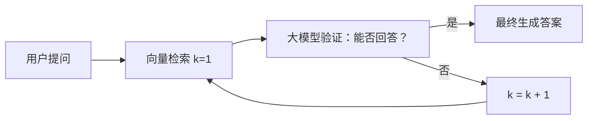
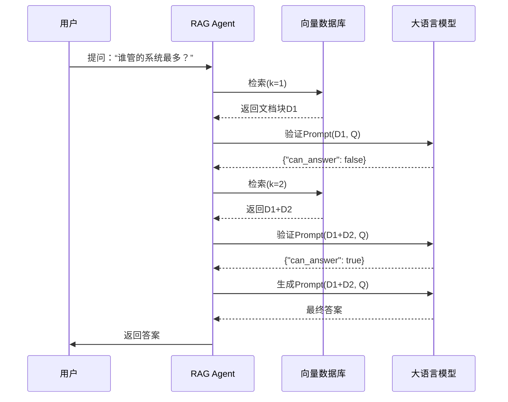
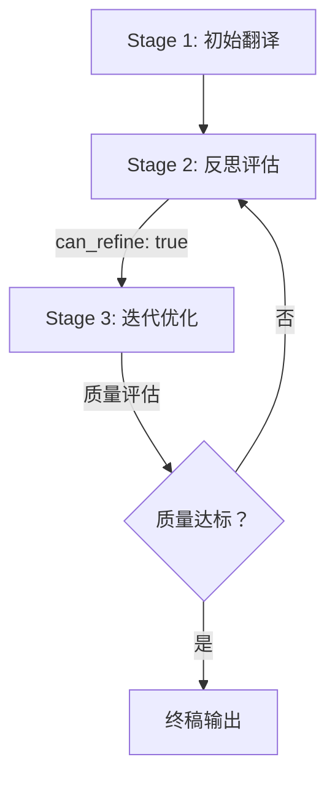
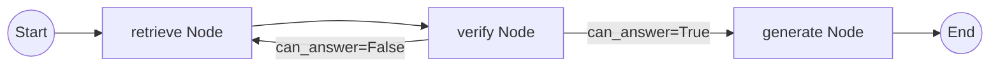

# Agent开发实战：基于LangGraph的RAG增强型Agent开发实践：循环反思机制与翻译智能体实现


## 一、引言：为何需要Agent？——传统RAG的固有缺陷与智能体范式的革命性突破

在人工智能应用工程实践中，**检索增强生成（Retrieval-Augmented Generation, RAG）** 已成为知识密集型问答系统的核心架构。然而，如视频中所演示的经典RAG流程存在一个根本性局限：**单次向量检索的“静态匹配”无法保证语义充分性**。当用户提问“谁管的系统最多？”时，传统RAG仅执行一次相似度搜索（k=1），返回最邻近的文本块（如“微服务部署规范”），而真正蕴含答案的“业务负责人”章节因余弦相似度略低而被遗漏。大模型基于错误上下文作答，只能输出“我不知道”。

> **技术本质剖析**：  
> 向量检索的本质是**高维空间中的近似最近邻搜索（Approximate Nearest Neighbor, ANN）**，其结果受嵌入模型能力、分块策略、查询改写质量等多重因素制约。它不理解“问题意图”，也不具备“验证-修正”的元认知能力。

Agent（智能体）范式正是为解决此问题而生。其核心思想并非替代RAG，而是**将RAG封装为可调用的工具，并赋予系统自主规划、反思、迭代与决策的能力**。视频中提出的“RAG Agent”即是一个典型范例：它构建了一个**闭环控制回路（Closed-loop Control Loop）**，通过循环执行“检索→验证→决策”三步，直至满足终止条件。这标志着AI系统从“被动响应”迈向“主动求解”的范式跃迁。



## 二、RAG Agent核心机制详解：循环验证架构的工程实现

### 1、循环验证（Iterative Verification）——Agent的“大脑”

RAG Agent的智能性集中体现在其**验证-决策循环**。该机制包含三个关键组件：

#### 1.动态检索器（Dynamic Retriever）

- **功能**：根据当前循环次数`k`，动态调整检索范围。

- **实现逻辑**：首次检索1个文本块（k=1），第二次检索2个（k=2），依此类推，直至k=15。

- **技术价值**：避免了“一刀切”的固定k值，以渐进式扩大搜索半径，平衡精度与效率。

- **代码示意**：

  ```python
  def dynamic_retrieve(query: str, k: int) -> List[Document]:
      # 使用LangChain的VectorStore.similarity_search_with_score
      docs = vectorstore.similarity_search_with_score(query, k=k)
      return docs
  ```

#### 2.反思验证器（Reflective Verifier）

- **功能**：作为Agent的“批判性思维模块”，判断当前检索到的上下文是否足以支撑答案生成。

- **提示工程（Prompt Engineering）**：这是成败关键。系统提示语（System Prompt）需强制模型输出结构化JSON，而非自由文本。

  ```text
  你是一个严谨的知识验证专家。请严格依据以下规则执行：
  1. 仔细阅读提供的上下文（context）和用户问题（question）。
  2. 判断上下文是否包含直接、明确、无歧义地回答该问题所需的所有信息。
  3. 若能回答，仅输出：{"can_answer": true}
  4. 若不能回答（信息缺失、模糊、矛盾或无关），仅输出：{"can_answer": false}
  5. 禁止任何额外解释、说明或格式。
  ```

- **结构化输出优势**：`{"can_answer": true/false}` 可被Python程序直接`json.loads()`解析，实现确定性分支控制，杜绝了自然语言输出的不可靠性。

#### 3.循环控制器（Loop Controller）

- **功能**：协调整个流程，管理状态与退出条件。

- **核心参数**：

  - `max_iterations = 15`：硬性安全阈值，防止无限循环。
  - `k = 1`：初始检索粒度。

- **状态流转逻辑**：

  ```python
  k = 1
  for iteration in range(1, max_iterations + 1):
      print(f"第{iteration}次检索...")
      docs = dynamic_retrieve(user_query, k=k)
      context = "\n\n".join([doc.page_content for doc in docs])
      
      # 构造验证Prompt
      verification_prompt = f"""<system>...上述系统提示...</system>
      <context>{context}</context>
      <question>{user_query}</question>"""
      
      response = llm.invoke(verification_prompt)
      result = json.loads(response.content)
      
      if result["can_answer"]:
          print("可以回答问题，开始最终生成...")
          break
      else:
          k += 1  # 增加检索广度
  ```

>  **关键洞察**：Agent的“智能”并非来自模型本身，而是源于**精心设计的控制逻辑与提示工程的协同**。它将大模型的“黑盒推理”转化为可编程、可验证、可中断的确定性流程。

### 2、状态管理与上下文传递——Agent的“记忆”

在循环过程中，Agent需维护两个核心状态：

- **检索状态（k值）**：记录当前搜索广度，驱动下一轮检索。
- **上下文状态（Context）**：每次检索返回的文档块集合，作为验证与最终生成的输入。

采用`List[Message]`结构存储对话历史，是一种轻量级状态管理方案。其优势在于：

- **天然支持多轮对话**：`messages[-1]`即最新回复，`messages[-2]`即上一轮用户输入。
- **与LLM API无缝集成**：OpenAI等接口原生支持`messages`列表格式。
- **隐式上下文压缩**：无需手动拼接，历史消息自动构成上下文。



## 三、Translation Agent深度解析：反思工作流（Reflection Workflow）的典范

吴文达教授开源的Translation Agent是反思工作流的教科书级实现。它完美模拟了人类专业译者的思维过程，其三层架构揭示了高质量Agent的设计哲学。

### 1、三层反思工作流（Three-Stage Reflection Workflow）

| 阶段        | 名称                              | 核心任务                     | 模型角色   | 输出                   |
| ----------- | --------------------------------- | ---------------------------- | ---------- | ---------------------- |
| **Stage 1** | 初始翻译（Initial Translation）   | 将源文本直译为目标语言       | “初级译员” | 初稿译文               |
| **Stage 2** | 反思评估（Reflection & Critique） | 批判性分析初稿，识别所有问题 | “资深审校” | 结构化修改意见（JSON） |
| **Stage 3** | 迭代优化（Iterative Refinement）  | 基于审校意见重译，提升质量   | “精修译者” | 终稿译文               |

> **设计精妙之处**：每个阶段均由独立的、角色化的提示语（Role-Prompting）驱动，确保模型在特定心智模型下工作，极大提升了输出稳定性与专业性。

### 2、提示语工程（Prompt Engineering）的范式实践

#### 1.Stage 1：初始翻译提示语

```text
你是一位精通[源语言]与[目标语言]的专业翻译家。你的任务是准确、流畅地将以下[源语言]文本翻译成[目标语言]。请严格遵循：
- 忠实原文含义，不增不减。
- 使用符合[目标国家]语言习惯的地道表达。
- 保持原文风格（如诗歌需押韵，技术文档需术语统一）。
<Source Text>[原文]</Source Text>
```

*作用：锚定模型角色，设定基础约束。*

#### 2.Stage 2：反思评估提示语（核心难点）

```text
你是一位拥有20年经验的[目标语言]文学编辑。请对以下翻译进行专业审校：
1. 逐句检查：是否存在事实性错误、文化误读、术语不一致？
2. 语言质量：是否通顺自然？有无冗余、拗口、标点错误？
3. 风格适配：是否符合[目标国家]读者的阅读习惯与审美？
4. 输出要求：仅输出一个JSON对象，包含键"issues"（字符串数组，列出所有问题）和"severity"（整数，1-5，5为最严重）。
<Source Text>[原文]</Source Text>
<Translation>[初稿]</Translation>
```

*作用：提供可操作的检查清单，强制结构化输出，为Stage 3提供精准指令。*

#### 3.Stage 3：迭代优化提示语

```text
你是一位追求极致的[目标语言]诗人/作家。请基于以下审校意见，对初稿进行彻底重译：
- 严格解决所有"issues"中列出的问题。
- 在修正错误的同时，大幅提升语言的艺术性与感染力。
- 最终译文必须是一首符合中文古诗格律（五言绝句）的佳作。
<Source Text>[原文]</Source Text>
<Critique>{"issues": ["未体现'床前明月光'的静谧感", "'疑是地上霜'意象转化生硬"], "severity": 4}</Critique>
<Initial Translation>[初稿]</Initial Translation>
```

*作用：将抽象批评转化为具体、可执行的创作指令，驱动质量飞跃。*

### 3、Translation Agent的局限性与演进方向

尽管效果卓越，其仍存在现实约束：

- **模型依赖性强**：高度依赖GPT-4等顶级模型的推理与创作能力，小模型（如7B参数）难以胜任Stage 2的深度批判。
- **流程刚性**：当前为固定三步链式（Chain），缺乏动态循环。理想状态应加入“质量门控”：若Stage 3输出仍不达标，则自动触发新一轮Stage 2评估。
- **领域泛化弱**：通用提示语在法律、医学等专业领域表现不佳，需注入领域知识库与术语表。



*图3：增强版Translation Agent——引入质量反馈循环的动态架构。虚线箭头代表可选的自我优化路径。*

## 四、LangGraph框架：构建复杂Agent的工业化基石

当Agent逻辑日益复杂，手写循环与状态管理将变得脆弱且难以维护。LangGraph的出现，标志着Agent开发从“手工艺”迈向“工业化”。

### 1、LangGraph三大核心概念：有向有环图（DAG）的工程化表达

| 概念      | 定义                                                         | 类比             | 关键特性                                 |
| --------- | ------------------------------------------------------------ | ---------------- | ---------------------------------------- |
| **State** | 存储Agent运行时所有数据的容器（如`messages`, `k`, `documents`）。 | “中央数据库”     | 所有节点共享同一份状态，实现数据一致性。 |
| **Node**  | 一个纯函数，接收`State`，执行特定计算（如调用LLM、查询数据库），并返回更新后的`State`。 | “流水线上的工人” | 职责单一，可复用、可测试、可并行。       |
| **Edge**  | 定义节点间流转的规则。分为：<br>- **普通边**：无条件流转（A→B）<br>- **条件边**：根据`State`中某字段值决定流向（如`if state['can_answer']: goto 'generate' else: goto 'retrieve'`） | “智能交通信号灯” | 实现动态、分支、循环等复杂控制流。       |

>  **范式革命**：LangGraph将Agent视为一个**状态机（State Machine）**，其行为完全由`State`与`Edge`规则定义。开发者不再关注“如何跳转”，只需声明“在什么状态下跳转到哪里”。

### 2、基于LangGraph重构RAG Agent：从代码到图谱

使用LangGraph，RAG Agent的实现被解耦为清晰的组件：

```python
# 1. 定义State
class GraphState(TypedDict):
    messages: List[BaseMessage]
    k: int
    documents: List[Document]
    can_answer: bool

# 2. 定义Nodes
def retrieve_node(state: GraphState) -> GraphState:
    # 执行向量检索，更新state['documents']和state['k']
    return state

def verify_node(state: GraphState) -> GraphState:
    # 调用LLM验证，更新state['can_answer']
    return state

def generate_node(state: GraphState) -> GraphState:
    # 最终生成答案
    return state

# 3. 定义Edges (条件边)
def decide_to_generate(state: GraphState) -> Literal["generate", "retrieve"]:
    return "generate" if state["can_answer"] else "retrieve"

# 4. 构建Graph
workflow = StateGraph(GraphState)
workflow.add_node("retrieve", retrieve_node)
workflow.add_node("verify", verify_node)
workflow.add_node("generate", generate_node)

workflow.set_entry_point("retrieve")
workflow.add_edge("retrieve", "verify")
workflow.add_conditional_edges(
    "verify",
    decide_to_generate,
    {
        "generate": "generate",
        "retrieve": "retrieve"  # 形成循环！
    }
)
workflow.add_edge("generate", END)

app = workflow.compile()
```



*图4：LangGraph实现的RAG Agent有向有环图（DAG）。红色循环边直观体现了Agent的自主迭代能力，这是传统DAG（有向无环图）无法表达的。*

### 3、LangGraph vs. 传统Chain：架构级差异对比

| 维度         | LangChain Chain          | LangGraph                      |
| ------------ | ------------------------ | ------------------------------ |
| **图结构**   | 有向无环图（DAG）        | 有向有环图（DAG + Cycle）      |
| **控制流**   | 线性、单向、不可回溯     | 支持分支、循环、并行、回溯     |
| **状态管理** | 无内置状态，需手动传递   | 内置全局`State`，所有节点共享  |
| **错误处理** | 任一节点失败，整条链中断 | 可设计“降级路径”或“重试节点”   |
| **可扩展性** | 添加新步骤需重构链       | 新增`Node`与`Edge`即可，零侵入 |

> **工程启示**：LangGraph不是简单的语法糖，而是为Agent这一新型软件范式提供了**第一性原理的架构支撑**。它让“让AI自己思考”这一宏大愿景，拥有了可落地、可维护、可规模化的企业级工程底座。

## 五、总结与展望：Agent开发的未来之路

本节内容系统性地解构了从零构建RAG Agent、Translation Agent，并最终升维至LangGraph框架的完整技术路径。其核心脉络可凝练为：

1. **问题驱动**：一切Agent设计始于对传统方法（如RAG）缺陷的深刻洞察。
2. **范式升级**：Agent = 工具调用（Tool Calling） + 规划（Planning） + 记忆（Memory） + 反思（Reflection）。
3. **工程深化**：从手写循环（Video Part 1）到框架化（LangGraph），是应对复杂性的必然选择。
4. **人机协同**：最强大的Agent，是将人类专家知识（如翻译审校标准）精准编码为提示语与工作流。

未来，Agent开发将向三个方向纵深发展：

- **多智能体协作（Multi-Agent Systems）**：不同专业Agent（检索Agent、验证Agent、生成Agent）组成“AI团队”，分工协作。
- **自主工具学习（Autonomous Tool Learning）**：Agent能动态发现、理解、调用未知API，突破预设工具集限制。
- **神经符号融合（Neuro-Symbolic Integration）**：将大模型的泛化能力与符号逻辑的精确推理结合，攻克数学证明、代码生成等硬核任务。

Agent开发已不仅是算法工程师的专属领域，更是每一位希望驾驭AI力量的开发者的必修课。掌握其内核，方能在AI原生应用的浪潮中，立于不败之地。


