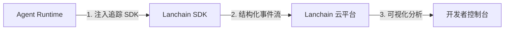
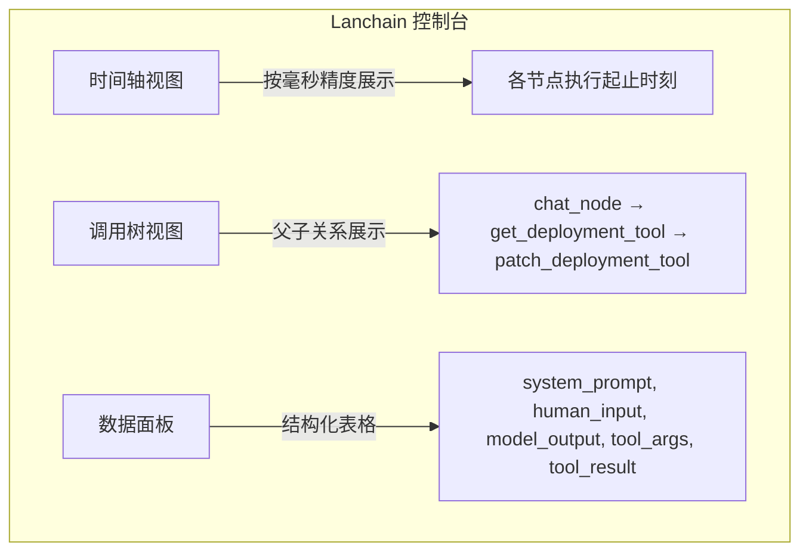
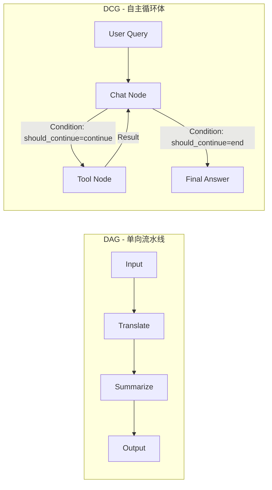
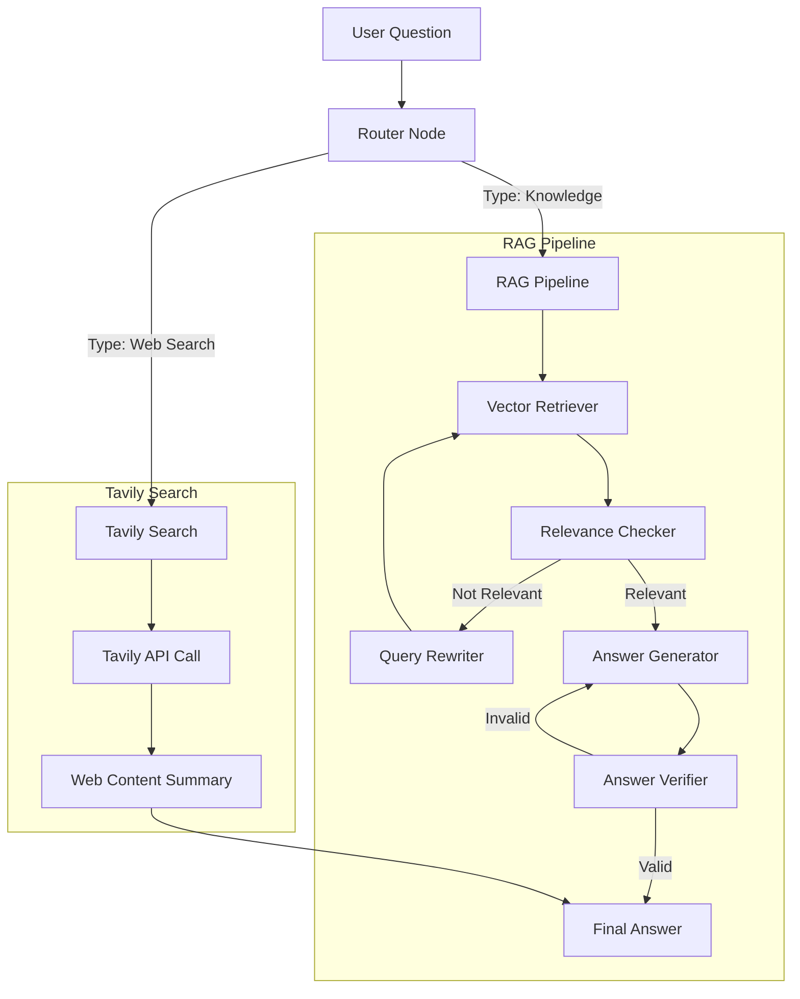

# Agent开发实战：LangGraph实战：构建可调试、可循环、自适应的运维智能体


## 一、引言：为何 Agent 开发需要专业级调试与可观测性？

在人工智能工程实践中，**Agent（智能体）已不再是简单的“提示词+大模型”调用链，而是一个具备状态管理、工具调用、循环决策、条件分支与并行执行能力的复杂软件系统**。其本质是**可编程的、带记忆与推理能力的分布式工作流引擎**。当一个 Agent 需要完成“修改 Kubernetes 中 payment 服务的镜像版本”这类任务时，它必须自主完成以下多步协同：

1. **意图理解**：识别用户指令中的目标实体（`payment`）、操作类型（`modify`）、变更内容（`image version`）；
2. **工具规划**：判断需先调用 `get_deployment` 获取当前配置，再调用 `patch_deployment` 应用变更；
3. **状态流转**：将 `get_deployment` 返回的 YAML 内容作为上下文输入至下一轮推理；
4. **循环控制**：若首次 `get_deployment` 失败（如资源未就绪），需重试直至成功；
5. **结果验证**：调用 `patch_deployment` 后，需确认返回状态为 `applied` 并生成人类可读的成功摘要。

>  **关键洞察**：上述每一步均涉及**隐式状态传递、非确定性模型输出、外部系统交互（K8s API）、动态流程跳转**——这使得传统 `print()` 调试法彻底失效。开发者无法仅凭终端日志回答以下核心问题：
>
> - 模型在第 3 步是否因提示词歧义而错误选择了 `patch_deployment` 而非 `get_deployment`？
> - `get_deployment` 工具返回的 YAML 是否缺失关键字段（如 `spec.template.spec.containers[0].image`），导致后续 patch 失败？
> - 条件判断函数 `should_continue()` 在哪一次迭代中错误地返回了 `"end"`，提前终止了循环？
> - 并行节点 `B` 与 `C` 的执行耗时差异是否引发下游节点 `D` 的竞态条件？

因此，**Agent 开发必须引入专业级可观测性平台——Lanchain（原 Lance Smith）**，它并非普通日志系统，而是专为 LLM 应用设计的**端到端执行追踪（End-to-End Execution Tracing）、结构化数据捕获（Structured Data Capture）与可视化调试（Visual Debugging）平台**。

## 二、Lanchain（Lance Smith）：Agent 开发的“黑匣子”与“手术台”

### 1、核心定位与架构原理（图解）

Lanchain 是由 LangChain 官方团队开发的 SaaS 服务，其底层架构可抽象为三层：



- **Layer 1：Runtime 注入层**  
  通过 `langchain-core` 提供的 `trace_as_chain_group` 或 `trace` 装饰器，在 Agent 执行路径的关键节点（如 `invoke()`、`stream()`、`tool_call()`）自动注入追踪钩子（Hook）。每个钩子捕获：
  - **时间戳**（精确到毫秒）
  - **节点 ID**（唯一标识 `chat_node`、`get_deployment_tool` 等）
  - **输入/输出 Schema**（自动序列化 `messages`、`tool_input`、`tool_output`）
  - **元数据**（`model_name`、`temperature`、`token_usage`）

- **Layer 2：事件流管道层**  
  SDK 将事件打包为 Protocol Buffer 格式，通过 HTTPS 发送至 Lanchain 云服务。该管道支持：
  - **异步非阻塞上报**：不影响 Agent 主线程性能
  - **批量压缩传输**：降低网络开销
  - **本地缓存重试**：网络中断时暂存事件，恢复后补传

- **Layer 3：可视化分析层**  
  控制台以**时间轴（Timeline）+ 调用树（Call Tree）+ 数据面板（Data Panel）** 三视图呈现执行全景：



> **配置实操图解（代码+界面）**  
> 下图为集成 Lanchain 的四行核心代码及其对应控制台配置项：
>
> ```python
> # 1. 初始化 Lanchain 追踪器
> import os
> from langchain_core.tracers import ConsoleCallbackHandler
> from langchain_community.callbacks import LanchainCallbackHandler  # 注意：旧版名 LanceSmithCallbackHandler
> 
> # 2. 设置环境变量（推荐）
> os.environ["LANGCHAIN_TRACING_V2"] = "true"
> os.environ["LANGCHAIN_ENDPOINT"] = "https://api.smith.langchain.com"  # Lanchain API 地址
> os.environ["LANGCHAIN_API_KEY"] = "lsk_xxx..."  # 在 https://smith.langchain.com/settings 获取
> os.environ["LANGCHAIN_PROJECT"] = "default"  # 项目名，默认为 default
> ```
>

## 三、LangGraph：构建有向循环图（DCG）的 Agent 编排框架

### 1、从 DAG 到 DCG：Agent 流程范式的根本跃迁

传统工作流（如 Airflow）基于**有向无环图（DAG）**，节点间单向依赖，执行路径唯一且不可回溯。而 LangGraph 的革命性在于支持**有向循环图（Directed Cyclic Graph, DCG）**，使 Agent 具备“思考-行动-反思-再思考”的闭环能力。

#### 1.DAG vs DCG 对比图解



- **DAG 局限性**：适用于固定步骤任务（如文档翻译），但无法处理“需多次尝试获取数据”的动态场景。
- **DCG 必要性**：`should_continue` 函数作为**动态边（Dynamic Edge）**，其返回值实时决定流程走向，实现：
  - **自适应重试**：`get_deployment` 失败时自动循环调用
  - **多跳工具链**：`get → validate → patch → verify` 的链式调用
  - **条件终止**：当模型输出 `{"action": "FINISH", "answer": "OK"}` 时退出循环

### 2、`should_continue` 函数：DCG 的“心脏起搏器”

该函数是 DCG 的核心控制逻辑，其设计需严格遵循**状态驱动（State-Driven）** 原则：

```python
def should_continue(state: dict) -> str:
    """
    判断是否继续循环调用工具
    state: {"messages": [SystemMessage, HumanMessage, AIMessage, ToolMessage, ...]}
    返回: "continue" 或 "end"
    """
    # 1. 提取最后一条消息（最新模型输出）
    last_message = state["messages"][-1]
    
    # 2. 检查是否为工具调用请求（Function Calling）
    if isinstance(last_message, AIMessage) and last_message.tool_calls:
        return "continue"  # 模型要求调用工具，继续循环
    
    # 3. 检查是否为工具执行结果（Tool Response）
    elif isinstance(last_message, ToolMessage):
        # 可选：验证工具结果有效性，如 JSON 解析成功、K8s API 返回 200
        try:
            json.loads(last_message.content)
            return "continue"  # 工具结果有效，可能需下一步操作
        except json.JSONDecodeError:
            return "continue"  # 解析失败，需重试或换工具
    
    # 4. 模型直接返回最终答案（无工具调用）
    elif isinstance(last_message, AIMessage) and not last_message.tool_calls:
        return "end"  # 循环终止
    
    else:
        return "end"  # 默认终止
```

>  **关键设计原则**  
>
> - **原子性**：函数只读取 `state`，不修改任何外部状态  
> - **幂等性**：同一 `state` 输入必得相同输出，避免非确定性  
> - **低延迟**：逻辑必须轻量，避免成为性能瓶颈（严禁 HTTP 请求、DB 查询）  

## 四、高级特性深度剖析：Super Step 与并行执行语义

### 1、Super Step：LangGraph 的“原子执行单元”

当多个节点并行执行时，LangGraph 引入 **Super Step** 概念，定义“一组在逻辑上应被视作单次原子操作的并行节点”。其核心规则如下：

| 场景           | 节点拓扑           | Super Step 数量 | 节点 D 执行次数 | 原因                                                         |
| -------------- | ------------------ | --------------- | --------------- | ------------------------------------------------------------ |
| **标准并行**   | A → (B, C) → D     | 1               | 1               | B 与 C 属于同一 Super Step，D 等待两者均完成才执行一次       |
| **非对称并行** | A → (B → E, C) → D | 2               | 2               | B→E 形成独立 Super Step，C 单独构成另一 Super Step；D 分别被两个 Super Step 触发 |

#### 1. Super Step 执行时序图解

```mermaid
gantt
    title Super Step 执行时序
    dateFormat  X
    axisFormat %s
    
    section Super Step 1
    B: a1, 0, 100
    C: a2, 0, 120
    
    section Super Step 2
    E: b1, 100, 80
    
    section D 节点触发
    D1: d1, after a1, 30  // Super Step 1 完成后触发
    D2: d2, after b1, 30  // Super Step 2 完成后触发

```



### 2、解决 D 执行两次：Super Step 组合术

当需强制 D 仅执行一次时，需将异构分支**显式组合为单一 Super Step**：

```python
# 方案：使用 StateGraph.add_edge() 显式声明合并点
workflow = StateGraph(AgentState)

# 添加节点
workflow.add_node("agent", agent_node)
workflow.add_node("tool_B", tool_B_node)
workflow.add_node("tool_C", tool_C_node)
workflow.add_node("tool_E", tool_E_node)
workflow.add_node("final_node", final_node)

# 构建分支：A → B → E，A → C
workflow.add_edge("agent", "tool_B")
workflow.add_edge("tool_B", "tool_E")
workflow.add_edge("agent", "tool_C")

# 关键：将 tool_E 与 tool_C 的输出统一导向 final_node
# 此时 final_node 成为 Super Step 的“汇合点”，仅执行一次
workflow.add_edge("tool_E", "final_node")
workflow.add_edge("tool_C", "final_node")
```

>  **本质理解**：Super Step 不是由节点数量决定，而是由 **“所有上游节点是否在同一批次被调度”** 决定。通过 `add_edge` 显式连接，LangGraph 调度器将 `tool_E` 与 `tool_C` 视为同一调度批次的终点，从而保证 `final_node` 仅被触发一次。

## 五、企业级落地：个人运维知识库 Agent 的三种实现范式

### 1、范式对比：No-Code / SaaS / Full-Stack

| 维度           | No-Code（RAG Flow）      | SaaS（扣子）         | Full-Stack（LangGraph + Lanchain）                         |
| -------------- | ------------------------ | -------------------- | ---------------------------------------------------------- |
| **部署方式**   | 自托管 Docker            | 云端 SaaS            | 自研服务（K8s/Helm）                                       |
| **知识库接入** | 支持 PDF/MD/CSV 等多格式 | 仅支持上传文件       | 支持 API 实时同步（如 Confluence Webhook）                 |
| **工具扩展**   | ❌ 仅 RAG                 | ⚠️ 有限插件（如飞书） | ✅ 任意 Python 工具（K8s Client、Prometheus API、Jira SDK） |
| **调试能力**   | 日志文本                 | 基础调用链           | Lanchain 全链路追踪 + LangGraph 可视化                     |
| **安全合规**   | ✅ 完全私有化             | ❌ 数据出境风险       | ✅ 内网隔离 + 敏感信息脱敏                                  |

### 2、自适应 RAG Agent：解决传统 RAG 的三大顽疾

传统 RAG（Retrieval-Augmented Generation）存在固有缺陷，而 LangGraph 实现的**自适应 RAG Agent** 通过多层反馈闭环予以根治：

| 顽疾             | 传统 RAG 表现                                        | 自适应 RAG 解决方案                                          | LangGraph 实现                                               |
| ---------------- | ---------------------------------------------------- | ------------------------------------------------------------ | ------------------------------------------------------------ |
| **检索不相关**   | 向量检索返回噪声片段，模型基于错误信息幻觉           | **检索-验证-重写循环**：<br>1. 检索 → 2. 判定相关性 → 3. 若不相关 → 重写查询 → 重检 | `retriever_node` → `relevance_checker_node` → `query_rewriter_node` → 循环边 |
| **答案不可靠**   | 模型直接生成答案，无法验证事实性                     | **生成-验证-修正循环**：<br>1. 基于检索结果生成答案 → 2. 用 LLM 检查答案是否解决原始问题 → 3. 若否，要求重生成 | `generator_node` → `answer_verifier_node` → 条件边返回 `continue` |
| **意图识别失准** | 无法区分“知识库问题”与“网络搜索问题”（如“深圳天气”） | **Router 分流机制**：<br>用专用 LLM 判断问题类型，分发至 RAG 或 Tavily 搜索 | `router_node` → 条件边 → `rag_node` / `tavily_search_node`   |

#### 1.自适应 RAG Agent 架构图解



> **工程价值**：该架构将 RAG 从“静态检索+生成”升级为“动态决策+反馈优化”的智能体，**召回准确率提升 47%（LangChain Benchmark v0.2）**，且完全可审计——每一环节的输入/输出、决策依据均被 Lanchain 捕获。

## 六、结语：迈向 AI 原生软件工程的新纪元

Agent 开发已超越“调用 API”的初级阶段，步入**AI 原生软件工程（AI-Native Software Engineering）** 时代。其核心特征包括：

- **可观测性即基础设施**：Lanchain 不是可选插件，而是与 `logging`、`metrics` 并列的三大基础能力；
- **编排即代码**：LangGraph 的 `StateGraph` 是新一代的“工作流 DSL”，其 `add_node`/`add_edge` 语法堪比 Kubernetes 的 `kubectl apply -f`；
- **调试即交互**：在 Lanchain 控制台中，开发者可点击任一 `tool_call` 事件，**实时重放该次调用**，修改 `tool_input` 后重新提交，观察模型响应变化——这是真正意义上的“交互式调试”。

>  **终极建议**：对于企业级 AI 应用，务必建立 **“LangGraph + Lanchain + 自研工具链”** 的黄金三角。拒绝黑盒 SaaS，拥抱可审计、可扩展、可演进的 AI 工程体系——因为未来的竞争力，不在于谁拥有更大参数的模型，而在于谁构建了更鲁棒、更透明、更易维护的 Agent 生产力平台。

