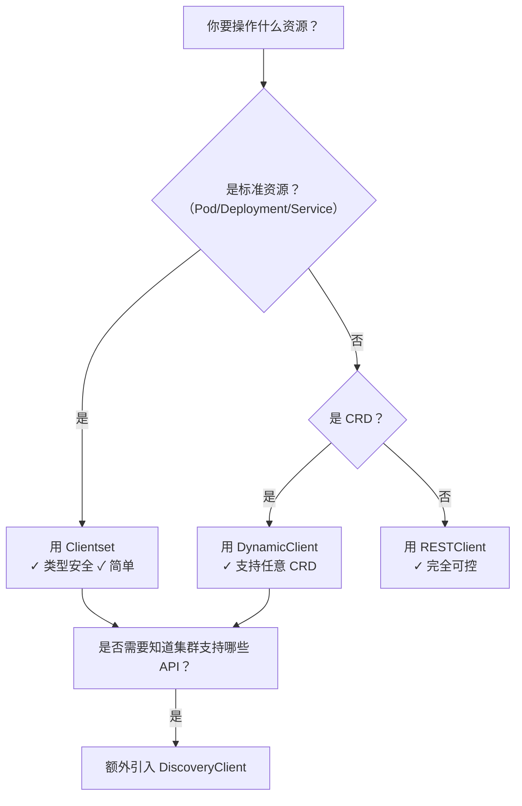

# Kubernetes 客户端开发入门：Client-go 核心原理与集群内外认证实践


## 一、什么是 `client-go`？—— Kubernetes 的“Go 语言遥控器”

### 1、核心定义

`client-go` 是 **Kubernetes 官方维护的 Go 语言 SDK（软件开发工具包）**，它不是命令行工具，也不是图形界面，而是一套**预封装好的 Go 代码库**。您可以把它想象成一台“智能遥控器”：

- 您无需手动拼接 HTTP 请求 URL；
- 无需自己解析 JSON 响应并转换为 Go 结构体；
- 无需手写 TLS 证书校验逻辑；
- 无需管理 Token 过期与刷新；
- 只需调用几个清晰命名的函数（如 `List()`、`Get()`、`Watch()`），即可完成对集群的全部操作。

>  **关键比喻**：  
> `kubectl` 是给运维人员用的“图形遥控器”（有按钮、有屏幕、有反馈）；  
> `client-go` 是给开发者用的“红外协议芯片”（嵌入到您的程序中，让您的程序成为 Kubernetes 的“智能终端”）。

### 2、为什么必须用 `client-go`？—— 手动调 API 的灾难性代价

| 操作步骤     | 手动实现（纯 HTTP）                                          | 使用 `client-go`                                             |
| ------------ | ------------------------------------------------------------ | ------------------------------------------------------------ |
| **认证**     | 需读取 `~/.kube/config`，解析 YAML，提取 `user.auth-provider.config.token` 或 `client-certificate-data`，Base64 解码，写入 HTTP Header | 一行代码 `rest.InClusterConfig()` 自动完成全部流程           |
| **序列化**   | 接收 JSON → 手动定义 `struct` → 用 `json.Unmarshal()` 映射 → 处理嵌套字段、空值、类型不匹配 | 内置 `Scheme` 注册机制，自动将 `v1.PodList` 与 API 返回 JSON 一一对应 |
| **错误处理** | 需判断 HTTP 状态码（401/403/404/500）、解析 Kubernetes 特有 `Status` 对象、区分业务错误与网络错误 | 统一返回 `error` 类型，`errors.IsNotFound()` 等工具函数开箱即用 |
| **版本兼容** | v1.22 API 与 v1.28 字段不同，需为每个版本维护独立代码分支    | `Scheme` 支持多 GroupVersion 注册，自动路由到正确编解码器    |

**图解：`client-go` 在 Kubernetes 生态中的定位**  

```
┌──────────────────────────────────────────────────────────────┐
│                您的 Go 应用程序（例如 Operator）                 │
│  ┌─────────────────────────────────────────────────────────┐  │
│  │           client-go SDK（遥控器芯片）                     │  │
│  │  ┌───────────────────────────────────────────────────┐  │  │
│  │  │   REST Client（HTTP 封装层）                        │  │  │
│  │  │   ┌─────────────────────────────────────────────┐ │  │  │
│  │  │   │   Scheme（数据模型注册中心）                    │ │  │  │
│  │  │   │   ├─ v1.CoreGroup（Pod/Namespace/Service）   │ │  │  │
│  │  │   │   ├─ apps/v1（Deployment/ReplicaSet）        │ │  │  │
│  │  │   │   └─ networking.k8s.io/v1（Ingress）         │ │  │  │
│  │  │   └─────────────────────────────────────────────┘ │  │  │
│  │  └───────────────────────────────────────────────────┘  │  │
│  └─────────────────────────────────────────────────────────┘  │
└───────────────────────────────────────────────────────────────┘
                              ↓ HTTPS/TLS
┌───────────────────────────────────────────────────────────────┐
│                Kubernetes API Server（集群大脑）                │
│  ┌─────────────────────────────────────────────────────────┐  │
│  │  etcd（持久化存储） ←─ 存储所有 Pod/Deployment 状态         │  │
│  └─────────────────────────────────────────────────────────┘  │
└───────────────────────────────────────────────────────────────┘
```

## 二、Kubernetes API 设计基石：GVK 与 GVR 模型（必须掌握的元概念）

Kubernetes 所有资源操作本质都是 **RESTful HTTP 请求**。但其 URL 设计高度结构化，由三个核心维度构成：

### 1、GVK：资源的“身份证号”（GroupVersionKind）

| 字段        | 含义             | 示例                                                         | 说明                                                         |
| ----------- | ---------------- | ------------------------------------------------------------ | ------------------------------------------------------------ |
| **Group**   | 资源所属功能分组 | `""`（空字符串 = core group）<br>`apps`<br>`networking.k8s.io` | `core` 组含基础资源（Pod/Node/Service）；`apps` 组含工作负载（Deployment）；`networking.k8s.io` 含网络策略 |
| **Version** | API 版本号       | `v1`<br>`v1beta1`                                            | `v1` 表示稳定版；`v1beta1` 表示测试版（可能被废弃）          |
| **Kind**    | 资源具体类型     | `Pod`<br>`Deployment`<br>`Ingress`                           | **注意**：`Kind` 是首字母大写的类型名，与 YAML 中 `kind: Deployment` 完全一致 |

#### 1.**验证方式（终端实操）**：

```bash
# 查看 Pod（core group, v1, Pod）
kubectl get pods -v=6 2>&1 | grep "GET"
# 输出：GET https://192.168.49.2:8443/api/v1/namespaces/default/pods

# 查看 Deployment（apps group, v1, Deployment）
kubectl get deployments -v=6 2>&1 | grep "GET"  
# 输出：GET https://192.168.49.2:8443/apis/apps/v1/namespaces/default/deployments
```

> **URL 规律总结**：  
>
> - Core Group → `/api/{version}/...` （无 `apis/`）  
> - Named Group → `/apis/{group}/{version}/...` （必含 `apis/`）

### 2、GVR：资源的“操作路径”（GroupVersionResource）

当执行 `kubectl get deployment` 时，`client-go` 会将 `GVK`（`apps/v1/Deployment`）**自动转换为 GVR**（`apps/v1/deployments`）：

- `Kind=Deployment` → `Resource=deployments`（复数小写形式）
- 此 `Resource` 直接作为 URL 路径的最后一段

📌 **图解：GVK → GVR 转换过程**  

```
┌─────────────────────────────────────────────────────────────────────────────┐
│                            GVK（声明“我是谁”）                                │
│  Group: apps         Version: v1         Kind: Deployment                   │
│                                                                             │
│                                 ↓ 自动转换                                   │
│                                                                             │
│                            GVR（声明“去哪找”）                                │
│  Group: apps         Version: v1         Resource: deployments              │
│                                                                             │
│                                 ↓ 构成 URL                                   │
│                                                                             │
│  https://<API_SERVER>/apis/apps/v1/namespaces/default/deployments           │
└─────────────────────────────────────────────────────────────────────────────┘
```

## 三、`client-go` 四大客户端深度解析（附选型决策树）

`client-go` 提供四种客户端，适用于不同场景：

| 客户端类型          | 适用场景                                                     | 优势                                | 劣势                                          | 代码示例关键词                              |
| ------------------- | ------------------------------------------------------------ | ----------------------------------- | --------------------------------------------- | ------------------------------------------- |
| **Clientset**       | 操作**标准内置资源**（Pod/Deployment/Service）               | 类型安全、IDE 自动补全、文档完善    | **无法操作 CRD（自定义资源）**                | `clientset.CoreV1().Pods(...)`              |
| **DynamicClient**   | 操作**任意资源（含 CRD）**，无需提前定义 Go struct           | 真正的“泛型”支持，Operator 开发必备 | 无类型检查，易出错，需手动处理 `Unstructured` | `dynamicClient.Resource(gvr).List(...)`     |
| **RESTClient**      | 需要**完全控制 HTTP 层**（如自定义 Header、超时）            | 最底层抽象，100% 灵活性             | 无资源语义，需手动拼接 URL 和处理响应         | `restClient.Get().Resource("pods").Do(...)` |
| **DiscoveryClient** | **探测集群能力**（如：哪些 GroupVersion 可用？哪些资源支持 Watch？） | 用于动态适配不同 K8s 版本集群       | 不用于常规 CRUD                               | `discoveryClient.ServerGroups()`            |

**选型决策树（小白速查表）**：



## 四、两种核心认证模式：Out-of-Cluster vs In-Cluster（生产必知）

### 1、方式一：Out-of-Cluster（集群外访问）—— 本地开发调试

- **原理**：读取本地 `~/.kube/config` 文件，提取 `certificate-authority-data`、`client-certificate-data`、`client-key-data` 及 `token`。
- **适用场景**：本地 IDE 调试、CI/CD 流水线脚本、CLI 工具开发。
- **风险警示**：`~/.kube/config` 通常含 **cluster-admin 权限**，**严禁在生产容器中挂载！**

### 2、方式二：In-Cluster（集群内访问）—— Operator/Controller 生产部署

- **原理**：Pod 启动时，Kubernetes **自动注入**以下内容：
  - ✅ 文件 `/var/run/secrets/kubernetes.io/serviceaccount/token`（JWT 访问令牌）
  - ✅ 文件 `/var/run/secrets/kubernetes.io/serviceaccount/ca.crt`（CA 证书）
  - ✅ 环境变量 `KUBERNETES_SERVICE_HOST` + `KUBERNETES_SERVICE_PORT`（API Server 地址）
- **强制要求**：必须为 Pod 关联的 `ServiceAccount` 绑定 `Role`/`ClusterRole`，否则 403 Forbidden！

📌 **图解：In-Cluster 认证自动注入机制**  

```
┌─────────────────────────────────────────────────────────────────────────────┐
│                                Kubernetes Master Node                       │
│  ┌───────────────────────────────────────────────────────────────────────┐  │
│  │  API Server                                                           │  │
│  └───────────────────────────────────────────────────────────────────────┘  │
└─────────────────────────────────────────────────────────────────────────────┘
                                      ↑
                                      │ HTTPS + TLS
                                      ↓
┌─────────────────────────────────────────────────────────────────────────────┐
│                                Your Application Pod                         │
│  ┌───────────────────────────────────────────────────────────────────────┐  │
│  │  /var/run/secrets/kubernetes.io/serviceaccount/                       │  │
│  │    ├── token                 ← JWT Token（有效期1小时）                 │  │
│  │    ├── ca.crt                ← CA Certificate（用于校验API Server）     │  │
│  │    └── namespace             ← Pod 所在命名空间（可选）                  │  │
│  │                                                                       │  │
│  │  Environment Variables:                                               │  │
│  │    KUBERNETES_SERVICE_HOST=10.96.0.1                                  │  │
│  │    KUBERNETES_SERVICE_PORT=443                                        │  │
│  └───────────────────────────────────────────────────────────────────────┘  │
└─────────────────────────────────────────────────────────────────────────────┘
```

> ⚠️ **生产黄金法则**：  
> **永远不要在容器中使用 `~/.kube/config`！**  
> **必须通过 `ServiceAccount` + `RoleBinding` 实施最小权限原则！**

## 五、实战：从零编写一个 Pod 列表程序（含完整可运行代码）

### 1、步骤 1：初始化 Go Module

```bash
mkdir client-go-demo && cd client-go-demo
go mod init client-go-demo
go get k8s.io/client-go@v0.28.0  # 锁定稳定版本
```

### 2、步骤 2：编写 `main.go`（In-Cluster 模式）

```go
package main

import (
	"context"
	"fmt"
	"log"
	"time"

	metav1 "k8s.io/apimachinery/pkg/apis/meta/v1"
	"k8s.io/client-go/kubernetes"
	"k8s.io/client-go/rest"
	"k8s.io/client-go/tools/clientcmd"
)

func main() {
	var config *rest.Config
	var err error

	// 【关键】自动选择认证模式：集群内用 In-Cluster，集群外用 kubeconfig
	if config, err = rest.InClusterConfig(); err != nil {
		// 回退到本地 kubeconfig（仅用于开发）
		config, err = clientcmd.BuildConfigFromFlags("", "/root/.kube/config")
		if err != nil {
			log.Fatal("无法加载配置:", err)
		}
	}

	// 创建 Clientset
	clientset, err := kubernetes.NewForConfig(config)
	if err != nil {
		log.Fatal("创建 Clientset 失败:", err)
	}

	// 列出 default 命名空间下所有 Pod
	pods, err := clientset.CoreV1().Pods("default").List(context.TODO(), metav1.ListOptions{})
	if err != nil {
		log.Fatal("列出 Pod 失败:", err)
	}

	fmt.Printf("共找到 %d 个 Pod:\n", len(pods.Items))
	for i, pod := range pods.Items {
		fmt.Printf("%d. %s (Phase: %s)\n", i+1, pod.Name, pod.Status.Phase)
	}
}
```

### 3、步骤 3：构建 Docker 镜像并部署

```Dockerfile
# Dockerfile
FROM golang:1.21-alpine AS builder
WORKDIR /app
COPY go.mod go.sum ./
RUN go mod download
COPY . .
RUN CGO_ENABLED=0 GOOS=linux go build -a -installsuffix cgo -o client-go-demo .

FROM alpine:latest
RUN apk --no-cache add ca-certificates
WORKDIR /root/
COPY --from=builder /app/client-go-demo .
CMD ["./client-go-demo"]
```

```yaml
# deploy.yaml
apiVersion: apps/v1
kind: Deployment
metadata:
  name: client-go-demo
spec:
  replicas: 1
  selector:
    matchLabels:
      app: client-go-demo
  template:
    metadata:
      labels:
        app: client-go-demo
    spec:
      serviceAccountName: client-go-sa  # 关键：指定 ServiceAccount
      containers:
      - name: demo
        image: your-registry/client-go-demo:latest
        imagePullPolicy: Always
---
# 必须绑定权限！
apiVersion: rbac.authorization.k8s.io/v1
kind: Role
metadata:
  namespace: default
  name: client-go-role
rules:
- apiGroups: [""]
  resources: ["pods"]
  verbs: ["get", "list", "watch"]
---
apiVersion: rbac.authorization.k8s.io/v1
kind: RoleBinding
metadata:
  name: client-go-binding
  namespace: default
subjects:
- kind: ServiceAccount
  name: client-go-sa
  namespace: default
roleRef:
  kind: Role
  name: client-go-role
  apiGroup: rbac.authorization.k8s.io
```

**执行部署**：

```bash
kubectl apply -f deploy.yaml
kubectl logs -l app=client-go-demo  # 查看输出
```

## 六、结语：迈向云原生开发者的坚实一步

`client-go` 是 Kubernetes 生态的“任督二脉”。掌握它，意味着您已具备：

- ✅ 编写自动化运维脚本的能力；
- ✅ 开发企业级 Operator 的基础；
- ✅ 深度集成 Kubernetes 到现有业务系统的实力；
- ✅ 理解云原生控制平面设计哲学的钥匙。

本文所授内容，绝非“API 列表速查”，而是为您构建了一套**可迁移、可扩展、可生产落地**的知识框架。后续模块将深入 `Informer` 事件监听机制、`WorkQueue` 任务调度、`Indexer` 本地缓存等高级主题——它们共同构成了 Kubernetes Controller 的灵魂。

请务必动手完成文中所有代码实验。**真正的理解，永远诞生于键盘敲击与终端日志之间。**