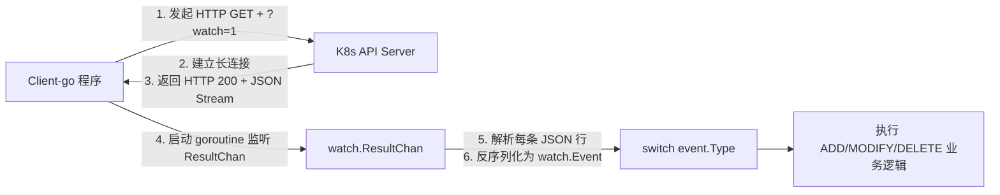
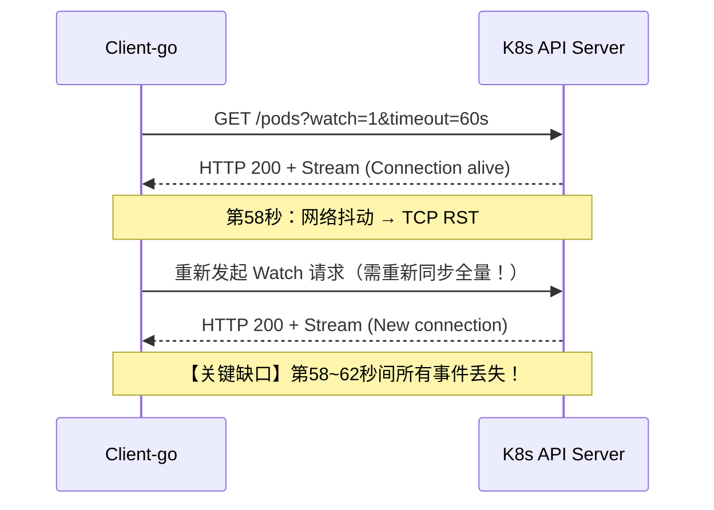
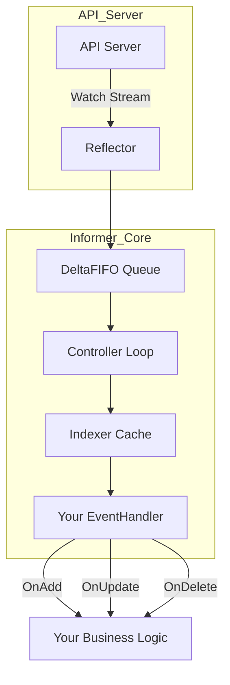
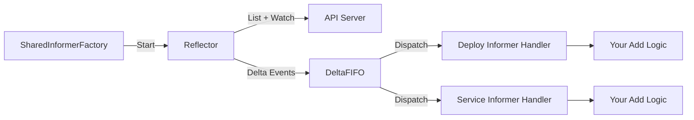
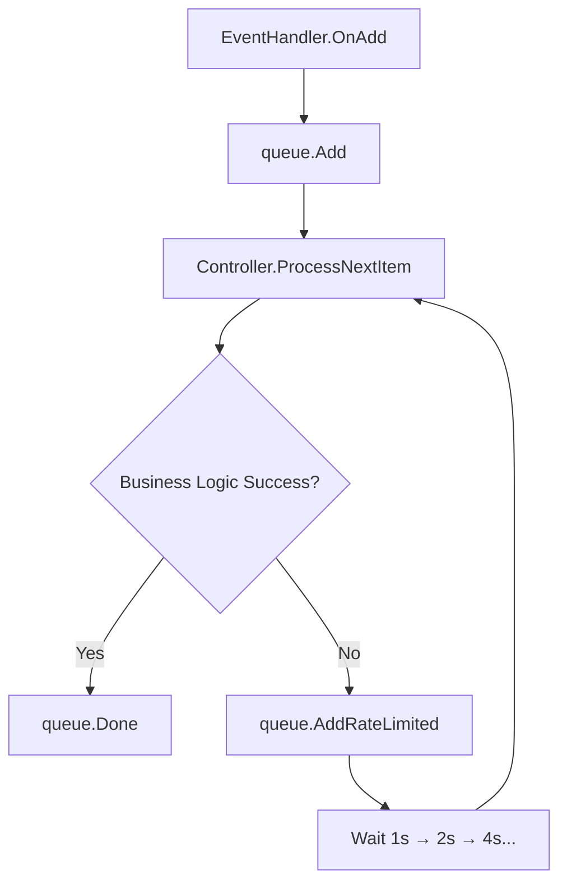
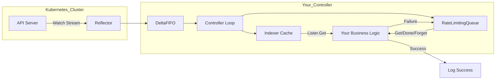

# Kubernetes 客户端事件监听最佳实践：从 Watch 到 Informer + 工作队列的演进


## 一、什么是 Watch？——Kubernetes 资源变更的“实时广播信道”

### 1、定义与类

`Watch` 是 Kubernetes API Server 提供的一种 **长连接流式事件推送机制**。它不是“轮询查询”，而是建立一条 TCP 连接后，服务器主动将后续发生的资源变更（如 Pod 创建、删除、更新）**实时、顺序、不可逆地推送给客户端**。

#### 1.**生活类比**：  

想象你订阅了某快递公司的“物流实时播报”服务。你不需要每分钟打电话问“我的包裹到哪了？”，而是快递公司通过微信/短信，在包裹**每次状态变化时（揽件→运输→派送→签收）自动推送一条消息**给你。`Watch` 就是这个“自动推送通道”。

#### 2.**技术本质**：  

- HTTP 协议层面：使用 `GET /api/v1/pods?watch=1` 发起请求，响应头中包含 `Content-Type: application/json;stream=watch`；
- 数据格式：返回的是一个 JSON 流（JSON Stream），每行是一个独立的 `WatchEvent` 对象；
- 事件类型：`ADDED`, `MODIFIED`, `DELETED`, `ERROR` 四种标准类型。

```text
// 示例 WatchEvent JSON 流（简化）
{"type":"ADDED","object":{"kind":"Pod","metadata":{"name":"nginx-abc123","namespace":"default"}}}
{"type":"MODIFIED","object":{"kind":"Pod","metadata":{"name":"nginx-abc123","phase":"Running"}}}
{"type":"DELETED","object":{"kind":"Pod","metadata":{"name":"nginx-abc123","namespace":"default"}}}
```

### 2、client-go 中 Watch 的基础实现（含图解）

#### 1.核心代码逻辑（Go 语言）

```go
// 1. 初始化配置与 ClientSet
config, err := rest.InClusterConfig() // 或 kubeconfig.LoadFromFile()
if err != nil { panic(err) }
clientset := kubernetes.NewForConfigOrDie(config)

// 2. 构造 Watch 请求（带超时）
timeout := int64(60) // 60秒超时（关键！）
listOptions := metav1.ListOptions{
    Watch:           true,
    TimeoutSeconds: &timeout,
}

// 3. 发起 Watch（返回 watch.Interface）
watcher, err := clientset.CoreV1().Pods("default").Watch(context.TODO(), listOptions)
if err != nil { panic(err) }

// 4. 持续读取事件流（阻塞式 Channel）
for event := range watcher.ResultChan() {
    switch event.Type {
    case watch.Added:
        pod := event.Object.(*corev1.Pod)
        fmt.Printf("[ADD] Pod %s created\n", pod.Name)
    case watch.Modified:
        pod := event.Object.(*corev1.Pod)
        fmt.Printf("[MODIFY] Pod %s updated\n", pod.Name)
    case watch.Deleted:
        pod := event.Object.(*corev1.Pod)
        fmt.Printf("[DELETE] Pod %s deleted\n", pod.Name)
    }
}
```

#### 2.执行流程图解（文字版 ASCII 图）



> **图解说明**：`ResultChan()` 是一个 Go Channel，`watcher` 内部 goroutine 持续从网络流中读取、解析 JSON 并发送到该 Channel；用户只需 `range` 遍历即可，无需处理底层 TCP 细节。

## 二、Watch 的致命缺陷：为什么生产环境严禁直接使用？

尽管 `Watch` 简单直观，但在生产级 Kubernetes 控制器开发中，**直接调用 `Watch()` 是严重反模式**。以下是其四大不可忽视的硬伤：

### 1、缺陷一：连接脆弱性 —— 超时与网络抖动导致事件丢失

| 问题现象                                           | 原因分析                                      | 后果                                 |
| -------------------------------------------------- | --------------------------------------------- | ------------------------------------ |
| `Watch` 连接在 `TimeoutSeconds` 后强制断开         | K8s API Server 为防连接泄漏，强制关闭空闲连接 | 客户端需手动重连，期间新事件无法接收 |
| 网络波动（如节点迁移、LB 重调度）导致 TCP 连接中断 | 底层 TCP 层无重连逻辑                         | 断连瞬间产生的事件永久丢失           |

#### 1.**图解连接生命周期**：



### 2、缺陷二：资源浪费 —— 多 Watch 导致 API Server 过载

- 每个 `Watch` 请求独占一个 HTTP 连接与 API Server Worker 线程；
- 若同时监听 100 个 Namespace 的 Pods，需 100 个并发连接；
- API Server 连接数上限（默认 10000）极易被耗尽，引发集群雪崩。

#### 1.**负载对比图（文字描述）**：

```
┌───────────────────────┬───────────────────────────────────────────────────┐
│ 监听方式               │ 对 API Server 的压力                                │
├───────────────────────┼───────────────────────────────────────────────────┤
│ 10个独立 Watch         │ 10个 TCP 连接 + 10个 goroutine + 每秒10次心跳保活     │
│ 1个 SharedInformer    │ 1个 TCP 连接 + 1个 goroutine + 共享本地缓存 + 无心跳   │
└───────────────────────┴───────────────────────────────────────────────────┘
```

### 3、缺陷三：无事件缓冲 —— 业务处理慢导致“雪崩式崩溃”

- `Watch` 事件是“推即毁”模型：事件送达 `ResultChan` 后，若业务逻辑未及时消费，Channel 缓冲区满则 `goroutine` 阻塞或 panic；
- 无背压（Backpressure）机制，无法限流；
- 当突发大量 Pod 调度事件（如滚动更新 1000 个副本），业务函数来不及处理，直接 OOM 崩溃。

### 4、缺陷四：无失败重试 —— 一次失败，永失此事件

- `WatchEvent` 是一次性消费：`event.Object` 被取出后，Channel 中再无备份；
- 若业务逻辑中 `fmt.Printf()` 报错（如磁盘满），该事件彻底消失；
- 无法像 Kafka 消息队列那样 `NACK` 并重入队列。

> ⚠**生产警示**：Kubernetes 官方文档明确指出：*“Direct use of the watch API is discouraged for controllers. Use Informers instead.”*

## 三、Informer：Watch 的工业级封装 —— 缓存、重连、同步三位一体

### 1、Informer 是什么？—— “智能代理”架构图解

`Informer` 是 client-go 提供的**高级抽象层**，它内部封装了 `Watch`，并额外集成三大核心能力：

| 能力                                     | 作用                    | 实现原理                                                     |
| ---------------------------------------- | ----------------------- | ------------------------------------------------------------ |
| ✅ **本地缓存（Indexer）**                | 避免频繁调用 API Server | 使用 `thread-safe map` 存储资源最新状态，支持按 namespace/name 快速索引 |
| ✅ **自动重连与重同步（Reflector）**      | 解决 Watch 断连问题     | 后台 goroutine 检测连接状态，断开后自动重建 Watch，并触发全量 List + 增量 Watch |
| ✅ **事件分发（DeltaFIFO + Controller）** | 解耦事件接收与业务处理  | 将 `WatchEvent` 转为 `Delta{Type, Object}` 存入队列，由 Controller 消费 |

#### 1.Informer 架构全景图（文字版）



> **关键洞察**：`Informer` 不是替代 `Watch`，而是**在其之上构建了一套可靠的事件管道系统**。`Reflector` 负责“可靠接入”，`DeltaFIFO` 负责“有序排队”，`Indexer` 负责“快速查询”，`Controller` 负责“稳定消费”。

### 2、SharedInformerFactory：多资源监听的性能基石

当需同时监听 Deployment、Service、ConfigMap 等多种资源时，**必须使用 `SharedInformerFactory`**，而非为每个资源创建独立 Informer。

#### 1.为什么必须共享？

- 所有 Informer 复用同一个 `Reflector` 和 `DeltaFIFO`；
- 仅需 **1 个 Watch 连接**，却能分发事件给 N 个资源监听器；
- 内存占用降低 90%+，API Server 压力趋近于 1。

#### 2.代码示例（监听 Deployment 与 Service）

```go
// 1. 创建 SharedInformerFactory（全局唯一）
factory := informers.NewSharedInformerFactory(clientset, 12*time.Hour)

// 2. 获取 Deployment Informer（不发起新 Watch）
deployInformer := factory.Apps().V1().Deployments()

// 3. 获取 Service Informer（复用同一连接）
serviceInformer := factory.Core().V1().Services()

// 4. 注册事件处理器
deployInformer.Informer().AddEventHandler(&handler{
    OnAdd:    func(obj interface{}) { log.Println("Deployment ADDED") },
    OnUpdate: func(old, new interface{}) { log.Println("Deployment UPDATED") },
    OnDelete: func(obj interface{}) { log.Println("Deployment DELETED") },
})

// 5. 启动所有 Informer（仅 1 次 Watch）
factory.Start(stopCh)

// 6. 等待缓存同步完成（关键！）
factory.WaitForCacheSync(stopCh)
```

#### 3.启动流程图解



> **最佳实践**：`WaitForCacheSync()` 必须在 `Start()` 后调用，确保本地缓存与 API Server 状态一致，否则 `Lister()` 可能返回空结果。

## 四、Rate-Limited WorkQueue：为控制器装上“智能节流阀”

即使有了 Informer，业务逻辑仍可能因外部依赖（如数据库慢、HTTP 超时）而失败。此时需引入 **WorkQueue** —— Kubernetes 控制器模式的“心脏”。

### 1、WorkQueue 是什么？—— 带重试策略的内存队列

`WorkQueue` 是 client-go 提供的**线程安全、可限速、支持指数退避的 Go Channel 封装**。它不是 Kafka，但提供了类似语义：

| 特性                    | 说明                                                |
| ----------------------- | --------------------------------------------------- |
| ✅ `Add(key)`            | 将资源唯一键（如 `"default/nginx-deploy"`）加入队列 |
| ✅ `Get()`               | 阻塞获取下一个 key                                  |
| ✅ `Done(key)`           | 标记处理成功，从队列移除                            |
| ✅ `Forget(key)`         | 标记处理失败，但不清除重试计数                      |
| ✅ `AddRateLimited(key)` | 加入队列，并应用速率限制（指数退避）                |

### 2、指数退避（Exponential Backoff）算法详解

当某 Deployment 处理失败时，`WorkQueue` 默认按以下间隔重试：

- 第1次失败 → 等待 `1s` 后重试  
- 第2次失败 → 等待 `2s` 后重试  
- 第3次失败 → 等待 `4s` 后重试  
- 第4次失败 → 等待 `8s` 后重试  
- ……  
- 第n次失败 → 等待 `2^(n-1) s` 后重试  

> **数学公式**：`delay = min(baseDelay * 2^retryCount, maxDelay)`  
> 默认 `baseDelay=5ms`, `maxDelay=1000s`（约16分钟）

#### 1.重试流程图解



### 3、完整控制器代码骨架（含错误注入演示）

```go
// 1. 创建限速队列
queue := workqueue.NewRateLimitingQueue(workqueue.DefaultControllerRateLimiter())

// 2. 创建 Informer 并绑定 Handler
informer := factory.Apps().V1().Deployments().Informer()
informer.AddEventHandler(cache.ResourceEventHandlerFuncs{
    AddFunc: func(obj interface{}) {
        key, _ := cache.MetaNamespaceKeyFunc(obj)
        queue.Add(key) // 入队
    },
    UpdateFunc: func(old, new interface{}) {
        key, _ := cache.MetaNamespaceKeyFunc(new)
        queue.Add(key)
    },
    DeleteFunc: func(obj interface{}) {
        key, _ := cache.DeletionHandlingMetaNamespaceKeyFunc(obj)
        queue.Add(key)
    },
})

// 3. Controller 主循环
for processNextItem() {
    // 4. 从队列取 key
    key, shutdown := queue.Get()
    if shutdown { return }
    
    // 5. 从 Indexer 缓存获取对象（非 API Server！）
    obj, exists, err := informer.GetIndexer().GetByKey(key.(string))
    if !exists { 
        queue.Forget(key) 
        queue.Done(key)
        continue 
    }
    
    // 6. 业务逻辑（模拟错误）
    deploy := obj.(*appsv1.Deployment)
    if deploy.Name == "test-deploy" {
        log.Printf("Simulating error for %s", deploy.Name)
        queue.AddRateLimited(key) // 触发指数退避
        queue.Done(key)
        continue
    }
    
    // 7. 成功处理
    log.Printf("Processed deployment %s", deploy.Name)
    queue.Forget(key)
    queue.Done(key)
}
```

#### 2.错误重试日志示例（验证指数退避）

```log
INFO: Processing deployment test-deploy
INFO: Simulating error for test-deploy
INFO: Retry #1 for test-deploy (next in 1s)
INFO: Retry #2 for test-deploy (next in 2s)
INFO: Retry #3 for test-deploy (next in 4s)
INFO: Retry #4 for test-deploy (next in 8s)
```

> **小白验证法**：运行程序后，`kubectl create deploy test-deploy --image=nginx`，观察日志是否出现 `Retry #1`, `Retry #2` —— 若出现，证明 Rate-Limited Queue 工作正常！

## 五、终极架构总结：从 Watch 到 Production-Ready Controller

下表系统对比三种方案，助您在项目中做出正确技术选型：

| 维度                | Raw Watch           | Informer                               | Informer + WorkQueue                     |
| ------------------- | ------------------- | -------------------------------------- | ---------------------------------------- |
| **连接数**          | N 个资源 = N 个连接 | 1 个连接（共享）                       | 1 个连接（共享）                         |
| **事件可靠性**      | ❌ 断连即丢失        | ✅ 自动重连+全量同步                    | ✅ + 失败重试+指数退避                    |
| **API Server 压力** | ⚠️ 极高（无缓存）    | ✅ 极低（本地缓存）                     | ✅ 极低（本地缓存）                       |
| **业务稳定性**      | ❌ 无背压，易雪崩    | ⚠️ 事件直达业务，失败即丢               | ✅ 队列缓冲，可控重试                     |
| **适用场景**        | 调试、临时脚本      | 简单监控告警（如 Prometheus Exporter） | **生产控制器（Operator、自定义调度器）** |
| **代码复杂度**      | ★☆☆☆☆（最简）       | ★★☆☆☆（需理解缓存）                    | ★★★★☆（需理解队列+控制器循环）           |

### 🧩 推荐架构图（文字版最终形态）



> ✅ **一句话总结**：**Watch 是“裸金属”，Informer 是“操作系统”，WorkQueue 是“智能调度器”**。生产环境必须三者结合，缺一不可。

## 六、附录：新手避坑指南（血泪经验总结）

| 坑位                                                   | 正确做法                                                     | 原因                                                     |
| ------------------------------------------------------ | ------------------------------------------------------------ | -------------------------------------------------------- |
| ❌ `Informer.Start()` 后未调用 `WaitForCacheSync()`     | ✅ 必须加 `factory.WaitForCacheSync(stopCh)`                  | 否则 `Lister().List()` 返回空，因缓存未就绪              |
| ❌ 在 `OnAdd` 中直接调用 `clientset.Create()`           | ✅ 应 `queue.Add(key)`，在 Controller 中处理                  | 防止 EventHandler goroutine 阻塞，破坏 Informer 事件分发 |
| ❌ 使用 `workqueue.New()` 而非 `NewRateLimitingQueue()` | ✅ 默认启用 `DefaultControllerRateLimiter()`                  | 避免失败事件无限重试打垮下游服务                         |
| ❌ `queue.Done(key)` 前未 `queue.Forget(key)`           | ✅ `Forget()` 清除重试计数，`Done()` 移除队列                 | 否则重试次数持续累加，退避时间指数爆炸                   |
| ❌ 监听资源未指定 Namespace（如 `Pods("")`）            | ✅ 显式指定 `Pods("default")` 或使用 `cache.TweakListOptions` | 防止监听全集群资源，引发 API Server OOM                  |

**结语**：Kubernetes 控制器开发是一门工程艺术，其精髓不在语法，而在对“分布式系统可靠性”的深刻敬畏。本文所揭示的 `Watch → Informer → WorkQueue` 演进路径，正是 Kubernetes 社区十年沉淀的最佳实践。请务必亲手敲一遍代码、注入一次错误、观察一次重试——唯有如此，方能在云原生世界的惊涛骇浪中，筑起坚不可摧的自动化堤坝。

> **延伸学习建议**：  
>
> - 深入阅读 `client-go/tools/cache/reflector.go`（Reflector 实现）  
> - 研读 `k8s.io/client-go/util/workqueue/default_rate_limiters.go`（退避算法源码）  
> - 实践项目：基于此架构开发一个“自动扩缩容”控制器，监听 HPA 事件并调整 Deployment replicas。


