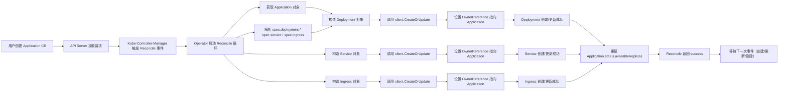

# 使用KubeBuilder开发ApplicationOperator：一键编排 Deployment、Service与Ingress


## 一、整体架构与核心概念图解

### 1、核心工作流概览



> **中文注释说明**：  
>
> - `Reconcile` 是 Operator 的“大脑”，它持续监听资源变化，并将实际状态（Actual State）驱动至期望状态（Desired State）；  
> - `OwnerReference` 是 Kubernetes 的**级联管理机制**，它在子资源（如 Deployment）的 metadata 中写入父资源（Application）的 UID，使 Kubernetes GC（垃圾回收器）能自动清理孤儿资源；  
> - `CreateOrUpdate` 并非原生 Kubernetes API，而是 Kubebuilder 提供的**幂等操作封装函数**，内部自动判断资源是否存在，避免重复创建报错。

## 二、环境准备：Kind + Kubebuilder 安装

### 1、知识点 1：Kind（Kubernetes IN Docker）——轻量级本地集群工具  

> **深度扩展（≥50 字）**：Kind 是 CNCF 官方推荐的 Kubernetes 本地开发集群工具，它通过在 Docker 容器中运行 kubelet 和 control-plane 组件，实现秒级启动单节点/多节点集群。相比 Minikube，Kind 更贴近生产环境（支持 multi-node、etcd、CNI 插件），且无需虚拟化层，资源占用极低，是 Operator 开发测试的黄金标准环境。其设计哲学是“Kubernetes in Kubernetes”，即用容器跑 Kubernetes，完美契合云原生 DevOps 流水线。

#### 1.**ASCII 图解：Kind 集群结构**

```
+----------------------------------------------+
|              Host OS (Linux/macOS/Win)       |
|  +----------------------------------------+  |
|  |            Docker Daemon               |  |
|  |  +-----------------+  +--------------+ |  |
|  |  |   Control-Plane |  |   Worker-Node| |  |
|  |  | [kube-apiserver]|  | [kubelet]    | |  |
|  |  | [etcd]          |  | [containerd] | |  |
|  |  | [kube-controller|  +--------------+ |  |
|  |  |  -manager]      |                   |  |
|  |  +-----------------+                   |  |
|  +----------------------------------------+  |
+----------------------------------------------+
          ↑
   Application CRD → Operator → Deployed Pods
```

#### 2.**安装命令（终端执行）**：

```bash
# 1. 安装 kind（需已安装 Docker）
curl -Lo ./kind https://kind.sigs.k8s.io/dl/v0.20.0/kind-$(uname)-amd64
chmod +x ./kind
sudo mv ./kind /usr/local/bin/kind

# 2. 创建集群（1 命令启动）
kind create cluster --name app-operator-cluster

# 3. 验证（自动配置 kubectl context）
kubectl cluster-info --context kind-app-operator-cluster
```

### 2、知识点 2：Kubebuilder —— Kubernetes Operator 的“脚手架引擎”  

> Kubebuilder 是 Kubernetes 官方维护的 Operator 开发框架，基于 controller-runtime 构建，提供 CLI 工具链（`kubebuilder init` / `create api`）自动生成 Go 项目骨架、CRD Schema、Controller 模板、Makefile 及测试桩。它屏蔽了底层 client-go 复杂性，让开发者聚焦于业务逻辑（Reconcile 函数），是生产级 Operator 开发的事实标准，已被 KubeVela、Argo CD、Crossplane 等主流项目采用。

#### 1.**图解：Kubebuilder 项目结构生成逻辑**

```
kubebuilder init --domain als.com        # 生成顶层项目（go.mod, main.go, Makefile）
       ↓
kubebuilder create api --group application --version v1 --kind Application  # 生成：
       │
       ├── api/v1/                          # API 定义目录
       │   ├── application_types.go         # ← 核心！定义 CRD 的 Go struct（spec/status）
       │   └── groupversion_info.go         # 注册 GroupVersion
       │
       ├── controllers/                     # 控制器逻辑目录
       │   └── application_controller.go    # ← 核心！Reconcile 函数入口
       │
       ├── config/                          # K8s 部署配置（CRD YAML, RBAC, Manager）
       │   ├── crd/                         # 自动生成 CRD YAML（无需手写！）
       │   ├── default/                     # Manager Deployment + RBAC
       │   └── samples/                     # 示例 Application YAML（待填充 spec）
       │
       └── go.mod                           # Go 模块依赖（含 controller-runtime, k8s.io/api）
```

#### 2.**安装命令**：

```bash
# 下载最新版（Linux/macOS）
curl -L https://go.kubebuilder.io/dl/latest/$(go env GOOS)/$(go env GOARCH) | tar -xz
sudo mv kubebuilder /usr/local/kubebuilder
export PATH=$PATH:/usr/local/kubebuilder/bin

# 验证
kubebuilder version
```

## 三、CRD 设计详解：Application 资源 Schema

### 1、知识点 3：CustomResourceDefinition（CRD）—— Kubernetes 的“类型扩展机制”  

> CRD 是 Kubernetes 原生提供的声明式 API 扩展机制，允许用户无需修改 Kubernetes 核心代码即可注册全新资源类型（如 Application）。它通过 YAML 定义资源的 Group（命名空间）、Version（演进版本）、Kind（类型名）及 OpenAPI v3 Schema（字段校验规则）。CRD 本身是集群级资源，由 API Server 动态编译为 REST endpoint，是 Operator 模式的基石。

#### 1.**本例 Application CRD 关键设计**：

- **Group**: `application.als.com`（自定义域名，避免冲突）  

- **Version**: `v1`（稳定版，非 beta）  

- **Kind**: `Application`（首字母大写 PascalCase）  

- **Spec 结构**（核心！）：

  ```go
  type ApplicationSpec struct {
      Deployment *ApplicationDeployment `json:"deployment,omitempty"` // 自定义 Deployment 结构
      Service    corev1.ServiceSpec     `json:"service,omitempty"`    // 复用标准 ServiceSpec
      Ingress    networkingv1.IngressSpec `json:"ingress,omitempty"`  // 复用标准 IngressSpec
  }
  ```

#### 2.**Application CRD Spec 层级关系**

```
Application (CR)
│
├── spec
│   │
│   ├── deployment ───────────────────┐
│   │   ├── image: "nginx:1.20"       │ ← 自定义字段（非复用）
│   │   ├── replicas: 3               │
│   │   └── port: 80                  │
│   │                                 │
│   ├── service ──────────────────────┤ ← 直接嵌入 corev1.ServiceSpec（标准结构）
│   │   ├── ports:                    │
│   │   │   - port: 80                │
│   │   │     targetPort: 80          │
│   │   └── selector:                 │
│   │         app: application-sample │
│   │                                 │
│   └── ingress ──────────────────────┤ ← 直接嵌入 networkingv1.IngressSpec（标准结构）
│       ├── ingressClassName: nginx   │
│       └── rules:                    │
│           - host: example.com       │
│             http:                   │
│               paths:                │
│                 - path: /           │
│                   backend:          │
│                     service:        │
│                       name: app-svc │
│                       port: 80      │
│
└── status
    └── availableReplicas: 3     ← Operator 写入的状态字段（反映真实副本数）
```

## 四、代码实现详解：从 Type 定义到 Reconcile 逻辑

### 1、知识点 4：`api/v1/application_types.go` —— CRD 的 Go 语言契约  

> 该文件是 Operator 的“数据契约”，使用 Go struct + struct tag（`json:"xxx"`）精确映射 YAML 字段。Kubebuilder 通过 `// +kubebuilder:object:root=true` 等注释标记，驱动 `controller-gen` 工具自动生成 CRD YAML 的 OpenAPI Schema。**关键原则**：所有字段必须显式声明 `omitempty`（避免空值污染），嵌套结构优先复用 `k8s.io/api` 中的标准类型（如 `corev1.ServiceSpec`），极大提升兼容性与可维护性。

1.**完整代码（含注释）**：

```go
// api/v1/application_types.go
package v1

import (
    corev1 "k8s.io/api/core/v1"                    // ← 引入标准 Service API
    networkingv1 "k8s.io/api/networking/v1"        // ← 引入标准 Ingress API
    metav1 "k8s.io/apimachinery/pkg/apis/meta/v1"  // ← 引入 ObjectMeta
)

// +kubebuilder:object:root=true
// +kubebuilder:subresource:status
// Application is the Schema for the applications API
type Application struct {
    metav1.TypeMeta   `json:",inline"`
    metav1.ObjectMeta `json:"metadata,omitempty"`

    Spec   ApplicationSpec   `json:"spec,omitempty"`   // ← 用户填写的期望状态
    Status ApplicationStatus `json:"status,omitempty"` // ← Operator 写入的实际状态
}

// +kubebuilder:object:root=true
type ApplicationList struct {
    metav1.TypeMeta `json:",inline"`
    metav1.ListMeta `json:"metadata,omitempty"`
    Items           []Application `json:"items"`
}

// ApplicationSpec defines the desired state of Application
type ApplicationSpec struct {
    // Deployment 定义（自定义结构，非复用）
    Deployment *ApplicationDeployment `json:"deployment,omitempty"`
    // Service 定义（直接复用标准类型）
    Service    corev1.ServiceSpec     `json:"service,omitempty"`
    // Ingress 定义（直接复用标准类型）
    Ingress    networkingv1.IngressSpec `json:"ingress,omitempty"`
}

// ApplicationDeployment 自定义结构体
type ApplicationDeployment struct {
    Image    string `json:"image,omitempty"`    // YAML 中为 image: "nginx:1.20"
    Replicas *int32 `json:"replicas,omitempty"` // 允许为 nil，便于默认值处理
    Port     int32  `json:"port,omitempty"`     // YAML 中为 port: 80
}

// ApplicationStatus defines the observed state of Application
type ApplicationStatus struct {
    // AvailableReplicas 记录当前可用副本数（由 Operator 更新）
    AvailableReplicas int32 `json:"availableReplicas,omitempty"`
}

func init() {
    SchemeBuilder.Register(&Application{}, &ApplicationList{})
}
```

#### 2.**Go Struct → YAML 映射关系**

```
Go Field: ApplicationSpec.Deployment.Image
         ↓ json tag
YAML Key: spec:
            deployment:
              image: "nginx:1.20"   ← 严格对应！

Go Field: ApplicationSpec.Service.Ports[0].Port
         ↓ 复用 corev1.ServiceSpec
YAML Key: spec:
            service:
              ports:
              - port: 80          ← 直接透传标准字段
                targetPort: 80

Go Field: ApplicationStatus.AvailableReplicas
         ↓ status subresource
YAML Key: status:
            availableReplicas: 3   ← 仅 Operator 可写，用户不可见
```

### 2、知识点 5：`controllers/application_controller.go` —— Reconcile 业务逻辑核心  

> Reconcile 函数是 Operator 的“心脏”，它接收 `reconcile.Request`（包含 namespace/name），通过 `r.Client.Get()` 获取 CR 对象，然后执行“读取 → 构造子资源 → 创建/更新 → 设置 OwnerReference → 更新 Status”全流程。**关键设计模式**：使用 `ctrl.CreateOrUpdate()` 实现幂等性；用 `ctrl.SetControllerReference()` 自动注入 OwnerReference；所有错误返回触发重试队列（Exponential Backoff），确保最终一致性。

#### 1.**核心 Reconcile 逻辑（精简版，含关键注释）**：

```go
func (r *ApplicationReconciler) Reconcile(ctx context.Context, req ctrl.Request) (ctrl.Result, error) {
    log := r.Log.WithValues("application", req.NamespacedName)

    // STEP 1: 获取 Application CR 对象
    var app v1.Application
    if err := r.Get(ctx, req.NamespacedName, &app); err != nil {
        log.Error(err, "unable to fetch Application")
        return ctrl.Result{}, client.IgnoreNotFound(err) // 忽略 NotFound 错误（删除时触发）
    }

    // STEP 2: 构造 Labels（统一用于 Deployment/Service/Ingress）
    labels := map[string]string{"app": app.Name}

    // STEP 3: 创建/更新 Deployment
    dep := &appsv1.Deployment{
        ObjectMeta: metav1.ObjectMeta{
            Name:      app.Name,
            Namespace: app.Namespace,
            Labels:    labels,
        },
        Spec: appsv1.DeploymentSpec{
            Replicas: app.Spec.Deployment.Replicas,
            Selector: &metav1.LabelSelector{MatchLabels: labels},
            Template: corev1.PodTemplateSpec{
                ObjectMeta: metav1.ObjectMeta{Labels: labels},
                Spec: corev1.PodSpec{
                    Containers: []corev1.Container{{
                        Name:  app.Name,
                        Image: app.Spec.Deployment.Image,
                        Ports: []corev1.ContainerPort{{ContainerPort: app.Spec.Deployment.Port}},
                    }},
                },
            },
        },
    }
    if err := ctrl.SetControllerReference(&app, dep, r.Scheme); err != nil {
        return ctrl.Result{}, err
    }
    if err := r.CreateOrUpdate(ctx, dep); err != nil {
        log.Error(err, "failed to create/update Deployment")
        return ctrl.Result{}, err
    }

    // STEP 4: 创建/更新 Service（复用 app.Spec.Service）
    svc := &corev1.Service{
        ObjectMeta: metav1.ObjectMeta{
            Name:      app.Name,
            Namespace: app.Namespace,
            Labels:    labels,
        },
        Spec: app.Spec.Service, // ← 直接赋值！复用标准结构
    }
    if err := ctrl.SetControllerReference(&app, svc, r.Scheme); err != nil {
        return ctrl.Result{}, err
    }
    if err := r.CreateOrUpdate(ctx, svc); err != nil {
        log.Error(err, "failed to create/update Service")
        return ctrl.Result{}, err
    }

    // STEP 5: 创建/更新 Ingress（复用 app.Spec.Ingress）
    ing := &networkingv1.Ingress{
        ObjectMeta: metav1.ObjectMeta{
            Name:      app.Name,
            Namespace: app.Namespace,
            Labels:    labels,
        },
        Spec: app.Spec.Ingress, // ← 直接赋值！复用标准结构
    }
    if err := ctrl.SetControllerReference(&app, ing, r.Scheme); err != nil {
        return ctrl.Result{}, err
    }
    if err := r.CreateOrUpdate(ctx, ing); err != nil {
        log.Error(err, "failed to create/update Ingress")
        return ctrl.Result{}, err
    }

    // STEP 6: 更新 Status（记录可用副本数）
    app.Status.AvailableReplicas = *app.Spec.Deployment.Replicas
    if err := r.Status().Update(ctx, &app); err != nil {
        log.Error(err, "failed to update Application status")
        return ctrl.Result{}, err
    }

    log.Info("Application reconciled successfully")
    return ctrl.Result{}, nil // 成功，不重试
}
```

#### 2.**Reconcile 执行时序（关键步骤）**

```
┌─────────────────────────────────────────────────────────────────────────────┐
│  Reconcile Loop (Triggered by ANY Application event)                        │
├─────────────────────────────────────────────────────────────────────────────┤
│ 1. GET Application CR → app                                                 │
│ 2. FOR EACH sub-resource (dep/svc/ing):                                     │
│    a) CONSTRUCT object with labels & spec                                   │
│    b) SET OwnerReference → app (via SetControllerReference)                 │
│    c) CREATEORUPDATE → Kubernetes API (idempotent!)                         │
│ 3. UPDATE app.status.availableReplicas                                      │
│ 4. RETURN success → Event queue cleared                                     │
└─────────────────────────────────────────────────────────────────────────────┘
```

## 五、部署与验证：端到端测试流程

### 1、知识点 6：`make install` 与 `make run` —— 本地开发调试闭环  

> `make install` 将 `config/crd/bases/` 下自动生成的 CRD YAML 应用到集群，注册新资源类型；`make run` 则在本地启动 Operator 进程（非容器化），它通过 `~/.kube/config` 访问 Kind 集群，实时监听事件。此组合构成零构建、零镜像、零推送的极速调试闭环，是 Kubebuilder 区别于传统 Helm/Operator SDK 的最大优势，极大提升开发迭代效率。

#### 1.**验证命令序列**：

```bash
# 1. 安装 CRD（注册 Application 类型）
make install

# 2. 启动 Operator（本地进程，连接 Kind 集群）
make run

# 3. 应用示例 Application（填充 config/samples/...yaml）
kubectl apply -f config/samples/application_v1_application.yaml

# 4. 验证子资源是否生成
kubectl get deploy,svc,ing -n default | grep application-sample

# 5. 修改镜像并观察 Reconcile（触发更新）
kubectl patch application application-sample -p '{"spec":{"deployment":{"image":"nginx:1.21"}}}' --type=merge

# 6. 删除 Application（验证 OwnerReference 级联删除）
kubectl delete application application-sample
kubectl get deploy,svc,ing -n default | grep application-sample # 应无输出
```

#### 2.**级联删除原理**

```
Kubernetes Garbage Collector (GC)
          ↓
  Watches OwnerReference field
          ↓
  If owner (Application) is deleted
          ↓
  GC finds all children with:
      metadata.ownerReferences[0].uid == <Application.UID>
          ↓
  GC sends DELETE request to:
      • deployment/application-sample
      • service/application-sample
      • ingress/application-sample
          ↓
  All children vanish automatically → Zero manual cleanup!
```

## 六、总结：Operator 开发范式与最佳实践

本实战完整呈现了 Kubebuilder 开发 Operator 的**黄金六步法**：  
1️⃣ **环境就绪**（Kind + Kubebuilder）→ 2️⃣ **CRD 设计**（Group/Version/Kind + Spec Schema）→  
3️⃣ **Type 定义**（Go struct + JSON tags + 复用标准类型）→ 4️⃣ **Reconcile 编码**（幂等创建 + OwnerReference + Status 更新）→  
5️⃣ **本地调试**（make install + make run）→ 6️⃣ **端到端验证**（CR 创建/更新/删除全生命周期）。

> **核心启示**：Operator 不是“写代码控制 Kubernetes”，而是**用 Kubernetes 的原生能力（CRD + OwnerReference + Controller Pattern）构建更高阶的抽象**。它将运维知识（如何部署 Nginx）编码为可复用、可版本化、可审计的声明式 API，这才是云原生时代自动化运维的终极形态。

