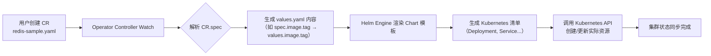

# 使用 Operator SDK 将 Helm Chart 快速转换为 Kubernetes Operator


## 一、核心概念解析：Operator、CRD、Helm Chart 三者关系

### 1、什么是 Kubernetes Operator？  

Operator 是 Kubernetes 的**扩展控制器模式**，它将人类运维专家对特定应用（如 etcd、Prometheus、Redis）的领域知识编码为 Go 程序，通过监听自定义资源（Custom Resource, CR）的变化，自动执行部署、扩缩容、备份恢复、故障自愈等复杂操作。其本质是 **“Kubernetes 原生化运维脚本”**，解决了 Stateful 应用在云原生环境中的生命周期管理难题。

```text
┌───────────────────────────────────────────────────────────────┐
│                Operator = 控制器（Controller） + CRD            │
│                                                               │
│   ┌──────────────┐     ┌──────────────────┐     ┌───────────┐ │
│   │  Custom      │────▶│  Operator        │────▶│  Redis    │ │
│   │  Resource    │     │  Controller      │     │  Pods     │ │
│   │  (redis.yaml)│     │  (Go 程序)        │     │ (Stateful)│ │
│   └──────────────┘     └──────────────────┘     └───────────┘ │
└───────────────────────────────────────────────────────────────┘
```

### 2、什么是 CRD（CustomResourceDefinition）？  

CRD 是 Kubernetes 提供的**声明式 API 扩展机制**，允许用户无需修改 Kubernetes 核心代码，即可注册全新的资源类型（如 `Redis`、`MinIOCluster`）。一旦 CRD 被创建，Kubernetes API Server 就能识别并持久化该资源对象；Operator Controller 则持续 watch 这些对象，并驱动集群状态向期望状态收敛。它是 Operator 的“输入接口”，也是 DevOps 团队交付应用的标准契约。

```text
CRD 定义示例（简化）：
apiVersion: apiextensions.k8s.io/v1
kind: CustomResourceDefinition
metadata:
  name: redis.app.al.com      ← 资源全名（Group/Version/Kind）
spec:
  group: app.al.com           ← API 组名，用于命名空间隔离
  versions:
  - name: v1                  ← 版本号
    schema:                   ← OpenAPI v3 验证规则（字段类型、必填等）
      openAPIV3Schema:
        type: object
        properties:
          spec:
            type: object
            properties:
              image:
                type: string   ← 自动映射 Helm values.yaml 中的 .image.repository
```

### 3、什么是 Helm Chart？  

Helm Chart 是 Kubernetes 的**应用打包格式**，由一组 YAML 模板（`templates/`）、配置值（`values.yaml`）、元数据（`Chart.yaml`）和依赖声明（`Chart.lock`）构成。它通过 Go template 引擎将 `values.yaml` 中的参数注入模板，生成最终可部署的 Kubernetes 清单（Deployment、Service、PVC 等）。Helm 是“包管理器”，而 Chart 是“安装包”。

```text
Helm Chart 目录结构（Redis 示例）：
redis/
├── Chart.yaml          ← 应用名称、版本、描述
├── values.yaml         ← 默认配置（image.tag=7.0, replicaCount=1）
├── templates/
│   ├── deployment.yaml ← {{ .Values.replicaCount }} → 生成 replicas: 1
│   ├── service.yaml    ← {{ .Values.service.port }} → 生成 port: 6379
│   └── _helpers.tpl    ← 公共函数（如 fullname）
└── charts/             ← 子 Chart 依赖（如 common）
```

## 二、Operator SDK Helm Plugin 工作原理

Operator SDK 的 Helm Plugin 并非重写 Helm，而是**将 Helm Chart “封装”为 Operator**。其核心思想是：**把 `values.yaml` 的每个字段，自动映射为 CR 的 `.spec` 字段；把 `helm install/upgrade` 操作，封装为 Controller 的 Reconcile 循环**。



> **关键优势**：开发者无需编写 Go 控制器逻辑，仅需一个成熟 Helm Chart 即可获得 Operator 全部能力（声明式部署、GitOps 支持、多租户隔离）。  
> **本质限制**：无法实现 Helm 原生不支持的复杂编排逻辑（如跨 Namespace 服务发现、自定义健康检查），此时需切换至 Go Plugin。

## 三、完整实战步骤详解（含全部命令与代码）

### 1、步骤 1：初始化 Operator 项目（`operator-sdk init`）

```bash
# 创建项目目录
mkdir redis-operator && cd redis-operator

# 初始化项目（指定 domain 和 Helm 插件）
operator-sdk init \
  --domain al.com \
  --plugins helm
```

#### 1.**生成目录结构**：

```text
redis-operator/
├── PROJECT                    ← 项目元数据（含 plugin: helm）
├── helm-charts/               ← Helm Charts 存放目录（空）
├── config/                    ← K8s 部署清单（CRD、RBAC、Manager）
│   ├── crd/                   ← 自动生成的 CRD YAML
│   ├── default/               ← Manager Deployment & RBAC
│   └── manager/               ← controller-manager 配置
├── Makefile                   ← 构建/部署快捷命令
└── go.mod                     ← Go 模块（虽不用 Go，但 SDK 依赖）
```

> **知识点扩展**：`PROJECT` 文件是 Operator SDK 的“项目身份证”，其中 `layout: helm` 表明使用 Helm 模式；`domain: al.com` 将作为 CRD 的 Group 名（`redis.app.al.com`），确保全局唯一性，避免命名冲突。

### 2、步骤 2：生成 Helm-based API（`operator-sdk create api`）

```bash
# 创建 Redis API（group=app, version=v1, kind=Redis）
operator-sdk create api \
  --group app \
  --version v1 \
  --kind Redis \
  --helm-chart ./helm-charts/redis  # 注意：此处指向本地 Chart 目录
```

#### 1.**常见错误处理**：若提示 `chart not found`，需先下载 Redis Chart：

```bash
# 下载官方 Redis Chart 到 helm-charts/redis
helm repo add bitnami https://charts.bitnami.com/bitnami
helm pull bitnami/redis --untar --destination helm-charts/
# 修复依赖（因 Chart 可能含子 Chart）
cd helm-charts/redis && helm dependency build && cd ../..
```

#### 2.**生成文件**：

- `config/crd/bases/app.al.com_redis.yaml`：CRD 定义（含 OpenAPI Schema）
- `helm-charts/redis/`：已拷贝的 Chart（含 `values.yaml`）
- `config/samples/app_v1_redis.yaml`：CR 示例（即 `values.yaml` 的 YAML 化）

> **知识点扩展**：`config/samples/app_v1_redis.yaml` 并非手写，而是 SDK **自动将 `values.yaml` 的顶层字段平铺为 `.spec`**。例如 `values.yaml` 中：
>
> ```yaml
> image:
> repository: docker.io/bitnami/redis
> tag: 7.0.15
> replicaCount: 3
> ```
>
> 将生成 CR 中：
>
> ```yaml
> spec:
> image:
>  repository: docker.io/bitnami/redis
>  tag: 7.0.15
> replicaCount: 3
> ```

### 3、步骤 3：构建并推送 Operator 镜像

```bash
# 构建镜像（使用 Makefile 封装的 docker build）
make docker-build IMG=your-dockerhub/redis-operator:v1

# 推送镜像
docker push your-dockerhub/redis-operator:v1
```

#### 1.**Makefile 关键逻辑**：

```makefile
# Makefile 中的 docker-build 规则
docker-build:
	docker build . -t ${IMG}
# ${IMG} 由命令行传入，确保镜像名可配置
```

> **知识点扩展**：Operator 镜像是一个**轻量级容器**，内含 `controller-manager` 二进制（由 SDK 编译）和 Helm Chart。它不运行 Redis，而是运行一个“Helm 客户端进程”，负责监听 CR 并调用 Helm Library 渲染部署。镜像体积通常 < 100MB。

### 4、步骤 4：部署 Operator 及 CRD

```bash
# 部署 CRD、RBAC、Manager Deployment 到集群
make deploy IMG=your-dockerhub/redis-operator:v1

# 验证部署
kubectl get ns redis-operator-system          # 应存在
kubectl get pods -n redis-operator-system     # controller-manager 应 Running
```

#### 1.**RBAC 权限说明**（`config/default/manager_auth_proxy_patch.yaml`）：

```yaml
# 默认仅授予 operator-system 命名空间内资源权限
rules:
- apiGroups: [""]
  resources: ["pods", "services", "endpoints"]
  verbs: ["*"]
- apiGroups: ["apps"]
  resources: ["deployments", "statefulsets"]
  verbs: ["*"]
```

> **权限升级**：  
> 若日志出现 `user cannot get resource "redis"`，说明缺少对自定义资源的访问权。需添加 ClusterRoleBinding：
>
> ```yaml
> # cluster-role-binding.yaml
> apiVersion: rbac.authorization.k8s.io/v1
> kind: ClusterRoleBinding
> metadata:
> name: redis-operator-manager-rolebinding
> subjects:
> - kind: ServiceAccount
>   name: redis-operator-controller-manager
>   namespace: redis-operator-system
> roleRef:
>   kind: ClusterRole
>   name: redis-operator-manager-role
>   apiGroup: rbac.authorization.k8s.io
> ```
>
> 执行 `kubectl apply -f cluster-role-binding.yaml` 后重启 Pod。

### 5、步骤 5：部署 Redis 实例（创建 CR）

```bash
# 应用 CR 示例（即 values.yaml 的声明式实例）
kubectl apply -f config/samples/app_v1_redis.yaml

# 查看 Redis Pod 是否启动
kubectl get pods -l app.kubernetes.io/instance=redis-sample
# 输出应类似：redis-sample-master-0, redis-sample-replicas-0
```

#### 1.**验证 Operator 工作**：

```bash
# 查看 Controller 日志
kubectl logs -n redis-operator-system deploy/redis-operator-controller-manager

# 日志应包含：
# "Reconciling Redis" → "Helm release installed" → "Redis cluster ready"
```

> **知识点扩展**：Operator SDK Helm Controller 的 Reconcile 流程为：  
>
> 1. 获取 CR 对象（`redis-sample`）  
> 2. 提取 `.spec` 字段，序列化为 `values.yaml` 内容  
> 3. 调用 Helm Engine 渲染 `redis/` Chart，生成 Manifests  
> 4. 使用 `k8s.io/client-go` 应用 Manifests（创建/更新资源）  
> 5. 更新 CR 的 `.status` 字段（如 `status.phase: Deployed`）

## 四、总结：Helm Operator 的适用场景与局限性

| 维度         | 优势                                                         | 局限性                                                       |
| ------------ | ------------------------------------------------------------ | ------------------------------------------------------------ |
| **开发效率** | ⭐⭐⭐⭐⭐ 无需 Go 编程，10 分钟即可将 Helm Chart 转为 Operator   | ⚠️ 无法实现 Helm 不支持的逻辑（如动态生成 Secret、跨集群调度） |
| **维护成本** | ⭐⭐⭐⭐ 与上游 Chart 同步，`helm update` 即可升级 Operator 功能 | ⚠️ Chart 结构变更（如 values.yaml 字段重命名）需手动更新 CRD Schema |
| **生产就绪** | ⭐⭐⭐ 适合标准有状态应用（Redis、PostgreSQL、Elasticsearch）   | ❌ 不适合需深度集成 Kubernetes API 的场景（如自定义调度器、网络策略） |

>  **最佳实践建议**：  
>
> - **起步阶段**：优先使用 Helm Plugin 快速验证 Operator 模式；  
> - **进阶阶段**：当业务需求超出 Helm 能力时，再迁移至 Go Plugin，并复用原有 Chart 作为模板库；  
> - **安全合规**：始终通过 `values.schema.json` 定义强校验规则，防止恶意 CR 注入非法配置。

