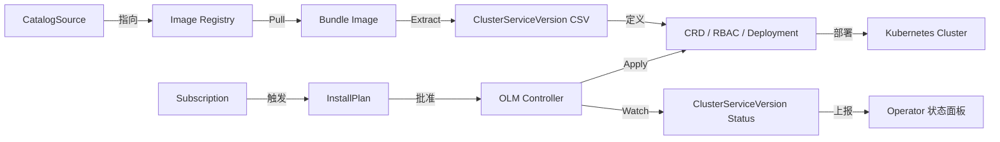

# OperatorLifecycleManager（OLM）：KubernetesOperator的标准化分发与生命周期管理工具


## 一、Operator SDK 概述：Kubernetes 原生扩展开发的核心工具链

Operator SDK 是由 Red Hat 主导开发、CNCF 官方推荐的 **Kubernetes Operator 开发框架**，专为简化自定义资源（Custom Resource, CR）及其控制器（Controller）的开发、测试、打包与分发而设计。它并非一个独立运行的服务，而是一套面向 Go 语言（主流）或 Ansible/Helm（可选后端）的 CLI 工具集 + Go SDK 库 + 项目模板 + 构建脚本（Makefile）的完整开发生态。

> **核心价值**：将 Kubernetes API 扩展开发从“手写 Informer/Reconcile 循环 + RBAC + CRD YAML”这一高门槛、易出错的过程，抽象为 `operator-sdk init && operator-sdk create api` 的声明式命令流，开发者只需聚焦业务逻辑（如 Redis 集群扩缩容、故障自动恢复），无需重复造轮子处理底层协调机制。

```bash
# 初始化一个基于 Go 的 Operator 项目（v1.30+）
operator-sdk init \
  --domain example.com \
  --repo github.com/example/redis-operator \
  --skip-go-version-check

# 创建自定义资源类型（如 RedisCluster）
operator-sdk create api \
  --group cache \
  --version v1alpha1 \
  --kind RedisCluster \
  --resource \
  --controller
```

该命令会自动生成：

- `api/v1alpha1/rediscluster_types.go`：Go 结构体定义（含 `+kubebuilder:validation` 注解）
- `controllers/rediscluster_controller.go`：Reconcile 核心逻辑入口
- `config/crd/bases/cache.example.com_redisclusters.yaml`：标准 CRD 清单
- `config/rbac/`：预置 RBAC 规则（ServiceAccount / Role / RoleBinding / ClusterRole）

✅ **图解：Operator SDK 项目结构**

```
├── api/                    # CRD 类型定义（Go struct + kubebuilder 注解）
│   └── v1alpha1/
│       ├── groupversion_info.go    # GroupVersion 注册
│       └── rediscluster_types.go   # RedisCluster Spec/Status 定义
├── controllers/            # 控制器逻辑（核心 Reconcile 函数）
│   └── rediscluster_controller.go
├── config/                 # K8s 部署清单（CRD/RBAC/Manager Deployment）
│   ├── crd/                # CRD YAML（含 OpenAPI v3 validation schema）
│   ├── rbac/               # 权限配置（最小权限原则）
│   └── manager/            # Operator 自身部署（Deployment + ServiceAccount）
├── Dockerfile              # 构建 Operator 镜像（多阶段构建）
├── Makefile                # 标准化构建命令（make build / make docker-build / make install）
└── go.mod                  # Go 模块依赖（含 controller-runtime, kubebuilder 等）
```

> **知识点扩展  
> Operator SDK 本质是 **Controller Runtime 框架的封装层**。Controller Runtime 提供了 `Manager`（启动控制器生命周期）、`Reconciler`（核心协调逻辑接口）、`Client`（K8s API 交互）、`Scheme`（类型注册）等基础能力。SDK 在其之上添加了代码生成（kubebuilder）、CLI 工具链（init/create）、打包规范（Bundle）和 OLM 集成支持，使开发者无需深入理解 `client-go` 的 Informer 缓存机制或 `controller-runtime` 的 EventSource 抽象，即可快速产出生产级 Operator。这是云原生领域“约定优于配置”思想的典范实践。

## 二、OLM（Operator Lifecycle Manager）：Operator 的企业级应用商店

### 1、OLM 核心定位与架构角色

OLM 全称 **Operator Lifecycle Manager**，是 Kubernetes 上专为 **Operator 的安装、升级、依赖管理与生命周期治理** 设计的集群级控制平面组件。它不是 Operator 本身，而是 Operator 的“操作系统内核”——负责调度、验证、部署、监控 Operator 及其依赖的 CRD、RBAC、Deployment 等资源，并确保整个生命周期符合声明式语义。

> **类比理解**：  
>
> - OLM ≈ Linux 的 `apt-get` / `yum` 包管理器（但面向 K8s 原生资源）  
> - Bundle ≈ `.deb` / `.rpm` 软件包（但为 OCI 镜像格式）  
> - CatalogSource ≈ 软件源（如 `deb http://archive.ubuntu.com/ubuntu/`）  
> - Subscription ≈ 用户订阅行为（自动拉取新版 Bundle）  
> - InstallPlan ≈ 安装计划（OLM 生成的待执行 YAML 清单）

**图解：OLM 核心组件交互流程（graph LR 流程图）**



**中文注释说明**：  

- `CatalogSource`：声明一个镜像仓库地址（如 `quay.io/operator-framework/community-operators`），OLM 从此拉取 Bundle  
- `Bundle Image`：包含 CSV、CRD、Manifests 的 OCI 镜像（非运行时容器，是元数据包）  
- `ClusterServiceVersion (CSV)`：Operator 的“身份证”，定义名称、版本、图标、描述、依赖、安装策略、权限范围  
- `Subscription`：用户创建的资源，声明“我要安装哪个 Operator 的哪个频道（channel）”  
- `InstallPlan`：OLM 自动生成的待执行清单（类似 Helm Release），需手动 `kubectl approve` 或自动批准  

### 2、Bundle：Operator 的标准化分发单元（OCI 镜像化）

Bundle 是 OLM 的核心分发格式，它将 Operator 的所有部署依赖（CRD、RBAC、Deployment、CSV）**打包为符合 OCI（Open Container Initiative）标准的镜像**，可推送到任意兼容 OCI 的镜像仓库（Docker Hub、Quay、Harbor、阿里云 ACR 等）。

> **Bundle 目录结构（ASCII 图）**

```
redis-operator-bundle:v0.0.1/
├── manifests/                  # 所有 K8s 清单文件
│   ├── cache.example.com_redisclusters_crd.yaml   # CRD
│   ├── redis-operator-manager-rolebinding.yaml    # RBAC
│   └── redis-operator.clusterserviceversion.yaml # CSV（关键！）
├── metadata/                   # 元数据
│   └── annotations.yaml        # Bundle 元信息（如 com.redhat.openshift.versions）
└── Dockerfile                  # 构建 Bundle 镜像的指令（COPY manifests/ /manifests/）
```

**关键命令详解（ `make bundle` 流程）**：

```bash
# 1. 生成 Bundle 目录（交互式填写元数据）
make bundle \
  IMG="quay.io/yourname/redis-operator:v0.0.1" \
  BUNDLE_IMG="quay.io/yourname/redis-operator-bundle:v0.0.1"

# 2. 构建并推送 Bundle 镜像（本质是 docker build + push）
make bundle-build bundle-push \
  BUNDLE_IMG="quay.io/yourname/redis-operator-bundle:v0.0.1"

# 3. 验证 Bundle 合法性（检查 CSV 语法、CRD 引用、权限完整性）
operator-sdk bundle validate \
  --tag "quay.io/yourname/redis-operator-bundle:v0.0.1" \
  --image-builder docker
```

> **知识点扩展（≥50字）**：  
> Bundle 的 OCI 化是云原生分发范式的重大演进。传统 Helm Chart 依赖 `helm install` CLI 解析，而 Bundle 作为标准镜像，天然支持镜像签名（cosign）、漏洞扫描（Trivy）、网络策略（NetworkPolicy 限制 pull 源）、多租户隔离（不同命名空间使用不同 CatalogSource）。更重要的是，Bundle 的不可变性（Immutable）确保了“一次构建，处处运行”，彻底规避了 YAML 文件分散存储导致的版本漂移与一致性风险，是金融、政务等强合规场景的刚需。

## 三、OLM 安装与 Operator 部署全流程实操

### 1、部署 OLM 到集群（Operator SDK CLI 一键安装）

```bash
# 安装最新版 OLM（自动创建 olm 命名空间及所有 CRD/Deployment）
operator-sdk olm install

# 验证安装状态（应看到 packageserver Running）
kubectl get pods -n olm

# 查看 OLM 自身的 CRD（CatalogSource/Subscription/InstallPlan/ClusterServiceVersion）
kubectl get crd | grep operators.coreos.com
```

**OLM 组件清单（ASCII 表格）**

| 组件名称           | 命名空间 | 作用说明                                      |
| ------------------ | -------- | --------------------------------------------- |
| `olm-operator`     | `olm`    | OLM 主控制器，监听 Subscription/InstallPlan   |
| `catalog-operator` | `olm`    | 管理 CatalogSource，同步 Bundle 到本地缓存    |
| `packageserver`    | `olm`    | 提供 gRPC 接口，供 OLM 查询可用 Operator 版本 |

### 2、创建 CatalogSource：接入 Bundle 镜像源

```yaml
# catalogsource.yaml
apiVersion: operators.coreos.com/v1alpha1
kind: CatalogSource
metadata:
  name: redis-catalog
  namespace: olm
spec:
  sourceType: grpc
  image: quay.io/yourname/redis-operator-bundle:v0.0.1  # 指向你的 Bundle 镜像
  displayName: Redis Operator Catalog
  publisher: Your Name
```

```bash
kubectl apply -f catalogsource.yaml
# 等待 READY=True（表示 Bundle 已成功解析）
kubectl get catalogsource -n olm
```

### 3、订阅（Subscription）Operator：声明式安装

```yaml
# subscription.yaml
apiVersion: operators.coreos.com/v1alpha1
kind: Subscription
metadata:
  name: redis-operator-sub
  namespace: default  # Operator 将部署在此命名空间
spec:
  channel: alpha      # 频道名（需与 CSV 中 channels 匹配）
  name: redis-operator # 必须与 CSV 中 spec.displayName 一致
  source: redis-catalog
  sourceNamespace: olm
```

```bash
kubectl apply -f subscription.yaml

# OLM 自动生成 InstallPlan（需批准）
kubectl get installplan -n default

# 批准安装计划（或配置自动批准）
kubectl patch installplan <installplan-name> -n default --type=json -p '[{"op": "replace", "path": "/spec/approved", "value": true}]'

# 查看 Operator Pod 是否 Running
kubectl get pods -n default | grep redis
```

> **常见故障点**：  
>
> - `catalog error creating catalog resource`：CatalogSource 镜像拉取失败（检查镜像地址、网络、权限）  
>
> - `CRD already exists`：卸载不彻底，残留 CRD 或 `catalogsource`；需手动清理：  
>
>   ```bash
>   kubectl delete catalogsource redis-catalog -n olm
>   kubectl delete crd redisclusters.cache.example.com
>   kubectl delete csv redis-operator.v0.0.1 -n default
>   ```

## 四、总结：Operator SDK + OLM 构建企业级云原生应用交付体系

Operator SDK 与 OLM 共同构成了 **Kubernetes Operator 开发-分发-运维全栈解决方案**。SDK 解决“如何高效写好 Operator”，OLM 解决“如何安全可靠地交付和管理 Operator”。二者结合，使企业能将数据库、中间件、AI 框架等有状态服务，以 **GitOps 方式（声明式 YAML + CI/CD Pipeline）** 进行版本化、自动化、可观测化管理，真正实现“Kubernetes as a Platform”。

> **最终 ASCII 架构全景图**

```
+---------------------------------------------------+
|                Developer Laptop                   |
|  [Go Code] → operator-sdk create → Makefile       |
|         ↓                                         |
|  [Bundle Image] ← make bundle-build ← Dockerfile  |
+-------------------------+-------------------------+
                          ↓ (push)
+-------------------------+-------------------------+
|           OCI Registry (Docker Hub / Quay)        |
|  redis-operator-bundle:v0.0.1                     |
+-------------------------+-------------------------+
                          ↓ (pull via CatalogSource)
+---------------------------------------------------+
|                Kubernetes Cluster                 |
| +---------------------+  +---------------------+  |
| |       OLM           |  |    Your App NS      |  |
| | - catalog-operator  |  | - RedisCluster CR   |  |
| | - olm-operator      |  | - redis-operator Pod|  |
| | - packageserver     |  +----------+----------+  |
| +----------+----------+             ↓             |
|            ↓                [Reconcile Loop]      |
| +----------+--------+     +----------+--------+   |
| | CatalogSource     |     | RedisCluster CR   |   |
| | Subscription      |→→→→ | Status: Ready     |   |
| | InstallPlan       |     +-------------------+   |
| +-------------------+                             |
+---------------------------------------------------+
```

此架构已广泛应用于 OpenShift、Rancher、SUSE Rancher、华为 CCE 等商业发行版，是云原生生产环境的事实标准。掌握其原理与实操，是每一位 Kubernetes 平台工程师、SRE、云原生架构师的核心竞争力。


