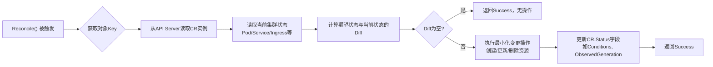
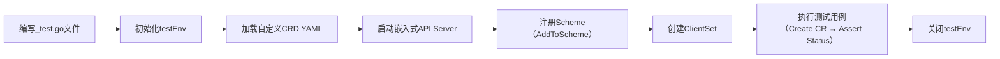

# KubernetesOperator开发三大最佳实践与端到端测试实战指南


## 一、Reconcile 函数的幂等性设计（Idempotent Reconcile）

### 1、核心定义与工程意义  

**幂等性（Idempotence）** 是指：无论对同一资源执行多少次相同操作，其最终系统状态保持一致，且不产生副作用。在 Operator 中，`Reconcile()` 函数是控制器响应事件（如 CR 创建/更新/删除）的核心入口。若该函数非幂等，则在网络抖动、etcd 临时不可用、控制器重启等常见场景下，将导致重复创建 Pod、误删 Service、状态字段反复翻转等严重故障。

> ✅ 正确范式：`Reconcile()` 应始终基于 **“当前状态（Actual State）” 与 “期望状态（Desired State）” 的差异比对** 来驱动操作，而非依赖事件类型分支判断。  
> ❌ 错误范式：`if event == CREATE { createPod() } else if event == UPDATE { updateService() }` —— 此逻辑必然崩溃。

### 2、幂等 vs 非幂等执行对比

```
非幂等执行（危险！）                    幂等执行（安全！）
┌─────────────────┐                      ┌────────────────────────┐
│ 事件触发         │                      │  Reconcile() 启动       │
├─────────────────┤                      ├────────────────────────┤
│ CREATE → 创建Pod │                     │ 1. 获取当前状态：         │
│ UPDATE → 更新Svc │                     │    - Pod: 0个           │
│ DELETE → 删除Ingr│                     │    - Service: 0个       │
│ ...             │                      │ 2. 获取期望状态：        │
└─────────────────┘                      │    - replicas=3        │
                                         │ 3. 计算差值：需创建3 Pod  │
                                         ├────────────────────────┤
                                         │ 4. 执行：创建3个Pod      │
                                         │ 5. 再次调用Reconcile()  │
                                         │    → 当前Pod=3 → 无需操作│
                                         └────────────────────────┘
```

### 3、流程图：Reconcile 标准执行流程（graph LR）



### 4、关键代码实现（Go 语言示例）

```go
func (r *ApplicationReconciler) Reconcile(ctx context.Context, req ctrl.Request) (ctrl.Result, error) {
    // 1. 获取CR实例（期望状态）
    var app myappv1.Application
    if err := r.Get(ctx, req.NamespacedName, &app); err != nil {
        if errors.IsNotFound(err) {
            return ctrl.Result{}, nil // CR已被删除，无需处理
        }
        return ctrl.Result{}, err
    }

    // 2. 获取当前状态：检查Deployment是否存在
    var deploy appsv1.Deployment
    err := r.Get(ctx, types.NamespacedName{
        Name:      app.Name,
        Namespace: app.Namespace,
    }, &deploy)

    // 3. 幂等决策：仅当Deployment不存在时才创建
    if errors.IsNotFound(err) {
        newDeploy := r.buildDeployment(&app)
        if err := r.Create(ctx, &newDeploy); err != nil {
            return ctrl.Result{}, err
        }
        // 更新Status表示资源已就绪
        app.Status.ObservedGeneration = app.Generation
        app.Status.Conditions = append(app.Status.Conditions, 
            metav1.Condition{Type: "DeploymentReady", Status: metav1.ConditionTrue})
        r.Status().Update(ctx, &app)
        return ctrl.Result{}, nil
    }

    // 4. 若Deployment存在，检查是否需更新（如replicas变更）
    if *deploy.Spec.Replicas != app.Spec.Deployment.Replicas {
        deploy.Spec.Replicas = &app.Spec.Deployment.Replicas
        if err := r.Update(ctx, &deploy); err != nil {
            return ctrl.Result{}, err
        }
    }
    return ctrl.Result{}, nil
}
```

> **扩展知识**：Kubernetes 官方推荐的 `controller-runtime` 框架中，`Reconcile()` 必须是**纯函数式设计**——它不维护任何内部状态，所有决策均来自实时读取的 API Server 数据。这保证了即使控制器进程崩溃重启，也能从任意时刻恢复一致行为。

## 二、EnvTest 端到端测试框架深度解析

### 1、架构本质：轻量级 Kubernetes 模拟器  

`envtest` 是 Kubernetes SIG-Testing 提供的官方测试工具包，其核心是一个**嵌入式、单进程、无 Controller 的 Kubernetes API Server 模拟器**。它包含：

- ✅ 真实 `kube-apiserver` 二进制（经裁剪）
- ✅ 内置 `etcd` 存储（内存模式，启动即用）
- ✅ 完整 RBAC、CRD、Namespaces 支持  
- ❌ 无 `kube-controller-manager`（不自动创建 Pod/Endpoint）
- ❌ 无 `kube-scheduler`（不分配 Node）
- ❌ 无 `cloud-controller-manager`（无云厂商集成）

> **定位**：专用于验证 Operator 的 **CRD Schema 合法性、Reconcile 逻辑正确性、Status 字段更新准确性** —— 即“数据平面”测试，非“控制平面”测试。

### 2、EnvTest 与真实集群对比

```
真实K8s集群（生产环境）              EnvTest（开发测试）
┌─────────────────────────┐        ┌──────────────────────────┐
│  kube-apiserver         │        │  envtest-apiserver       │
│  kube-controller-manager│        │  (含etcd内存实例)          │
│  kube-scheduler         │        │                          │
│  cloud-controller       │        │                          │
│  kubelet + ContainerRt  │        │                          │
└─────────────────────────┘        └──────────────────────────┘
          ↓                                  ↓
   Operator部署于集群内                 Operator连接本地API Server
   自动管理真实工作负载                  仅验证CR与Status交互逻辑
```

### 3、流程图：EnvTest 测试生命周期（graph LR）



### 4、完整可运行测试代码（含注释）

```go
// test/e2e/application_test.go
package e2e

import (
    "context"
    "path/filepath"
    "testing"

    // Kubernetes Core
    corev1 "k8s.io/api/core/v1"
    metav1 "k8s.io/apimachinery/pkg/apis/meta/v1"
    "k8s.io/apimachinery/pkg/runtime"
    "k8s.io/apimachinery/pkg/types"
    "k8s.io/client-go/kubernetes/scheme"

    // Controller Runtime
    "sigs.k8s.io/controller-runtime"
    "sigs.k8s.io/controller-runtime/pkg/client"
    "sigs.k8s.io/controller-runtime/pkg/envtest"
    logf "sigs.k8s.io/controller-runtime/pkg/log"
    "sigs.k8s.io/controller-runtime/pkg/log/zap"

    // 本项目API
    myappv1 "github.com/example/myapp/api/v1"
)

var (
    testEnv *envtest.Environment
    k8sClient client.Client
    ctx       context.Context
)

func TestMain(m *testing.M) {
    logf.SetLogger(zap.New(zap.UseDevMode(true)))
    ctx = context.Background()

    // 1. 初始化EnvTest环境
    testEnv = &envtest.Environment{
        CRDDirectoryPaths: []string{
            filepath.Join("..", "config", "crd", "bases"), // 加载CRD YAML
        },
        ErrorIfCRDPathMissing: true,
    }

    // 2. 启动API Server
    cfg, err := testEnv.Start()
    if err != nil {
        panic(err)
    }

    // 3. 注册自定义API Scheme
    err = myappv1.AddToScheme(scheme.Scheme)
    if err != nil {
        panic(err)
    }

    // 4. 创建Client
    k8sClient, err = client.New(cfg, client.Options{Scheme: scheme.Scheme})
    if err != nil {
        panic(err)
    }

    // 运行测试
    code := m.Run()

    // 5. 清理：关闭EnvTest
    if err := testEnv.Stop(); err != nil {
        panic(err)
    }
    os.Exit(code)
}

// 测试用例：创建Application并验证Status
func TestApplicationReconcile(t *testing.T) {
    // 构造测试CR
    app := &myappv1.Application{
        TypeMeta: metav1.TypeMeta{Kind: "Application", APIVersion: "myapp.example.com/v1"},
        ObjectMeta: metav1.ObjectMeta{
            Name:      "test-app",
            Namespace: "default",
        },
        Spec: myappv1.ApplicationSpec{
            Deployment: myappv1.DeploymentSpec{
                Replicas: 2,
                Image:    "nginx:1.20",
            },
        },
    }

    // 创建CR
    err := k8sClient.Create(ctx, app)
    assert.NoError(t, err)

    // 等待Reconcile完成（需启动Controller，此处省略启动逻辑）
    // 实际项目中需在TestMain中启动Manager

    // 验证Status更新
    var updatedApp myappv1.Application
    err = k8sClient.Get(ctx, types.NamespacedName{Name: "test-app", Namespace: "default"}, &updatedApp)
    assert.NoError(t, err)
    assert.Equal(t, int32(2), *updatedApp.Status.AvailableReplicas)
}
```

> **重要提醒**：`envtest` 不运行你的 Operator 控制器！你必须在测试中显式启动 `ctrl.Manager` 并注册 `ApplicationReconciler`，否则 `Reconcile()` 永远不会被调用。这是新手最常踩的坑。

## 三、课后实战：为 Application CRD 增加 ConfigMap 支持

### 1、设计目标  

扩展 `Application` CRD，支持通过 `spec.configMap` 字段声明一个 ConfigMap，Operator 在 Reconcile 时自动创建该 ConfigMap，并挂载至 Pod。

### 2、修改步骤（完整清单）

#### 1.**更新 API 定义（api/v1/application_types.go）**

```go
type ApplicationSpec struct {
    Deployment DeploymentSpec `json:"deployment"`
    Service    ServiceSpec    `json:"service"`
    Ingress    IngressSpec    `json:"ingress"`
    ConfigMap  *ConfigMapSpec `json:"configMap,omitempty"` // 新增字段
}

type ConfigMapSpec struct {
    Name string            `json:"name"`
    Data map[string]string `json:"data"`
}
```

#### 2.**生成新CRD YAML**

```bash
make manifests
```

#### 3.**修改 Reconcile() 逻辑（controllers/application_controller.go）**

```go
// 在Reconcile函数中添加：
if app.Spec.ConfigMap != nil {
    cm := r.buildConfigMap(&app)
    if err := r.CreateOrUpdate(ctx, &cm); err != nil {
        return ctrl.Result{}, err
    }
    // 将ConfigMap挂载到Deployment中...
}
```

#### 4.**构建ConfigMap对象**

```go
func (r *ApplicationReconciler) buildConfigMap(app *myappv1.Application) corev1.ConfigMap {
    return corev1.ConfigMap{
        TypeMeta: metav1.TypeMeta{Kind: "ConfigMap", APIVersion: "v1"},
        ObjectMeta: metav1.ObjectMeta{
            Name:      app.Spec.ConfigMap.Name,
            Namespace: app.Namespace,
        },
        Data: app.Spec.ConfigMap.Data,
    }
}
```

> **验证点**：运行 `make test-e2e`，确保新增 ConfigMap 创建成功，且 Deployment 的 `volumes` 和 `volumeMounts` 正确注入。

## 结语：Operator 工程化的三大基石  

Operator 不是“写个脚本扔进集群”，而是践行 Kubernetes 声明式哲学的严肃工程实践。其稳固性建立于三根支柱之上：  
🔹 **幂等性** —— 是容错的基石，保障系统在混沌中自我修复；  
🔹 **关注点分离** —— Reconcile 只管“状态差分”，不涉“事件溯源”；  
🔹 **可测试性** —— `envtest` 提供零依赖、秒级启动的端到端验证闭环。  

唯有深刻理解并贯彻这三点，才能构建出真正生产就绪（Production-Ready）的 Operator。