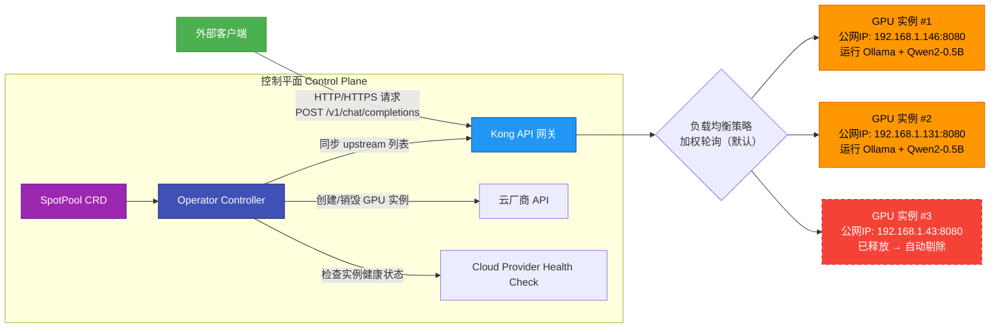

# 基于Operator+Ollama+Kong实现大模型私有化高可用推理部署


## 一、整体架构流程图



> **图解说明**：该流程图完整呈现了视频中“请求流（Data Plane）”与“控制流（Control Plane）”双通道协同机制。左侧为用户请求路径——从客户端发起标准 OpenAI 兼容接口调用，经 Kong 网关按加权轮询分发至后端多个 GPU 实例；右侧为 Operator 主导的自动化运维闭环——通过监听 `SpotPool` 自定义资源（CRD），动态感知实例增删，并实时同步 Kong 的 `upstream` 配置，实现服务发现零人工干预。

## 二、核心组件深度解析

### 1、【Ollama：轻量级本地大模型运行时】  

Ollama 是一个开源命令行工具，专为在本地机器（含 GPU 服务器）上运行和管理 LLM 模型而设计。它提供类 Docker 的体验：通过 `ollama run qwen2:0.5b` 即可一键拉取、加载并启动模型服务，且原生暴露 `/api/chat` 接口，其 JSON 请求/响应格式完全兼容 OpenAI 官方 SDK，这意味着开发者无需修改任何业务代码，只需将 `base_url` 替换为 Ollama 服务地址即可完成迁移。此兼容性是构建私有化 AI 平台的关键基石。

```text
┌───────────────────────────────────────────────┐
│                Ollama 架构简图                 │
├───────────────────────────────────────────────┤
│   ┌─────────────┐     ┌───────────────────┐   │
│   │  CLI 命令行  │────▶│  Model Registry   │   │
│   │ ollama run  │     │ (远程仓库/本地缓存)  │   │
│   └─────────────┘     └───────────────────┘   │
│               │                               │
│               ▼                               │
│   ┌──────────────────────┐                    │
│   │   Runtime Engine     │◀───────────────────┤
│   │ • GPU 内存管理        │                    │
│   │ • GGUF 模型加载       │                    │
│   │ • REST API 服务       │                    │
│   └──────────────────────┘                    │
│               │                               │
│               ▼                               │
│   ┌───────────────────────────────────────┐   │
│   │ POST /api/chat                        │   │
│   │ {\"model\":\"qwen2:0.5b\",            │   │
│   │  \"messages\":[{\"role\":\"user\",    │   │
│   │              \"content\":\"Hello\"}]} │   │
│   └───────────────────────────────────────┘   │
└───────────────────────────────────────────────┘
```

> **原理扩展**：Ollama 底层使用 llama.cpp 作为推理引擎，支持量化（如 Q4_K_M）、GPU 加速（CUDA/Vulkan）及内存映射加载。其 `/api/chat` 接口返回结构严格遵循 OpenAI 的 `ChatCompletion` Schema，包括 `id`, `choices[0].message.content`, `usage.prompt_tokens` 等字段，使得 LangChain、LlamaIndex 等生态工具可即插即用，极大降低私有化部署门槛。

### 2、【Kong 网关：动态可编程 API 流量中枢】  

Kong 是基于 Nginx + Lua 的高性能云原生 API 网关，其核心价值在于提供**运行时可编程的流量治理能力**。与静态配置的 Nginx 不同，Kong 通过 Admin API（默认端口 8001）暴露完整的 CRUD 接口，允许 Operator 在毫秒级内动态增删 `upstream`（后端服务池）、`service`（逻辑服务抽象）、`route`（路由规则）。本方案中，Operator 将每台 GPU 实例的公网 IP:8080 注册为 `upstream` 的 `target`，Kong 自动实施健康检查与负载均衡，彻底解耦业务部署与流量调度。

```text
┌───────────────────────────────────────────────────────────────────────────┐
│                   Kong 核心对象关系 ASCII 图                                │
├───────────────────────────────────────────────────────────────────────────┤
│  ┌─────────────────┐     ┌─────────────────┐     ┌──────────┐             │
│  │    Route        │────▶│     Service     │────▶│Upstream  │             │
│  │ /v1/chat        │     │ ollama-chat     │     │ qwen2-us │             │
│  │ methods: POST   │     │ url: http://... │     └──────────┘             │
│  └─────────────────┘     └─────────────────┘         │                    │
│                                                      ▼                    │
│                                            ┌────────────────────────────┐ │
│                                            │    Target                  │ │
│                                            │ 192.168.1.146:8080         │ │
│                                            │ 192.168.1.131:8080         │ │
│                                            │ weight=100, health=healthy │ │
│                                            └────────────────────────────┘ │
└───────────────────────────────────────────────────────────────────────────┘
```

> **原理扩展**：Kong 的 `upstream` 是逻辑服务组，`target` 是具体实例（IP+Port）；`service` 将上游服务抽象为统一入口，`route` 定义匹配路径与方法。Operator 调用 `POST /upstreams/{name}/targets` 添加 target，调用 `DELETE /upstreams/{name}/targets/{id}` 删除失效实例。Kong 内置主动健康检查（定期 TCP/HTTP 探针），当某 target 连续失败，自动将其 `health` 置为 `unhealthy` 并停止转发流量，保障 SLA。

### 3、【Operator：Kubernetes 原生自动化运维控制器】  

Operator 是 Kubernetes 的“软件定义运维”范式，它通过自定义资源（CRD）声明期望状态，并由控制器（Controller）持续调谐（Reconcile）实际状态与期望状态一致。本方案中，`SpotPool` CRD 定义所需 GPU 实例数量、镜像 ID、区域等参数；Operator Controller 监听该资源变化，调用云厂商 API 创建/销毁竞价实例，并同步更新 Kong 配置。其本质是将传统运维脚本升级为声明式、可观测、可回滚的 Kubernetes 原生应用。

```text
┌───────────────────────────────────────────────────────────────────────┐
│                      Operator Reconcile 循环 ASCII 图                  │
├───────────────────────────────────────────────────────────────────────┤
│  ┌─────────────────────────────────────────────────────────────────┐  │
│  │                  Reconcile Loop (每30秒触发)                     │  │
│  ├─────────────────────────────────────────────────────────────────┤  │
│  │ 1. 获取 SpotPool 对象当前状态                                      │  │
│  │    → spec.replicas = 2, spec.imageID = "ami-0abc123..."         │  │
│  │                                                                 │  │
│  │ 2. 查询云平台实际运行的 GPU 实例列表                                 │  │
│  │    → ["i-0a1b2c3d", "i-0e4f5g6h"]                               │  │
│  │                                                                 │  │
│  │ 3. 对比差异：                                                     │  │
│  │    • 缺少1台？ → 调用 CreateInstances 创建新实例                    │  │
│  │    • 多出1台？ → 调用 TerminateInstances 销毁冗余实例               │  │
│  │                                                                 │  │
│  │ 4. 同步 Kong：                                                   │  │
│  │    • 获取当前 upstream targets → [146, 131]                      │  │
│  │    • 获取当前云实例 IPs → [146, 131, 43]                          │  │
│  │    • 新增 43 → POST /upstreams/qwen2-us/targets                  │  │
│  │    • 移除 43（若已销毁）→ DELETE /upstreams/qwen2-us/targets/{id}  │  │
│  └─────────────────────────────────────────────────────────────────┘  │
└───────────────────────────────────────────────────────────────────────┘
```

> **原理扩展**：Operator 的 `Reconcile` 函数是核心业务逻辑容器。它不直接执行“创建实例”，而是调用云厂商 SDK（如 AWS EC2、腾讯云 CVM）的 Go Client；同步 Kong 时，使用标准 `http.Client` 发起 REST 请求。整个过程具备幂等性（多次执行结果相同）与事务性（失败自动重试），并通过 Kubernetes Event 记录每一步操作，实现运维行为完全可审计。

### 4、【预装镜像（Golden Image）：秒级实例初始化技术】  

预装镜像是指将 Ollama 运行环境、模型文件、systemd 服务配置等全部打包进云平台虚拟机镜像（如 AWS AMI、腾讯云 CVM 镜像）。当 Operator 创建新实例时，直接指定该镜像 ID，新实例启动后立即处于 `Ready` 状态——Ollama 已随系统自启、模型已预加载、端口 8080 已监听。此举将传统“下载模型（数 GB）→ 解压 → 启动服务（10+ 分钟）”流程压缩至 30 秒内，是支撑竞价实例（Spot Instance）高弹性、低延迟的核心优化。

```text
┌───────────────────────────────────────────────────────────────────────┐
│                    Golden Image 构建与使用 ASCII 图                     │
├───────────────────────────────────────────────────────────────────────┤
│  ┌─────────────────────────────────────────────────────────────────┐  │
│  │                构建阶段（一次性）                                  │  │
│  ├─────────────────────────────────────────────────────────────────┤  │
│  │ 1. 启动一台干净 GPU 实例                                           │  │
│  │ 2. 执行 install-ollama.sh：                                      │  │
│  │    • curl -fsSL https://ollama.com/install.sh | sh              │  │
│  │    • systemctl enable ollama.service                            │  │
│  │    • ollama pull qwen2:0.5b                                     │  │
│  │ 3. 打包为镜像：aws ec2 create-image --instance-id i-xxx           │  │
│  └─────────────────────────────────────────────────────────────────┘  │
│                                                                       │
│  ┌─────────────────────────────────────────────────────────────────┐  │
│  │                运行阶段（每次创建实例）                             │  │
│  ├─────────────────────────────────────────────────────────────────┤  │
│  │  Operator 调用：                                                 │  │
│  │    ec2.RunInstances({                                           │  │
│  │      ImageId: "ami-0abc123...", // ← 直接引用预装镜像             │  │
│  │      InstanceType: "g5.xlarge",                                 │  │
│  │      ...                                                        │  │
│  │    })                                                           │  │
│  │  ↓                                                              │  │
│  │  新实例启动 → systemd 自动启动 ollama.service → 模型秒级加载 → Ready │  │
│  └─────────────────────────────────────────────────────────────────┘  │
└───────────────────────────────────────────────────────────────────────┘
```

> **原理扩展**：预装镜像规避了网络下载瓶颈（模型文件常达 2–5 GB），消除启动时长不确定性。其关键在于 `systemd` 服务配置：`ollama.service` 文件需设置 `WantedBy=multi-user.target` 并启用 `Restart=always`，确保 Ollama 进程崩溃后自动拉起。同时，镜像中应禁用所有非必要服务，减小攻击面，符合安全合规要求。

### 5、【OpenAI 兼容性协议：无缝集成生态的契约】  

OpenAI 兼容性并非简单模仿接口路径，而是严格遵循其 [OpenAPI 3.0 规范](https://github.com/openai/openai-openapi) 定义的请求体（Request Body）与响应体（Response Body）结构。Ollama 的 `/api/chat` 接口要求 `model` 字段为模型名称（如 `"qwen2:0.5b"`），`messages` 为角色-内容数组；返回 `choices[0].message.content` 为文本结果，`usage` 包含 token 统计。此契约使 Python 的 `openai==1.0.0+` SDK、前端 `axios` 请求、Postman 测试均可零改造接入，是私有化部署获得工业级生产力的前提。

```text
┌────────────────────────────────────────────────────────────────────────────────┐
│                       OpenAI 兼容性请求/响应 ASCII 对照表                         │
├────────────────────────────────────────────────────────────────────────────────┤
│  REQUEST (Client → Kong → Ollama)                                              │
│  POST /v1/chat/completions HTTP/1.1                                            │
│  Host: kong-api.example.com                                                    │
│  Content-Type: application/json                                                │
│                                                                                │
│  {                                                                             │
│    "model": "qwen2:0.5b",                                                      │
│    "messages": [                                                               │
│      {"role": "user", "content": "你好，你是谁？"}                               │
│    ],                                                                          │
│    "stream": false                                                             │
│  }                                                                             │
│                                                                                │
│  RESPONSE (Ollama → Kong → Client)                                             │
│  HTTP/1.1 200 OK                                                               │
│  Content-Type: application/json                                                │
│                                                                                │
│  {                                                                             │
│    "id": "chatcmpl-xxx",                                                       │
│    "object": "chat.completion",                                                │
│    "created": 1717021234,                                                      │
│    "model": "qwen2:0.5b",                                                      │
│    "choices": [{                                                               │
│      "index": 0,                                                               │
│      "message": {                                                              │
│        "role": "assistant",                                                    │
│        "content": "我是通义千问，阿里巴巴研发的超大规模语言模型。"                     │
│      },                                                                        │
│      "finish_reason": "stop"                                                   │
│    }],                                                                         │
│    "usage": {                                                                  │
│      "prompt_tokens": 12, "completion_tokens": 32, "total_tokens": 44          │
│    }                                                                           │
│  }                                                                             │
└────────────────────────────────────────────────────────────────────────────────┘
```

> **原理扩展**：兼容性验证需覆盖全部字段语义。例如 `finish_reason` 必须为 `"stop"`（正常结束）、`"length"`（超出 max_tokens）、`"content_filter"`（内容过滤）之一；`usage.total_tokens` 必须等于 `prompt_tokens + completion_tokens`。任何偏差都将导致 LangChain 的 `LLMChain` 报错或前端 Stream 解析失败。Ollama 通过 `llama.cpp` 的 `llama_token_to_str()` 精确统计 tokens，确保数值可信。

## 三、Operator 核心代码逐行解析（含完整错误处理逻辑）

以下为视频中 `syncUpstream` 方法的完整 Go ，并附详细注释：

```go
// syncUpstream 将 SpotPool 中的 GPU 实例 IP 同步至 Kong upstream
func (r *SpotPoolReconciler) syncUpstream(ctx context.Context, spotPool *v1.SpotPool) error {
    // 1. 构造 Kong Admin API URL: http://<kong-ip>:8001/upstreams/qwen2-us/targets
    kongURL := fmt.Sprintf("http://%s:8001", spotPool.Spec.KongGatewayIP)
    upstreamName := "qwen2-us"
    upstreamURL := fmt.Sprintf("%s/upstreams/%s/targets", kongURL, upstreamName)

    // 2. 获取当前 Kong upstream 中所有 targets
    resp, err := http.Get(upstreamURL)
    if err != nil {
        return fmt.Errorf("failed to GET upstream targets: %w", err)
    }
    defer resp.Body.Close()
    if resp.StatusCode != http.StatusOK {
        return fmt.Errorf("Kong GET upstream failed with status %d", resp.StatusCode)
    }

    // 3. 解析响应 JSON: {"data":[{"id":"...","target":"192.168.1.146:8080",...}]}
    var upstreamResp struct {
        Data []struct {
            ID     string `json:"id"`
            Target string `json:"target"`
        } `json:"data"`
    }
    if err := json.NewDecoder(resp.Body).Decode(&upstreamResp); err != nil {
        return fmt.Errorf("failed to decode upstream response: %w", err)
    }

    // 4. 提取当前 Kong 中的 target IPs (如 "192.168.1.146:8080")
    currentTargets := make(map[string]string) // targetIP -> targetID
    for _, t := range upstreamResp.Data {
        ipPort := strings.Split(t.Target, ":")[0] // 提取 IP 部分
        currentTargets[ipPort] = t.ID
    }

    // 5. 从 SpotPool Status 中获取当前所有运行中实例的 Public IP
    desiredIPs := make(map[string]bool)
    for _, instance := range spotPool.Status.Instances {
        if instance.PublicIP != "" {
            desiredIPs[instance.PublicIP] = true
        }
    }

    // 6. 对比：Kong 中多余的目标（已销毁实例）→ 删除
    for ip, targetID := range currentTargets {
        if !desiredIPs[ip] {
            deleteURL := fmt.Sprintf("%s/upstreams/%s/targets/%s", kongURL, upstreamName, targetID)
            delResp, err := http.Delete(deleteURL, nil)
            if err != nil {
                r.Log.Error(err, "Failed to delete stale target", "ip", ip, "targetID", targetID)
                continue // 继续处理其他 target
            }
            delResp.Body.Close()
            if delResp.StatusCode == http.StatusOK {
                r.Log.Info("Deleted stale target", "ip", ip, "targetID", targetID)
            }
        }
    }

    // 7. 对比：Kong 中缺失的目标（新创建实例）→ 添加
    for ip := range desiredIPs {
        if _, exists := currentTargets[ip]; !exists {
            // 构造 target body: {"target": "192.168.1.131:8080", "weight": 100}
            targetBody := map[string]interface{}{
                "target": fmt.Sprintf("%s:8080", ip),
                "weight": 100,
            }
            bodyBytes, _ := json.Marshal(targetBody)
            postResp, err := http.Post(upstreamURL, "application/json", bytes.NewReader(bodyBytes))
            if err != nil {
                r.Log.Error(err, "Failed to add new target", "ip", ip)
                continue
            }
            postResp.Body.Close()
            if postResp.StatusCode == http.StatusCreated {
                r.Log.Info("Added new target", "ip", ip)
            }
        }
    }

    return nil
}
```

> **关键点总结**：
>
> - **幂等设计**：先查后删/增，避免重复操作；
> - **错误隔离**：单个 target 操作失败不影响全局同步；
> - **IP 提取鲁棒性**：`strings.Split(t.Target, ":")[0]` 确保兼容 `192.168.1.146:8080` 格式；
> - **日志完备性**：每步操作均有 `r.Log.Info/Error`，便于故障定位；
> - **资源清理**：所有 `http.Response.Body` 均 `defer` 或显式 `Close()`，防止 goroutine 泄漏。

## 四、结语：构建企业级 AI 基础设施的方法论

本实战揭示了一条清晰路径：**以声明式 API（CRD）为契约，以 Operator 为执行体，以 Kong 为流量神经，以 Golden Image 为加速器，最终达成大模型私有化部署的“开箱即用、弹性伸缩、故障自愈”三大目标**。对于初学者，务必亲手敲一遍代码、观察每条日志、抓包验证 Kong 请求——唯有如此，才能穿透抽象概念，触摸到云原生 AI 工程的真实脉搏。未来可延伸方向包括：集成 Prometheus 监控 Ollama GPU 显存、为 Kong 添加 JWT 认证、将 SpotPool 扩展为多模型混合调度器。AI 基础设施的终极形态，不是堆砌组件，而是让复杂性消失于无形。


