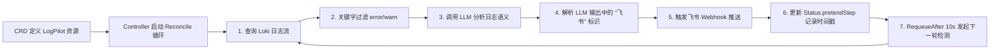

# 基于大模型的日志流智能监测Operator：LogPilot实战解析


## 一、Operator 架构总览：声明式运维范式的闭环控制循环

Operator 是 Kubernetes 中扩展原生 API 的核心模式，其本质是将“运维知识”编码为可执行的控制器（Controller），通过持续比对期望状态（Spec）与实际状态（Status），驱动集群自动收敛。LogPilot 并非简单脚本，而是一个具备**自感知、自决策、自执行**能力的智能体。



> ✅ **图解：Operator 控制循环本质**  
>
> ```
> ┌──────────────────────────────────────────────┐  
> │           RECONCILE LOOP                     │  
> │ ┌────────┐   ┌─────────────┐   ┌────────┐    │  
> │ │ Spec   │──▶│ Controller  │──▶│ Status │    │  
> │ └────────┘   └─────────────┘   └────────┘    │  
> │     ▲               │            ▲           │  
> │     └───────────────┼────────────┘           │  
> │                     ▼                        │  
> │             [Desired State == Actual State?] │  
> └──────────────────────────────────────────────┘  
> ```

## 二、Loki 日志系统集成：云原生日志聚合中枢

Loki 是 CNCF 毕业项目，采用**标签索引（Label-based Indexing）** 替代全文索引，极致压缩存储。LogPilot 通过 `/loki/api/v1/query_range` 接口按时间窗口拉取日志，而非轮询或流式订阅，符合 Kubernetes Operator 的声明式设计哲学。

```go
// 示例：构建 Loki 查询 URL
url := fmt.Sprintf(
    "%s/loki/api/v1/query_range?query=%s&start=%d&end=%d&limit=100",
    spec.LokiURL,
    url.QueryEscape(spec.LokiQuery), // 必须 URL 编码！
    startTime.UnixNano(),
    time.Now().UnixNano(),
)
```

> ✅ **图解：Loki 标签索引 vs 传统 ELK**  
>
> ```
> ELK 全文索引：[LOG_LINE] → [TOKENIZE] → [INVERTED_INDEX: "error": [1,5,9]]  
> Loki 标签索引：{job="payment",level="error"} → [CHUNK_ID: abc123] → [RAW_BYTES]  
> ```

## 三、CRD（CustomResourceDefinition）设计：声明式配置的契约基石

CRD 是 Operator 的“用户界面”，定义 `LogPilot` 资源的 Schema。其 `spec` 字段必须包含所有外部依赖参数，`status` 字段则记录运行时状态，实现**可观测性内建**。

```go
type LogPilotSpec struct {
    LokiURL      string `json:"lokiURL"`      // Loki 查询地址 e.g. http://loki:3100
    LokiQuery    string `json:"lokiQuery"`    // LogQL 查询语句 e.g. `{job="payment"} |= "error"`
    LLMEndpoint  string `json:"llmEndpoint"`  // OpenAI 兼容 API 地址
    LLMToken     string `json:"llmToken"`     // API 认证 Token（需 Secret 管理）
    LLMModel     string `json:"llmModel"`     // 模型名 e.g. "gpt-4o"
    FeishuWebhook string `json:"feishuWebhook"` // 飞书机器人地址
}

type LogPilotStatus struct {
    LastSyncTime metav1.Time `json:"lastSyncTime,omitempty"` // 上次同步时间戳
}
```

> **图解：CRD 数据流向**  
>
> ```
> ┌───────────────┐     ┌──────────────────────┐     ┌────────────────────┐  
> │ kubectl apply │────▶│ Kubernetes API Server│────▶│ LogPilot Controller│  
> └───────────────┘     └──────────────────────┘     └────────────────────┘  
>      ▲                      │                        │  
>      └──────────────────────┼────────────────────────┘  
>                             ▼  
>                   [Watch Events: ADD/UPDATE/DELETE]  
> ```

## 四、LogQL 查询语言：Loki 的精准日志检索语法

LogQL 是 Loki 的查询语言，语法简洁但功能强大。`{job="payment"}` 定位日志流，`|=` 执行行内模糊匹配，`|__` 可链式过滤。LogPilot 使用 `|="error"|="warn"` 实现业务错误捕获。

```logql
// 精确匹配 payment 服务的 error/warn 日志
{job="payment"} |= "error" |= "warn"

// 进阶：提取结构化字段（需 Promtail 配置）
{job="payment"} | json | level=~"error|warn"
```

> ✅ **图解：LogQL 执行流程**  
>
> ```
> ┌───────────────────────────────────────────────────────────────┐  
> │                         LogQL Execution                         │  
> │ 1. Label Matching: {job="payment"} → Fetch all chunks          │  
> │ 2. Line Filtering: |= "error" → Scan raw bytes in each chunk   │  
> │ 3. Result Aggregation: Return matching log lines + timestamps │  
> └───────────────────────────────────────────────────────────────┘  
> ```

## 五、OpenAI Go SDK 集成：标准化大模型调用接口

LogPilot 使用 `github.com/sashabaranov/go-openai` SDK，其核心是 `Client` 对象。关键点在于：**BaseURL 可覆盖为私有 LLM（如 Ollama）**，`APIKey` 从 CRD 注入，`Model` 指定推理引擎。

```go
client := openai.NewClientWithConfig(openai.DefaultConfig(spec.LLMToken))
client.BaseURL = spec.LLMEndpoint // 支持 http://localhost:11434/v1 (Ollama)

resp, err := client.CreateChatCompletion(ctx, openai.ChatCompletionRequest{
    Model: spec.LLMModel,
    Messages: []openai.ChatCompletionMessage{
        {Role: openai.ChatMessageRoleUser, Content: buildPrompt(logs)},
    },
})
```

> ✅ **图解：OpenAI 兼容 API 抽象层**  
>
> ```
> ┌─────────────────────┐    ┌──────────────────────┐    ┌──────────────────┐  
> │ LogPilot Controller │──▶ │ OpenAI Go SDK Client │──▶ │ ChatGPT / Ollama │  
> └─────────────────────┘    └──────────────────────┘    └──────────────────┘  
>      ▲                          │                          │  
>      └──────────────────────────┼──────────────────────────┘  
>                                 ▼  
>                    [HTTP POST /v1/chat/completions]  
> ```

## 六、Prompt 工程实践：运维专家角色注入与结构化输出

Prompt 是 LLM 的“操作手册”。LogPilot 的 Prompt 明确指定角色（运维专家）、输入（原始日志）、任务（分级诊断）、输出约束（含“飞书”标识）。这是**可控 AI 行为的关键**。

```text
你是一名资深 Kubernetes 运维工程师。以下是从 Loki 获取的应用日志：
{{.Logs}}

请严格按以下规则分析：
1. 判断错误等级：INFO/WARN/ERROR/FATAL
2. 若为 ERROR 或 FATAL，且涉及：数据库连接失败、外部 HTTP 请求超时、内存 OOM，则视为严重问题。
3. 对严重问题，给出一条可执行建议（≤20 字）。
4. 若需立即通知值班人员，请在响应末尾添加【飞书】。
```

> **图解：Prompt 结构化设计**  
>
> ```
> ┌───────────────────────────────────────────────────────────────┐  
> │                    PROMPT ENGINEERING TEMPLATE                │  
> │ [ROLE] 你是一名 Kubernetes 运维专家                              │  
> │ [CONTEXT] 日志来自 payment 服务，Loki 标签：{job="payment"}      │  
> │ [TASK] 分析错误等级 + 识别严重问题 + 给出建议                      │  
> │ [CONSTRAINT] 输出必须含【飞书】标识才触发告警                      │  
> └───────────────────────────────────────────────────────────────┘  
> ```

## 七、飞书 Webhook 推送：企业级告警通道集成

飞书 Webhook 是 HTTP POST 接口，接收 JSON 格式消息体。LogPilot 构造标准 `text` 类型消息，内容为 LLM 分析结果，实现**告警即上下文**，避免运维人员二次排查。

```go
msg := map[string]interface{}{
    "msg_type": "text",
    "content": map[string]string{
        "text": analysisResult,
    },
}
body, _ := json.Marshal(msg)
req, _ := http.NewRequest("POST", spec.FeishuWebhook, bytes.NewReader(body))
req.Header.Set("Content-Type", "application/json")
```

> **图解：飞书消息投递链路**  
>
> ```
> ┌─────────────────────┐    ┌──────────────────┐    ┌──────────────────┐  
> │ LogPilot Controller │──▶ │ HTTP POST Request │──▶│ Feishu Bot Server│  
> └─────────────────────┘    └──────────────────┘    └──────────────────┘  
>      ▲                          │                          │  
>      └──────────────────────────┼──────────────────────────┘  
>                                 ▼  
>                [Feishu App receives & pushes to group]  
> ```

## 八、Status 状态管理：Operator 自我认知的核心机制

`Status` 字段是 Operator 的“记忆”。`LastSyncTime` 不仅用于幂等控制，更支撑**时间窗口滑动查询**（本次查询 `now-5s` 至 `now`，下次从 `LastSyncTime` 开始），杜绝日志漏检。

```go
// 更新 Status
logPilot.Status.LastSyncTime = metav1.Time{Time: time.Now()}
if err := r.Status().Update(ctx, &logPilot); err != nil {
    return ctrl.Result{}, err
}
```

> ✅ **图解：Status 时间窗口滑动**  
>
> ```
> Time ───────────────────────────────────────────────────────────►  
>    [t0]────[t1]────[t2]────[t3]────[t4]────[t5]  
>    ▲      ▲      ▲      ▲      ▲      ▲  
>    │      │      │      │      │      │  
>    └──────┴──────┴──────┴──────┴──────┘  
>      Query Window: [t0→t1], [t1→t2], [t2→t3]...  
> ```

## 九、Reconcile 循环调度：Kubernetes 控制器的生命节律

`Reconcile` 方法是 Operator 的心脏。LogPilot 设置 `RequeueAfter: 10*time.Second`，形成稳定心跳。此设计平衡实时性与资源消耗，避免高频轮询压垮 Loki。

```go
// reconcile.go
return ctrl.Result{RequeueAfter: 10 * time.Second}, nil
```

> ✅ **图解：Reconcile 生命周期**  
>
> ```
> ┌───────────────────────────────────────────────────────────────┐  
> │                    RECONCILE EXECUTION CYCLE                  │  
> │ 1. GET LogPilot Resource from API Server                      │  
> │ 2. EXECUTE business logic (Loki → LLM → Feishu)               │  
> │ 3. UPDATE Status field                                        │  
> │ 4. RETURN ctrl.Result{RequeueAfter: 10s} → Schedule next run  │  
> └───────────────────────────────────────────────────────────────┘  
> ```

## 十、错误处理与健壮性设计：生产环境生存法则

LogPilot 对所有外部依赖（Loki、LLM、Feishu）实施**防御性编程**：空日志返回 `nil` 而非 panic；LLM 超时设置 `context.WithTimeout`；HTTP 错误检查 `resp.StatusCode`。这是 Operator 区别于脚本的核心。

```go
if len(logs) == 0 {
    log.Info("No logs found in time window, skipping LLM analysis")
    return ctrl.Result{RequeueAfter: 10 * time.Second}, nil
}
```

> **图解：错误处理分层策略**  
>
> ```
> ┌───────────────────────────────────────────────────────────────┐  
> │                    ERROR HANDLING LAYERS                      │  
> │ Layer 1: HTTP Transport (net/http timeout)                    │  
> │ Layer 2: LLM API Response Status Code (4xx/5xx)               │  
> │ Layer 3: Business Logic (empty logs, missing "飞书" tag)       │  
> │ Layer 4: Kubernetes API Update Failure (retry via Requeue)    │  
> └───────────────────────────────────────────────────────────────┘  
> ```

## 十一、安全最佳实践：敏感信息零硬编码

`LLMToken` 和 `FeishuWebhook` 绝不可写入 CRD YAML。正确方案是：CRD 引用 `Secret`，Operator 在 `Reconcile` 中 `Get` Secret 内容。虽简化演示，但生产必须遵循此规范。

```yaml
# logpilot.yaml
spec:
  llmToken: "" # 留空，由 controller 从 Secret 读取
  feishuWebhook: ""
---
# secret.yaml
apiVersion: v1
kind: Secret
metadata:
  name: logpilot-secrets
type: Opaque
data:
  llm-token: <base64-encoded>
  feishu-webhook: <base64-encoded>
```

> ✅ **图解：Secret 注入流程**  
>
> ```
> ┌──────────────────┐    ┌──────────────────┐    ┌──────────────────┐  
> │ LogPilot CRD     │──▶ │ Kubernetes Secret│──▶ │ Controller Get() │  
> │ (references name)│    │ (base64 data)    │    │ (decodes on fly) │  
> └──────────────────┘    └──────────────────┘    └──────────────────┘  
> ```

## 十二、本地开发与调试：K3s + Loki + Ollama 一体化环境

使用 K3s（轻量 Kubernetes）部署 Loki 与示例应用 `payment`。开发者需验证：① Loki Dashboard 可见日志；② `payment` 应用主动抛出 `error`；③ LogPilot Pod 日志显示 `Sending alert to Feishu`。调试命令：

```bash
# 查看 Loki 日志流
kubectl -n monitoring port-forward svc/loki 3100:3100

# 查看 LogPilot 控制器日志
kubectl logs -l app=logpilot-controller

# 手动触发一次 Reconcile（用于调试）
kubectl patch logpilots example -p '{"spec":{"lokiQuery":"{job=\"payment\"} |= \"error\""}}' --type=merge
```

> ✅ **图解：本地开发环境拓扑**  
>
> ```
> ┌──────────────────┐    ┌──────────────────┐    ┌─────────────────────┐  
> │   payment Pod    │──▶ │      Loki        │──▶ │ LogPilot Controller │  
> │ (emits error)    │    │ (stores logs)    │    │ (queries & analyzes)│  
> └──────────────────┘    └──────────────────┘    └─────────────────────┘  
>      ▲                      ▲                        ▲  
>      └──────────────────────┼────────────────────────┘  
>                             ▼  
>                   [All in single K3s cluster]  
> ```

**结语**：LogPilot 不仅是一个工具，更是**AI 原生运维（AIOps）的最小可行范式**——它将领域知识（运维规则）、数据管道（Loki）、智能引擎（LLM）、执行通道（Feishu）通过 Kubernetes Operator 范式无缝缝合。掌握此项目，即掌握了构建企业级智能运维系统的元能力。


