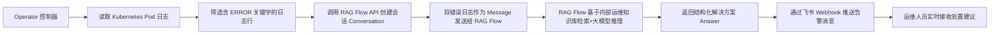

# 基于RAGFlow的运维专家知识库故障排查实战


## 一、整体架构设计：从日志到飞书告警的端到端闭环

### 1、架构流程图



**说明**：该流程图完整呈现了 Operator 的数据流向与职责边界。它不是黑盒调用，而是**可观测、可调试、可审计**的声明式自动化链路。

## 二、核心组件详解

### 1、RAG Flow：检索增强生成（Retrieval-Augmented Generation）引擎

> RAG Flow 是一个开源 RAG 应用框架，它将传统向量数据库（如 Chroma、Weaviate）与大语言模型（LLM）服务（如 OpenAI、Ollama）解耦封装，提供标准化 REST API。其核心价值在于：**让企业无需训练模型，仅通过上传 Markdown/Word/PDF 等文档，即可快速构建垂直领域问答系统**。它自动完成文档切片（chunking）、嵌入（embedding）、向量索引（vector indexing）、语义检索（retrieval）和提示工程（prompting）全过程。

#### 1.**图解：RAG Flow 内部工作流**

```
+------------------+     +---------------------+     +-------------------+
|   运维知识库文档   |---->|   文档分块 & 嵌入     |---->| 向量数据库索引       |
| (operator.md)    |     | (Embedding Model)   |     | (e.g., Chroma)    |
+------------------+     +----------+----------+     +---------+---------+
                                        |                        |
                                        v                        v
+--------------------+     +--------------------------------------------+
|   用户提问/日志      |---->| 语义检索相似块 + 拼接 Prompt + 调用 LLM 推理   |
| (e.g., "500 error")|     | (Prompt: “请基于以下知识回答…” + chunks)      |
+--------------------+     +--------------------------------------------+
                                        |
                                        v
                                +---------------------+
                                |   结构化答案输出      |
                                | (Answer: “联系小王”等)|
                                +---------------------+
```

### 2、CRD（Custom Resource Definition）：Kubernetes 自定义资源

> CRD 是 Kubernetes 的“插件机制”，允许用户像原生资源（Pod、Service）一样定义自己的资源类型。本实战中定义的 `RagLogPilot` CRD，本质是**一份运维人员可读写的 YAML 配置说明书**，它声明了：“我要监控哪个命名空间（workloadNamespace）、RAG Flow 地址在哪（endpoint）、认证密钥是什么（token）”。Operator 控制器监听此资源变化，实现“配置即代码（GitOps）”。

#### 1.**图解：CRD 与 Operator 协同关系**

```
+---------------------+       +----------------------------+
|   kubectl apply -f  |------>|  Kubernetes API Server     |
|   raglogpilot.yaml  |       | (存储 CRD 定义与实例)        |
+---------------------+       +-------------+--------------+
                                              |
                                              v
                              +-------------------------------+
                              |   Operator 控制器（Reconciler） |
                              | • 监听 RagLogPilot 变更        |
                              | • 获取 Pod 日志 → 调用 RAG      |
                              | • 更新 Status.conversationID   |
                              +-------------------------------+
```

### 3、 Conversation ID：RAG Flow 会话状态管理标识符

> RAG Flow 的 `/v1/conversations` 接口返回的 `data.id` 字段，是本次对话的唯一身份凭证（UUID）。它并非一次性令牌，而是**支持多轮上下文记忆的会话句柄**。Operator 必须将其持久化至 CRD 的 `.status.conversationID` 字段，确保后续日志分析请求复用同一会话，从而让模型理解“这是同一个故障的连续日志片段”，避免信息割裂。

#### 1.**图解：Conversation ID 生命周期**

```
+----------------------+     +-------------------------------------------+
|  Operator 初始化时    |---->| POST /v1/conversations?user_id=xxx        |
| 调用创建接口           |     | → 返回 { "data": { "id": "conv_abc123" } } |
+----------------------+     +-------------------------------------------+
                                      |
                                      v
+----------------------------------------------+
| Operator 将 conv_abc123 存入 CRD Status 字段  |
| apiVersion: itjc8.com/v1                     |
| kind: RagLogPilot                            |
| metadata: {...}                              |
| status: { "conversationID": "conv_abc123" }  |
+----------------------------------------------+
                                      |
                                      v
+-------------------------------------------------+
| 后续所有 /v1/completion 请求必须携带此 ID          |
| { "conversation_id": "conv_abc123", ... }       |
+-------------------------------------------------+
```

### 4、 Kubernetes Client-go：Operator 与集群通信的“神经中枢”

> `client-go` 是 Kubernetes 官方 Go 语言 SDK，Operator 依赖它完成所有集群内操作：`ListPods`、`GetPodLog`、`UpdateStatus`。本实战中，Operator 同时支持两种连接模式：① **In-Cluster Mode**（运行在 Pod 内，自动加载 ServiceAccount Token）；② **Out-of-Cluster Mode**（本地开发，读取 `$HOME/.kube/config`）。二者通过 `rest.InClusterConfig()` 与 `clientcmd.BuildConfigFromFlags()` 自动切换。

#### 1.**图解：client-go 连接模式选择逻辑**

```
+-----------------------+
| Operator 启动入口      |
| (main.go)             |
+-----------+----------+
            |
            v
+------------------------+       +-----------------------------+
| 判断环境变量 KUBERNETES  |---T-->| 使用 rest.InClusterConfig() |
| _SERVICE_HOST 是否存在  |       | → 从 /var/run/secrets/...   |
+------------------------+       +-----------------------------+
            |
            F
            v
+-----------------------------------------------+
| 使用 clientcmd.BuildConfigFromFlags("",       |
| "$HOME/.kube/config")                         |
| → 加载 kubeconfig 文件中的 server/token/cert    |
+-----------------------------------------------+
```

### 5、飞书 Webhook：告警消息的“最后一公里”投递

> 飞书 Webhook 是一种 HTTP 回调机制，Operator 将 `answer` 字段内容（如“500 错误请立即联系小王”）封装为 JSON，POST 至飞书机器人地址。其核心字段为 `msg_type="text"` 与 `content={"text":"..."}`。**它实现了 DevOps 的“告警即文档”理念——不再只说“出错了”，而是直接给出“谁来干、怎么干”的可执行指令**。

#### 1.**图解：飞书消息结构**

```
+--------------------------+     +--------------------------------------+
| Operator 构造 payload     |---->| POST https://open.feishu.cn/...      |
| {                        |     | {                                    |
|   "msg_type": "text",    |     |   "msg_type": "text",                |
|   "content": {           |     |   "content": {                       |
|     "text": "【故障】     |     |     "text": "【故障】500错误 → 联系小王" |
|        500错误 → 联系小王" |     |   }                                  |
|   }                      |     | }                                    |
| }                        |     +--------------------------------------+
+--------------------------+            |
                                        v
                             +---------------------------+
                             | 飞书客户端实时弹窗提醒       |
                             | 运维人员秒级响应         |
                             +---------------------------+
```

## 三、关键代码逐行解析（含完整 Go 代码片段）

### 1、步骤 1：定义 CRD Schema（`api/v1/raglogpilot_types.go`）

```go
// RagLogPilotSpec defines the desired state of RagLogPilot
type RagLogPilotSpec struct {
    // workloadNamespace 是要监控的 Kubernetes 命名空间名称
    // Operator 将遍历该命名空间下所有 Pod 并抓取日志
    WorkloadNamespace string `json:"workloadNamespace"`
    
    // RAGFlowEndpoint 是 RAG Flow 服务的 API 地址，例如 "http://192.168.1.100:3000/v1"
    RAGFlowEndpoint string `json:"ragFlowEndpoint"`
    
    // RAGFlowToken 是访问 RAG Flow API 所需的 Bearer Token，用于身份认证
    RAGFlowToken string `json:"ragFlowToken"`
}

// RagLogPilotStatus defines the observed state of RagLogPilot
type RagLogPilotStatus struct {
    // ConversationID 是 RAG Flow 分配的会话唯一标识，用于后续请求复用上下文
    ConversationID string `json:"conversationID,omitempty"`
}
```

**小白提示**：这段代码不是“魔法”，它是 Operator 的“大脑说明书”。`WorkloadNamespace` 告诉它去哪找日志；`RAGFlowEndpoint` 和 `RAGFlowToken` 告诉它怎么跟 RAG Flow “说话”。

### 2、步骤 2：创建 Conversation（`controllers/raglogpilot_controller.go`）

```go
func (r *RagLogPilotReconciler) createNewConversation(
    ctx context.Context,
    rlp *itjc8v1.RagLogPilot,
) (string, error) {
    // 1. 构造请求 URL：http://<endpoint>/v1/conversations?user_id=<uuid>
    url := fmt.Sprintf("%s/v1/conversations?user_id=%s", 
        rlp.Spec.RAGFlowEndpoint, 
        uuid.NewString())

    // 2. 创建 HTTP GET 请求
    req, err := http.NewRequestWithContext(ctx, "GET", url, nil)
    if err != nil {
        return "", err
    }

    // 3. 设置认证头：Authorization: Bearer <token>
    req.Header.Set("Authorization", "Bearer "+rlp.Spec.RAGFlowToken)

    // 4. 发起请求并检查响应
    client := &http.Client{}
    resp, err := client.Do(req)
    if err != nil {
        return "", err
    }
    defer resp.Body.Close()

    // 5. 解析 JSON 响应：{"data":{"id":"conv_xyz789"}}
    var result map[string]interface{}
    if err := json.NewDecoder(resp.Body).Decode(&result); err != nil {
        return "", err
    }

    // 6. 提取 data.id 字段作为 Conversation ID
    data, ok := result["data"].(map[string]interface{})
    if !ok {
        return "", fmt.Errorf("invalid response format: missing 'data'")
    }
    convID, ok := data["id"].(string)
    if !ok {
        return "", fmt.Errorf("invalid response format: missing 'data.id'")
    }
    return convID, nil
}
```

**小白提示**：这就是 Operator 如何“打电话给 RAG Flow 并拿到通话编号”的全过程。每一步都有明确目的，无一行冗余。