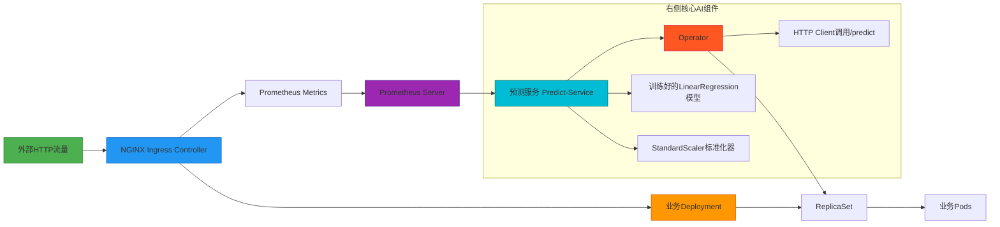
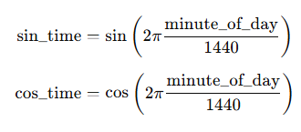
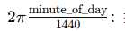
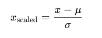

# AIOps实战：基于时序预测的Kubernetes自动扩缩容系统（上）


## 一、整体架构设计：Kubernetes 原生 AI 运维闭环系统

### 1、架构全景图



**中文注释说明：**  

- `NGINX Ingress Controller` 是 Kubernetes 集群的**统一入口网关**，负责七层路由、TLS终止、限流等；它原生暴露 `/metrics` 接口，供 Prometheus 抓取指标。  
- `Prometheus Server` 通过 ServiceMonitor 或直接抓取，持续采集 `nginx_ingress_controller_requests_total{controller="nginx"}` 等指标，并通过 PromQL 计算 QPS（如 `rate(nginx_ingress_controller_requests_total[5m])`）。  
- `Predict-Service` 是一个 Flask Web 服务，接收 HTTP GET 请求，内部调用已训练模型，输入当前时间 + QPS，输出推荐副本数（replicas）。  
- `Operator` 是 Kubernetes 自定义控制器，遵循 Operator Pattern，周期性（30s）调用 `/predict`，获取结果后 PATCH `Deployment.spec.replicas`，实现声明式弹性扩缩容。

## 二、核心知识点详解

### 1、知识点 1：时间周期性编码 —— 正弦/余弦特征工程

#### 1.**为什么不能直接用“小时”或“分钟”作为模型输入？**  

假设你有一个时间序列特征 `minute_of_day`，范围是 **0~1439**（一天总共有 1440 分钟）。

如果直接喂给模型：

- 0 分 → 0
- 1 分 → 1
- …
- 1439 分 → 1439

模型看到的只是一个 **线性数值**。问题来了：

1. **周期性特征被忽略**
   - 00:01 和 23:59 在物理上几乎连续（相隔 2 分钟），但数值上差 1438。
   - 模型会认为这两个时间点“相距很远”，完全违背实际业务规律。
2. **边界问题（首尾不连续）**
   - 如果模型试图拟合一天的规律（比如交通流量或电商访问量），首尾时间的模式连续性会被破坏。
   - 很多模型（线性回归、树模型、神经网络）对这种线性边界敏感，可能出现 **拟合错误**。

**结论**：直接用线性时间会让周期性模式无法被模型理解。

#### 2.**解决方案：正弦-余弦时间嵌入（Sine-Cosine Time Embedding）**  

关键思路：把线性时间映射到 **单位圆** 上，让“时间”具有 **周期性几何结构**。

##### 1）公式

假设 `minute_of_day` 表示一天中的分钟数（0~1439）：

- `sin_time = sin(2π × minute_of_day / 1440)`  

- `cos_time = cos(2π × minute_of_day / 1440)`  



该变换将线性时间转化为二维周期向量，保证相邻时刻在特征空间中距离极小。

>解释：
>
>- 把一天划分成一个完整的圆（360° = 2π 弧度)。
>- `sin` 和 `cos` 分别对应 x 和 y 坐标。
>
>这样，每一个时间点都可以映射到一个 **二维向量** sin, cos，在单位圆上顺时针/逆时针循环。

##### 2）单位圆示意图

```ascii
         ↑ y (cos)
         |
   12:00 ● (0,1)      06:00 ● (0,-1)
         | 
         |     ● (1,0) → x (sin)
00:00 ● —+———————→     18:00 ● (-1,0)
         |
         |
```

> 解释：
>
> - **0:00** → (0,1)
> - **06:00** → (1,0)
> - **12:00** → (0,-1)
> - **18:00** → (-1,0)
>
> 优点：
>
> 1. 首尾连续：0:00 和 23:59 在单位圆上几乎重合。
> 2. 距离表示真实时间间隔：模型可以计算向量距离，而不是线性差值。

#### 3.为什么要用 `sin` 和 `cos` 两个维度？

>- 如果只用 `sin`：
>  - 06:00 和 18:00 都映射到同一个 `sin=1` 或 `-1`，**无法区分上午/下午**。
>- 加上 `cos`：
>  - 每个时间点都有唯一的二维表示。
>  - 模型可以区分 **时间顺序和周期位置**。
>
>换句话说，`(sin, cos)` = “时间在圆上的坐标”，完美解决周期性问题。

### 2、知识点 2：Pandas DataFrame 数据结构

Pandas DataFrame 是 Python 数据科学的**核心内存表结构**，本质为带行列索引的二维数组，功能远超 Excel：  

- **行索引（Index）**：默认为整数序列（0,1,2…），支持自定义时间戳、字符串等；  
- **列（Columns）**：每列为 Series，支持向量化运算（如 `df['qps'] > 100` 返回布尔数组）；  
- **数据类型**：自动推断（int64, float64, datetime64[ns], object），支持混合类型；  
- **核心操作**：`df.read_csv()` 加载、`df.dropna()` 清洗、`df.groupby().agg()` 聚合、`df.merge()` 关联。

```ascii
DataFrame 示例（3行×4列）：
       time   qps  instance  sin_time
0  00:00:00  12.0       2.0    0.000
1  00:10:00  15.3       2.0    0.044
2  00:20:00  18.7       3.0    0.087
↑ 行索引   ↑ 列名      ↑ 列数据（Series）
```

> **优势**：内存高效、语法简洁、生态完善（无缝对接 scikit-learn、Matplotlib）。

### 3、知识点 3：scikit-learn 标准化（StandardScaler）原理（≥170字）

#### 1.为什么要标准化？

>很多机器学习模型（尤其是线性回归、SVM、神经网络）对 **特征的量纲和数值范围** 非常敏感：
>
>- 比如你的特征有两个：
>  - `QPS`（每秒请求数）：[10, 50, 100]
>  - `sin_time`（时间周期编码）：[-1, 0, 1]
>
>如果直接输入模型：
>
>- QPS 数值范围大，sin_time 数值范围小
>- 梯度下降更新参数时，会被 QPS 主导，导致：
>  - 损失函数对小量级特征贡献很小
>  - 梯度震荡或收敛缓慢
>  - 模型难以同时学习所有特征的规律
>
>**结论**：不同量纲的特征必须统一尺度，避免数值不平衡问题。

#### 2.StandardScaler 的原理

##### 1)介绍

StandardScaler 使用 **Z-score 标准化**，公式为：

>其中：
>
>- $\mu$ = 训练集特征均值
>- $\sigma$ = 训练集特征标准差
>
>效果：
>
>1. 标准化后的特征均值 ≈ 0
>2. 标准差 ≈ 1
>3. 不同特征尺度统一，损失函数对各特征贡献均衡

##### 2)举例说明

假设训练集：

| 特征     | 原始值        |
| -------- | ------------- |
| QPS      | 10, 50, 100   |
| sin_time | 0.1, 0.2, 0.3 |

计算均值和标准差：

- QPS: μ = (10+50+100)/3 = 53.33, σ ≈ 37.74
- sin_time: μ = 0.2, σ ≈ 0.0816

标准化后：

\text{QPS_scaled} = \frac{[10,50,100]-53.33}{37.74} \approx [-1.15, -0.09, 1.26]\text{sin_scaled} = \frac{[0.1,0.2,0.3]-0.2}{0.0816} \approx [-1.22, 0.0, 1.22]

可以看到：

- 两个特征都在 **[-1.5, 1.5]** 范围内
- 模型训练时不会被 QPS 主导，可以平等学习两者规律

##### 3)使用方法

```python
from sklearn.preprocessing import StandardScaler

# 训练集标准化
scaler = StandardScaler()
X_train_scaled = scaler.fit_transform(X_train)

# 测试集/新数据
X_test_scaled = scaler.transform(X_test)  # 只用训练集均值和方差

```

>**注意点**：
>
>1. **测试集或推理新数据不能再 fit**，否则会泄露信息（data leakage）
>2. **保存 scaler**（如 `scaler.pkl`）以便生产环境使用

### 4、知识点 4：模型持久化与服务化（joblib + Flask）

#### 1.为什么要模型持久化？

>在 Python 里，训练好的模型本质上是 **内存中的对象**：
>
>- 变量一旦程序退出或服务器重启就会丢失
>- 无法直接在不同程序或不同时间使用
>
>**解决方案**：将模型**序列化**成文件保存下来，下次直接读取，而不用重新训练。

#### 2.joblib 序列化

>**joblib** 是 Python 中专门针对 NumPy 数组和大型模型的高效序列化工具，比标准 `pickle` 更快、更节省空间。

##### 1)保存模型

```python
import joblib

joblib.dump(model, 'model.pkl')
```

##### 2)加载模型

```python
model = joblib.load('model.pkl')
```

##### 3)优点

>1. 支持跨 Python 版本（兼容性较好）
>2. 高效存储大型数组
>3. 恢复后可以直接调用 `.predict()`
>
>注意：标准化器（StandardScaler）也需要同样序列化保存，否则生产环境新数据无法标准化。

#### 3.Flask 服务化封装

>**目的**：让模型可以通过 HTTP 请求实时预测，提供 API 接口。

##### 1)核心流程

###### ①定义 REST API

```python
from flask import Flask, jsonify

app = Flask(__name__)

@app.route('/predict', methods=['GET'])
def predict():
    # 下面步骤实现模型预测
    ...

```

###### ②获取实时特征

```python
qps = get_qps_from_prometheus()  # 从监控系统获取 QPS
minute_of_day = current_time.hour * 60 + current_time.minute
sin_time = np.sin(2*np.pi*minute_of_day/1440)
cos_time = np.cos(2*np.pi*minute_of_day/1440)
```

###### ③构造特征向量

```python
X = np.array([[qps, sin_time, cos_time]])
X_scaled = scaler.transform(X)  # 使用训练集的 StandardScaler
```

###### ④预测实例数量

```python
pred = model.predict(X_scaled)
pred_int = max(1, min(20, int(pred)))  # 限制范围
```

###### ⑤返回 JSON

```python
return jsonify({"instance": pred_int})
```

###### ⑥响应示例

```python
GET http://localhost:8080/predict
↓
{
  "qps": 18.7,
  "time": "00:20:00",
  "sin_time": 0.087,
  "cos_time": 0.996
}
↓
HTTP 200 OK
{"instance": 3}
```

>客户端发起请求 → 服务端计算特征 → 模型预测 → 返回 JSON
>
>JSON 格式标准，方便前端或自动化系统解析

#### 4.生产建议

>**Gunicorn 多进程**
>
>- Flask 自带开发服务器适合调试，不适合高并发
>- Gunicorn 可以启动多个 worker 进程，提高吞吐量
>
>**Nginx 反向代理**
>
>- 做负载均衡、HTTPS、日志记录
>- 对接 Gunicorn，保证稳定服务
>
>**健康检查 `/healthz`**
>
>- 定期检测服务是否可用
>- 运维系统可以自动重启或报警
>
>**统一序列化文件**
>
>- 模型 `model.pkl` + 标准化器 `scaler.pkl`
>- 推理时必须使用同一套文件，否则预测可能偏差很大


### 5、知识点 5：Prometheus 指标采集链路（≥160字）

NGINX Ingress Controller 默认**不暴露 metrics**，需显式启用：  

1. Helm 安装时设置参数：  

   ```bash
   --set controller.metrics.enabled=true \
   --set controller.metrics.serviceMonitor.enabled=true \
   --set controller.metrics.prometheusRule.enabled=true
   ```

2. 启用后，Controller 暴露端口 `10254/metrics`，内容为文本格式指标：  

   ```
   # HELP nginx_ingress_controller_requests_total Global count of processed requests.
   # TYPE nginx_ingress_controller_requests_total counter
   nginx_ingress_controller_requests_total{controller="nginx",controller_class="k8s.io/ingress-nginx",...} 12345
   ```

3. Prometheus 通过 `rate(nginx_ingress_controller_requests_total[5m])` 计算每秒请求数（QPS），窗口内求导避免瞬时抖动。

```ascii
采集链路图：
Ingress Pod → /metrics (text) → Prometheus Scraping → TSDB存储 → PromQL查询
          ↑
      Helm参数开启
```

> **验证命令**：`curl http://<ingress-pod-ip>:10254/metrics | grep requests_total`

## 三、结语：从理论到落地的完整闭环

本课程构建了一个**端到端 AIOps 自动扩缩容系统**：  
**数据层**：CSV 时间序列 → Pandas 清洗 → 正弦余弦编码；  
**模型层**：scikit-learn 线性回归 → MSE 评估 → joblib 持久化；  
**服务层**：Flask API → Prometheus 实时 QPS → 标准化推理；  
**编排层**：Kubernetes Operator → 定期调用 → Deployment 动态更新。