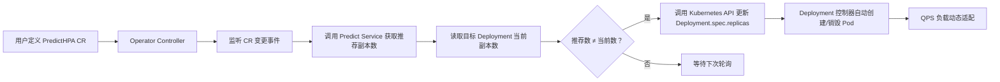
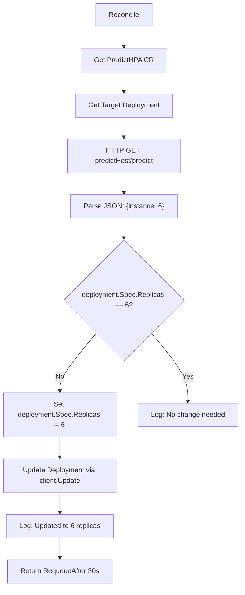

# 基于预测模型的Kubernetes自定义Operator弹性扩缩容实践


## 一、Operator 核心定位与架构全景图

Operator 是 Kubernetes 的“智能运维机器人”，它将领域知识（如 AI 模型推理逻辑、弹性扩缩规则）编码为自定义控制器，实现对 `CustomResource`（CR）的声明式管理。



> **知识点详解：Kubernetes Operator 架构**  
> Operator 由三部分构成：**CustomResourceDefinition (CRD)** 定义新资源类型（如 `PredictHPA`）；**Custom Resource (CR)** 是用户编写的 YAML 实例；**Controller** 是核心逻辑，持续监听 CR 变更，并通过 Client-go 调用 Kubernetes API 执行操作。其本质是“将运维脚本封装为 Kubernetes 原生组件”，实现 GitOps 风格的自动化。Operator 不是替代 HPA，而是**增强型 HPA**——HPA 基于 CPU/Memory 等指标，而本例基于 AI 模型预测的 QPS-Replicas 映射关系，具备前瞻性与业务语义感知能力。

## 二、代码开发全流程逐行详解

### 1、步骤 1：初始化项目结构

```bash
mkdir hpa-operator
cd hpa-operator
go mod init hpa-operator
kubebuilder init --domain example.com --repo hpa-operator
```

> 🔍 **ASCII 项目结构图解**  
>
> ```
> hpa-operator/
> ├── api/                 # 存放 CRD 定义（Go struct）
> │   └── v1/              # 版本 v1
> │       ├── predicthpa_types.go   ← 核心：定义 PredictHPA 字段
> │       └── groupversion_info.go
> ├── controllers/         # 存放控制器逻辑
> │   └── predicthpa_controller.go  ← 核心：Reconcile 业务逻辑
> ├── config/              # K8s 部署清单（RBAC、CRD、Manager）
> │   ├── crd/             # 自动生成的 CRD YAML
> │   ├── default/         # Manager Deployment + RBAC
> │   └── samples/         # 用户示例 CR YAML（predicthpa.yaml）
> ├── main.go              # Controller 启动入口
> └── go.mod
> ```

### 2、步骤 2：定义 PredictHPA CustomResource（`api/v1/predicthpa_types.go`）

```go
// +kubebuilder:object:root=true
// +kubebuilder:subresource:status
type PredictHPA struct {
    metav1.TypeMeta   `json:",inline"`
    metav1.ObjectMeta `json:"metadata,omitempty"`

    Spec   PredictHPASpec   `json:"spec,omitempty"`
    Status PredictHPAStatus `json:"status,omitempty"`
}

type PredictHPASpec struct {
    // +kubebuilder:validation:Required
    DeploymentName string `json:"deploymentName"` // ← 控制哪个 Deployment？
    // +kubebuilder:validation:Required
    PredictHost string `json:"predictHost"` // ← 推理服务 URL，如 http://ml-python:8080
    // 可选：Namespace string `json:"namespace,omitempty"` // 本例省略，使用同命名空间
}
```

> **知识点详解：Kubernetes CustomResource 设计原则**  
> CR 必须包含 `TypeMeta`（标识资源类型）与 `ObjectMeta`（元数据如 name/namespace）。`Spec` 字段描述**期望状态**（Desired State），是用户唯一需填写的部分；`Status` 字段描述**实际状态**（Actual State），由 Controller 自动更新。`+kubebuilder` 注释是代码生成指令：`object:root` 表示根资源，`subresource:status` 启用独立 status 子资源（支持 `kubectl patch status`）。字段必须加 `json:"xxx"` 标签，否则 YAML 序列化失败；`validation:Required` 保证该字段不可为空，提升健壮性。

### 3、步骤 3：编写核心控制器逻辑（`controllers/predicthpa_controller.go`）

#### 1.Reconcile 主流程



#### 2.关键代码片段（含详细注释）

```go
func (r *PredictHPAReconciler) Reconcile(ctx context.Context, req ctrl.Request) (ctrl.Result, error) {
    log := r.Log.WithValues("predicthpa", req.NamespacedName)

    // Step 1: Get PredictHPA CR
    var hpa v1.PredictHPA
    if err := r.Get(ctx, req.NamespacedName, &hpa); err != nil {
        log.Error(err, "unable to fetch PredictHPA")
        return ctrl.Result{}, client.IgnoreNotFound(err) // ← 忽略 CR 被删场景
    }

    // Step 2: Get Target Deployment
    var dep appsv1.Deployment
    depNamespacedName := types.NamespacedName{
        Name:      hpa.Spec.DeploymentName,
        Namespace: req.Namespace, // ← 同命名空间
    }
    if err := r.Get(ctx, depNamespacedName, &dep); err != nil {
        log.Error(err, "unable to fetch Deployment")
        return ctrl.Result{}, err
    }

    // Step 3: Call Predict Service
    recommendReplicas, err := r.getRecommendReplicas(hpa.Spec.PredictHost)
    if err != nil {
        log.Error(err, "fail to get recommend replicas")
        return ctrl.Result{RequeueAfter: 30 * time.Second}, nil // ← 失败后30秒重试
    }

    // Step 4: Compare & Update if needed
    if *dep.Spec.Replicas != int32(recommendReplicas) {
        log.Info("Updating replicas", "current", *dep.Spec.Replicas, "recommended", recommendReplicas)
        dep.Spec.Replicas = &[]int32{int32(recommendReplicas)}[0] // ← Go 语法糖：取地址

        // 使用 RetryOnConflict 防止并发更新冲突
        err = retry.RetryOnConflict(retry.DefaultRetry, func() error {
            return r.Update(ctx, &dep)
        })
        if err != nil {
            log.Error(err, "fail to update Deployment")
            return ctrl.Result{}, err
        }
        log.Info("Updated Deployment replicas", "replicas", recommendReplicas)
    }

    return ctrl.Result{RequeueAfter: 30 * time.Second}, nil // ← 固定间隔轮询
}
```

> **知识点详解：Client-go RetryOnConflict 机制（≥120字）**  
> Kubernetes API 是乐观并发控制（OCC）：当两个客户端同时更新同一对象时，后提交者会收到 `409 Conflict` 错误。`retry.RetryOnConflict` 是官方提供的容错方案——它捕获 `IsConflict` 错误，自动重新 `GET` 最新版本，再执行更新逻辑，直至成功或超时。这避免了手动实现“读-改-写”循环的复杂性与竞态风险。`DefaultRetry` 提供指数退避策略（初始100ms，最大32.7s），是生产环境必备实践。若不使用，高并发场景下 Operator 将频繁报错并中断。

### 4、步骤 4：实现 HTTP 请求函数（`getRecommendReplicas`）

```go
func (r *PredictHPAReconciler) getRecommendReplicas(host string) (int, error) {
    // 构造 URL: http://<host>/predict
    url := fmt.Sprintf("http://%s/predict", host)
    resp, err := http.Get(url)
    if err != nil {
        return 0, fmt.Errorf("failed to call predict service: %w", err)
    }
    defer resp.Body.Close()

    if resp.StatusCode != http.StatusOK {
        return 0, fmt.Errorf("predict service returned %d", resp.StatusCode) // ← 关键：捕获 404！
    }

    body, err := io.ReadAll(resp.Body)
    if err != nil {
        return 0, fmt.Errorf("failed to read response body: %w", err)
    }

    // 定义响应结构体（仅含 instance 字段）
    var data struct {
        Instance int `json:"instance"`
    }
    if err := json.Unmarshal(body, &data); err != nil {
        return 0, fmt.Errorf("failed to unmarshal JSON: %w", err)
    }

    return data.Instance, nil
}
```

> **知识点详解：JSON Unmarshal 安全实践（≥120字）**  
> 直接 `json.Unmarshal` 到匿名结构体是高效且安全的做法。`Instance int` 字段使用 `json:"instance"` 标签精确匹配响应字段名；若 API 返回 `{}` 或 `{"error":"xxx"}`，`Unmarshal` 会静默忽略不存在字段，但 `data.Instance` 将为 0（Go 零值），此时需结合 HTTP 状态码判断有效性。**绝不可**使用 `map[string]interface{}` 动态解析，因其丧失类型安全、易引发 panic，且无法校验必填字段。本例中 `instance` 是整数，若 API 返回字符串 `"6"`，`Unmarshal` 会自动转换；若返回 `"invalid"`，则触发错误，符合防御性编程原则。

## 三、部署与调试全流程图解

### 1、部署清单依赖关系

```
┌───────────────────────┐     ┌───────────────────────┐     ┌──────────────────────────┐
│  predicthpa.yaml      │     │  ml-python-deploy.yaml│     │  hpa-operator-deploy.yaml│
│  - deploymentName: qps│     │  - image: ml-python   │     │  - image: hpa-operator   │
│  - predictHost: ml-py │────▶│  - port: 8080         │────▶│  - serviceAccount: hpa   │
└───────────────────────┘     └───────────────────────┘     └──────────────────────────┘
          ▲                           ▲                           ▲
          │                           │                           │
          └───────────────────────────┴───────────────────────────┘
                              RBAC 权限链：hpa SA → hpa-role → apps/deployments
```

> **知识点详解：Kubernetes RBAC 权限最小化原则（≥120字）**  
> Operator 必须通过 ServiceAccount（SA）运行，并绑定 Role/ClusterRole 获取权限。本例需 `apps/v1 Deployments` 的 `get/list/watch/update/patch` 权限——`list/watch` 用于发现 Deployment，`get` 用于读取当前副本数，`update/patch` 用于修改 `spec.replicas`。**严禁**使用 `cluster-admin`，应遵循最小权限原则：在 `config/rbac/role.yaml` 中精确声明 `rules`，并通过 `kubebuilder create api` 自动生成。调试时若遇 `cannot list deployments`，必查 `kubectl auth can-i --list --as=system:serviceaccount:default:hpa-operator`，验证权限是否生效。

## 四、典型故障排查图谱

```
PredictHPA 不工作？
├── [HTTP 404] → 检查 predictHost URL 是否正确？Service 名称/端口是否匹配？
│                 ↓
│           kubectl get svc -n default  # 确认 ml-python Service 存在且端口为 8080
├── [RBAC Denied] → 检查 ServiceAccount 绑定的 Role 是否包含 apps/deployments 权限？
│                 ↓
│           kubectl describe rolebinding hpa-operator-manager-rolebinding
├── [Image Platform] → M1 Mac 构建的镜像（arm64）无法在 x86_64 集群运行？
│                 ↓
│           docker buildx build --platform linux/amd64 -t ...  # 强制指定平台
└── [CrashLoopBackOff] → 查看日志：kubectl logs -f deploy/hpa-operator
                        ↓
                  kubectl describe pod -l control-plane=controller-manager  # 查看 Crash 原因
```

>  **知识点详解：跨平台镜像构建（≥120字）**  
> Apple Silicon（M1/M2）Mac 默认构建 `linux/arm64` 镜像，而多数云服务器为 `linux/amd64`（即 MD64）。直接部署会导致 `exec format error`。解决方案是启用 Docker Buildx 多平台构建：`docker buildx build --platform linux/amd64 -t your-repo/hpa-operator:latest .`。需先启用 Buildx：`docker buildx install` 并在 Docker Desktop 设置中开启 `Use the new BuildKit engine`。这是云原生开发的必备技能，忽略将导致 Operator 在生产环境完全不可用。

## 五、总结：ALOps Operator 的工程价值

本 Operator 实现了 **“AI 模型即服务（MaaS）+ Kubernetes 原生编排”** 的闭环：

- **输入**：实时 QPS 指标（由 Prometheus 抓取）→ **模型推理** → **输出**：推荐副本数 → **K8s 执行** → **负载自适应**。
- 其核心价值在于**将 AI 决策嵌入基础设施层**，使扩容决策从“滞后响应”（HPA）升级为“前瞻预测”（ALOps），显著提升资源利用率与 SLA 保障能力。

> **课后思考题指引（供延伸学习）**  
> 提升预测准确度的方案包括：① **特征工程**：引入历史 QPS 趋势、时间周期（小时/星期）、错误率等多维特征；② **模型迭代**：用 Prophet 或 LSTM 替代简单线性回归；③ **在线学习**：每小时用新数据微调模型；④ **A/B 测试框架**：并行部署多个模型版本，按流量比例分流并对比效果。代码层面需扩展 `predictHost` 接口为 `/predict?feature=...`，并在 Operator 中构造特征向量。

