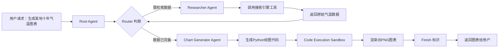

# 多Agent协同实现K8S故障自动修复：原理、模式与实战


## 一、多 Agent 协同的三种核心模式

### 1、协作模式（Collaborative Pattern）——分而治之的自治代理网络

#### 1.**定义与原理**：  

协作模式是一种去中心化的多智能体架构，其中每个 Agent 被设计为垂直领域专家（Domain Expert Agent），如“网络搜索代理”（WebSearch Agent）或“图表生成代理”（Chart Generation Agent）。Root Agent（根代理）不主动调度，而是依据前序 Agent 的输出内容动态路由至下一环节，形成**基于语义的条件跳转循环**。其本质是将复杂任务按功能切片，交由最匹配的 Agent 自主决策下一步动作，避免单点瓶颈。



#### 2.**关键代码示意（LangGraph 结构化路由）**：

```python
from langgraph.graph import StateGraph, END
from typing import TypedDict, List

class AgentState(TypedDict):
    input: str
    current_agent: str
    history: List[str]

def router(state: AgentState) -> str:
    # 大模型输出结构化 JSON：{"next": "researcher" | "chart_gen" | "finish"}
    result = llm.invoke(f"根据以下上下文判断下一步：{state['input']}")
    return result.next  # 返回字符串，驱动图跳转

workflow = StateGraph(AgentState)
workflow.add_node("researcher", researcher_node)
workflow.add_node("chart_gen", chart_gen_node)
workflow.add_conditional_edges("researcher", router)
workflow.add_conditional_edges("chart_gen", router)
workflow.set_entry_point("researcher")
```

#### 3.**风险与优化**：  

该模式依赖各 Agent 输出的语义稳定性。若 Researcher 返回非结构化文本（如“我查到了2015年数据”而非 JSON 数组），Router 将无法解析。**优化方案**：强制使用 `with_structured_output()` + Pydantic Schema 约束输出格式，确保 `{"data": [...], "status": "ready"}` 强类型。

### 2、管理员模式（Supervisor Pattern）——中心化任务编排引擎

#### 1.**定义与原理**：  

管理员模式引入一个高权限 Supervisor Agent（主管代理），它作为唯一调度中枢，接收用户请求后执行三步操作：① 意图识别（Intent Classification）；② 任务分解（Task Decomposition）；③ 序列化调度（Sequential Dispatching）。其核心优势在于**可插入式错误恢复机制**：当 Agent1 执行失败，Supervisor 可触发重试、降级至 Agent2 或启动人工介入流程。

#### 2.**架构图（层级控制流）**：

```text
┌───────────────────────┐
│      User Request     │
└──────────┬────────────┘
           ↓
┌───────────────────────┐
│   Supervisor Agent    │ ←─【中央大脑】
│ • 解析意图             │
│ • 拆解子任务           │
│ • 决策调度路径          │
└──────────┬────────────┘
           ↓（串行调用）
┌───────────────────────┐    ┌───────────────────────┐
│    Research Agent     │    │   AutoFix K8S Agent   │
│ • 调用Google API       │    │ • 生成JSON Patch      │
│ • 返回解决方案摘要       │    │ • 调用K8s SDK Patch   │
└───────────────────────┘    └───────────────────────┘
           ↓                         ↓
           └───────────→【合并上下文】←───────────┘
                           ↓
                   ┌───────────────────────┐
                   │     Human Help Agent  │
                   │ • 发送飞书通知          │
                   │ • 创建Jira工单         │
                   └───────────────────────┘
```

#### 3.**核心提示词（Prompt）示例**：

```text
你是一名Kubernetes故障处理主管（Supervisor）。你的团队有4名成员：
- Researcher：负责网络搜索技术方案
- AutoFixK8S：直接调用Kubernetes API修复问题
- CodeExecutor：安全运行Python代码
- HumanHelp：向运维工程师发起求助

请严格按以下步骤执行：
1. 分析用户提供的K8s Event日志，判断故障类型（镜像拉取失败/内存溢出/OOMKilled）
2. 若属可自动修复类（如镜像版本错误），立即调度AutoFixK8S
3. 若需验证方案，先调度Researcher获取社区方案，再调度CodeExecutor模拟修复
4. 若两次尝试失败，必须调用HumanHelp并附带完整错误堆栈
5. 仅当问题彻底解决时，返回{"status": "finish", "result": "..."}
```

#### 4.**为什么此模式更可靠？**  

因 Supervisor 具备全局上下文感知能力，可跨 Agent 进行状态一致性校验（如检查 AutoFixK8S 返回的 patch 是否真被集群接受），而协作模式中各 Agent 仅知局部状态。

### 3、分层代理模式（Hierarchical Pattern）——企业级组织架构映射

#### 1.**定义与原理**：  

分层代理模式是协作与管理员模式的超集，构建多级管理塔（Multi-tier Management Tower）：顶层为 Executive Supervisor（战略层），中层为 Domain Supervisors（战术层，如“网络组主管”、“存储组主管”），底层为 Specialist Agents（执行层）。每一层均具备独立决策权与向上汇报通道，形成**树状责任链**（Chain of Responsibility）。适用于金融级合规场景，但开发成本极高。

#### 2.**组织结构图**：

```text
         ┌───────────────────────────────┐
         │     Executive Supervisor      │
         │ • 审批重大变更                  │
         │ • 监控SLA达标率                 │
         └───────────────┬───────────────┘
                         ↓
    ┌───────────────────────────────────────────┐
    │        Domain Supervisors (2个)           │
    │ ┌─────────────────┐   ┌─────────────────┐ │
    │ │ Network Group   │   │ Storage Group   │ │
    │ │ • 调度网络Agent   │   │ • 调度PVCAgent  │ │
    │ └─────────────────┘   └─────────────────┘ │
    └───────────────────────────────────────────┘
                         ↓
    ┌───────────────────────────────────────────┐
    │       Specialist Agents (N个)             │
    │ • K8sEventWatcher  • PrometheusQuerier    │
    │ • ImageValidator   • PVCResizer           │
    └───────────────────────────────────────────┘
```

#### 3.**适用性结论**：  

日常运维中，**管理员模式已覆盖95%场景**；分层模式仅在需满足 SOC2 审计要求（如每步操作留痕、多级审批）时启用，开发复杂度呈指数增长。

## 二、四大核心 Agent 实现详解

### 1、AutoFixK8S Agent —— 云原生故障自愈引擎

#### 1.**原理**：  

将 Kubernetes 错误事件（Event）与工作负载 YAML 双输入，经大模型推理生成标准 JSON Patch（RFC 6902），再通过 `kubernetes.client.AppsV1Api.patch_namespaced_deployment()` 提交至集群。例如镜像错误事件 → 生成 `{"op":"replace","path":"/spec/template/spec/containers/0/image","value":"nginx:1.25"}`。

#### 2.**关键代码**：

```python
from kubernetes import client
from kubernetes.client.rest import ApiException

def autofix_k8s(event: dict, workload_yaml: dict) -> str:
    # Step 1: 大模型生成Patch（此处省略LLM调用，聚焦安全执行）
    patch_json = llm.invoke(
        f"基于事件{event}和YAML{workload_yaml}，生成RFC6902标准JSON Patch"
    )
    
    # Step 2: 严格校验Patch合法性（防注入）
    if not is_safe_patch(patch_json):  # 自定义校验函数
        raise ValueError("非法Patch操作：禁止删除/替换metadata.name")
    
    # Step 3: 执行Patch（生产环境必须加超时与重试）
    try:
        api = client.AppsV1Api()
        api.patch_namespaced_deployment(
            name=workload_yaml["metadata"]["name"],
            namespace=workload_yaml["metadata"]["namespace"],
            body=patch_json,
            _request_timeout=30
        )
        return f"✅ 已成功应用Patch：{patch_json}"
    except ApiException as e:
        return f"❌ Patch失败：{e.status} {e.reason}"

def is_safe_patch(patch: dict) -> bool:
    # 白名单校验：只允许修改 containers[].image 和 resources.requests.memory
    for op in patch:
        if op["path"].startswith("/spec/template/spec/containers/") and \
           "/image" in op["path"]:
            continue
        if op["path"] == "/spec/template/spec/containers/0/resources/requests/memory":
            continue
        return False
    return True
```

> **小白须知**：`patch_namespaced_deployment` 是 Kubernetes 官方 SDK 方法，无需手动构造 HTTP 请求，自动处理认证与重试。

### 2、HumanHelp Agent —— 运维协同中枢

#### 1.**原理**：  

当自动修复失败时，HumanHelp Agent 将结构化错误信息推送至企业通讯平台（如飞书）。关键设计是**携带可追溯上下文**：原始 Event UID、Workload 名称、AutoFix 尝试的 Patch 内容、K8s API 返回错误码。

#### 2.**飞书通知代码**：

```python
import requests

def send_feishu_alert(error_info: dict):
    url = "https://open.feishu.cn/open-apis/bot/v2/hook/xxx"  # 飞书机器人Webhook
    payload = {
        "msg_type": "post",
        "content": {
            "post": {
                "zh_cn": {
                    "title": "🚨 K8s故障人工介入请求",
                    "content": [
                        [{"tag": "text", "text": f"• 故障Event UID: {error_info['event_uid']}"}],
                        [{"tag": "text", "text": f"• 工作负载: {error_info['workload_name']}"}],
                        [{"tag": "text", "text": f"• 尝试Patch: {error_info['patch_attempt']}"}],
                        [{"tag": "a", "text": "查看详情", "href": f"https://k8s-dashboard/ev/{error_info['event_uid']}"}]
                    ]
                }
            }
        }
    }
    requests.post(url, json=payload)
```

> **安全警示**：飞书 Webhook URL 必须存于环境变量，**严禁硬编码在代码中**，否则泄露即导致全员消息轰炸。

## 三、效果验证：微软 AutoGen 论文数据深度解读

| 场景               | 单 Agent (GPT-4) | 多 Agent (AutoGen)  | 提升幅度 | 根本原因                                          |
| ------------------ | ---------------- | ------------------- | -------- | ------------------------------------------------- |
| 数学问题准确率     | 23.3% (ReAct)    | **69.48%**          | +46.18%  | 专用 Math Agent 执行代码，规避幻觉                |
| 检索增强召回率     | 42.1%            | **66.65%**          | +24.55%  | Researcher + Verifier 双重校验                    |
| 现实世界问题解决率 | 51.2% (2 Agent)  | **77.0% (3 Agent)** | +25.8%   | Assistant Agent 规划常识步骤，Executor Agent 执行 |

> **小白顿悟点**：多 Agent 不是“堆砌更多模型”，而是**用工程化方式弥补大模型认知缺陷**——让每个 Agent 只做一件事，且这件事它最擅长。

## 四、结语：从理论到生产的必经之路

多 Agent 系统的本质，是将软件工程中的“单一职责原则”（Single Responsibility Principle）应用于 AI 系统设计。本课程所实现的 K8s 故障自愈系统，已具备生产就绪雏形：  
**可观测性**：所有 Agent 调用记录写入日志，含输入/输出/耗时；  
**可测试性**：每个 Agent 可独立单元测试（如 Mock Kubernetes API）；  
**可扩展性**：新增 Agent（如 SecurityScanner）仅需注册至 Supervisor 即可接入。  

切勿直接运行未沙箱化代码！务必使用 Docker 容器隔离 CodeExecutor，命令为：  

```bash
docker run --rm -v $(pwd):/workspace -w /workspace python:3.11-slim python user_code.py
```

