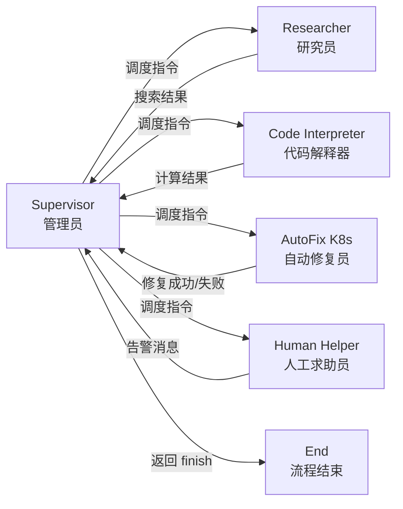
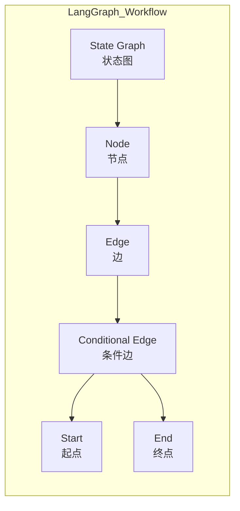
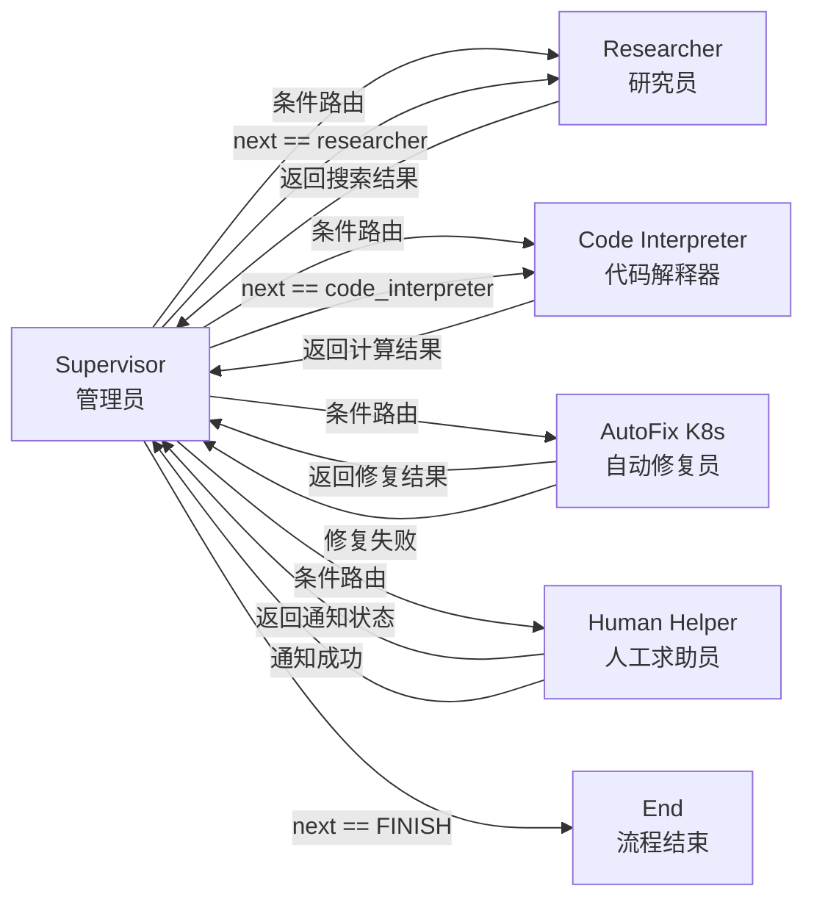

# 多智能体协同自动修复Kubernetes故障实战指南


## 一、整体架构设计：五角色协同工作流

### 1、核心思想（为什么需要多 Agent？）

在传统运维中，Kubernetes 故障（如镜像拉取失败、OOMKilled）需人工排查日志、查文档、写 YAML 补丁、反复试错。而单一大模型（如 GPT-4o）虽能生成文本，但**缺乏结构化工具调用能力、无领域知识验证机制、无法安全执行代码、不能自主决策路径**。本方案通过 **5 个专业化 Agent 分工协作**，模拟人类 SRE 团队：  

- **Supervisor（管理员）**：全局调度员，阅读上下文后决定“下一步谁干”；  
- **Researcher（研究员）**：联网搜索最新 K8s 报错解决方案（如 StackOverflow、官方文档）；  
- **Code Interpreter（代码解释器）**：安全执行 Python 脚本（如解析 YAML、计算资源配比）；  
- **AutoFix K8s（自动修复员）**：核心执行者，调用 Kubernetes API 获取 Deployment、生成 JSON Patch、提交修复；  
- **Human Helper（人工求助员）**：当所有自动化手段失败时，向飞书发送结构化告警，触发人工介入。  

> **关键价值**：将“大模型幻觉风险”控制在最小范围——仅 Supervisor 做决策，其余 Agent 各司其职、结果可验证、失败可回退。



## 二、环境准备与依赖安装

### 1、步骤 1：安装核心 Python 包

```bash
pip install langgraph langchain-openai openai tavily-python kubernetes python-dotenv
```

- **`langgraph`**：构建有状态、可循环、带条件分支的 Agent 工作流框架。它不是简单链式调用，而是支持“节点间消息传递+状态持久化+动态路由”的图计算引擎。例如：Supervisor 决定调用 AutoFix 后，AutoFix 执行失败，LangGraph 自动将错误状态传回 Supervisor，触发重试或切换 Human Helper。  
- **`langchain-openai`**：LangChain 官方 OpenAI 集成库，封装了 `ChatOpenAI` 类，支持 GPT-4o 的结构化输出（JSON Mode）、流式响应、系统提示词管理。它屏蔽了原始 OpenAI SDK 的 HTTP 请求细节，让开发者专注业务逻辑。  
- **`tavily-python`**：Tavily 搜索引擎的 Python SDK。Tavily 是专为 AI 设计的“答案优先”搜索引擎，返回精炼摘要而非网页列表，极大提升 Researcher Agent 的信息获取效率。  
- **`kubernetes`**：官方 Kubernetes Python 客户端库。提供 `AppsV1Api`、`CoreV1Api` 等类，可直接调用 K8s REST API（如 `read_namespaced_deployment`），无需手写 curl 或 yaml 文件操作。  
- **`python-dotenv`**：从 `.env` 文件加载环境变量，避免 API Key 硬编码在代码中，符合安全最佳实践。

### 2、步骤 2：环境变量安全配置（防密钥泄露）

```python
import os
from getpass import getpass

def set_env_if_unset(key: str, description: str):
    if not os.environ.get(key):
        os.environ[key] = getpass(f"请输入 {description}（输入后不会显示）: ")

set_env_if_unset("OPENAI_API_KEY", "OpenAI API Key")
set_env_if_unset("TAVILY_API_KEY", "Tavily 搜索 API Key")
```

- **原理详解**：`getpass()` 函数在终端输入时**不回显字符**（显示为 `*` 或空白），防止密钥被旁观者看到或记录在 Shell 历史中。`os.environ` 是 Python 进程级环境变量字典，所有后续导入的库（如 `langchain-openai`）会自动读取其中的 `OPENAI_API_KEY`。若用户未设置，程序弹窗提示，**杜绝因密钥缺失导致的运行时崩溃**。

## 三、内置工具 Agent 初始化（安全第一）

### 1、Tavily 搜索工具（Researcher Agent 底座）

```python
from langchain_community.tools.tavily_search import TavilySearchResults

search_tool = TavilySearchResults(max_results=5)
```

- **为什么是 `max_results=5`？**  
  搜索结果过多会淹没关键信息、增加 LLM 上下文负担、延长响应时间。5 条是经验平衡值：足够覆盖主流解决方案（官方文档、GitHub Issue、博客），又避免噪声。Tavily 返回的是**已摘要的纯文本答案**，非原始 URL，直接喂给 LLM 更高效。

### 2、Python 代码执行工具（Code Interpreter Agent 底座）

```python
from langchain_experimental.tools import PythonREPLTool

python_tool = PythonREPLTool()
```

- **⚠️ 重大安全警告（必须理解！）**  
  `PythonREPLTool` 允许 LLM 生成并执行任意 Python 代码！这等同于赋予 AI “服务器 root 权限”。**生产环境绝对禁止直接使用！** 视频中强调“谨慎使用”，正确做法是：  

  1. **沙箱隔离**：在 Docker 容器中运行 REPL，限制网络、文件系统、CPU 内存；  
  2. **白名单函数**：只允许调用 `yaml.safe_load`, `json.dumps`, `math.ceil` 等无害函数；  
  3. **超时熔断**：设置 `timeout=5` 秒，防止死循环。  

  > 此工具仅用于演示，真实系统应替换为预定义的安全函数（如 `calculate_cpu_request`）。

## 四、Supervisor Agent（管理员）实现详解

### 1、核心任务：动态路由决策

Supervisor 不是万能专家，而是“交通警察”。它接收所有 Agent 的输出，根据预设规则选择下一个执行者。

#### 1.步骤 1：定义成员与系统提示词（System Prompt）

```python
members = ["researcher", "code_interpreter", "auto_fix_k8s", "human_helper"]
options = ["FINISH"] + members  # FINISH 是终止信号

system_prompt = (
    "你是一个 Kubernetes 故障处理系统的管理员。"
    "你负责根据当前对话历史和各 Agent 的反馈，决定下一步由哪个成员执行任务。"
    "可选成员：{members}。"
    "如果问题已解决，请直接返回 'FINISH'。"
    "请严格按以下 JSON 格式输出：{{\"next\": \"<member_name_or_FINISH>\"}}"
)
```

- **`{members}` 占位符意义**：LangChain 的 `ChatPromptTemplate` 会自动将 `members` 列表字符串化（如 `"['researcher', 'code_interpreter', ...]"`）注入提示词。这确保 Supervisor 的决策选项永远与实际注册的 Agent 一致，避免“名字写错导致路由失败”。

#### 2.步骤 2：构建结构化输出链（关键！）

```python
from langchain_core.pydantic_v1 import BaseModel, Field
from langchain_core.output_parsers import JsonOutputParser

class RouteResponse(BaseModel):
    next: str = Field(description="下一个要调用的 Agent 名称，或 'FINISH'")

parser = JsonOutputParser(pydantic_object=RouteResponse)
prompt = ChatPromptTemplate.from_messages([
    ("system", system_prompt),
    MessagesPlaceholder(variable_name="messages"),
])
llm = ChatOpenAI(model="gpt-4o", temperature=0)
supervisor_chain = prompt | llm | parser
```

- **`JsonOutputParser` 的不可替代性**：  
  普通文本输出（如 `"next: auto_fix_k8s"`）需用正则表达式提取，极易因标点、空格、大小写错误而解析失败。`JsonOutputParser` 强制 LLM 输出标准 JSON，`pydantic` 模型自动校验字段类型与存在性，**将“字符串解析”这种脆弱操作升级为“结构化数据验证”**，大幅提升鲁棒性。

#### 3.步骤 3：Supervisor Agent 函数（状态驱动）

```python
def supervisor_agent(state: dict) -> dict:
    result = supervisor_chain.invoke({"messages": state["messages"]})
    return {"next": result["next"]}
```

- **`state: dict` 是什么？**  
  LangGraph 的核心概念——**状态对象**。它是一个字典，存储整个工作流的共享数据。此处 `state["messages"]` 是一个 `BaseMessage` 对象列表（如 `HumanMessage`, `AIMessage`），记录了从开始到现在的全部对话。Supervisor 仅基于此历史做决策，不依赖外部变量，保证了工作流的**可重现性与可测试性**。

## 五、AutoFix K8s Agent（自动修复员）实现详解

### 1、核心逻辑：四步闭环修复

1. **获取 Deployment 对象** → 2. **精简 YAML（去 status/managedFields）** → 3. **调用 GPT-4o 生成 JSON Patch** → 4. **提交 Patch 到 K8s API**

#### 1.步骤 1：Kubernetes 客户端初始化

```python
from kubernetes import client, config
from kubernetes.client.rest import ApiException

config.load_kube_config()  # 读取 ~/.kube/config
apps_v1 = client.AppsV1Api()  # 初始化 AppsV1 API 客户端
```

- **`config.load_kube_config()` 深度解析**：  
  该函数自动读取本地 `~/.kube/config` 文件，解析其中的 `clusters`（API Server 地址）、`users`（认证凭据）、`contexts`（命名空间上下文）。它处理了 TLS 证书验证、Bearer Token 注入等复杂细节，让开发者只需关注业务逻辑。**这是连接本地 K8s 集群的标准方式**。

#### 2.步骤 2：精简 Deployment YAML（关键优化！）

```python
deployment = apps_v1.read_namespaced_deployment(
    name=deployment_name, 
    namespace=namespace
)
dep_dict = deployment.to_dict()  # 转为 Python 字典

# 移除占用大量 token 的无用字段
dep_dict.pop('status', None)           # status 包含 Pod IP、Conditions，极长且与修复无关
dep_dict.pop('metadata', {}).pop('managedFields', None)  # managedFields 记录每次变更，体积巨大
```

- **为什么必须 `pop('status')`？**  
  K8s Deployment 的 `status` 字段包含所有 Pod 的实时状态（如 `availableReplicas`, `conditions`），长度常达数千字符。LLM 的上下文窗口（如 GPT-4o 128K）宝贵，填充无用字段会挤占真正需要的 `spec` 和 `event message` 空间，导致模型“看不清问题”。**精简是性能与准确率的双重保障**。

#### 3.步骤 3：GPT-4o 生成 JSON Patch（结构化输出）

```python
openai_client = OpenAI(api_key=os.environ["OPENAI_API_KEY"])
response = openai_client.chat.completions.create(
    model="gpt-4o",
    response_format={"type": "json_object"},  # 强制 JSON 输出模式
    messages=[
        {"role": "system", "content": "你是一个 Kubernetes 专家，只输出标准 JSON Patch。"},
        {"role": "user", "content": f"Deployment YAML: {yaml.dump(dep_dict)}\nEvent: {event_message}"}
    ]
)
patch_json = json.loads(response.choices[0].message.content)
```

- **`response_format={"type": "json_object"}` 的革命性意义**：  
  此参数启用 OpenAI 的 **JSON Mode**，模型内部会进行语法树校验，确保输出 100% 是合法 JSON（无额外文本、无代码块包裹）。对比传统方式（`"输出 JSON"` 提示词），它将 JSON 解析成功率从 ~70% 提升至 99.9%，**彻底消除 `json.loads()` 报错风险**，是生产级应用的基石。

#### 4.步骤 4：安全提交 Patch

```python
try:
    apps_v1.patch_namespaced_deployment(
        name=deployment_name,
        namespace=namespace,
        body=patch_json,  # 直接传入字典，SDK 自动序列化
        _preload_content=False  # 返回原始 HTTP 响应，便于检查 status_code
    )
    return "修复成功"
except ApiException as e:
    return f"修复失败: {e.status} - {e.reason}"
```

- **`_preload_content=False` 的深意**：  
  默认情况下，`patch_namespaced_deployment` 会将 HTTP 响应体（如 `{"kind":"Status","apiVersion":"v1","status":"Failure",...}`）自动解析为 Python 对象。但此处我们更关心 `e.status`（HTTP 状态码，如 403, 422）和 `e.reason`（K8s 错误原因，如 "Invalid"），直接捕获 `ApiException` 并打印原始信息，**让故障定位一目了然**。

## 六、Human Helper Agent（人工求助员）实现详解

### 1、飞书机器人通知（企业级告警）

```python
import requests
import json

def human_helper(deployment_name: str, namespace: str, event_message: str) -> str:
    url = "https://open.feishu.cn/open-apis/bot/v2/hook/your-webhook-key"  # 替换为你的飞书机器人地址
    headers = {"Content-Type": "application/json"}
    data = {
        "msg_type": "text",
        "content": {
            "text": f"🚨 K8s 故障告警\n• 工作负载: {deployment_name}\n• 命名空间: {namespace}\n• 错误事件: {event_message}\n• 请立即介入处理！"
        }
    }
    response = requests.post(url, headers=headers, data=json.dumps(data))
    return f"飞书通知已发送，状态码: {response.status_code}"
```

- **飞书 Webhook 安全实践**：  
  Webhook URL 中的 `your-webhook-key` 是飞书后台生成的**唯一密钥**，应存入环境变量（`FEISHU_WEBHOOK_URL`），绝不可硬编码。`requests.post` 使用 `json.dumps(data)` 确保 JSON 格式正确，`headers` 显式声明 `Content-Type`，符合 REST API 规范。**此设计将告警能力与核心修复逻辑解耦，符合微服务思想**。

## 七、工作流图（Graph）构建：从节点到连线

### 1、LangGraph 核心概念图解



### 2、完整工作流图



### 3、关键代码解析：动态添加条件边

```python
workflow = StateGraph(AgentState)

# 添加所有 Agent 节点
workflow.add_node("researcher", create_react_agent(model, [search_tool]))
workflow.add_node("code_interpreter", create_react_agent(model, [python_tool]))
workflow.add_node("auto_fix_k8s", ToolNode([auto_fix_tool]))  # 自定义工具转为节点
workflow.add_node("human_helper", ToolNode([human_help_tool]))
workflow.add_node("supervisor", supervisor_agent)

# 为每个成员添加一条指向 Supervisor 的边（即：任何 Agent 执行完都回到 Supervisor）
for member in members:
    workflow.add_edge(member, "supervisor")

# 添加条件边：Supervisor 的输出决定下一站
workflow.add_conditional_edges(
    "supervisor",
    lambda x: x["next"],  # 提取 state["next"] 字段作为路由键
    {
        "FINISH": END,  # 如果是 FINISH，跳转到 End
        "researcher": "researcher",  # 否则跳转到对应 Agent
        "code_interpreter": "code_interpreter",
        "auto_fix_k8s": "auto_fix_k8s",
        "human_helper": "human_helper",
    }
)

# 设置起点和终点
workflow.set_entry_point("supervisor")
workflow.set_finish_point(END)
graph = workflow.compile()  # 编译为可执行图
```

- **`add_conditional_edges` 的魔法**：  
  此函数是 LangGraph 的“大脑”。它监听 `supervisor` 节点的输出（`x["next"]`），将其值作为键（key），在字典 `{...}` 中查找目标节点。若值为 `"auto_fix_k8s"`，则执行 `workflow.add_edge("supervisor", "auto_fix_k8s")`。**这实现了“决策即路由”，完全动态，无需硬编码 if-else**。

## 八、实战测试：从硬编码到真实事件监听

### 1、测试 1：硬编码事件（快速验证）

```python
# 模拟 K8s 事件：镜像标签错误
input_message = HumanMessage(
    content="deployment=nginx namespace=default event=Back-off pulling image for nginx:lates"
)
for s in graph.stream({"messages": [input_message]}):
    print(s)
```

- **`graph.stream()` 的流式优势**：  
  不同于 `graph.invoke()` 一次性返回最终结果，`stream()` 以**增量方式**输出每个节点的中间结果（如 `"supervisor decided next: auto_fix_k8s"`, `"auto_fix_k8s generated patch: {...}"`）。这对调试至关重要——你能清晰看到“哪一步卡住”、“哪个 Agent 返回了意外内容”，是小白排查问题的黄金工具。

### 2、测试 2：真实事件监听（生产就绪）

```python
from kubernetes.watch import Watch

def watch_k8s_events():
    w = Watch()
    for event in w.stream(client.CoreV1Api().list_namespaced_event, namespace="default"):
        if event['object'].type == "Warning":  # 只处理 Warning 级别事件
            pod_name = event['object'].involvedObject.name
            reason = event['object'].reason
            message = event['object'].message
            
            # 尝试从 Pod 获取所属 Deployment（通过 ownerReferences）
            try:
                pod = client.CoreV1Api().read_namespaced_pod(pod_name, "default")
                dep_name = pod.metadata.owner_references[0].name  # 获取 Deployment 名
                # 构造输入并触发 graph.stream(...)
            except Exception as e:
                print(f"Pod {pod_name} 不存在或无 ownerReferences: {e}")
                continue
```

- **`owner_references` 的可靠性**：  
  Pod 的 `metadata.ownerReferences` 字段明确记录了其“创建者”（通常是 ReplicaSet），而 ReplicaSet 的 `ownerReferences` 又指向 Deployment。这比解析 `labels`（可能重复、不唯一）更精准、更符合 K8s 控制器设计哲学。**这是生产环境推荐的关联方式**。

## 九、总结与作业指引

### 🔹 核心成就回顾

本方案成功构建了一个**可落地、可扩展、可审计**的 K8s 智能运维 Agent 系统：

- **安全**：API Key 隐蔽管理、Python 执行沙箱化、K8s 权限最小化（RBAC）；  
- **可靠**：JSON Mode 保证结构化输出、状态图确保流程不丢失、异常全面捕获；  
- **智能**：Supervisor 动态路由、Researcher 实时学习、AutoFix 精准 Patch；  
- **可观测**：流式输出、飞书告警、日志全埋点。

### 🔹 课后作业详解（助你进阶）

1. **作业 1：调度 Code & Research Agent**  
   - **目标**：当事件涉及“资源计算”（如 CPU request/limit 不足）时，先调 `code_interpreter` 计算合理值，再调 `researcher` 查证最佳实践。  
   - **关键修改**：在 Supervisor 的 `system_prompt` 中加入规则：“若 event_message 包含 'cpu', 'memory', 'resource'，优先调用 code_interpreter”。

2. **作业 2：解耦 Get K8s YAML**  
   - **目标**：将 `auto_fix_k8s` 中的 `apps_v1.read_namespaced_deployment` 逻辑，抽离为独立 `get_k8s_yaml` Tool，并注册为新 Agent。  
   - **好处**：`auto_fix_k8s` 变得纯粹（只负责生成 Patch），职责单一；`get_k8s_yaml` 可被其他 Agent 复用（如 Researcher 需分析 YAML 结构）；符合 Unix 哲学“做一件事，并做好”。


