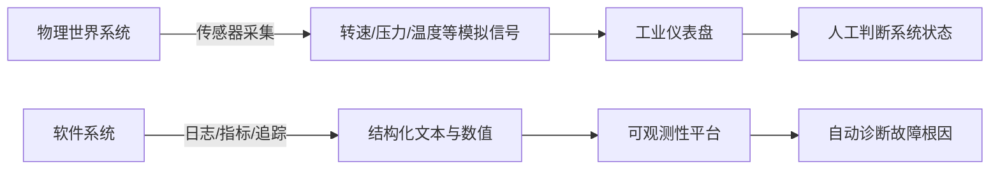
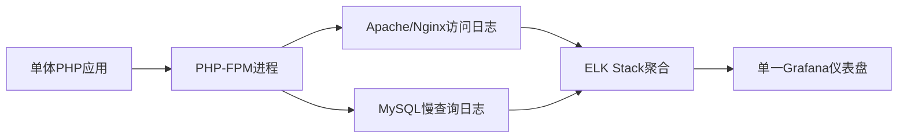
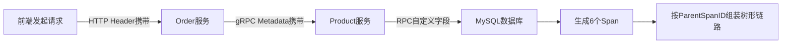
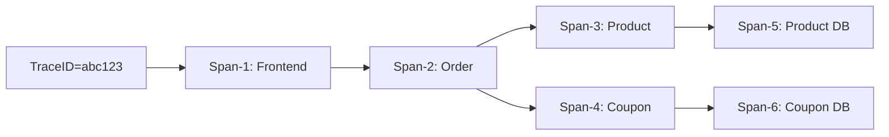
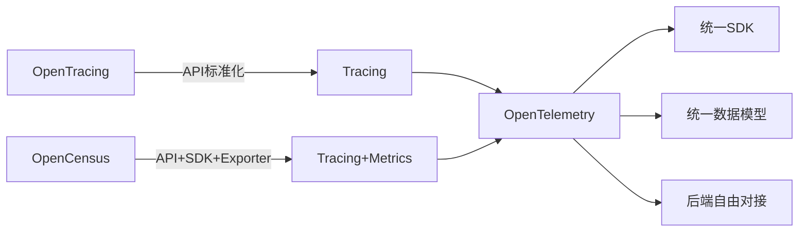
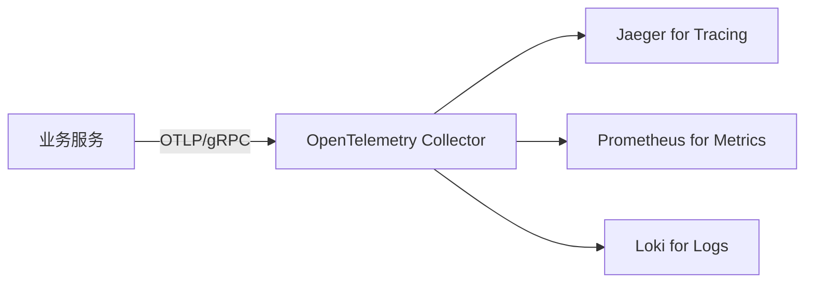
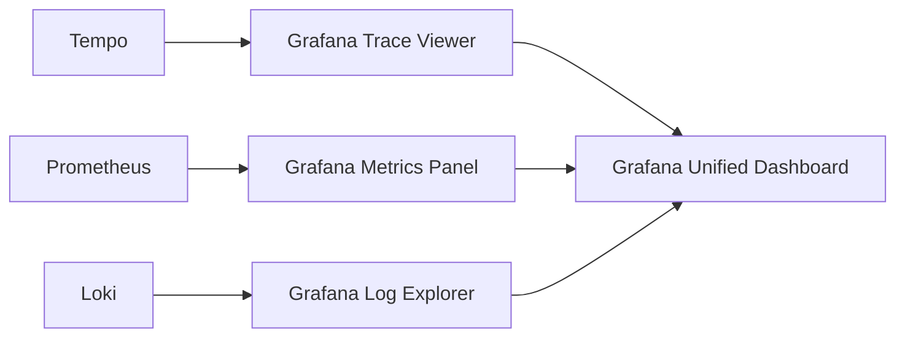

# OpenTelemetry 可观测性入门：从历史演进到统一标准


# 

## 一、可观测性（Observability）的本质与历史演进

### 1、知识点1：可观测性的控制论起源（1960年，鲁道夫·卡尔曼博士）

可观测性（Observability）并非IT专属概念，其数学根基源于**现代控制理论**。1960年，匈牙利裔美国科学家鲁道夫·卡尔曼（Rudolf E. Kalman）在《On the General Theory of Control Systems》中首次形式化定义：*若系统所有内部状态均可由其外部输出唯一确定，则该系统是可观测的*。工业领域率先实践——如图所示，工厂仪表盘上实时跳动的「电机转速」「阀门开度」「管道压力」「环境温度」等传感器读数，即为系统“输出”，工程师据此反推产线运行健康度。软件工程将其迁移：日志（Log）、指标（Metric）、追踪（Trace）三类输出，共同构成数字系统的“传感器阵列”。



> **字符图解**：  
>
> ```
> [工厂产线] ──(压力传感器)──→ [PLC控制器] ──→ [SCADA大屏]  
>  ↑                              ↓  
> [软件服务] ←─(OpenTelemetry SDK)←─ [K8s Pod日志+HTTP延迟+DB调用链]
> ```

## 二、单体架构 → 微服务架构的可观测性断层

### 1、知识点2：单体监控的局限性（Agent + PHP-FPM + New Relic）

单体应用时代，监控聚焦于**进程级资源**：通过部署`collectd`或`Zabbix Agent`采集PHP-FPM进程数、CPU占用率、内存RSS值；用`tail -f /var/log/php/error.log`配合`grep "Fatal error"`做日志告警；New Relic早期版本仅支持Java/.NET探针，对PHP需手动注入`newrelic_start_transaction()`。其本质是**垂直单点观测**——所有数据来自同一台服务器，无跨服务关联需求。



> **字符图解**：  
>
> ```
> ┌──────────────────────┐    ┌──────────────────────┐
> │   单体PHP服务器        │    │   监控中心            │
> │  ├─ CPU: 72%         │───→│  ├─ Grafana大盘       │
> │  ├─ 内存: 4.2GB/8GB   │    │  ├─ New Relic告警    │
> │  └─ 错误日志: 3条/分   │    │  └─ 日志关键词告警     │
> └──────────────────────┘    └──────────────────────┘
> ```

## 三、分布式追踪（Tracing）的核心机制

### 1、知识点3：Trace Context 传播三协议（HTTP Header / gRPC Metadata / RPC自定义字段）

微服务调用链中，`Trace Context`是贯穿请求生命周期的“DNA”。其传播依赖协议适配：

- **HTTP场景**：写入`uber-trace-id`（Jaeger）或`x-b3-traceid`（Zipkin）Header；
- **gRPC场景**：注入`Metadata`对象（键值对集合），等效于HTTP Header；
- **私有RPC**：需在序列化协议（如Protobuf）中预留`trace_id`、`span_id`字段。

> **字符图解（Jaeger格式）**：  
>
> ```
> uber-trace-id: 489b4a5c1e7d8f2a-1a2b3c4d5e6f7890-0-1
>              ↑              ↑         ↑  ↑
>         Trace ID      Span ID   ParentSpanID Flag(采样)
> ```



## 四、Span模型与调用链拓扑构建

### 1、知识点4：Span的六要素与父子关系（TraceID/SpanID/ParentSpanID/Start/End/Attributes）

一个Span代表**一次逻辑操作单元**，包含6个强制字段：

- `trace_id`：全局唯一请求标识（如`489b4a5c1e7d8f2a`）；
- `span_id`：当前操作唯一ID（如`1a2b3c4d5e6f7890`）；
- `parent_span_id`：上游调用方Span ID（根Span为`0000000000000000`）；
- `start_time`/`end_time`：纳秒级时间戳，计算耗时；
- `attributes`：KV对扩展属性（如`http.method=GET`, `db.statement=SELECT * FROM orders`）。

> **字符图解（6 Span调用链）**：  
>
> ```
> Span-1[Frontend]  
> ↓ (parent=Span-1)  
> Span-2[Order]  
> ├─↓ (parent=Span-2)  
> ├─Span-3[Product]  
> │     ↓ (parent=Span-3)  
> │   Span-5[Product DB]  
> └─↓ (parent=Span-2)  
>   Span-4[Coupon]  
>         ↓ (parent=Span-4)  
>       Span-6[Coupon DB]
> ```



## 五、三大追踪标准的演进与统一

### 1、知识点5：OpenTracing → OpenCensus → OpenTelemetry 的合并逻辑

- **OpenTracing（2016）**：CNCF项目，仅定义Tracing API（如`StartSpan()`），后端可插拔（Jaeger/Zipkin自由切换）；
- **OpenCensus（2018）**：Google主导，同时覆盖Tracing+Metrics，含API+SDK+Exporter三层，但语言支持少；
- **OpenTelemetry（2019）**：二者合并产物，**既提供多语言SDK（Go/Java/Python等12+），又保留后端无关性**，成为CNCF毕业项目。



> **字符图解（标准对比）**：  
>
> ```
> OpenTracing: 仅定义 interface Span { Start(); Finish() }  
> OpenCensus: 提供 ocagent_exporter.go + metrics.Counter("req_total")  
> OpenTelemetry: otel.Tracer("demo").Start(ctx, "http_handler")  
> ```

## 六、OpenTelemetry 架构全景图

### 1、知识点6：SDK + Collector + Backend 的三级数据流

OpenTelemetry采用**分层解耦设计**：

- **SDK层**：嵌入业务代码，自动注入HTTP/gRPC上下文，生成Span；
- **Collector层**：独立进程（DaemonSet），接收OTLP协议数据，支持过滤/采样/转换/重路由；
- **Backend层**：Jaeger/Prometheus/Loki等存储与展示系统，完全解耦。



> **字符图解（数据流向）**：  
>
> ```
> [Spring Boot App]  
>  ↓ (otel-javaagent自动注入)  
> [OTLP Exporter] → [Collector] → [Jaeger UI]  
>  ↓                ↓              ↓  
> [Prometheus Scraper] → [Grafana]  
>  ↓  
> [Loki Push API] → [Loki Storage]  
> ```

## 七、集成实践：从零构建可观测性技术栈

### 知识点7：Grafana 全家桶（Tempo+Prometheus+Loki+Grafana）

推荐生产级组合方案：

- **Tracing**：Grafana Tempo（原生支持OTLP，轻量级替代Jaeger）；
- **Metrics**：Prometheus（Pull模式采集，Alertmanager配置告警）；
- **Logs**：Loki（索引less设计，与Prometheus标签体系一致）；
- **UI**：Grafana（同一界面联动查询Trace/Metric/Log，实现“黄金信号”闭环）。



> **字符图解（三合一查询）**：  
>
> ```
> 在Grafana中点击某次Trace → 自动跳转至对应时间范围 →  
> 同步显示该时段Prometheus的QPS/错误率 →  
> 并关联Loki中该TraceID的所有日志行  
> ```

## 结语：OpenTelemetry 是“集成协议”，而非“监控平台”

OpenTelemetry 的核心价值在于**终结厂商锁定**——它不提供存储、不渲染图表、不发送告警，而是以标准化SDK和OTLP协议，将日志、指标、追踪三类数据**统一建模、统一传输、统一处理**。开发者只需集成一次SDK，即可自由组合Jaeger/Prometheus/Loki等任意后端，真正实现“可观测性即代码”（Observability as Code）。下一模块，我们将手把手演示Go/Python服务接入OpenTelemetry的完整代码实践。


