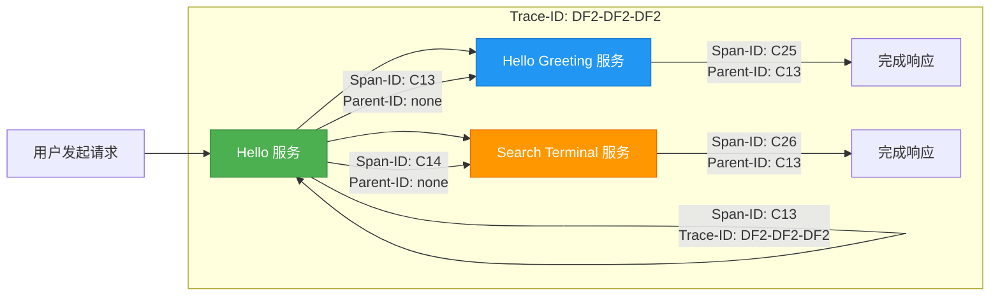
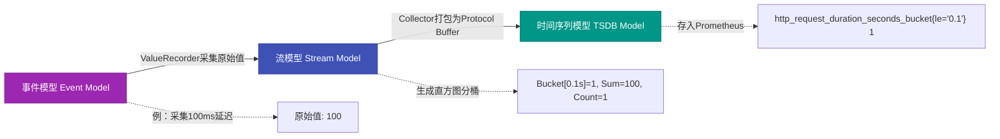
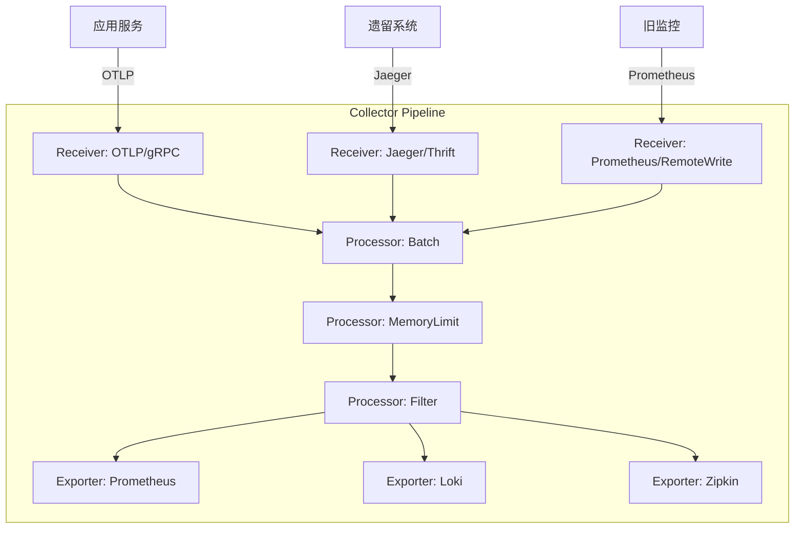

# OpenTelemetry数据采集核心机制详解：Trace、Metrics与组件架构

## 一、OpenTelemetry Trace 数据结构详解

### 1、分布式追踪基本模型：Span 与 Trace ID 的层级关系  

在微服务架构中，一次用户请求（如访问 `/hello`）会跨多个服务调用。OpenTelemetry 将其建模为 **Trace（追踪链）**，由若干 **Span（跨度）** 组成。每个 Span 表示一个独立的操作单元（如 HTTP 请求、数据库查询）。

> **关键概念图解（文字流程图）：**  

- **Trace ID（追踪ID）**：全局唯一标识符（如 `DF2-DF2-DF2`），贯穿整条调用链，用于关联所有 Span。
- **Span ID（跨度ID）**：单个操作的唯一标识（如 `C13`, `C25`），**不可跨 Span 复用**。
- **Parent ID（父级ID）**：指向直接上游 Span 的 Span ID（如 `C25` 的 Parent ID 是 `C13`），构建树状调用结构。
- **Context（上下文）**：包含 Trace ID、Span ID、Trace Flags（是否采样）、Trace State（供应商私有状态键值对）等不可变元数据。

> **知识点扩展（≥50字）：**  
> Context 是 OpenTelemetry 中实现**跨进程、跨语言、跨网络的上下文传播**的核心载体。它通过 HTTP Header（如 `traceparent: 00-DF2...-C13-01`）或消息中间件协议头自动注入与提取，确保异步调用、线程切换、RPC 调用中追踪链不中断。这是实现“一处埋点、全链路可见”的基础设施保障。

### 2、Span 的五大核心字段详解

| 字段名         | 类型                | 说明                                                         | 示例                                                         |
| -------------- | ------------------- | ------------------------------------------------------------ | ------------------------------------------------------------ |
| **Context**    | 结构体              | 不可变元数据容器，含 TraceID/SpanID/Flags/State              | `{trace_id:"DF2...",span_id:"C13",flags:1}`                  |
| **Attributes** | 键值对（Key-Value） | 描述操作语义的业务/技术元数据，支持 string/bool/int/double/array | `{"http.method":"GET","http.status_code":200,"server.port":"8080"}` |
| **Events**     | 事件列表            | Span 生命周期内发生的离散时间点事件（带时间戳）              | `[{"name":"page_interactive","time":"2024-05-01T10:00:00.123Z"}]` |
| **Links**      | 关联 Span 列表      | 建立**非父子关系**的 Span 关联（如消息队列中多个消费者处理同一消息） | `[{"trace_id":"DF2...","span_id":"X99","attributes":{"messaging.system":"kafka"}}]` |
| **Status**     | 枚举值              | 表示 Span 执行结果：`UNSET`（默认成功）、`ERROR`（发生异常）、`OK`（显式标记成功） | `{"code":"ERROR","description":"HTTP 500 Internal Server Error"}` |

> **知识点扩展（≥50字）：**  
> **Links 与 ParentID 的本质区别**在于语义建模：ParentID 强制定义**严格的调用依赖顺序**（A → B → C），而 Links 表达**弱关联性**（如 A 和 B 同时消费 Kafka Topic X 的同一条消息）。这使 OpenTelemetry 能精准刻画事件驱动、Serverless、批处理等复杂架构，避免将异步协作错误建模为同步调用。

## 二、OpenTelemetry Metrics 数据模型详解

### 1、六大指标类型及其语义

| 类型           | 英文名                     | 特性                                               | 典型场景                      | 数据示例                                              |
| -------------- | -------------------------- | -------------------------------------------------- | ----------------------------- | ----------------------------------------------------- |
| 计数器         | Counter                    | 单调递增（只加不减）                               | HTTP 请求总数                 | `http_requests_total{method="GET"} 1250`              |
| 异步计数器     | Asynchronous Counter       | 每次导出时采集瞬时值，需聚合计算                   | 主机 CPU 使用率（由 OS 提供） | `system.cpu.utilization 0.72`                         |
| 上下计数器     | UpDownCounter              | 可增可减                                           | 并发活跃连接数                | `http_connections_active 15`                          |
| 异步上下计数器 | Asynchronous UpDownCounter | 异步采集的可增减值                                 | JVM 堆内存使用量              | `jvm.memory.used 1.2GiB`                              |
| 仪表盘         | Gauge                      | 采集指定时间窗口的**最后一个观测值**（非平均值！） | 温度传感器读数                | `sensor.temperature 23.5`                             |
| 直方图         | Histogram                  | 统计分布（分桶计数+总和+计数）                     | HTTP 请求延迟 P95             | `http_request_duration_seconds_bucket{le="0.1"} 1200` |

> **知识点扩展（≥50字）：**  
> **Gauge 的“最后采样值”特性极易被误解**。例如每秒采集一次内存使用量 `[1.1, 1.3, 1.2, 1.4]`，Gauge 仅存储 `1.4`（末尾值），而非平均值 `1.25`。这导致其**无法反映波动趋势**，仅适合监控稳态指标（如当前在线用户数）。若需分析变化率，必须配合 Counter 或 Histogram 使用。

### 2、Metrics 三级数据模型演进流程

- **事件模型（Event Model）**：SDK 通过 `ValueRecorder` 捕获原始观测值（如 `request_size = 2048`），并实时执行 `max`、`sum`、`bucket` 等聚合运算。
- **流模型（Stream Model）**：Collector 将聚合结果序列化为标准协议（如 OTLP），以流式方式传输至后端。
- **时间序列模型（TSDB Model）**：最终持久化为时间序列数据库（如 Prometheus、M3DB）中的 `(metric_name, labels, timestamp, value)` 元组。

> **知识点扩展（≥50字）：**  
> OpenTelemetry Metrics 的**流式聚合设计**是其超越 Prometheus 的关键。传统方案需后端拉取原始数据再聚合，造成网络与存储压力；而 OpenTelemetry 在 SDK 层即完成 `sum/count/max/bucket` 计算，仅传输轻量聚合结果，大幅降低资源开销，特别适合边缘设备与高吞吐场景。

## 三、OpenTelemetry 核心组件：Collector 与 SDK

### 1、Collector（采集器）—— 可观测性数据的中枢网关

- **Receiver（接收器）**：支持多协议接入（OTLP、Jaeger、Zipkin、Prometheus），实现**异构系统统一纳管**。
- **Processor（处理器）**：提供 `batch`（批量发送）、`memory_limiter`（内存控制）、`filter`（敏感信息脱敏）、`transform`（标签重写）等能力。
- **Exporter（导出器）**：支持扇出（Fan-out）至多个后端（如同时发给 Prometheus + Loki + Elasticsearch）。

> **知识点扩展（≥50字）：**  
> Collector **非强制依赖**，但它是构建企业级可观测平台的基石。其价值体现在：① **协议转换**（统一接入旧系统）；② **数据治理**（脱敏、采样、降噪）；③ **弹性伸缩**（解耦应用与后端，避免雪崩）；④ **多后端分发**（一份数据，多处分析）。无 Collector 的 SDK 直连模式仅适用于小规模验证场景。

### 2、SDK（软件开发工具包）—— 语言原生集成桥梁

截至 2024 年 10 月，OpenTelemetry 官方 SDK 支持情况如下：

| 语言                         | Trace 状态 | Metrics 状态       | Logs 状态       | 备注               |
| ---------------------------- | ---------- | ------------------ | --------------- | ------------------ |
| Java / Python / Go / Node.js | ✅ Stable   | ✅ Stable / ⚠️ Alpha | ⚠️ Alpha / 🚧 Dev | 生产推荐首选       |
| Rust                         | ⚠️ Beta     | 🚧 Dev              | 🚧 Dev           | 新兴语言，社区活跃 |
| .NET / PHP / Erlang          | ✅ Stable   | ⚠️ Alpha            | 🚧 Dev           | 需评估日志成熟度   |

> **知识点扩展（≥50字）：**  
> SDK 的**语言适配深度决定可观测性落地效果**。例如 Java SDK 深度集成 Spring Boot Actuator，可自动注入 HTTP、JDBC、Redis 等组件的追踪；而 Python SDK 依赖 `opentelemetry-instrumentation-*` 包实现框架插桩。选择 SDK 时，必须核查目标框架的 instrumentation 支持列表，避免手动埋点导致覆盖率不足。

## 四、Trace-Metrics-Logs 三者关联机制

### 1、关联核心原则：**Context 传播 + 标签注入**

| 数据类型             | 关联方式                                             | 实现步骤                                                     | 注意事项                                                     |
| -------------------- | ---------------------------------------------------- | ------------------------------------------------------------ | ------------------------------------------------------------ |
| **Metrics ←→ Trace** | 在指标标签（Attributes）中注入 `trace_id`、`span_id` | `counter.add(1, {"trace_id": context.trace_id(), "span_id": context.span_id()})` | 需启用 `context propagation`，否则 context 为空              |
| **Logs ←→ Trace**    | 在日志结构体中添加 `trace_id`、`span_id` 字段        | `logger.info("Processing request", extra={"trace_id": tid, "span_id": sid})` | 日志系统（如 Loki、ELK）需配置 `trace_id` 字段为索引字段，方可实现点击跳转 |

> 🔍 **知识点扩展（≥50字）：**  
> 三者关联的本质是**建立统一上下文锚点**。OpenTelemetry 通过 `context` 对象在进程内传递 Trace ID，并在 SDK 输出 Metrics/Logs 时自动注入。但若日志框架未兼容 OpenTelemetry（如 Log4j2 未启用 `OpenTelemetryAppender`），则需手动提取 `context` 并注入日志字段，否则关联将失效。

## 总结：OpenTelemetry 的工程实践黄金法则

1. **追踪先行**：优先集成 Trace，因其是 Metrics/Logs 关联的根上下文；
2. **Collector 必选**：生产环境禁用 SDK 直连，必须经 Collector 统一治理；
3. **指标选型守则**：高频计数用 `Counter`，状态快照用 `Gauge`，延迟分析必用 `Histogram`；
4. **关联三要素**：`context propagation`（传播） + `attribute injection`（注入） + `backend indexing`（后端索引）缺一不可；
5. **SDK 选型铁律**：查文档确认目标语言的 `instrumentation` 支持度，而非仅看 SDK 稳定性。

