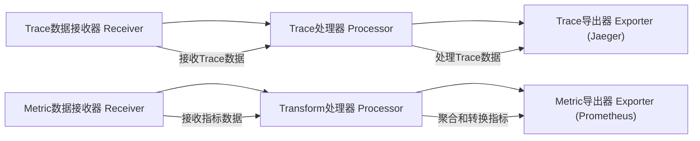
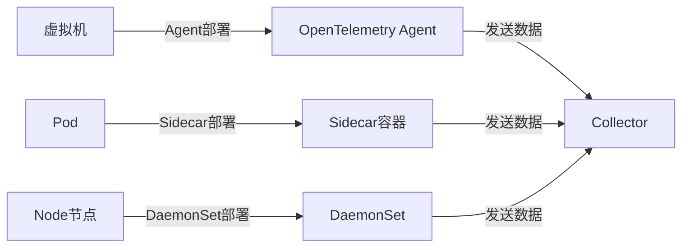
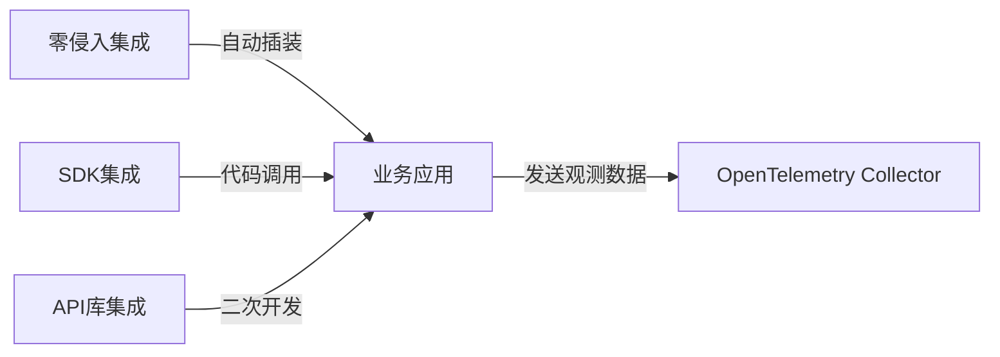
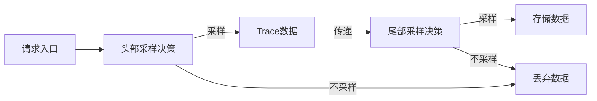
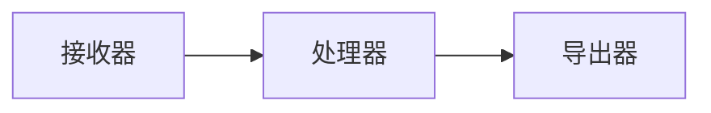
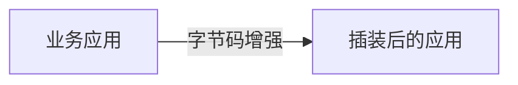
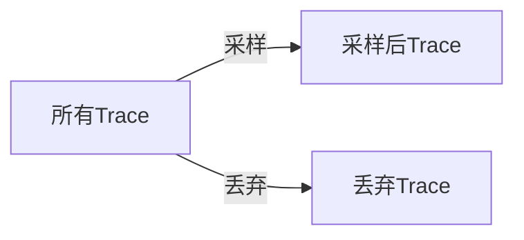

# 深入解析OpenTelemetry数据流与集成方式


## 一、OpenTelemetry 数据流详解

### 1、数据流基本架构

OpenTelemetry Collector是数据处理的核心组件，负责接收、处理和导出观测数据。数据流主要分为两条管道（pipeline）：

- **Trace Pipeline（追踪管道）**：处理分布式追踪数据。
- **Metric Pipeline（指标管道）**：处理指标数据。

两条管道均由以下几个组件组成：

- **Receiver（接收器）**：负责接收外部发送的trace或metric数据。
- **Processor（处理器）**：对接收到的数据进行处理，如聚合、转换等。
- **Exporter（导出器）**：将处理后的数据导出到外部系统，如Prometheus、Jaeger。

#### 代码示例（伪代码）

```yaml
pipelines:
  traces:
    receivers: [otlp]
    processors: [batch, memory_limiter]
    exporters: [jaeger]
  metrics:
    receivers: [otlp]
    processors: [transform]
    exporters: [prometheus]
```

### 2、详细数据流过程

- **Trace数据流**：
  - 通过Receiver接收trace数据。
  - 经过Processor（如standalone matrix processor）处理，关联指标与追踪数据。
  - 最终导出到Jaeger，供查询和分析。

- **Metric数据流**：
  - 通过Receiver接收指标数据。
  - 经过Transform Processor进行指标聚合和转换。
  - 导出到Prometheus，供监控和告警使用。

### 3、流程图



## 二、OpenTelemetry 部署方式

### 1、混合部署支持

OpenTelemetry支持多种部署环境：

- **Kubernetes（K8S）环境**：
  - 通过Sidecar（边车容器）部署在Pod中，采集应用数据。
  - 通过DaemonSet部署在Node节点，采集节点级指标。

- **虚拟机（VM）环境**：
  - 以Agent方式部署，直接运行在虚拟机上，采集应用和系统数据。

### 2、部署示意图



## 三、OpenTelemetry 集成方式

### 1、零侵入集成（自动插装）

- **定义**：无需修改业务代码，通过自动插装技术将OpenTelemetry SDK注入应用。
- **技术实现**：
  - 字节码增强（Bytecode Instrumentation）
  - Monkey Patching（猴子补丁）
  - eBPF（扩展的伯克利包过滤器）技术
- **支持语言**：Dotnet、Go、Java、JavaScript、PHP、Python等。
- **优点**：无需代码改动，快速集成。
- **缺点**：
  - 业务自定义指标无法自动采集。
  - eBPF依赖Linux内核版本，兼容性需评估。

### 2、SDK集成（推荐方式）

- **定义**：在业务代码中显式调用OpenTelemetry SDK接口进行集成。
- **优点**：
  - 灵活性高，可自定义业务指标。
  - 支持丰富的开发语言和框架。
- **缺点**：
  - 需要开发资源和跨部门协作。
  - 可能增加开发和维护成本。

### 3、API库集成（封装库）

- **定义**：直接调用OpenTelemetry提供的API库进行二次开发。
- **应用场景**：适合需要高度定制的监控方案。
- **注意**：一般不直接使用，适合高级开发者。

### 集成流程图



## 四、采样策略详解

### 1、采样的必要性

- 大部分trace数据是正常请求，无错误和延迟。
- 只有少部分trace包含异常或性能问题。
- 全量采集成本高，存储和处理压力大。
- 采样通过选择部分数据进行存储和分析，降低成本。

### 2、采样率示例

- 常用采样率为1%，即100个请求采样1个。

### 3、采样场景

- **不采样**：
  - 数据量少（每秒几十条以下）。
  - 业务场景要求全量采集（如金融业务）。
- **采样**：
  - 数据量大（每秒数百至数千条）。
  - 大部分请求正常，采样降低成本。

### 4、采样方式

#### 1.头部采样（Head Sampling）

- **定义**：在请求入口处决定是否采样。
- **优点**：实现简单，减少无用数据传输。
- **缺点**：
  - 无法根据请求执行结果动态调整采样。
  - 可能丢失重要异常数据。
- **支持**：OpenTelemetry Collector支持。

#### 2.尾部采样（Tail Sampling）

- **定义**：请求结束时根据完整链路信息决定采样。
- **优点**：
  - 可根据错误、延迟等动态判断采样。
  - 更智能，保留关键数据。
- **缺点**：
  - 设计复杂，延迟较高。
  - 需记录所有链路数据直到采样决策。
- **支持**：OpenTelemetry Collector支持，SDK支持有限。

#### 3.采样流程图



## 五、总结与展望

本文系统介绍了OpenTelemetry的核心数据流、部署方式、集成方法和采样策略。理解这些内容，有助于构建高效、可扩展的分布式追踪和指标监控系统。后续模块将深入实战，带领读者完成OpenTelemetry的集成与三合一监控系统搭建。

## 六、知识点扩展与图解

### 1、OpenTelemetry Collector

OpenTelemetry Collector是一个独立的服务，负责接收、处理和导出观测数据。它支持多种协议和数据格式，具有高度可扩展性和灵活的配置能力。Collector的设计使得数据处理逻辑与应用解耦，便于统一管理和扩展。



### 2、自动插装技术

自动插装是指在不修改源代码的情况下，通过技术手段动态注入监控代码。常用技术包括字节码增强和Monkey Patching。eBPF是一种内核级的动态追踪技术，性能优异但依赖内核版本。



### 3、采样策略的重要性

采样策略决定了哪些数据被采集和存储，直接影响监控系统的性能和成本。合理的采样策略能够在保证数据质量的同时，降低系统负载。




