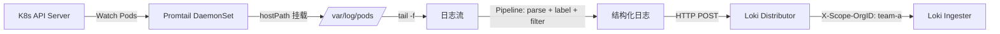
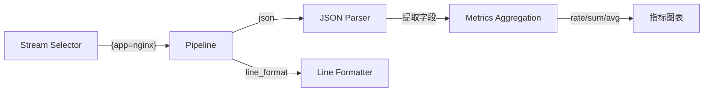
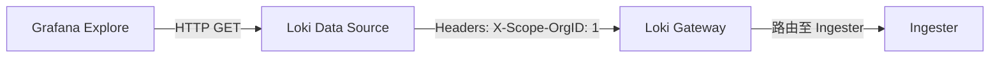
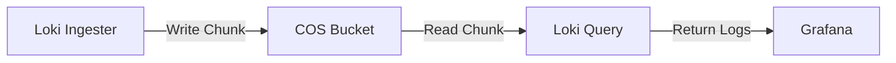

# Loki日志采集实战：轻量级可观测性日志方案全解析


## 一、Loki 核心架构原理（为什么轻量？为什么低成本？）

Loki 不是 Elasticsearch 的简化版，而是**日志存储范式的根本性重构**。其核心思想是：**不索引日志内容，只索引元数据标签（Labels）与时间戳**。  
Elasticsearch 对每行日志做全文分词索引（如将 `"level=error msg='timeout'"` 拆成 `level`, `error`, `msg`, `timeout` 等词条），导致磁盘占用高、内存消耗大、写入延迟高。而 Loki 仅对 `app="nginx"`, `container="web"` 这类结构化标签建立倒排索引，日志原始内容（Log Line）则以压缩块（Chunk）形式直接写入对象存储（如 COS/S3）。这使存储成本降低 **60–80%**，写入吞吐提升 **3–5 倍**，且天然适配 Kubernetes 的标签体系。

```mermaid
graph LR
A[Pod stdout/stderr] -->|1. 写入宿主机目录| B["/var/log/pods/.../0.log"]
B -->|2. Promtail 以 DaemonSet 挂载 hostPath| C[Promtail 容器]
C -->|3. 实时 tail -f + 添加 Labels| D[Loki Distributor]
D -->|4. 路由至 Ingester| E[Ingester 缓存队列]
E -->|5. 批量压缩为 Chunk| F[(对象存储 COS/S3)]
F -->|6. Query 查询时合并实时+历史数据| G[Query Frontend]
G -->|7. 缓存 & 调度| H[Query]
H -->|8. 从 COS 读取 Chunk + 从 Ingester 读缓存| I[Grafana 展示]

```



> **图解说明**：  
>
> - `A→B`：K8s 标准行为，所有容器日志统一落盘至 `/var/log/pods/`；  
> - `B→C`：Promtail 通过 `hostPath` 挂载该目录，实现“零侵入”采集；  
> - `D→E`：Distributor 是无状态网关，Ingester 是有状态缓存节点（内存中暂存 1–3 小时日志）；  
> - `E→F`：Ingester 将日志按 `Label+TimeRange` 分组压缩为 Chunk，写入对象存储——**这是低成本根源**；  
> - `F→I`：Query 同时读 COS（冷数据）和 Ingester（热数据），保证查询完整性。

## 二、Promtail 日志采集器：K8s 原生集成机制

Promtail 是 Loki 的“眼睛”，它不是传统 Agent（如 Filebeat），而是**专为 Kubernetes 设计的声明式日志采集器**。其核心能力在于：  

- **自动发现 Pod**：通过 K8s API 监听 Pod 创建/删除事件，动态生成采集配置；  
- **智能打标（Labeling）**：自动提取 `pod_name`, `namespace`, `container_name`, `job` 等标签，无需手动配置；  
- **Pipeline 处理**：支持 `docker`, `crio`, `systemd` 等多种日志格式解析，并可添加 `drop`, `labelallow`, `regex` 等过滤规则；  
- **多租户隔离**：通过 `X-Scope-OrgID` Header 实现团队/业务线级日志逻辑隔离。



> **关键代码解析（Promtail values.yaml）**：  
>
> ```yaml
> config:
> snippets:
>  pipelineStages:
>     - docker: {}  # 自动解析 Docker 日志格式
>     - labels:
>         job: ""      # 提取 job 标签
>         namespace: "" # 提取命名空间
>   clients:
>   - url: http://loki-gateway:3100/loki/api/v1/push
>     headers:
>       X-Scope-OrgID: "1"  # 必须匹配 Loki 的租户 ID！
> ```

## 三、LogQL 查询语言：从日志到指标的跃迁

LogQL 是 Loki 的“SQL”，语法分为三部分：  

1. **Stream Selector（日志流选择器）**：`{app="loki", container="loki"} ` —— 用标签快速定位日志源；  
2. **Pipeline Expression（管道表达式）**：`| json | line_format "{{.status}} {{.duration}}"` —— 解析 JSON 并重写输出；  
3. **Metrics Query（指标聚合）**：`rate({app="loki"} | json | duration > 500 [1m])` —— 将日志转为 Prometheus 式指标。

> **结构化日志为何关键？**  
> 若日志为 `{"status":200,"duration":123,"path":"/api/user"}`，LogQL 可直接 `| json | duration > 500` 精确筛选；若为非结构化 `GET /api/user 200 123ms`，则需 `| regex ".* (?P<status>\\d+) .* (?P<dur>\\d+)ms"` 正则提取——**结构化是高效查询的前提**。



## 四、生产级部署三大模式对比

| 部署模式            | 组件拓扑                                                   | 适用场景                     | 扩展性         | Helm 参数示例                  |
| ------------------- | ---------------------------------------------------------- | ---------------------------- | -------------- | ------------------------------ |
| **Single Binary**   | 所有组件（Distributor/Ingester/Query）运行于单进程         | 快速验证、日志量 < 20GB/天   | 副本数扩容     | `--set loki.singleBinary=true` |
| **Simple Scalable** | Write（Distributor+Ingester）与 Read（Query+Frontend）分离 | 中型集群、日志量 1–5TB/天    | 读/写独立扩缩  | `--set loki.target=read,write` |
| **Microservices**   | 每个组件独立 Deployment + Service                          | 超大型集群、日志量 > 10TB/天 | 全组件弹性伸缩 | `--set loki.target=ingester`   |

> **核心命令验证**：  
>
> ```bash
> # 查看 Loki 启动参数（确认部署模式）
> kubectl get pod -n loki-stack -o yaml | grep -A 2 "args"
> # 输出：args: ["-target=all"] → Single Binary 模式
> ```

## 五、Grafana 数据源配置：不可跳过的 Header 细节

Grafana 连接 Loki 时，**必须配置 `X-Scope-OrgID` Header**，否则返回 `401 Unauthorized`。这是因为 Loki 默认启用多租户，所有请求需携带租户标识。



> **配置步骤**：  
>
> 1. Grafana → Configuration → Data Sources → Add data source → Loki；  
> 2. URL 填 `http://loki-gateway:3100`；  
> 3. **HTTP Headers → Custom HTTP Headers → Key: `X-Scope-OrgID`, Value: `1`**；  
> 4. Save & Test → 显示 `Data source is working` 即成功。

## 六、对象存储（COS/S3）集成：实现无限日志容量

Loki 将日志 Chunk 存入对象存储，彻底解决本地磁盘瓶颈。以腾讯云 COS 为例：  

- **Bucket 权限**：需授予 Loki `cos:GetObject`, `cos:PutObject`, `cos:ListMultipartUploadParts` 权限；  
- **配置要点**：`endpoint` 不含 bucket 名（如 `cos.ap-beijing.myqcloud.com`），`bucketnames` 为实际桶名；  
- **成本优势**：COS 归档存储单价约 ¥0.015/GB/月，远低于 SSD 云盘（¥0.35/GB/月）。



> **生产配置片段（loki-values.yaml）**：  
>
> ```yaml
> storage_config:
> aws:
>  s3: "s3://AKID:SECRET@cos.ap-beijing.myqcloud.com/loki-bucket"
>  s3forcepathstyle: true
> ```

## 结语：构建统一可观测性平台的基石

Loki 不是孤立工具，而是 **OpenTelemetry + Prometheus + Grafana 三位一体可观测性栈的关键拼图**。它用“标签索引+对象存储”的极简哲学，解决了日志海量存储与快速检索的矛盾。掌握其原理与实践，即掌握了现代云原生系统稳定性的第一道防线。后续模块将深入 Prometheus 指标采集与 OpenTelemetry 分布式追踪，最终在 Grafana 中融合日志、指标、链路，实现真正的“一个面板，全局洞察”。


