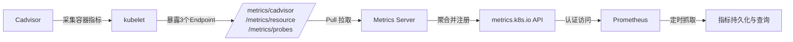
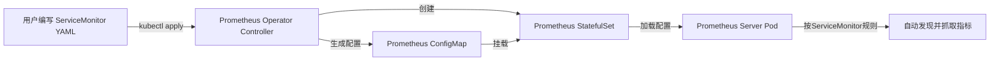
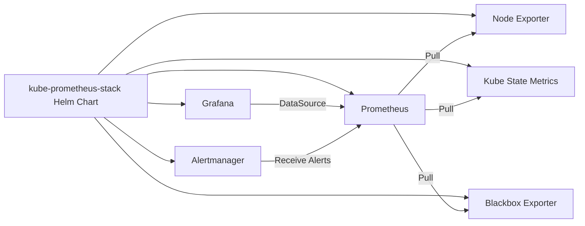
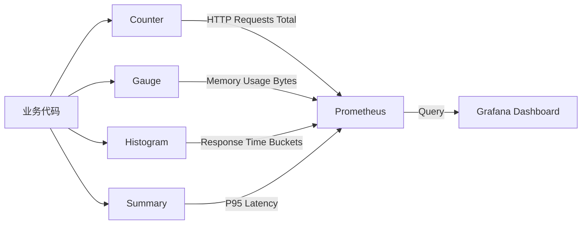
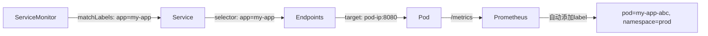
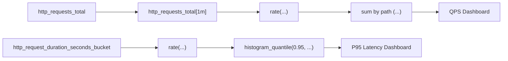

# Prometheus指标采集实战：从K8s系统监控到业务指标集成

## 一、Kubernetes 系统级指标采集路径详解

### 1、核心知识点：K8S 指标采集四层架构（Cadvisor → kubelet → Metrics Server → API Server）

Kubernetes 并非直接将容器指标“裸露”给 Prometheus，而是通过一套标准化、分层式的数据管道进行暴露。该路径共含 **4 个关键组件**，每一层承担明确职责：

- **Cadvisor（容器指标采集器）**：运行在每个 Node 上的守护进程，**实时监控容器 CPU、内存、网络、磁盘 I/O 等底层资源使用量**。它不存储数据，仅做采集与初步聚合，输出格式为 Prometheus 原生文本（`.prom`）。  
- **kubelet（节点代理）**：K8S 的 Node 端核心组件，**内嵌 Cadvisor，并提供 `/metrics/cadvisor`、`/metrics/resource`、`/metrics/probes` 三个标准 HTTP Endpoint**。这是 Prometheus 抓取系统指标的**第一入口**。  
- **Metrics Server（集群级指标聚合器）**：以 Pod 形式部署的**可插拔附加组件**，定时从所有 kubelet 拉取 `/metrics/resource` 数据，**聚合后注册为 Kubernetes 原生 `metrics.k8s.io` API**（如 `kubectl top node/pod` 依赖此 API）。  
- **API Server（统一网关）**：K8S 控制平面核心，**将 Metrics Server 注册的 `metrics.k8s.io` API 暴露给外部调用者（如 HPA、Prometheus）**。Prometheus 通过 ServiceAccount Token 认证访问该 API。

> 就像一个「工厂流水线」：  
>
> - **Cadvisor = 车间传感器**（贴在每台机器上，测温度/转速）  
> - **kubelet = 车间班长**（汇总传感器数据，写在三本台账上：《设备健康表》《资源用量表》《探针检查表》）  
> - **Metrics Server = 总厂统计科**（每天收全厂班长的《资源用量表》，加总成《全厂能耗日报》）  
> - **API Server = 厂长办公室门禁**（只有持工牌（Token）的人才能进来看《日报》）  
> - **Prometheus = 自动抄表机器人**（每天固定时间刷工牌进门，拍照存档《日报》）

## 二、Prometheus Operator：声明式管理 Prometheus 的工业级方案

### 1、核心知识点：CRD（自定义资源定义）驱动的运维范式

原生 Prometheus 需手动编写 `prometheus.yml`，配置 Target、Relabel、Service Discovery 等，**极易出错且无法版本化管理**。Prometheus Operator 通过 Kubernetes 原生机制（CRD + Controller）实现**声明式运维**：

- **CRD 是 Operator 的“语言”**：它在 K8S 集群中注册新资源类型（如 `Prometheus`、`Alertmanager`、`ServiceMonitor`），使用户能用 YAML 文件（类似 `kubectl apply -f prom.yaml`）创建 Prometheus 实例，而非手动部署 Pod。  
- **Controller 是 Operator 的“大脑”**：持续监听 CRD 变更，自动创建 StatefulSet、Service、ConfigMap 等底层资源，并确保其状态与 YAML 定义一致（如自动重载配置、滚动更新）。  
- **ServiceMonitor 是“指标发现说明书”**：用户只需声明「我要监控哪些 Service」+「从哪个端口/路径抓指标」，Operator 自动注入 Prometheus 配置，**彻底解耦业务团队（写 Service）与运维团队（写 ServiceMonitor）**。

> 就像「智能家电安装服务」：  
>
> - **原生 Prometheus = 自己买零件组装空调**（要懂电路图、接线顺序、遥控器配对）  
> - **Prometheus Operator = 扫码下单，师傅上门安装**（你只说“我要在客厅装一台制冷2匹的空调”，师傅自带所有零件、工具、说明书，自动完成打孔、接电、抽真空、测试）  
> - **ServiceMonitor = 你的语音指令**（“监控我家客厅的空调” → 师傅自动识别品牌型号、找到对应接口、设置参数）

## 三、kube-prometheus-stack：一键部署的生产就绪套件

### 1、核心知识点：Helm Chart 封装的开箱即用监控栈

`kube-prometheus-stack` 是社区维护的 Helm Chart，**将 Prometheus、Grafana、Alertmanager、Node Exporter、Kube State Metrics 等 10+ 组件打包为一个原子化应用**，解决三大痛点：

- **预置采集规则**：内置 200+ 条 K8S 资源指标抓取规则（如 Pod CPU 使用率、Deployment 副本数、etcd 健康状态），无需手写 `scrape_configs`。  
- **预置告警规则**：包含 CPU 过载、内存泄漏、Pod 频繁重启等 50+ 条生产级告警（`PrometheusRule` CRD），触发后自动通知 Alertmanager。  
- **预置可视化面板**：Grafana 内置 100+ 个 Dashboard（如「Kubernetes / Compute Resources / Cluster」），覆盖集群、节点、命名空间、工作负载全维度。

> **理解图解**：  
> 就像「精装交付的智慧家庭套装」：  
>
> - **单买摄像头/门锁/灯光 = 原生 Prometheus**（每个都要单独布线、联网、APP 配置）  
> - **kube-prometheus-stack = 全屋智能套装**（含网关、APP、预设场景）  
>   - 开箱即用「家庭健康看板」（Grafana Dashboard）  
>   - 预设「门窗异常开启告警」（PrometheusRule）  
>   - 自动同步「全屋设备状态」（Node Exporter + KSM）  
>   - 一键启用「远程访客检测」（Blackbox Exporter）

## 四、业务指标集成：Go 应用接入 Prometheus SDK 全流程

### 1、核心知识点：四种指标类型（Counter/Gauge/Histogram/Summary）的语义与编码实践

Prometheus SDK 提供 4 种基础指标类型，**选择错误将导致监控失效**：

- **Counter（计数器）**：**只增不减**，用于累计事件总数（如 HTTP 请求次数、错误发生次数）。必须用 `Inc()` 或 `Add()` 修改，**禁止 Set()**。  
- **Gauge（仪表盘）**：**可增可减可设值**，用于瞬时状态（如当前在线用户数、内存剩余字节数）。支持 `Set()`、`Inc()`、`Dec()`。  
- **Histogram（直方图）**：**按预设区间（bucket）统计分布**，用于延迟、响应时间等。需定义 `buckets: [0.1, 0.2, 0.5, 1.0]`，Prometheus 在服务端计算分位数（如 P95）。  
- **Summary（摘要）**：**客户端实时计算分位数**，直接上报 P50/P90/P99 值。精度高但开销大，**不支持跨实例聚合**（如 10 个 Pod 的 Summary 无法合并为集群 P95）。

> **理解图解**：  
> 就像「医院体检报告单」：  
>
> - **Counter = 就诊总人次**（只能 +1，不能 -1；今天看了 100 人，明天就是 101）  
> - **Gauge = 当前体温**（36.5℃ → 37.2℃ → 36.8℃，可升可降可设值）  
> - **Histogram = 血压分布统计**（把 1000 人血压按「<90」「90-120」「120-140」「>140」分组，算出各组人数）  
> - **Summary = 心率分位数**（直接告诉你「P50=75次/分，P95=92次/分」，但无法合并 10 个科室的数据）

## 五、ServiceMonitor 实战：让 Prometheus 自动发现业务指标

### 1、核心知识点：Label Selector 驱动的服务发现机制

`ServiceMonitor` 是 Prometheus Operator 的核心 CRD，其本质是 **「用 Kubernetes Label 匹配 Service，再从 Service 关联的 Endpoints 抓取指标」**：

- **matchLabels**：指定要监控的 Service 的 `metadata.labels`（如 `app: my-app`）。  
- **endpoints.port**：指定 Service 中 **port.name**（非 port.number！），如 `metrics`，对应 Service YAML 中 `ports[0].name: metrics`。  
- **endpoints.path**：指定指标暴露路径，默认 `/metrics`。  
- **自动 Relabel**：Operator 会为每个抓取目标注入 `pod`, `namespace`, `service`, `instance` 等标签，**实现指标与资源的强绑定**（查指标时可直接 `namespace="prod" and pod=~"my-app-.*"`）。

> **理解图解**：  
> 就像「快递柜智能投递」：  
>
> - **ServiceMonitor = 快递公司后台系统**（设定规则：“所有贴‘生鲜’标签的包裹，投递到 3 号柜”）  
> - **Service = 小区快递柜编号牌**（上面写着「生鲜专用柜：3号」）  
> - **Endpoints = 柜门编号**（3号柜有 10 个门，对应 10 个 Pod IP）  
> - **自动 Relabel = 柜门贴的电子标签**（每个门自动显示「订单号：20240501-001，客户：张三，时效：2小时」）  
> - **你查物流 = 输入「订单号+客户名」，秒出柜门位置**

## 六、PromQL 查询入门：从单指标到业务洞察

### 1、核心知识点：PromQL 四层语法结构（Selector → Range Vector → Aggregation → Function）

PromQL 不是 SQL，其执行顺序为 **从左到右、由内而外**：

1. **Selector（选择器）**：`http_requests_total{job="my-app"}` —— 定位原始指标序列。  
2. **Range Vector（范围向量）**：`http_requests_total[1m]` —— 取过去 1 分钟的所有采样点。  
3. **Aggregation（聚合）**：`sum by (path) (rate(http_requests_total[1m]))` —— 按 `path` 分组，计算每条路径的 QPS。  
4. **Function（函数）**：`histogram_quantile(0.95, rate(http_request_duration_seconds_bucket[1m]))` —— 对直方图桶数据计算 P95 延迟。

> **理解图解**：  
> 就像「餐厅客流分析仪」：  
>
> - **Selector = 查「今日外卖订单表」**（筛选条件：商家=麦当劳）  
> - **Range Vector = 截取「最近 60 分钟」的订单记录**（共 300 条）  
> - **Aggregation = 按「菜品」分组，算每分钟平均下单量**（汉堡：12 单/分，薯条：8 单/分）  
> - **Function = 算「95% 订单的送达时间」**（查 300 条记录，第 285 条的送达时间是 28 分钟 → P95=28min）

