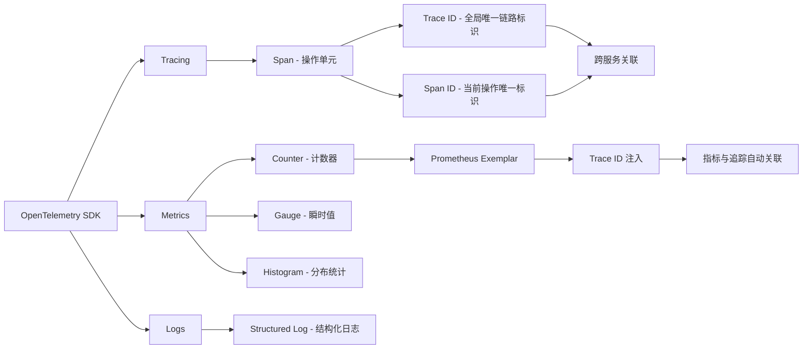
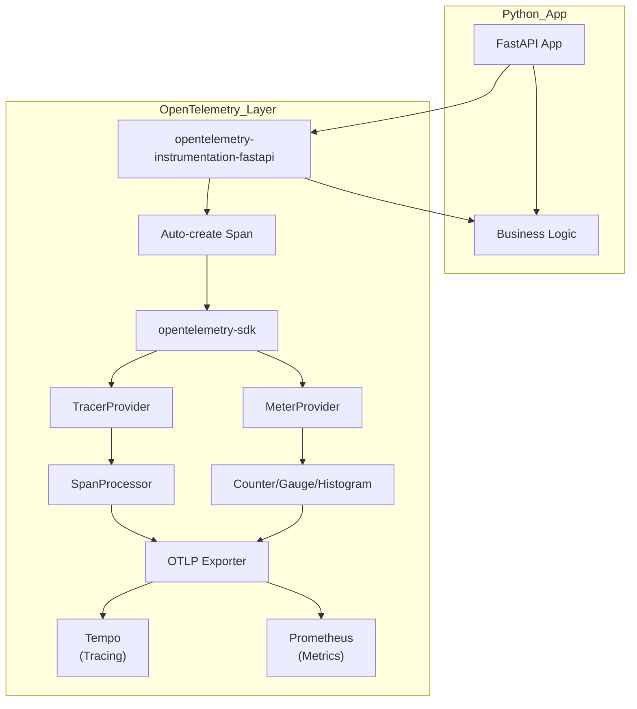
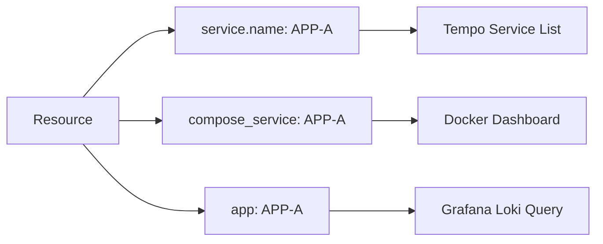
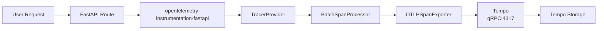
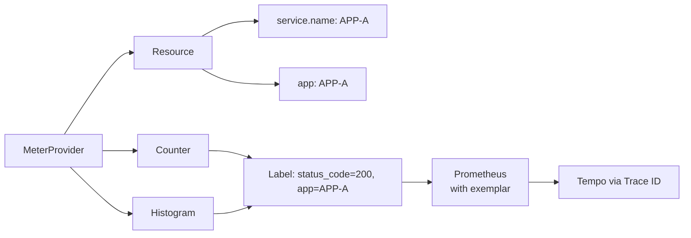
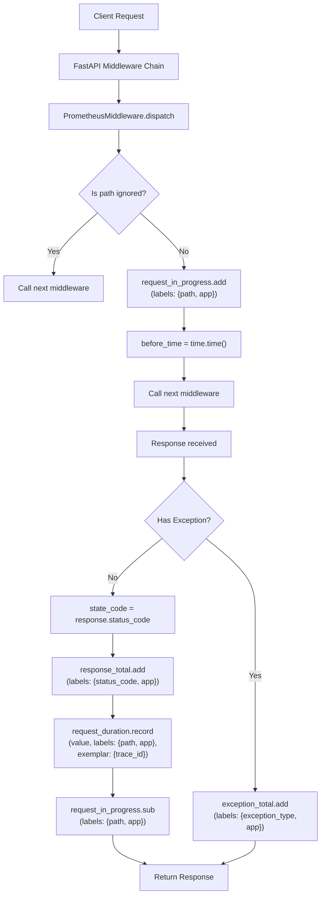
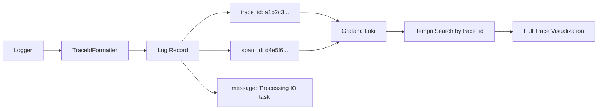
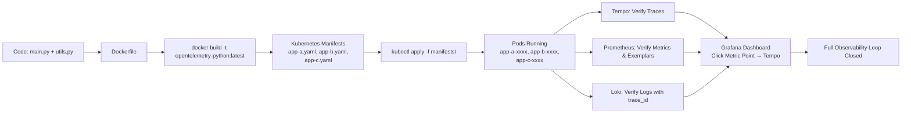

# Python微服务中集成OpenTelemetry实现可观测性三合一（Tracing + Metrics + Logs）


## 一、OpenTelemetry 核心架构与三大支柱详解

OpenTelemetry 是云原生可观测性领域的**事实标准**，它统一了分布式追踪（Tracing）、指标（Metrics）和日志（Logs）三大支柱的数据采集与导出协议。其设计目标是**厂商中立、语言无关、可插拔**，避免用户被某一家 APM 厂商锁定。



- **Tracing（分布式追踪）**：用于记录请求在微服务间流转的完整路径。每个请求生成一个唯一的 `Trace ID`，每次调用（如 HTTP 请求、数据库查询）生成一个 `Span`，包含 `Span ID`、开始/结束时间、父 Span ID、属性（Attributes）等。它是诊断“慢请求”“失败请求”的黄金工具。
- **Metrics（指标）**：用于量化系统行为，如 QPS、响应延迟、错误率、内存占用等。OpenTelemetry 支持 Counter（只增不减）、Gauge（可增可减）、Histogram（分布统计）等类型。关键创新是 `Exemplar`（示例），它允许在指标采样点**直接嵌入 Trace ID**，实现指标异常点与具体追踪链路的秒级下钻。
- **Logs（日志）**：结构化日志是调试的基础。OpenTelemetry 不替代日志框架（如 Python 的 `logging`），而是提供 `get_current_span()` 方法，让开发者能轻松将当前 `trace_id` 和 `span_id` 注入日志字段，从而在 Grafana 中通过日志直接跳转到对应追踪。

> **须知**：想象你点外卖——`Trace ID` 就像订单号（全局唯一），`Span ID` 就像每个环节的子单号（接单、配餐、骑手取餐、送达），`Metrics` 是餐厅每小时接了多少单（QPS）、平均配送时长（Latency），`Logs` 是骑手APP里每一步的操作记录（含订单号）。三者结合，才能完整复盘一次失败的配送。

## 二、Python 环境初始化与依赖库详解

视频中创建 `demo3` 目录并编写 `requirements.txt`，这是 Python 工程化的起点。依赖管理是稳定运行的前提。

### 1、核心依赖库清单与作用

| 库名                                     | 版本要求 | 作用详解（>50字）                                            |
| ---------------------------------------- | -------- | ------------------------------------------------------------ |
| `fastapi`                                | ≥0.104.0 | **现代异步 Web 框架**。基于 Starlette 和 Pydantic，提供极高的性能和自动生成 API 文档（Swagger UI）能力，是构建可观测性后端服务的首选。 |
| `uvicorn`                                | ≥0.23.0  | **ASGI 服务器**。作为 FastAPI 的生产级运行容器，支持异步 I/O、热重载、多进程部署，是 Python 异步生态的基石。 |
| `opentelemetry-api`                      | ≥1.22.0  | **OpenTelemetry 标准接口定义**。提供 `TracerProvider`, `MeterProvider`, `get_current_span()` 等抽象接口，确保 SDK 可替换性。所有实现必须兼容此 API。 |
| `opentelemetry-sdk`                      | ≥1.22.0  | **官方参考实现 SDK**。包含 `TracerProvider`, `MeterProvider`, `SpanProcessor`, `Exporter` 等核心组件，是集成的主体。 |
| `opentelemetry-exporter-otlp-proto-grpc` | ≥1.22.0  | **OTLP/gRPC 导出器**。将 SDK 采集的数据，通过 Google Protocol Buffers + gRPC 协议，高效、可靠地发送至 Tempo（追踪）、Prometheus（指标）等后端。gRPC 比 HTTP 更快、更省资源。 |
| `opentelemetry-instrumentation-fastapi`  | ≥0.42.0  | **FastAPI 自动插桩库**。无需修改业务代码，即可自动为所有 FastAPI 路由创建 `Span`，捕获请求方法、路径、状态码、处理时长等，极大降低接入成本。 |



> **须知**：`requirements.txt` 就像一份“食材清单”，`pip install -r requirements.txt` 就是请大厨（pip）按清单采购所有原料。缺少任一库（如漏装 `opentelemetry-exporter-otlp-proto-grpc`），数据就无法发送到 Tempo，整个链路就断了。

## 三、核心代码模块详解：`utils.py` —— OpenTelemetry 初始化中枢

`utils.py` 是整个集成的“心脏”，它完成了资源（Resource）、追踪提供者（TracerProvider）、指标提供者（MeterProvider）的初始化与配置。

### 1、Resource（资源）配置：服务身份的“身份证”

```python
from opentelemetry import trace, metrics
from opentelemetry.sdk.resources import Resource
from opentelemetry.sdk.trace import TracerProvider
from opentelemetry.sdk.metrics import MeterProvider

# 创建 Resource - 定义服务元数据
resource = Resource.create(
    attributes={
        "service.name": os.getenv("APP_NAME", "unknown-service"),  # 必填！服务名，Tempo 中显示为服务名
        "compose_service": os.getenv("APP_NAME", "unknown-service"), # Docker Compose 兼容标签
        "app": os.getenv("APP_NAME", "unknown-service")           # 自定义标签，Grafana 面板筛选用
    }
)
```

- **Resource 是什么？**  
  Resource 是 OpenTelemetry 中描述“**谁在产生数据**”的实体。它是一组键值对（Key-Value），用于标识服务实例。`service.name` 是强制要求的属性，是 Tempo、Jaeger 等追踪后端识别服务的唯一依据。没有它，所有 Span 都会归类到 `unknown-service`，无法区分 APP-A、APP-B。

- **为什么需要多个相同值的标签？**  
  不同后端对标签命名规范不同。`service.name` 是 OTLP 标准，`compose_service` 是 Docker Compose 生态常用，`app` 是 Grafana Loki 日志系统中常用的 `label`。**一个 Resource 可以同时满足多个后端的元数据需求，避免重复配置。**



### 2、TracerProvider（追踪提供者）配置：Span 的“工厂”

```python
# 创建 TracerProvider 并绑定 Resource
tracer_provider = TracerProvider(resource=resource)

# 添加 SpanProcessor - 批量处理 Span
span_processor = BatchSpanProcessor(
    OTLPSpanExporter(
        endpoint=os.getenv("OTLP_GRPC_ENDPOINT", "http://tempo:4317"),
        insecure=True  # 生产环境应使用 TLS
    )
)
tracer_provider.add_span_processor(span_processor)

# 设置全局 TracerProvider
trace.set_tracer_provider(tracer_provider)
```

- **TracerProvider 是什么？**  
  它是 OpenTelemetry 的“Span 工厂”。所有 `trace.get_tracer(__name__)` 调用，最终都向它申请一个 `Tracer` 实例。`Tracer` 再负责创建 `Span`。`BatchSpanProcessor` 是关键优化：它不立即发送每个 Span，而是**批量打包、异步发送**，极大降低网络开销和后端压力。

- **OTLP/gRPC Endpoint 的意义？**  
  `http://tempo:4317` 是 Tempo 服务监听的 gRPC 地址。`4317` 是 OTLP/gRPC 的标准端口。`insecure=True` 表示不验证 TLS 证书，仅用于开发；生产环境必须配置 `certificate_file` 启用 HTTPS。



### 3、MeterProvider（指标提供者）配置：Metrics 的“仪表盘”

```python
# 创建 MeterProvider 并绑定 Resource
meter_provider = MeterProvider(resource=resource)

# 设置全局 MeterProvider
metrics.set_meter_provider(meter_provider)

# 获取 Meter - 创建指标
meter = meter_provider.get_meter("fastapi-app")

# 定义 Counter 指标
request_total = meter.create_counter(
    "fastapi.request.total",
    description="Total count of requests",
    unit="1"
)

# 定义 Histogram 指标
request_duration = meter.create_histogram(
    "fastapi.request.duration",
    description="Request duration in seconds",
    unit="s"
)
```

- **MeterProvider 与 Prometheus Exemplar 的关系？**  
  `MeterProvider` 是指标的“总控中心”。`create_counter()` 返回的 `Counter` 对象，在调用 `.add(1, {"status_code": "200", "app": "APP-A"})` 时，会触发 `Exemplar` 机制。如果 Prometheus 配置了 `enable-feature=exemplars`，它会**自动从当前线程的 Span 中提取 Trace ID**，并将其作为 `exemplar` 关联到该指标样本上。

- **为什么 Metrics 必须与 Resource 绑定？**  
  因为指标本身不携带服务身份信息。只有通过 `MeterProvider(resource=resource)`，所有从此 `Meter` 创建的指标，才会自动继承 `service.name`、`app` 等标签。否则，Prometheus 中所有指标都只有 `job="unknown"`，无法按服务维度聚合。



## 四、中间件（Middleware）详解：Metrics 与 Tracing 的“粘合剂”

`PrometheusMiddleware` 类是视频中 `utils.py` 的核心逻辑，它实现了 FastAPI 的中间件协议，**在请求进入和响应返回的瞬间，自动采集指标并关联追踪上下文**。

### 1、Middleware 执行流程图解



### 2、关键代码解析：如何获取 Trace ID 并注入 Exemplar？

```python
# 在 dispatch 方法中，于 record duration 前：
current_span = trace.get_current_span()
if current_span and current_span.is_recording():
    trace_id = current_span.get_span_context().trace_id
    # trace_id 是一个 128-bit 整数，需格式化为 32 位十六进制字符串
    trace_id_hex = format(trace_id, '032x')
    # 此处的 trace_id_hex 将作为 exemplar 的 key
    request_duration.record(
        duration_seconds,
        attributes={"path": path, "app": self.app_name},
        exemplar={"trace_id": trace_id_hex}  # 这就是 Prometheus Exemplar!
    )
```

- **`trace.get_current_span()` 的工作原理？**  
  OpenTelemetry 使用 **Context Propagation（上下文传播）** 机制。当 `opentelemetry-instrumentation-fastapi` 创建 Span 后，会将 `SpanContext` 存入 Python 的 `contextvars`（线程/协程局部变量）。`get_current_span()` 就是从这里安全地取出当前活跃的 Span，**完全线程安全、协程安全**。

- **Exemplar 如何在 Prometheus 中生效？**  
  Prometheus 抓取指标时，若发现样本带有 `exemplar` 字段（如 `# HELP fastapi_request_duration_seconds ... # EXEMPLAR {trace_id="a1b2c3..."} 0.123`），会将其存储为特殊索引。在 Grafana 中点击指标图表上的某个异常点，Grafana 会自动提取 `trace_id`，并跳转到 Tempo 查看完整链路。

> **须知**：Middleware 就像快递驿站。每个包裹（请求）进来，驿站先盖个章（`request_in_progress.add`），记下出发地（`path`）；包裹发出时，再盖个章（`response_total.add`），并把快递单号（`trace_id`）写在运单（`exemplar`）上。这样，查任何一个运单，都能立刻找到对应的包裹全程录像（Tempo 追踪）。

## 五、日志（Logs）集成：打通 Logs 与 Tracing 的最后一环

日志集成的目标是：**让每一行日志都携带 `trace_id` 和 `span_id`，实现“日志即追踪”**。

### 1、日志格式化器（Formatter）配置

```python
import logging
from opentelemetry.trace import get_current_span

class TraceIdFormatter(logging.Formatter):
    def format(self, record):
        span = get_current_span()
        if span and span.is_recording():
            record.trace_id = format(span.get_span_context().trace_id, '032x')
            record.span_id = format(span.get_span_context().span_id, '016x')
        else:
            record.trace_id = "00000000000000000000000000000000"
            record.span_id = "0000000000000000"
        return super().format(record)

# 配置 logging
LOGGING_CONFIG = {
    "version": 1,
    "formatters": {
        "access": {
            "()": "utils.TraceIdFormatter",  # 使用自定义 Formatter
            "format": "%(asctime)s | %(levelname)-8s | %(name)s | %(trace_id)s | %(span_id)s | %(message)s"
        }
    },
    "handlers": {
        "console": {
            "class": "logging.StreamHandler",
            "formatter": "access"
        }
    },
    "loggers": {
        "uvicorn.access": {
            "handlers": ["console"],
            "level": "INFO"
        }
    }
}
```

### 2、日志与追踪关联的图解



- **为什么日志必须用 `contextvars` 而非全局变量？**  
  Python 的 `threading.local()` 只对线程有效，而 FastAPI 是异步的（`async/await`），大量请求在同一个线程内并发执行。`contextvars` 是 Python 3.7+ 引入的**协程局部变量**，能确保每个 `async` 请求都有独立的 `Span` 上下文，不会出现 A 请求的日志打上 B 请求的 `trace_id` 这种灾难性错误。

> **须知**：想象你在一个大型呼叫中心（FastAPI 服务器），有 100 个坐席（协程）共用 10 条电话线（线程）。`contextvars` 就像给每个坐席配发一个专属的电子工牌，上面实时显示他正在处理的客户订单号（`trace_id`）。无论坐席在哪个电话线上接电话，他的工牌都不会串。

## 六、端到端部署与验证流程图解

整个流程从代码编写，到容器化，再到 Kubernetes 部署，最后在 Grafana 中验证，形成一个闭环。



- **验证要点**：
  1. **Tempo**：访问 `http://tempo:3100`，搜索 `service.name = APP-A`，应看到完整的三层调用链（APP-A → APP-B → APP-C）。
  2. **Prometheus**：访问 `http://prometheus:9090`，执行查询 `fastapi_request_duration_seconds_count{app="APP-A"}`，点击图表上的点，检查 `exemplar` 字段是否包含有效的 `trace_id`。
  3. **Loki**：访问 `http://grafana:3000`，选择 Loki 数据源，查询 `{app="APP-A"} | json | __error__=""`，日志行中应清晰显示 `trace_id` 和 `span_id` 字段。

> **总结**：OpenTelemetry 的集成不是“写几行代码”，而是一个**系统工程**。它要求开发者理解 `Resource`（我是谁）、`TracerProvider`（我如何追踪）、`MeterProvider`（我如何计量）、`Middleware`（我何时计量）、`Formatter`（我如何记录）五大要素，并通过 `contextvars` 和 `Exemplar` 这两大核心技术，将三者无缝编织成一张可观测性之网。本文所呈现的，正是这张网的每一根经纬线。

