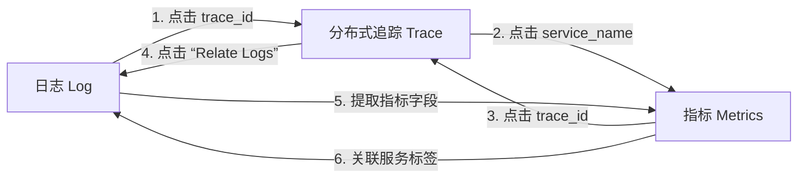

# 打造日志、指标与分布式追踪三合一的可观测性查询面板


## 一、核心目标：什么是“三合一查询面板”？

> **定义**：指在 Grafana 中，任意一个可观测数据源（日志 / 指标 / 追踪）均可**单击跳转**至关联的其他两类数据，且全部基于统一的 `trace_id` 实现上下文联动。  
> **本质价值**：告别“切屏查日志→切屏查指标→切屏查链路”的碎片化排查，实现**一次定位、三端印证、闭环诊断**。



> **图解说明**：  
>
> - 箭头表示**单向可点击跳转能力**（非自动同步）；  
> - 所有跳转均依赖 `trace_id` 作为唯一纽带；  
> - `service_name` 是跨系统映射的关键桥梁（如 Tempo 中的 `service.name="app-a"` → Loki 中的 `app="app-a"`）；  
> - 虚线路径（5/6）为**非 OpenTelemetry 原生链路**，需手动配置日志解析或标签重写。

## 二、组件级详细配置与原理剖析

### 1、知识点 1：Loki 配置 —— 从日志中提取 `trace_id` 字段（关键！）

#### 1.**为什么需要？**  

Loki 默认将整行日志视为字符串，无法识别其中的 `trace_id`。必须通过 **LogQL 解析器（Parser）** 将其提取为结构化标签（label），才能被 Grafana 用作跳转参数。

#### 2.**详细配置步骤**  

1. 进入 Grafana → **Configuration → Data Sources → Loki** → 点击 **"Edit"**；  
2. 切换到 **"Derived Fields"** 标签页 → 点击 **"Add derived field"**；  
3. 填写以下内容（严格按顺序）：

| 字段名                 | 值（必须完全一致）                                           | 说明                                                         |
| ---------------------- | ------------------------------------------------------------ | ------------------------------------------------------------ |
| **Name**               | `Trace ID`                                                   | 显示在日志条目旁的按钮文字                                   |
| **Regular expression** | `trace_id="([a-f0-9]{32})"`                                  | **正则表达式详解**：<br>匹配形如 `trace_id="4a7d3e1b8c9f0a2d4e6b8c9f0a2d4e6b"` 的字符串；<br>`([a-f0-9]{32})` 表示捕获 32 位十六进制字符（OpenTelemetry 标准 trace_id 长度）；<br>若日志格式为 `trace_id: 4a7d3e1b...`，则正则应改为 `trace_id:\s*([a-f0-9]{32})`。 |
| **URL**                | `http://tempo:3200/search?tags={"traceID":"${__value.raw}"}&limit=10` | Tempo 查询地址（需替换为实际 Tempo 地址）；`${__value.raw}` 自动代入正则捕获组内容 |
| **URL Label**          | `View in Tempo`                                              | 按钮显示文字                                                 |
| **Datasource**         | `Tempo`                                                      | 必须选择已配置的 Tempo 数据源                                |

> **原理扩展**：  
> Loki 的 Derived Fields 功能本质是**客户端侧日志增强**。它不修改原始日志存储，而是在 Grafana 渲染日志列表时，对每行日志执行正则匹配，并将结果注入 HTML 元素作为可点击链接。该机制依赖日志输出格式标准化——开发者必须在应用日志中显式打印 `trace_id="xxx"`（如使用 OpenTelemetry SDK 的 `logger.addContext("trace_id", span.context().traceId())`）。若日志无此字段，则整个三合一链路断裂。

### 2、知识点 2：Prometheus 配置 —— 为指标注入 `trace_id` 上下文

#### 1.**为什么需要？**  

Prometheus 原生指标（如 `http_request_duration_seconds_bucket`）不含 `trace_id`。但 OpenTelemetry 的 `PrometheusExporter` 支持在指标注释（HELP 文本）中嵌入 trace_id，供 Grafana 解析。

#### 2.**详细配置步骤（含完整代码）：**  

1. 进入 Grafana → **Configuration → Data Sources → Prometheus** → 点击 **"Edit"**；  
2. 切换到 **"Links"** 标签页 → 点击 **"Add link"**；  
3. 填写以下内容：

| 字段名          | 值                                                           | 说明                                                  |
| --------------- | ------------------------------------------------------------ | ----------------------------------------------------- |
| **Name**        | `Trace ID`                                                   | 图表上悬停时显示的链接名称                            |
| **URL**         | `http://tempo:3200/search?tags={"traceID":"${__value.text}"}&limit=10` | 同 Loki 链接，但 `${__value.text}` 读取 HELP 注释文本 |
| **URL Label**   | `View Trace`                                                 | 按钮文字                                              |
| **Data source** | `Tempo`                                                      | 关联 Tempo                                            |

> **原理扩展**：  
> 此配置利用 Prometheus 指标的 `HELP` 文本字段（非指标值本身）存储 trace_id。当 OpenTelemetry 的 Prometheus Exporter 输出指标时，会自动在 HELP 行追加类似 `# HELP http_request_duration_seconds Bucketed HTTP response latency (in seconds) for all requests. trace_id=4a7d3e1b8c9f0a2d4e6b8c9f0a2d4e6b` 的内容。Grafana 在渲染图表时解析 HELP 文本中的 `trace_id=` 后缀，提取值并生成跳转链接。这是 Prometheus 生态中实现 trace 关联的**唯一轻量级方案**，无需修改指标模型。

### 3、知识点 3：Tempo 配置 —— 实现双向跳转（Trace ↔ Log / Trace ↔ Metrics）

#### 1.**为什么需要？**  

Tempo 作为追踪中枢，必须能反向查询日志和指标。这依赖两个核心配置：`Trace to Logs` 和 `Trace to Metrics`，本质是**标签映射规则（Label Mapping）**。

#### 2.配置 3.1：Trace to Logs（从追踪跳转到日志）

1. 进入 Grafana → **Configuration → Data Sources → Tempo** → 点击 **"Edit"**；  
2. 展开 **"Trace to logs"** → 开启开关；  
3. 设置 **Tags**：  
   - `service.name` → `app`  
     （即：将 Tempo 追踪中 `service.name="app-a"` 的值，映射为 Loki 查询中的 `app="app-a"`）  

> **原理扩展**：  
> 此配置本质是 **Grafana 的标签重写（Relabeling）引擎**。当用户在 Tempo 界面点击 "Related Logs" 时，Grafana 自动构造 Loki 查询：`{app="app-a"} |~ "trace_id.*4a7d3e1b..."`。其中 `app="app-a"` 来自 `service.name` 的映射，`trace_id` 来自当前追踪的 traceID。该机制要求 Loki 日志中必须存在 `app` 标签（通常由 Promtail 的 `pipeline_stages` 配置注入），否则查询无结果。

#### 3.Trace to Metrics（从追踪跳转到指标）

1. 展开 **"Trace to metrics"** → 开启开关；  

2. 设置 **Tags**：  

   - `service.name` → `service`  

3. 在 **"Query"** 输入框中填写 PromQL：  

   ```promql
   histogram_quantile(0.95, sum by (le) (rate(http_request_duration_seconds_bucket{service=~"$service"}[5m])))
   ```

   > 此即 P95 延迟查询，`$service` 会被自动替换为映射后的服务名（如 `"app-a"`）。

> **原理扩展**：  
> 该配置使 Tempo 能动态生成服务维度的指标查询。`service.name` 映射为 Prometheus 的 `service` 标签，确保指标查询精准定位到当前追踪所属服务。PromQL 中的 `$service` 是 Grafana 内置变量，值来自 Tempo 追踪的 `service.name` 字段。此设计避免了硬编码服务名，支持多租户环境下的自动适配，是实现“一键查看该服务性能指标”的核心技术。

## 三、三合一联动实验验证

完成上述配置后，执行以下四类验证实验：

| 实验类型            | 操作路径                                                     | 预期结果                                                     | 故障排查要点                                                 |
| ------------------- | ------------------------------------------------------------ | ------------------------------------------------------------ | ------------------------------------------------------------ |
| **Log → Trace**     | Loki 中筛选 `{app="app-a"}` → 找到含 `trace_id` 的日志 → 点击 `View in Tempo` | 自动跳转至 Tempo，展示该 trace 的完整调用链                  | 检查 Loki 正则是否匹配日志、Tempo URL 是否可达               |
| **Metrics → Trace** | Prometheus 图表 → 悬停某数据点 → 点击 `View Trace`           | 跳转至 Tempo，定位到对应 trace                               | 检查指标 HELP 文本是否含 `trace_id=`、Prometheus 数据源 Links 是否启用 |
| **Trace → Logs**    | Tempo 中打开某 trace → 点击右上角 `Related Logs`             | 自动填充 Loki 查询 `{app="app-a"} |~ "trace_id.*xxx"` 并执行 | 检查 Tempo 的 `Trace to logs` 标签映射、Loki 是否有 `app` 标签 |
| **Trace → Metrics** | Tempo 中打开某 trace → 点击 `P95` 链接                       | 显示该服务近5分钟 P95 延迟曲线                               | 检查 PromQL 语法、`service` 标签在 Prometheus 中是否存在     |

> **关键提示**：所有跳转均依赖 **时间范围一致性**。建议在 Grafana 顶部时间选择器中设置为 `Last 5 minutes`，避免因时间窗口不匹配导致查询为空。

## 四、总结：三合一架构的核心思想

本方案并非简单堆砌三个工具，而是构建了一个**以 trace_id 为神经中枢、以标签映射为血管网络、以 Grafana 为操作大脑**的可观测性有机体。其成功落地的三大基石是：

1. **标准化输出**：应用层必须按 OpenTelemetry 规范输出 `trace_id`（日志）、`service.name`（追踪）、`service` 标签（指标）；  
2. **标签对齐**：Loki 的 `app`、Tempo 的 `service.name`、Prometheus 的 `service` 必须语义等价且值一致；  
3. **客户端智能**：Grafana 的 Derived Fields、Links、Trace-to-X 功能，将原始数据转化为可交互的诊断动作。

>  最终效果：工程师在生产环境发现错误时，仅需在 Loki 中定位一条异常日志 → 单击跳转至 Tempo 查看全链路 → 再点击 P95 查看该服务性能基线 → 若发现延迟突增，立即点击关联日志深入分析。整个过程无需切换系统、无需记忆 ID、无需编写查询语句——这才是现代云原生可观测性的终极体验。


