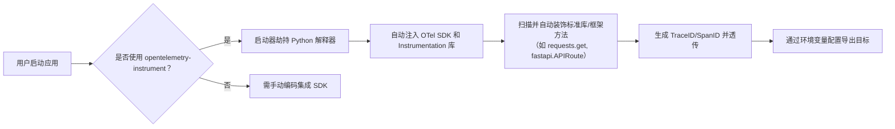
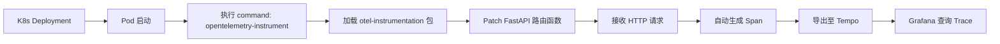

# 零代码集成 OpenTelemetry：原理、实践与关键限制


## 一、核心概念解析：什么是“零代码集成”？

**零代码集成（Zero-Code Instrumentation）** 并非完全不写代码，而是指**无需修改业务源码中的追踪逻辑（Tracing Logic）**，即不手动调用 `tracer.start_span()`、不显式配置 `OTLPExporter`、不编写 `Resource` 初始化代码。其本质是利用语言运行时（如 Python 的 `sitecustomize.py` 或 `import hooks`）或进程启动代理（如 `opentelemetry-instrument` 启动器），在应用加载前自动注入观测能力。  
优势：业务代码零侵入、快速落地、适合遗留系统；  
局限：无法精细控制 Span 生命周期、缺少自定义属性注入能力、Log/Trace/Metrics 关联弱。  

> 类比理解：就像给汽车加装“黑匣子行车记录仪”，你不用改发动机代码，只需在点火前插上设备，它就自动记录所有行驶数据。



## 二、必备依赖包详解（Python 环境）

零代码集成依赖三个核心 PyPI 包，缺一不可：

### 1. `opentelemetry-exporter-otlp-proto-http`  

该包提供基于 HTTP 协议的 OTLP（OpenTelemetry Protocol）导出能力，将采集的 Trace 数据序列化为 Protocol Buffers 格式，通过 POST 请求发送至后端 Collector（如 Tempo、Jaeger）。它替代了手动创建 `OTLPSpanExporter` 实例的代码，**环境变量 `OTEL_EXPORTER_OTLP_ENDPOINT` 即由该包读取并生效**。若缺失，Trace 将无法离开本机。

### 2. `opentelemetry-instrumentation-fastapi`  

专为 FastAPI 框架设计的自动插桩模块。它通过 Monkey Patch 技术，在 FastAPI 启动时自动为每个路由（`@app.get()`）包裹 Span 创建逻辑，捕获请求路径、状态码、延迟等信息。**无需在 `main.py` 中写 `FastAPIInstrumentor.instrument_app(app)`** —— 这正是“零代码”的关键实现层。

### 3. `opentelemetry-sdk`  

OpenTelemetry 的核心运行时 SDK，包含 `TracerProvider`、`SpanProcessor`、`Resource` 等基础组件。它是所有 Instrumentation 的容器，负责管理 Span 生命周期与资源上下文。**即使零代码，此包仍必须安装，否则启动器无法初始化追踪引擎**。

> 安装命令（`requirements.txt`）：
>
> ```txt
> opentelemetry-exporter-otlp-proto-http==1.24.0
> opentelemetry-instrumentation-fastapi==0.42b0
> opentelemetry-sdk==1.24.0
> ```

## 三、环境变量配置原理与全量清单

零代码集成完全依赖环境变量驱动，其本质是 **OTel Python SDK 在 `opentelemetry-instrument` 启动时读取 `os.environ` 并自动构建 `TracerProvider`**。以下是必须配置的变量（含作用与示例）：

| 环境变量名                                         | 示例值                                                    | 作用说明                                                     |
| -------------------------------------------------- | --------------------------------------------------------- | ------------------------------------------------------------ |
| `OTEL_RESOURCE_ATTRIBUTES`                         | `service.name=open-telemetry-python-raw,environment=prod` | 定义服务元数据，用于在 Grafana Tempo/Loki 中按服务名过滤 Trace。等价于代码中 `Resource.create({...})`。 |
| `OTEL_SERVICE_NAME`                                | `open-telemetry-python-raw`                               | 服务唯一标识，是 `OTEL_RESOURCE_ATTRIBUTES` 的快捷方式，优先级更高。 |
| `OTEL_EXPORTER_OTLP_ENDPOINT`                      | `http://tempo:4318/v1/traces`                             | 指定 Trace 导出地址，必须与 Collector 的 OTLP HTTP 接口一致。 |
| `OTEL_EXPORTER_OTLP_PROTOCOL`                      | `http/protobuf`                                           | 明确协议类型，避免自动探测失败。                             |
| `OTEL_LOG_LEVEL`                                   | `INFO`                                                    | 控制 OTel 内部日志级别，便于调试集成问题。                   |
| `OTEL_PYTHON_LOGGING_AUTO_INSTRUMENTATION_ENABLED` | `true`                                                    | 启用日志自动注入 TraceID，使 `logging.info()` 输出自动携带 `trace_id` 字段。 |

> 注意：`OTEL_EXPORTER_OTLP_ENDPOINT` 必须与代码中 SDK 配置的 URL **完全一致**，否则 Trace 将静默丢失。


## 四、Kubernetes Manifest 关键改造点

在 Kubernetes 中部署零代码应用，`Deployment` 的 `spec.template.spec.containers` 需做三项强制修改：

### 1、启动命令重写（`command`）

原始镜像命令为 `["python", "main.py"]`，必须替换为：

```yaml
command: ["opentelemetry-instrument", "python", "main.py"]
```

原理：`opentelemetry-instrument` 是一个封装好的启动器，它会先加载 OTel SDK，再执行原命令，从而实现“无感插桩”。

### 2、环境变量注入（`env`）

必须显式声明所有 `OTEL_*` 变量，**不可依赖 ConfigMap**（因启动器在容器启动初期读取，ConfigMap 挂载有延迟风险）：

```yaml
env:
- name: OTEL_SERVICE_NAME
  value: "open-telemetry-python-raw"
- name: OTEL_EXPORTER_OTLP_ENDPOINT
  value: "http://tempo.monitoring.svc.cluster.local:4318/v1/traces"
# ... 其他变量
```

### 3、镜像标签标准化

使用 `:latest` 不推荐，应固定为带语义化版本的镜像（如 `ghcr.io/open-telemetry/opentelemetry-python:1.24.0`），确保环境一致性。

> 特别提醒：`ServiceMonitor`（Prometheus Operator）必须单独部署，用于抓取 OTel SDK 暴露的 `/metrics` 端点（默认端口 9464），否则 Metrics 将不可见。



## 五、零代码 vs SDK 集成对比分析

| 维度                       | 零代码集成                                                   | SDK 手动集成                                                 |
| -------------------------- | ------------------------------------------------------------ | ------------------------------------------------------------ |
| **代码侵入性**             | ✅ 业务代码 0 修改                                            | ❌ 需在 `main.py` 添加 `instrument_app()` 等调用              |
| **定制能力**               | ⚠️ 仅支持预设 Hook（如 FastAPI 路由），无法添加业务 Span      | ✅ 可在任意位置 `with tracer.start_span("db-query"):` 自定义 Span |
| **Log/Trace/Metrics 关联** | ⚠️ 依赖 `OTEL_PYTHON_LOGGING_AUTO_INSTRUMENTATION_ENABLED`，但跨服务 TraceID 透传需额外配置（如 `requests` 插桩） | ✅ 可通过 `get_current_span().get_span_context().trace_id` 手动注入日志字段，强关联 |
| **调试难度**               | ⚠️ 错误常表现为 Trace 缺失，需检查 `OTEL_LOG_LEVEL=DEBUG` 日志 | ✅ 错误直接抛出异常，定位精准                                 |
| **适用场景**               | 快速验证、CI/CD 测试环境、遗留系统观测兜底                   | 生产环境核心服务、需全链路诊断、合规审计要求                 |

> 结论：**零代码是“开箱即用”的起点，SDK 是“生产就绪”的终点**。二者非互斥，而是演进关系。

## 六、常见故障排查指南

### 1、现象：Grafana Tempo 中看不到 Trace  

**排查路径**：  

1. 进入 Pod 执行 `env | grep OTEL` → 确认所有变量存在且拼写正确；  
2. 查看容器日志：`kubectl logs <pod> \| grep -i "exporter"` → 检查是否连接 Collector 成功；  
3. 执行 `curl http://localhost:9464/metrics` → 验证 Metrics 端点是否暴露（证明 SDK 已加载）。

### 2、现象：日志中无 `trace_id` 字段  

**根因**：`OTEL_PYTHON_LOGGING_AUTO_INSTRUMENTATION_ENABLED=true` 未生效。  
**修复**：确认该变量已写入 Deployment，且 `opentelemetry-instrument` 启动器版本 ≥ 1.22.0（旧版本不支持）。

### 3、现象：Trace 中 Service Name 显示为 `unknown_service:python`  

**根因**：`OTEL_SERVICE_NAME` 或 `OTEL_RESOURCE_ATTRIBUTES` 未设置或值为空。  
**修复**：在环境变量中强制指定 `OTEL_SERVICE_NAME=your-app-name`。

## 七、总结：零代码集成的本质与价值

零代码集成 OpenTelemetry 是云原生可观测性落地的“第一公里”。它通过**启动器代理 + 环境变量驱动 + 框架自动插桩**三位一体机制，将复杂的分布式追踪能力下沉至基础设施层。对小白而言，它消除了学习 Span 生命周期、Context 传播、Exporter 配置等底层概念的门槛；对团队而言，它实现了可观测性能力的“标准化交付”。然而，必须清醒认知：**零代码不是银弹，而是观测能力的“最小可行集”**。当业务需要深度诊断、自定义指标或跨语言强关联时，SDK 集成仍是不可替代的终极方案。

> 最终建议：从零代码起步 → 验证链路连通性 → 逐步过渡到 SDK 集成关键服务 → 构建 All-in-One 可观测性平台。


