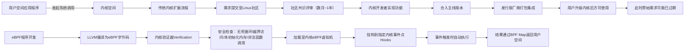
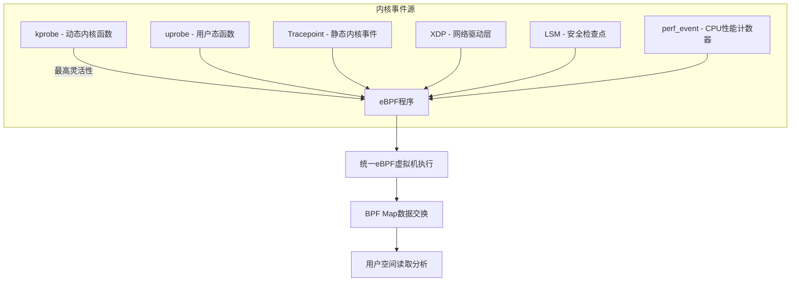

# eBPF 入门：让 Linux 内核真正“可编程”的革命性技术


## 一、什么是 eBPF？——可编程内核的革命性范式

**eBPF**（extended Berkeley Packet Filter，扩展伯克利包过滤器）**并非仅用于网络包过滤的工具，而是一种安全、沙箱化的内核运行时编程框架**。其核心价值在于：**在不修改、不重启、不编译 Linux 内核的前提下，动态注入并执行用户定义的逻辑代码，从而实时观测、干预和增强内核行为**。

> **关键突破点**：传统内核功能扩展需经历“应用提出需求 → 社区评审 → 内核开发者编码 → 多轮测试 → 合入主线 → 发行版集成 → 用户升级”长达1–3年的漫长流程；而 eBPF 程序可在**秒级完成编译、验证、加载与卸载**，且全程运行于受严格约束的虚拟机中，彻底打破内核“只读不可写”的僵化模型。



> **说明**：左侧为传统内核扩展的“瀑布式长周期”流程，右侧为 eBPF 的“敏捷式短闭环”流程。箭头标注清晰体现二者在**时间成本、安全机制、部署灵活性**上的本质差异。

## 二、eBPF 的核心安全机制：验证器（Verifier）

eBPF 程序绝非任意 C 代码直译——它必须通过内核内置的**静态验证器（Verifier）** 才能加载。该验证器是 eBPF 安全基石，执行以下强制校验：

- **终止性保障**：禁止无限循环（如 `while(1)`），所有循环必须有可证明的上界（通过 `#pragma unroll` 或编译器自动推导）；
- **内存安全**：禁止指针算术运算（`ptr++`）、禁止访问未映射内存、所有 map 访问必须经 `bpf_map_lookup_elem()` 检查返回值；
- **权限隔离**：无法直接调用任意内核函数，仅限白名单辅助函数（如 `bpf_trace_printk`, `bpf_get_current_pid_tgid`）；
- **资源限制**：指令数上限（默认4096条）、map 键值大小、栈空间（512字节）均被硬编码约束。

> **解释**：验证器如同一位“内核安检员”，在程序运行前逐行扫描字节码，确保其行为完全可控——就像给一段 JavaScript 代码加装“沙盒引擎”，即使代码含恶意逻辑，也无法突破内存边界或调用危险系统调用。

## 三、eBPF 程序的四大核心挂载点（Hooks）

eBPF 程序必须绑定到内核预设的**事件钩子（Hook）** 上才能激活。五类，现按重要性排序详解：

### 1、kprobe / uprobe（动态插桩）

- **kprobe**：在任意内核函数入口/出口插入探针。例如监控 `sys_openat` 函数调用：

  ```c
  SEC("kprobe/sys_openat")
  int trace_sys_openat(struct pt_regs *ctx) {
      u64 pid = bpf_get_current_pid_tgid();
      char filename[256];
      bpf_probe_read_user(&filename, sizeof(filename), (void *)PT_REGS_PARM2(ctx));
      bpf_printk("PID %d opened file: %s", pid >> 32, filename);
      return 0;
  }
  ```

- **uprobe**：在用户态二进制（如 `mysqld`, `postgres`）的指定函数地址插桩，实现**零侵入数据库性能分析**。

### 2、Tracepoint（静态追踪点）

- 内核开发者预先埋点的轻量级事件（如 `syscalls/sys_enter_read`），开销极低，适合高频采集。

- 示例：捕获所有 `read()` 系统调用参数：

  ```c
  SEC("tracepoint/syscalls/sys_enter_read")
  void trace_read(struct trace_event_raw_sys_enter *ctx) {
      bpf_printk("read fd=%d count=%d", (int)ctx->args[0], (int)ctx->args[2]);
  }
  ```

### 3、XDP（eXpress Data Path）——网络层极速处理

- 在网卡驱动收包**最早阶段**（DMA后、协议栈前）执行，支持微秒级包过滤/转发/重写。
- 典型场景：DDoS防护（丢弃恶意IP）、L4负载均衡（修改目的IP端口）。

### 4、LSM（Linux Security Module）——安全策略引擎

- 挂载到内核安全检查点（如 `security_file_open`），可实现细粒度访问控制（如禁止特定进程打开敏感文件）。

### 5、perf_event（性能事件）

- 绑定 CPU 性能计数器（如 `cycles`, `instructions`），用于火焰图生成、热点函数定位。



> 📌 **注释**：所有 Hook 类型最终汇入同一套 eBPF 运行时环境，体现其“一次编写、多点复用”的架构优势。

## 四、用户空间与内核空间：eBPF 的运行边界

- **用户空间（User Space）**：所有普通进程（`bash`, `nginx`, `python`）运行区域，拥有独立虚拟内存，**无权直接操作硬件**，必须通过**系统调用（syscall）** 请求内核服务。
- **内核空间（Kernel Space）**：操作系统核心驻留区，直接管理 CPU、内存、设备驱动。eBPF 程序虽由用户编译，但**加载后运行于内核空间的受限虚拟机中**，与内核共享地址空间，却受验证器严格隔离。

> **关键对比表**：
>
> | 维度       | 用户空间           | 内核空间               | eBPF 程序位置                                     |
> | ---------- | ------------------ | ---------------------- | ------------------------------------------------- |
> | 权限       | 无硬件访问权       | 全权限                 | 受限权限（验证器管控）                            |
> | 内存       | 独立虚拟地址空间   | 全局地址空间           | 栈≤512B，仅能访问Map                              |
> | 稳定性影响 | 崩溃仅影响自身进程 | 崩溃导致系统宕机       | 验证失败则拒绝加载                                |
> | 开发调试   | GDB/printf 自由    | 需 `bpf_printk()` 输出 | 日志输出至 `/sys/kernel/debug/tracing/trace_pipe` |

## 五、eBPF 生态全景：从基础到生产级

- **开发工具链**：`clang` + `llc` 编译 C 到 eBPF 字节码；`bpftool` 管理程序生命周期；`libbpf` 提供 C API 封装。
- **主流项目**：
  - **Cilium**：基于 eBPF 的云原生网络/安全平台，替代 iptables 实现 Service 负载均衡；
  - **Falco**：运行时安全检测引擎，实时识别异常进程行为；
  - **Pixie**：K8s 应用性能可观测性平台，无需埋点自动采集 HTTP/gRPC 指标；
  - **bcc**：Python/Lua 绑定库，提供 `execsnoop`, `opensnoop` 等即用型诊断工具。

> **生态价值总结**：eBPF 已超越“网络技术”范畴，成为构建**现代云基础设施可观测性、安全性、网络性三大支柱的统一底座**——其“内核可编程化”范式，正重塑操作系统与上层应用的交互方式。


