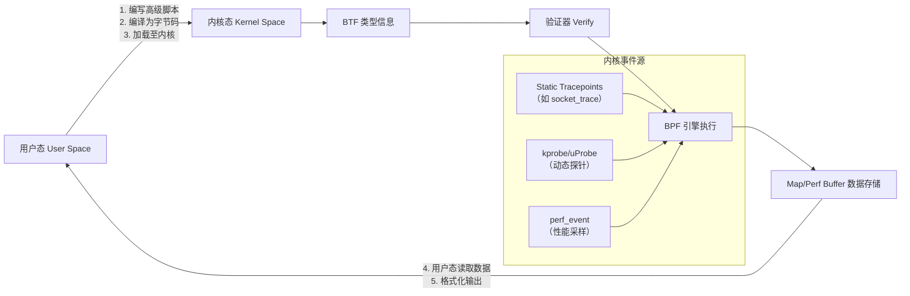
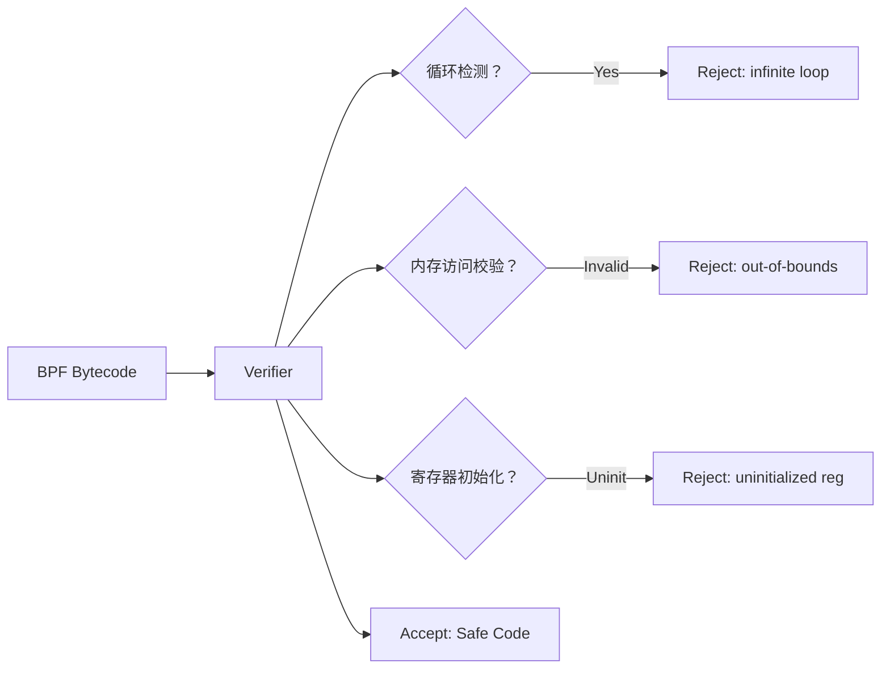
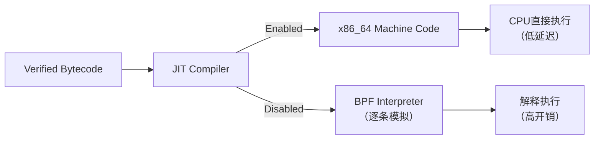
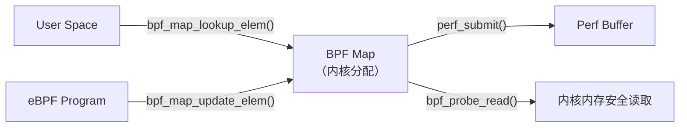
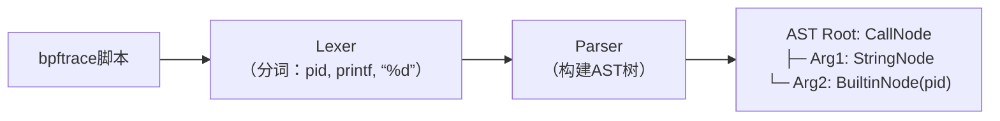

# eBPF 程序从编写到内核执行的完整技术链路解析

## 一、eBPF 整体架构流程图（高阶视图）

> **说明**：eBPF 是一种“用户编写 → 内核验证 → 安全执行 → 数据回传”的双向闭环系统。用户态负责开发与展示，内核态负责安全沙箱运行；`Map` 是唯一跨空间共享数据的桥梁，`BTF` 提供类型保障，`Verify` 是安全守门员。

## 二、七大核心技术点详解（含原理、作用、图解）

### 1、BPF 字节码（BPF Bytecode）

**详细解释**：  
BPF 字节码是 eBPF 程序在内核中实际运行的中间指令格式，每条指令为64位固定长度（8字节），包含操作码（OPCODE）、源/目标寄存器编号、立即数（IMM）和偏移量（OFFSET）。它不依赖CPU架构，但可被JIT编译为x86_64或ARM64等原生机器码，确保跨平台兼容性与高性能执行。字节码由LLVM从C或bpftrace脚本生成，是内核验证器唯一接受的输入形式。

### 2、BTF（BPF Type Format）

**详细解释**：  
BTF 是内核内置的类型描述元数据格式，以紧凑二进制方式存储结构体、联合体、枚举及函数签名等完整类型信息。它使eBPF程序能安全访问内核数据结构成员（如`task_struct->pid`），无需硬编码偏移量；同时支撑`libbpf`自动生成类型安全的Map键值结构，彻底解决传统BPF中“魔法数字”导致的崩溃风险，是现代eBPF可观测性的基石。

### 3、验证器（Verifier）

**详细解释**：  
验证器是Linux内核中一段超9000行C代码的安全引擎，在加载BPF字节码前执行静态分析。它严格检查：① 无无限循环（通过有向无环图DAG路径分析）；② 无越界内存访问（栈/Map/辅助函数返回值均校验）；③ 寄存器状态完备（禁止使用未初始化寄存器）。任何违规将返回260+种错误码并拒绝加载，从根源杜绝内核崩溃。

### 4、JIT 编译器（Just-In-Time Compiler）

**详细解释**：  
JIT编译器将已验证的BPF字节码动态翻译为宿主机CPU原生指令（如x86_64的`mov`, `add`, `jmp`），绕过解释器逐条模拟的开销。启用后（`net.core.bpf_jit_enable=1`），性能提升3–5倍；其生成的机器码受内核W^X保护（不可写且不可执行），并通过`bpf_jit_dump=2`可查看汇编输出，是eBPF生产环境高性能的关键保障。

### 5、Map（BPF Maps）

**详细解释**：  
Map 是eBPF中唯一的内核-用户态双向数据通道，本质为内核管理的高性能哈希表/数组/队列等数据结构。用户态通过`bpf_map_lookup_elem()`读取，eBPF程序用`bpf_map_update_elem()`写入；支持`BPF_MAP_TYPE_HASH`（键值存储）、`BPF_MAP_TYPE_PERF_EVENT_ARRAY`（性能事件缓冲）等十余种类型，是传递`pid`、调用栈、网络包统计等所有观测数据的核心载体。

### 6、抽象语法树（AST）

**详细解释**：  
AST是编译器将源代码（如bpftrace脚本）解析成的树状内存结构，节点代表运算符、变量、函数调用等语法单元。例如`printf("PID: %d", pid)`被解析为`CallNode(printf) ← StringNode("PID: %d") + BuiltinNode(pid)`。它是后续语义分析、IR生成的基础，确保编译器理解代码逻辑而非仅字符串匹配，为类型检查与错误定位提供结构化依据。

### 7、LLVM 工具链

**详细解释**：  
LLVM是eBPF程序的编译中枢，包含前端（Clang解析C代码）、中端（IR优化器）和后端（BPF目标代码生成）。它将C源码先转为统一中间表示（IR），再经`llc -march=bpf`生成字节码；支持死代码消除、常量传播等20+优化，且IR可被`llvm-objdump`反汇编验证。没有LLVM，eBPF将无法实现C语言级开发体验。

## 三、eBPF 程序执行全流程（10步精解）

| 步骤 | 名称        | 关键操作                                                     | 代码/工具示例                                                |
| ---- | ----------- | ------------------------------------------------------------ | ------------------------------------------------------------ |
| 1    | 源码解析    | bpftrace脚本经Lexer/Yacc分词并构建AST                        | `tracepoint:syscalls:sys_enter_nanosleep { printf("PID: %d\n", pid); }` |
| 2    | AST生成     | 生成语法树：CallNode(printf) ← StringNode + BuiltinNode(pid) | —                                                            |
| 3    | BTF注入     | （本例无结构体引用，跳过）                                   | `#include <vmlinux.h>`                                       |
| 4    | 语义分析    | 检查`pid`是否为合法内置变量，报错`undefined identifier 'pidd'` | `printf("PID: %d", pidd);` → 编译失败                        |
| 5    | IR生成      | Clang生成LLVM IR：`%0 = call i64 @bpf_get_current_pid_tgid()` | `clang -O2 -target bpf -c ...`                               |
| 6    | 字节码生成  | `llc`将IR编译为BPF指令：`r1 = r10; r1 += -8; *(u64*)(r1 + 0) = r6;` | `llc -march=bpf -filetype=obj`                               |
| 7    | 验证器检查  | 验证寄存器r6是否已初始化、栈偏移-8是否合法                   | `kernel: bpf_verifier: [0] R6 !read_ok`                      |
| 8    | JIT编译     | 启用JIT后生成x86_64指令：`mov rdi, QWORD PTR [rbp-8]; call bpf_trace_printk@PLT` | `echo 1 > /proc/sys/net/core/bpf_jit_enable`                 |
| 9    | Map数据写入 | eBPF程序调用`bpf_perf_event_output()`将pid写入perf buffer    | `bpf_perf_event_output(ctx, &my_events, BPF_F_CURRENT_CPU, &data, sizeof(data));` |
| 10   | 用户态输出  | `bpftool prog run`或`bpftrace -e '...'`读取Map并打印`PID: 1234` | `bpftrace -e 'kprobe:do_nanosleep { printf("PID: %d\n", pid); }'` |

## 四、结语：为什么eBPF是云原生时代的操作系统新范式？

eBPF 不是简单的“内核插件”，而是通过**强制验证的字节码沙箱**、**类型安全的BTF元数据**、**零拷贝的Map通信**与**JIT加速的确定性执行**，在不修改内核源码的前提下，实现了网络、安全、可观测性三大领域的革命性突破。对初学者而言，掌握上述10步流程与7大组件，即掌握了打开Linux内核黑盒的万能钥匙——这不仅是运维工程师的进阶必修课，更是云原生时代基础设施工程师的核心竞争力。

