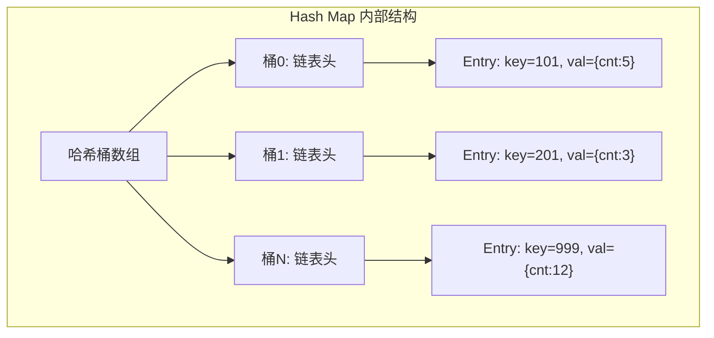
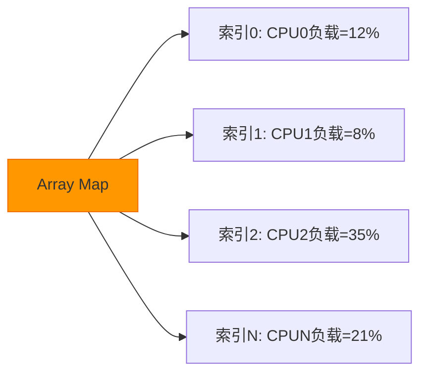
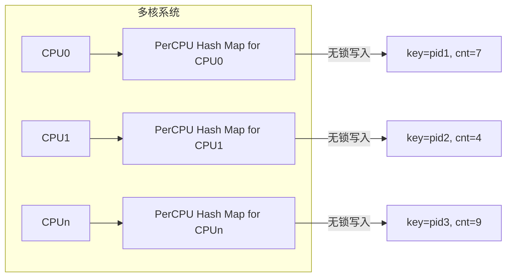
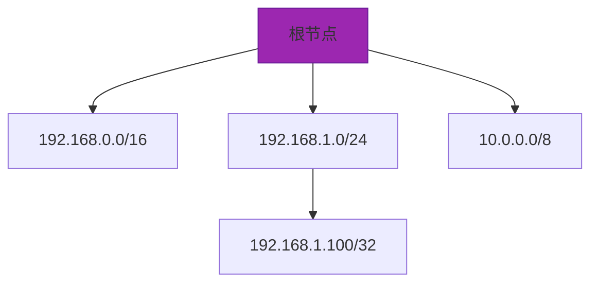
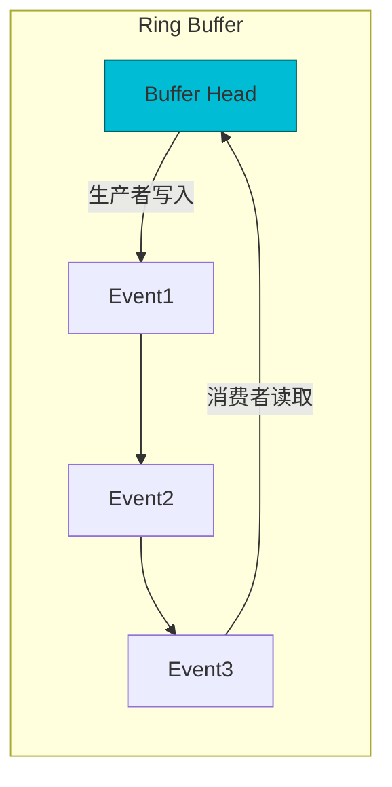
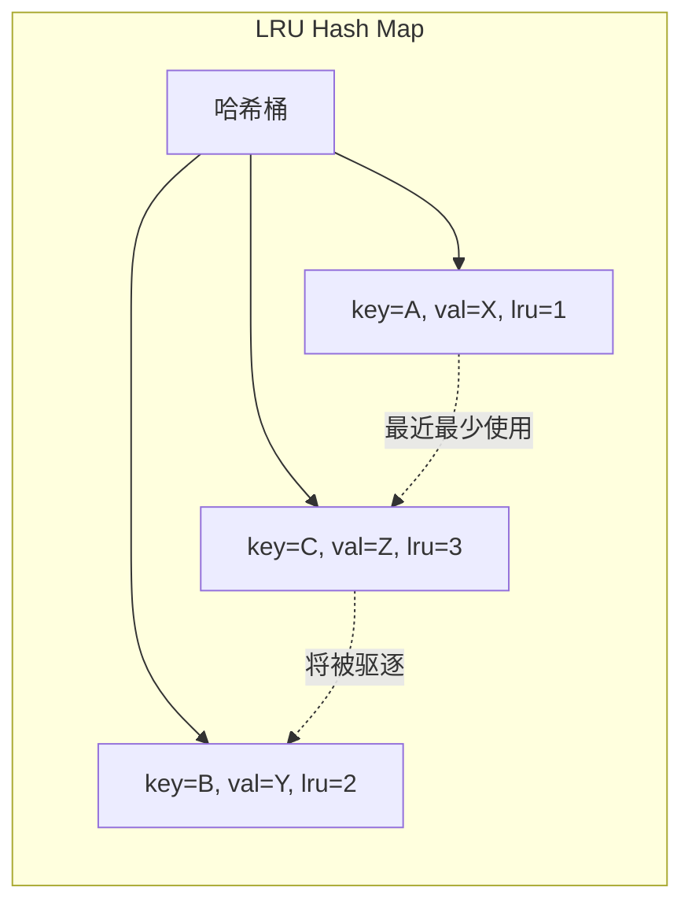
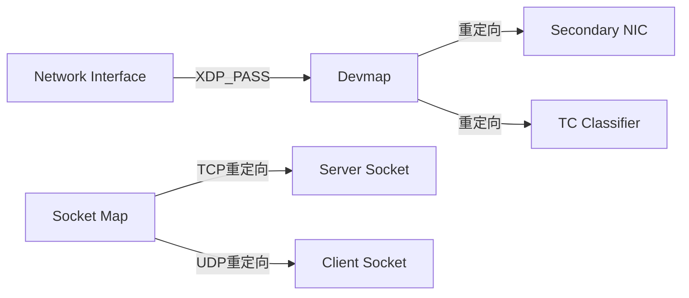
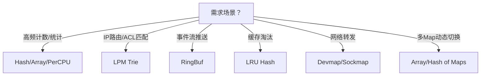

# eBPF Map 全解析：内核与用户态高效数据共享的核心机制


## 一、eBPF Map 的核心定位与设计哲学

eBPF Map 是 **eBPF（extended Berkeley Packet Filter）生态系统中唯一被官方支持的、安全可控的内核态与用户态双向数据交换通道**。它并非传统意义上的内存共享，而是由内核统一管理的、类型严格校验的、生命周期受控的**受保护数据容器**。其设计初衷是解决“如何让运行在受限沙箱中的 eBPF 程序安全地与用户空间协作”这一根本问题。

> **图解：eBPF Map 的系统级定位**  
>
> ```mermaid
> graph LR
> A[用户空间程序] -->|"通过 bpf() 系统调用"| B[eBPF Map]
> C[eBPF 内核程序] -->|通过 bpf_map_lookup_elem / bpf_map_update_elem 等辅助函数| B
> D[内核其他子系统] -->|可选：通过特定接口访问| B
> B -->|内存隔离| E[内核专用页框池]
> style B fill:#4CAF50,stroke:#388E3C,color:white
> style E fill:#2196F3,stroke:#0D47A1,color:white
> ```

- **关键特性解释**：  
  eBPF Map 在创建时即被内核分配独立的物理内存页，并全程由内核内存管理器（MMU）进行访问控制。所有读写操作必须经由内核提供的 `bpf_map_*` 辅助函数完成，禁止直接指针解引用。这确保了即使 eBPF 程序存在逻辑错误，也无法越界访问或破坏内核关键数据结构，从而实现**零信任环境下的强隔离性**。

## 二、eBPF Map 的核心属性与元数据结构

每个 eBPF Map 实例在创建时必须显式声明以下四类元信息，内核据此进行静态验证与资源预分配：

| 属性            | 含义                | 示例值                        | 重要性说明                                                   |
| --------------- | ------------------- | ----------------------------- | ------------------------------------------------------------ |
| **Map Type**    | 数据组织逻辑模型    | `BPF_MAP_TYPE_HASH`           | 决定底层算法、API 行为及适用场景，不可运行时变更             |
| **Max Entries** | 最大键值对数量      | `1024`                        | 内核据此预分配哈希桶/数组空间；**超限写入直接返回 `-E2BIG` 错误，不自动扩容** |
| **Key Size**    | 键（Key）字节长度   | `sizeof(__u32)` = `4`         | 影响哈希计算效率与内存对齐，需与程序中 `struct { __u32 key; }` 定义严格一致 |
| **Value Size**  | 值（Value）字节长度 | `sizeof(struct stats)` = `16` | 决定单条记录存储容量，过大将显著增加内存占用与拷贝开销       |

> **代码示例（用户态创建 Hash Map）**：
>
> ```c
> // 使用 libbpf 创建 map
> struct bpf_map *map = bpf_map__create(
>  BPF_MAP_TYPE_HASH,          // 类型
>  "user_stats",               // 名称（用于调试）
>  sizeof(__u32),              // key_size: 用户ID为u32
>  sizeof(struct user_stats),  // value_size: 自定义统计结构
>  1024,                       // max_entries
>  NULL                        // attributes (默认)
> );
> if (!map) {
>  fprintf(stderr, "Failed to create map: %s\n", strerror(errno));
>  return -1;
> }
> ```

## 三、主流 eBPF Map 类型深度解析（含图解与场景）

### 1、`BPF_MAP_TYPE_HASH` —— 高效哈希表



- **原理扩展**：  
  采用开放寻址法（Open Addressing）结合链地址法（Chaining）的混合实现。内核为每个 Map 预分配固定大小哈希桶数组，键经 `jhash()` 计算后映射至桶索引；同桶冲突项以单向链表组织。**不支持动态扩容，满载后 `bpf_map_update_elem()` 返回 `-E2BIG`，开发者必须主动监控并清理旧数据**。

- **典型用途**：进程系统调用计数（key=pid_t, value=struct {syscall_cnt[256]}）

### 2、`BPF_MAP_TYPE_ARRAY` —— 零拷贝索引数组



- **原理扩展**：  
  底层为连续物理内存块，支持 O(1) 时间复杂度的随机访问。**所有索引必须在 `[0, max_entries)` 范围内，越界访问触发 `SIGSEGV`**。因无哈希计算开销，性能极高，适用于 CPU 绑定型场景（如 per-CPU 统计），但灵活性低于 Hash Map。

- **典型用途**：多核 CPU 使用率实时采集（key=cpu_id, value=u64）

### 3、`BPF_MAP_TYPE_PERCPU_HASH` / `PERCPU_ARRAY` —— 每核独占 Map



- **原理扩展（≥50字）**：  
  为每个在线 CPU 核心分配独立的 Map 实例副本（内存布局为 `struct { cpu0_data; cpu1_data; ... }`）。eBPF 程序调用 `bpf_map_lookup_elem()` 时，内核自动路由至当前 CPU 对应副本，**彻底消除多核竞争，避免原子操作与缓存行颠簸（False Sharing）**，是高并发场景首选。

- **典型用途**：网络包处理中 per-CPU 流量统计（避免锁争用）

### 4、`BPF_MAP_TYPE_LPM_TRIE` —— 最长前缀匹配树



- **原理扩展**：  
  基于基数树（Radix Tree）实现，专为 IP 路由查找优化。支持 `bpf_map_lookup_elem()` 传入任意 IP 地址，内核自动执行最长前缀匹配（LPM），返回最精确匹配的路由条目。**时间复杂度 O(log n)，远优于线性扫描，是 XDP 流量分类核心组件**。

- **典型用途**：XDP 程序中实现 ACL 规则匹配、DDoS 源 IP 封禁

### 5、`BPF_MAP_TYPE_RINGBUF` —— 零拷贝环形缓冲区



- **原理扩展**：  
  采用内存映射（mmap）+ 生产者/消费者指针双原子变量设计。用户态通过 `mmap()` 直接读取缓冲区，eBPF 程序调用 `bpf_ringbuf_output()` 写入事件，**全程零内存拷贝，延迟低于 1μs**。当缓冲区满时，新事件自动覆盖最旧事件（丢弃策略），适合高频日志与追踪。

- **典型用途**：`tracepoint` 事件实时捕获、进程上下文切换跟踪

### 6、`BPF_MAP_TYPE_LRU_HASH` —— 自动淘汰哈希表



- **原理扩展**：  
  在标准 Hash Map 基础上集成双向链表维护访问时序。每次 `lookup` 或 `update` 操作均将对应节点移至链表尾（MRU端）；当插入新元素且 Map 已满时，自动删除链表头（LRU端）节点。**无需用户手动清理，完美适配 DNS 缓存、会话状态等有限资源场景**。

- **典型用途**：HTTP 请求 Session ID 缓存、最近活跃 IP 地址记录

### 7、`BPF_MAP_TYPE_DEVMAP` / `SOCKMAP` —— 网络设备与套接字直连



- **原理扩展**：  
  `DEVMAP` 允许 XDP 程序将数据包直接转发至另一网卡（`bpf_redirect_map()`），绕过协议栈，实现微秒级转发；`SOCKMAP` 则允许 eBPF 程序将数据包注入指定 socket（`bpf_sk_redirect_map()`），用于透明代理、服务网格流量劫持。二者是云原生网络加速基石。

- **典型用途**：Kubernetes CNI 插件（Cilium）、eBPF 加速的 Envoy 代理

## 四、总结：Map 选型决策树



> **终极建议**：  
> 初学者优先掌握 `HASH`、`ARRAY`、`RINGBUF` 三大基础类型；进阶者深入 `PERCPU` 与 `LPM`；网络开发者必学 `DEVMAP`/`SOCKMAP`。所有 Map 必须通过 `libbpf` 或 `bpftool` 进行创建与调试，严禁裸系统调用。

