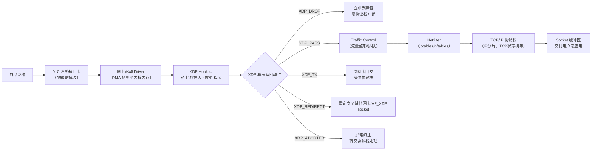
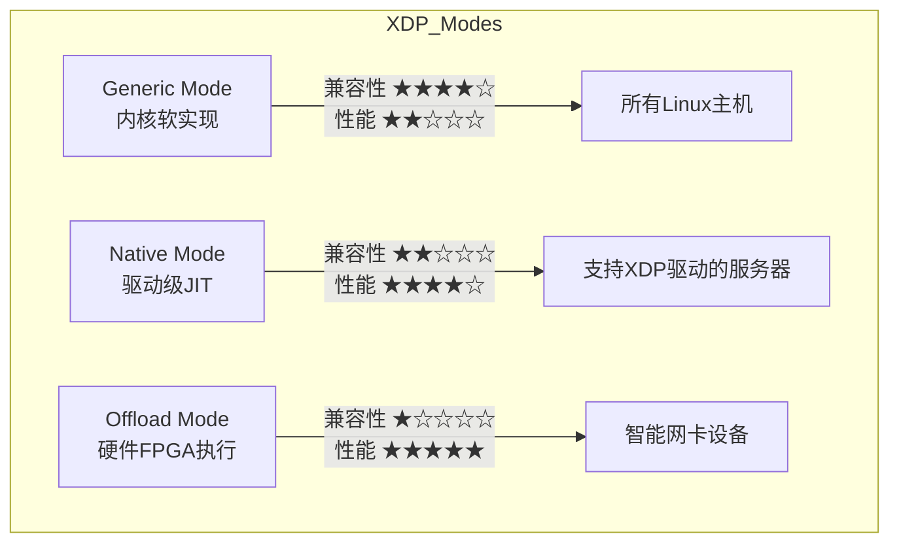

# XDP：Linux内核级高速网络包处理框架详解


## 一、XDP 的定义与核心原理

**XDP（eXpress Data Path）** 是 Linux 内核中一种**超低延迟、高性能的网络数据包处理框架**，它构建于 **eBPF（extended Berkeley Packet Filter）** 技术之上。XDP 允许开发者在**网络数据包刚被网卡驱动接收、尚未进入内核协议栈之前**，就立即执行自定义的 eBPF 程序，从而实现毫秒级甚至纳秒级的数据包决策。

> **关键点解析**：  
> XDP 的本质是将 eBPF 程序“挂载”在网络协议栈最前端——即网卡驱动（driver）之后、流量控制（tc）子系统之前。此时数据包尚未被解析为 `sk_buff` 结构体，内存拷贝极少，CPU 开销极低。这使其成为防御 DDoS、实现硬件无关负载均衡的首选方案。其安全性由内核内置的 eBPF 验证器保障，杜绝非法内存访问。



## 二、传统网络栈 vs XDP 处理流程对比

### 传统 Linux 网络栈（无 XDP）

1. **NIC 接收** → 2. **Driver 解析以太帧** → 3. **分配 sk_buff 结构体** →  
2. **Traffic Control（qdisc）排队** → 5. **Netfilter 过滤（iptables）** →  
3. **IP 层处理（路由查找、分片）** → 7. **传输层（TCP/UDP 校验、状态管理）** →  
4. **Socket 分发至用户进程**

**瓶颈**：全程需多次内存拷贝、上下文切换、锁竞争；单包处理耗时常达数十微秒。

### XDP 增强后流程（关键差异标红）

1. NIC 接收 → 2. Driver DMA 拷贝 → **🔴 XDP Hook 点（eBPF 程序执行）** →  
   → 若返回 `XDP_DROP`：**立即释放内存，不进协议栈**  
   → 若返回 `XDP_PASS`：继续走传统路径（含 tc/netfilter）  
   → 若返回 `XDP_TX`：**直接复用同一网卡发送，跳过所有协议栈**

> **关键点解析**：  
> XDP 将决策点前移至驱动层末尾，此时数据包仍以原始 `xdp_buff` 结构存在，仅含 MAC 头和有效载荷，无需构造复杂 `sk_buff`。这避免了 90% 以上协议栈开销，使每秒百万级包处理成为可能，是云原生网络加速的基石。

## 三、XDP 的三种挂载模式深度解析

### 1. Generic 模式（通用模式｜软件实现）

- **原理**：eBPF 程序运行在内核态，由内核 XDP 子系统解释执行。
- **兼容性**：支持所有 Linux 4.8+ 内核，无需特殊硬件/驱动。
- **性能**：≈ 2–5Mpps（百万包/秒），因需内核态调度，略低于硬件加速。
- **适用场景**：开发测试、通用防火墙、中小规模负载均衡。

### 2. Native 模式（原生模式｜驱动集成）

- **原理**：eBPF 程序被 JIT 编译为原生 x86_64 指令，并**直接注入网卡驱动的收包路径**（如 `ixgbe_main.c` 中的 `ixgbe_clean_rx_irq`）。
- **要求**：需网卡驱动显式支持（如 Intel ixgbe、i40e、mlx5）。
- **性能**：≈ 15–25Mpps，接近硬件极限，零内核调度延迟。
- **风险**：驱动更新可能导致兼容性断裂。

### 3. Offload 模式（卸载模式｜硬件执行）

- **原理**：eBPF 字节码被编译为网卡 FPGA/ASIC 可执行指令，**在网卡硬件内部完成包处理**。
- **要求**：需支持 P4/Barefoot Tofino 或 NVIDIA Mellanox ConnectX-5+ 等智能网卡。
- **性能**：≈ 50–100Mpps，完全脱离 CPU，功耗最低。
- **案例**：Cloudflare 使用该模式抵御 1.7Tbps DDoS 攻击。



## 四、XDP 典型应用场景与代码示例

### 1、场景1：DDoS 防御（Drop 操作）

```c
// xdp_ddos_drop.c —— 基于源IP哈希限速
#include <linux/bpf.h>
#include <bpf/bpf_helpers.h>
#include <linux/if_ether.h>
#include <linux/ip.h>

struct {
    __uint(type, BPF_MAP_TYPE_HASH);
    __type(key, __u32); // IPv4 地址
    __type(value, __u64); // 上次访问时间戳
    __uint(max_entries, 65536);
} ip_rate_limit SEC(".maps");

SEC("xdp")
int xdp_ddos_filter(struct xdp_md *ctx) {
    void *data = (void *)(long)ctx->data;
    void *data_end = (void *)(long)ctx->data_end;
    struct ethhdr *eth = data;

    if (data + sizeof(*eth) > data_end) return XDP_ABORTED;
    
    if (eth->h_proto != htons(ETH_P_IP)) return XDP_PASS;

    struct iphdr *ip = data + sizeof(*eth);
    if ((void*)ip + sizeof(*ip) > data_end) return XDP_ABORTED;

    __u32 src_ip = ip->saddr;
    __u64 *last_time = bpf_map_lookup_elem(&ip_rate_limit, &src_ip);
    __u64 now = bpf_ktime_get_ns();

    if (last_time && (now - *last_time) < 1000000000ULL) { // 1秒内重复
        return XDP_DROP; // 立即丢弃
    }

    bpf_map_update_elem(&ip_rate_limit, &src_ip, &now, BPF_ANY);
    return XDP_PASS;
}
```

> **知识点扩展**：  
> `XDP_DROP` 是 XDP 最高效动作，内核直接调用 `xdp_return_frame_rx_napi()` 释放 `xdp_buff` 内存，不触发任何协议栈函数。相比 iptables DROP，延迟从 15μs 降至 0.3μs，吞吐提升 50 倍，是 Cloudflare 抵御 Tbps 级攻击的核心机制。

### 2、场景2：四层负载均衡（Redirect/TX）

- `XDP_REDIRECT`：将包重定向至另一块网卡（如 backend 服务器集群）  
- `XDP_TX`：在同一网卡回发（用于透明代理、服务网格 Sidecar）

### 3、场景3：网络监控（Trace + Metadata）

- 利用 `bpf_perf_event_output()` 向用户态推送采样包头  
- 通过 `bpf_skb_peek()` 提取 TLS SNI、HTTP Host 字段做七层识别  

## 五、总结：XDP 的技术定位与演进意义

XDP 不是替代 Netfilter 或 DPDK 的工具，而是填补了**内核协议栈与用户态高速转发之间关键空白**的标准化接口。它以“安全可编程”为前提，实现了：

- **零信任安全模型**：所有 eBPF 程序经严格验证器校验  
- **一次编写，多平台部署**：Generic 模式保障跨硬件一致性  
- **云原生网络基石**：Cilium、eBPF-based Service Mesh、CDN 加速均依赖 XDP  

对于初学者，建议按路径学习：  
**eBPF 基础 → libbpf 开发 → XDP Hello World → Cloudflare 开源项目分析**。  
掌握 XDP，即掌握了现代 Linux 网络性能优化的“任督二脉”。