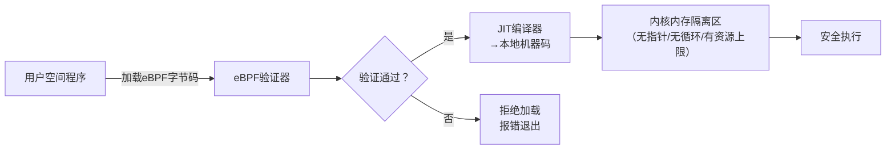
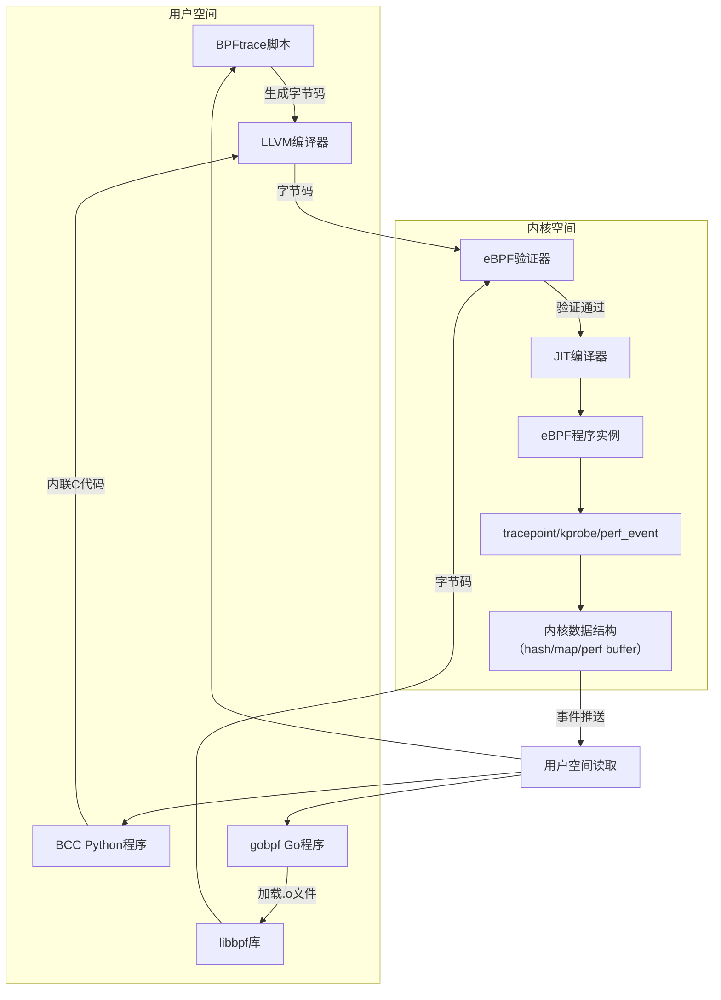

# eBPF入门指南：核心组件与用户空间工具全景解析


## 一、eBPF 技术栈分层架构（内核空间 vs 用户空间）

eBPF 并非单一技术，而是一套**分层协作的运行时体系**，其核心思想是：  

> **“在不修改内核源码、不重启系统前提下，安全地扩展内核能力”**  

### 1、内核空间三大核心技术

| 技术名称 | 全称                            | 核心作用                                                     | 初学者需掌握程度                         |
| -------- | ------------------------------- | ------------------------------------------------------------ | ---------------------------------------- |
| **eBPF** | extended Berkeley Packet Filter | 内核内置的**虚拟机指令集**，所有 eBPF 程序最终编译为该字节码，在内核沙箱中执行 | ✅ 了解其“安全沙箱”机制即可（见下方图解） |
| **BPF**  | Berkeley Packet Filter          | eBPF 的祖先，仅支持网络包过滤；现代 Linux 中已完全被 eBPF 取代 | ⚠️ 仅需知道它是历史演进起点               |
| **XDP**  | eXpress Data Path               | 基于 eBPF 的**最早数据包处理层**，在网卡驱动收包后立即执行，延迟<1μs | ✅ 理解其“零拷贝+硬件卸载”优势            |

#### 1.eBPF 安全沙箱机制（图解）



> **知识点扩展**：eBPF 验证器是内核中一道强制安全门禁。它静态分析字节码，禁止无限循环、非法内存访问、未初始化变量等危险操作，并限制程序最大指令数（默认100万条）。所有eBPF程序必须通过验证才能加载，这是Linux内核首次实现“可编程但不可破坏”的范式革命。

## 二、用户空间核心工具链

### 1、BPFtrace（高级跟踪工具）

**定位**：类 `awk` 的声明式跟踪语言，专为快速诊断设计  
**典型场景**：实时监控进程系统调用、文件I/O延迟、TCP重传等  

#### 1.示例代码（统计每个进程的open()调用次数）

```bash
# 一行命令实现：监听所有进程的open系统调用并计数
sudo bpftrace -e '
tracepoint:syscalls:sys_enter_open {
    @opens[comm] = count();
}
'
```

> **知识点扩展**：BPFtrace 将底层eBPF复杂性封装为简洁语法。`tracepoint:syscalls:sys_enter_open` 自动绑定内核追踪点，`@opens[comm]` 创建哈希映射存储进程名（comm）到计数的关联关系。其背后由LLVM编译为eBPF字节码，再经libbpf加载——用户无需接触C语言或内核模块编译。

### 2、BCC（BPF Compiler Collection）

**定位**：Python/C++双接口的**生产级工具集**，含数十个预置工具  
**典型工具**：`biolatency`（块设备I/O延迟分布）、`tcplife`（TCP连接生命周期）  

#### 1.示例：用Python调用BCC获取CPU调度延迟

```python
from bcc import BPF
# 加载eBPF C代码（内联在Python中）
bpf_code = """
#include <uapi/linux/ptrace.h>
BPF_HISTOGRAM(dist);
int trace_sched_migrate_task(struct pt_regs *ctx) {
    u64 ts = bpf_ktime_get_ns();
    dist.increment(bpf_log2l(ts));
    return 0;
}
"""
b = BPF(text=bpf_code)
b.attach_kprobe(event="sched_migrate_task", fn_name="trace_sched_migrate_task")
print("Tracing sched_migrate_task... Hit Ctrl-C to end.")
b["dist"].print_log2_hist("microseconds") # 打印对数直方图
```

> **知识点扩展**：BCC的核心价值在于**自动处理eBPF程序生命周期**。它内置Clang/LLVM编译器，能将内联C代码实时编译为字节码；同时提供`BPF_HISTOGRAM`等高级数据结构，自动管理内核-用户空间共享内存。开发者只需关注业务逻辑，无需手动编写加载器。

### 3、libbpf / gobpf（底层通信库）

**定位**：为高级语言提供eBPF程序加载与事件读取的**标准化API**  
**关键区别**：

- `libbpf`：C语言原生库，BCC底层依赖，也是Linux内核官方推荐方案  
- `gobpf`：Go语言绑定，使Go服务可直接嵌入eBPF监控能力  

#### 1.Go代码加载eBPF程序（gobpf示例）

```go
package main
import (
    "github.com/iovisor/gobpf/bcc"
)
func main() {
    // 加载预编译的eBPF对象文件
    prog := bcc.NewModuleFromFile("trace_open.o")
    defer prog.Close()
    
    // 绑定kprobe到sys_open函数
    prog.LoadKprobe("trace_open")
    prog.AttachKprobe("sys_open", "trace_open")
    
    // 读取perf事件
    reader := prog.GetPerfMap("events")
    reader.ReadLoop(func(data []byte) {
        fmt.Printf("Open by PID: %d\n", binary.LittleEndian.Uint32(data))
    })
}
```

> **知识点扩展**：libbpf是eBPF生态的“操作系统内核接口”。它定义了统一的BPF对象文件格式（.o），支持CO-RE（Compile Once – Run Everywhere）技术，使同一份eBPF程序可跨不同内核版本运行。gobpf等语言绑定均基于libbpf构建，确保生态一致性。

## 三、完整技术栈流程图（用户空间 ↔ 内核空间）



> **图解说明**：箭头表示数据流向。所有用户空间工具最终都通过**libbpf**（或BCC内置封装）与内核交互。eBPF程序在内核中以沙箱形式运行，通过`perf buffer`或`ring buffer`将事件异步传递回用户空间，实现毫秒级监控闭环。

## 四、学习路径建议

1. **第一步**：用 `bpftrace -l` 查看系统所有可用追踪点，理解`tracepoint`概念  
2. **第二步**：运行 `bcc-tools/biolatency` 观察磁盘I/O延迟，感受eBPF的实时性  
3. **第三步**：修改BCC示例中的C代码，尝试添加自定义打印逻辑  
4. **第四步**：阅读Linux内核文档 `Documentation/bpf/`，理解验证器规则  

> **结语**：eBPF不是“另一个监控工具”，而是Linux内核的**第二套API体系**。掌握BCC/BPFtrace，相当于获得内核的“显微镜”与“手术刀”，这是云原生时代SRE与开发者的必备硬技能。