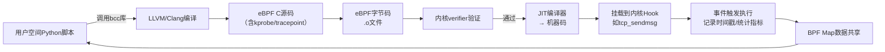
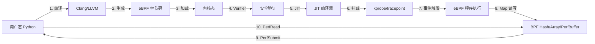

# EBPF零侵入可观测性开发实战：从BCC入门到HTTP延迟监控


## 一、eBPF 与 BCC 的本质关系：内核级“探针操作系统”

### 1、知识点1：什么是 eBPF？——Linux 内核的“安全沙箱虚拟机”

eBPF（extended Berkeley Packet Filter）**不是一种编程语言，而是一套运行在 Linux 内核中的轻量级、受控、可验证的虚拟机指令集**。它允许用户空间程序在不修改内核源码、不加载内核模块（LKM）、不重启系统的情况下，**安全地注入并执行自定义逻辑到内核关键路径中**（如网络栈、系统调用、进程调度、文件 I/O 等）。

其核心设计哲学是：  
**安全性第一**：所有 eBPF 程序在加载前必须通过内核 `verifier`（验证器）检查，禁止无限循环、非法内存访问、越界读写、未初始化指针等；  
**高性能保障**：支持 JIT（Just-In-Time）编译，将字节码直接转为原生 CPU 指令（x86_64/ARM64），性能接近原生 C；  
**事件驱动架构**：程序不主动轮询，而是绑定到内核 hook（如 `kprobe`, `tracepoint`, `socket filter`, `cgroup`），由内核在特定事件发生时自动触发；  
**跨版本兼容**：eBPF 程序与内核 ABI 解耦，只要内核 ≥ 4.1（推荐 ≥ 5.4），同一份字节码可在不同发行版上运行。



> **图解说明**：此流程图完整呈现 eBPF 程序从编写到执行的全生命周期。箭头标注中文注释，清晰体现“用户态编译 → 内核态验证 → JIT加速 → Hook挂载 → 事件触发 → Map回传”五大阶段。

## 二、BCC 框架：让 eBPF 开发像写 Python 一样简单

### 1、知识点2：BCC 是什么？——Facebook 开源的 eBPF “高级语言运行时”

BCC（BPF Compiler Collection）是由 Facebook 开源的**eBPF 开发框架与工具集**，它并非替代 eBPF，而是为其提供**生产级封装**。它解决了原生 eBPF 开发的四大痛点：

| 痛点           | BCC 解决方案                                                 | 小白友好度 |
| -------------- | ------------------------------------------------------------ | ---------- |
| ❌ 编译复杂     | 内置 LLVM/Clang 集成，Python 中 `BPF(text=...)` 一行加载 C 代码 | ⭐⭐⭐⭐⭐      |
| ❌ 跨语言门槛高 | 提供 Python/C++/Lua API，90% 逻辑可用 Python 编写，仅内核部分用 C | ⭐⭐⭐⭐⭐      |
| ❌ 数据交互困难 | 封装 `BPFTable` 类，自动映射内核 `BPF_MAP_TYPE_HASH` 等结构，`table[key] = value` 直接操作 | ⭐⭐⭐⭐       |
| ❌ 工具链缺失   | 自带 70+ 开箱即用工具：`biolatency`, `tcplife`, `execsnoop`, `opensnoop` 等 | ⭐⭐⭐⭐⭐      |

> **安装实操（腾讯云 Ubuntu）**：
>
> ```bash
> # 1. 启用 eBPF 支持（Ubuntu 22.04 默认开启）
> sudo apt update && sudo apt install -y python3-pip linux-headers-$(uname -r)
> # 2. 安装 BCC 工具集（官方推荐方式）
> sudo apt install -y bpfcc-tools linux-headers-$(uname -r)
> # 3. 克隆源码（用于学习示例）
> git clone https://github.com/iovisor/bcc.git
> ```

## 三、Hello World 实战：理解 eBPF 的事件驱动本质

### 1、知识点3：`hello_world.py` —— 第一个 eBPF 程序的逐行解析

该程序监听 `sys_clone()` 系统调用（进程创建入口），每次有新进程诞生即打印 `"Hello, World!"`。

```python
from bcc import BPF

# ① 定义 eBPF C 程序（字符串形式，嵌入Python）
prog = """
#include <uapi/linux/ptrace.h>
int hello(struct pt_regs *ctx) {
    bpf_trace_printk("Hello, World!\\n");
    return 0;
}
"""

# ② 加载并编译 eBPF 字节码
b = BPF(text=prog)

# ③ 将函数 'hello' 挂载到内核函数 'sys_clone' 入口（kprobe）
b.attach_kprobe(event="sys_clone", fn_name="hello")

# ④ 实时读取内核 trace_pipe 输出（阻塞式）
print("Tracing sys_clone()... Hit Ctrl-C to exit.")
b.trace_print()
```

**关键点深度扩展**：

- `bpf_trace_printk()`：内核调试专用函数，输出至 `/sys/kernel/debug/tracing/trace_pipe`，**仅用于开发，不可用于生产**（性能开销大）；
- `attach_kprobe(event="sys_clone", ...)`：动态插入 `kprobe` 到内核符号 `sys_clone`，无需修改内核、无需重启；
- `b.trace_print()`：Python 层持续 `read()` trace_pipe 并格式化解析，实现“内核日志 → 终端可见”。

> **执行效果**：运行后立即看到高频 `"Hello, World!"`，因 `k3s`、`systemd`、`bash` 等持续 fork 进程，印证“事件驱动”非轮询。

---

## 四、进阶实战：HTTP 请求延迟监控（零侵入生产级方案）

### 1、知识点4：`http_delay.py` —— 基于 TCP 协议栈的精准耗时测量

传统应用层埋点（如 Go `http.Handler`）只能统计“从接收请求到返回响应”的时间，**无法覆盖内核协议栈处理耗时（TCP ACK、重传、缓冲区拷贝等）**。本方案通过 eBPF 在 `tcp_sendmsg()`（请求进入内核）与 `tcp_cleanup_rbuf()`（响应发送完成）两个精确 hook 点打点，计算真实端到端延迟。

```python
# 核心逻辑节选
bpf_text = """
#include <uapi/linux/ptrace.h>
#include <linux/sched.h>
#include <net/sock.h>

struct data_t {
    u32 pid;
    u64 latency;
    char comm[TASK_COMM_LEN];
};

BPF_HASH(start, u32, u64);        // PID → 开始时间戳（ns）
BPF_PERF_OUTPUT(events);         // 用户态事件通道

int trace_start(struct pt_regs *ctx) {
    u32 pid = bpf_get_current_pid_tgid() >> 32;
    if (pid != TARGET_PID) return 0;
    u64 ts = bpf_ktime_get_ns();
    start.update(&pid, &ts);
    return 0;
}

int trace_end(struct pt_regs *ctx) {
    u32 pid = bpf_get_current_pid_tgid() >> 32;
    if (pid != TARGET_PID) return 0;
    u64 *tsp = start.lookup(&pid);
    if (!tsp) return 0;
    u64 delta = bpf_ktime_get_ns() - *tsp;
    start.delete(&pid);

    struct data_t data = {};
    data.pid = pid;
    data.latency = delta / 1000000; // ns → ms
    bpf_get_current_comm(&data.comm, sizeof(data.comm));
    events.perf_submit(ctx, &data, sizeof(data));
    return 0;
}
"""
```

**为什么比应用层更准？**

- **覆盖全链路**：包含 socket 接收队列排队、TCP 状态机处理、网卡 DMA 拷贝、协议栈校验等；
- **规避用户态干扰**：不受 GC、线程调度、锁竞争等应用层抖动影响；
- **零代码修改**：无需改 Go 服务一行代码，部署即生效。

> **运行命令**：`sudo python3 http_delay.py -p $(pgrep -f "go run main.go")`

## 五、BCC 架构全景：用户态与内核态协同工作流

### 1、知识点5：BCC 四层架构图解（含数据流）



## 六、延伸模块概览：从可观测性到安全防护

### 1、知识点6：模块十五四大子模块技术栈解析

| 模块                       | 技术组合                          | 核心能力                 | 小白一句话理解                     |
| -------------------------- | --------------------------------- | ------------------------ | ---------------------------------- |
| **BCC 实战**               | Python + eBPF C                   | 内核级指标采集           | “给 Linux 内核装上显微镜”          |
| **eBPF + Grafana**         | eBPF + Prometheus + Grafana       | 零侵入 Metrics 可视化    | “不用改代码，自动生成 Dashboard”   |
| **eBPF + Cilium + Hubble** | Cilium eBPF Dataplane + Hubble UI | 分布式 Tracing           | “看清微服务间每一次 HTTP 调用路径” |
| **eBPF + Falco**           | Falco Rule Engine + eBPF Probes   | 实时 Kubernetes 安全告警 | “当黑客尝试提权时，秒级弹窗报警”   |

## 七、总结：为什么 eBPF 是云原生可观测性的终极答案？

eBPF 的革命性在于它**终结了“可观测性必须侵入业务”的时代**。传统 APM（如 SkyWalking）需字节码增强、OpenTelemetry 需 SDK 注入，而 eBPF 在**内核协议栈与系统调用层统一拦截**，天然具备：

- **零依赖**：不修改应用、不引入 SDK、不重启服务；
- **全栈覆盖**：网络、存储、CPU、内存、安全，一把尺子量到底；
- **生产就绪**：已被 Netflix、Facebook、Google、AWS 广泛用于百万级节点监控；
- **未来可期**：eBPF 正演进为“内核可编程平台”，将支撑 Service Mesh、WASM 边缘计算、AI 驱动的异常检测等下一代基础设施。

> **行动建议**：  
> 立即复现 `hello_world.py`，感受“内核事件驱动”；  
> 用 `sudo /usr/share/bcc/tools/biolatency` 查看磁盘 I/O 延迟分布；  
> 阅读 [BCC Examples](https://github.com/iovisor/bcc/tree/master/examples) 中 `tcplife.py` 源码，理解连接生命周期追踪。  


