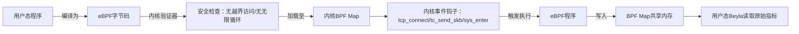
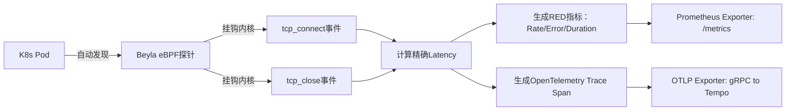
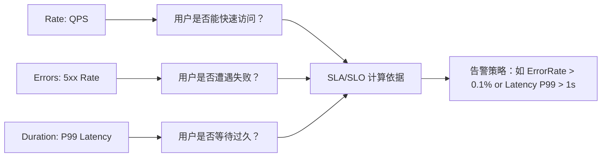
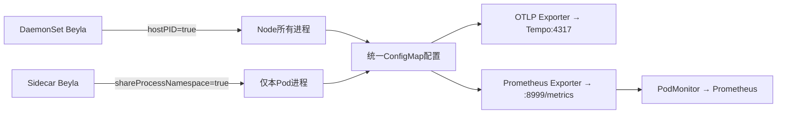
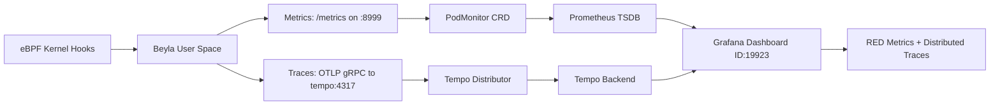

# Bella：基于eBPF的零侵入式可观测性工具详解

## 一、eBPF：Linux 内核的“安全沙箱程序引擎”

### 1、知识点详解

eBPF（extended Berkeley Packet Filter）是 Linux 5.8+ 内核内置的**轻量级虚拟机运行时**，允许用户态程序在不修改内核源码、不加载内核模块的前提下，**安全地注入自定义逻辑到内核关键路径**（如网络协议栈、系统调用入口、进程调度器）。其核心机制是：用户编写 C/LLVM 代码 → 编译为 eBPF 字节码 → 经内核验证器（Verifier）严格检查内存安全与循环限制 → 加载至内核 BPF Map 中执行。所有操作均在受控沙箱中完成，杜绝内核崩溃风险。eBPF 不是“抓包工具”，而是**内核可观测性的操作系统级基础设施**，为 Beyla 提供了无需修改应用代码即可捕获 TCP 连接、HTTP 请求、进程行为等底层事件的能力。

> **须知**：eBPF 要求 Linux ≥5.8，低于此版本无法启用。它不是“黑科技”，而是现代云原生监控的基石——就像 Docker 依赖 cgroups 一样，Beyla 依赖 eBPF。

## 二、Beyla：eBPF 驱动的零侵入观测代理

### 2、知识点详解

Beyla 是一款开源的 **eBPF 原生观测代理**，其核心价值在于：**无需在业务代码中植入任何 SDK（如 OpenTelemetry Java Agent）、无需重启服务、无需修改 Dockerfile**，即可自动发现并监控 Kubernetes 中所有 HTTP/HTTPS/gRPC/TCP 服务。它通过 eBPF 直接挂钩内核网络栈，在 `tcp_connect`（请求开始）和 `tcp_close`（响应结束）两个时间点精确计算请求耗时（Latency），该耗时包含：网络排队时间 + 内核协议栈处理时间 + 用户态应用处理时间。这比传统应用层埋点（仅记录 `start_time`/`end_time`）更精准，尤其在高负载下能捕获线程池排队延迟。Beyla 支持 Go/C++/Rust/Python 等多语言服务，并原生导出 OpenTelemetry 格式 Trace 与 Prometheus 格式 Metrics，实现厂商无关的可观测性。

> **须知**：Beyla 不是“魔法”，它依赖 Linux 内核能力。部署时必须开启 `hostPID: true`（访问宿主机进程）和 `privileged: true`（加载 eBPF 程序），否则无法工作。

## 三、RED 方法论：面向用户体验的核心指标

### 1、知识点详解 

RED 方法论（Rate, Errors, Duration）是由 Weaveworks 工程师提出、专为**微服务客户体验监控**设计的黄金指标集。它彻底摒弃传统系统指标（CPU/Memory），聚焦用户真实感受：  

- **Rate（速率）**：每秒请求数（QPS），反映服务吞吐能力；  
- **Errors（错误）**：每秒错误请求数（如 HTTP 5xx），直接关联用户失败率；  
- **Duration（持续时间）**：请求延迟（P95/P99 Latency），决定用户等待感知。  
  RED 与 USE（Utilization/Saturation/Errors）方法论本质不同：USE 关注“机器是否健康”（运维视角），RED 关注“用户是否满意”（业务视角）。例如，CPU 使用率 90% 但 RED 指标正常，说明服务仍可用；而 Latency P99 突增 2s，即使 CPU 仅 30%，用户已感知卡顿。Beyla 通过 eBPF 获取的 Duration 是端到端真实延迟，包含网络栈排队时间，这是传统 APM 工具无法提供的关键洞察。

> **须知**：RED 指标必须在 Grafana Dashboard（ID: 19923）中可视化。视频中反复强调：**不要看 CPU，要看 P99！**

## 四、Beyla 部署架构：DaemonSet vs Sidecar 模式

### 1、知识点详解

Beyla 提供两种生产级部署模式，本质是**监控粒度与资源开销的权衡**：  

- **DaemonSet 模式（推荐）**：每个 K8s Node 部署一个 Beyla 实例，通过 `hostPID: true` 访问宿主机所有进程，实现**集群全局监控**。优势：资源占用低（1个实例管全节点）、支持监控 kube-system 组件（如 CoreDNS）。需配置 `privileged: true` 加载 eBPF。  
- **Sidecar 模式**：为每个业务 Pod 注入 Beyla 容器，通过 `shareProcessNamespace: true` 共享进程命名空间，仅监控本 Pod。优势：隔离性强、调试方便；劣势：资源浪费（N 个 Pod 启 N 个 Beyla）、无法监控 DaemonSet 组件。  
  无论哪种模式，Beyla 均通过 ConfigMap 配置 OTLP 导出器（指向 Tempo）和 Prometheus Exporter（端口 8999），再由 Prometheus Operator 的 `PodMonitor` CRD 抓取指标。这是云原生标准集成方式，非 Beyla 特有。

## 五、完整数据流：从内核到 Grafana Dashboard

### 1、知识点详解

Beyla 的端到端数据流清晰体现云原生可观测性分层设计：  

1. **内核层**：eBPF 程序在 `tcp_connect`/`tcp_close` 钩子捕获连接事件，计算 Latency 并写入 BPF Map；  
2. **代理层**：Beyla 用户态进程轮询 BPF Map，聚合为 RED 指标（Prometheus 格式）和 Trace Span（OTLP 格式）；  
3. **传输层**：Metrics 通过 `/metrics` 端点暴露，由 Prometheus 的 `PodMonitor` 抓取；Traces 通过 gRPC 推送至 Tempo Distributor（端口 4317）；  
4. **存储层**：Prometheus 存储 Metrics；Tempo 存储 Trace；  
5. **展示层**：Grafana 通过 Prometheus Data Source 查询 Metrics，通过 Tempo Data Source 查询 Trace，并加载 RED Dashboard（ID: 19923）实现一体化视图。  
   整个链路无业务代码侵入，纯基础设施层集成。

> ⚠️ **须知**：视频中 Grafana 无数据，90% 原因为 `PodMonitor` 的 `selector.matchLabels` 未与 Beyla Pod 的 `labels` 对齐（如 `instrument: beyla`），务必用 `kubectl get pod -l instrument=beyla --show-labels` 验证标签一致性。

**总结**：Beyla 将 eBPF 的内核能力封装为开箱即用的观测代理，通过 RED 方法论将技术指标转化为业务语言，是云原生时代“零侵入可观测性”的最佳实践范本。掌握其原理与部署，是构建现代化 SRE 体系的关键一步。

