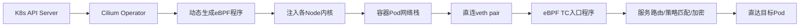
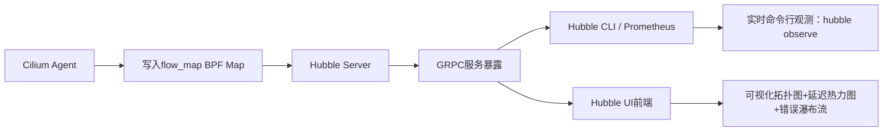

# Cilium + Hubble：基于 eBPF 的零侵入云原生可观测性实践


## 一、eBPF：Linux 内核的“安全沙箱式可编程引擎”

### 1、**知识点详解：**  

eBPF（extended Berkeley Packet Filter）是 Linux 5.4+ 内核引入的革命性机制，它允许用户在**不修改内核源码、不加载内核模块**的前提下，向内核注入经过严格验证的安全字节码程序。这些程序可挂载于网络收发（`skb`）、系统调用（`tracepoint`）、套接字（`socket filter`）等数十个内核钩子点，实现毫秒级数据包过滤、性能追踪与实时监控，彻底替代传统低效的 `iptables` 链路，是现代云原生可观测性的底层基石。


> **中文注释流程图说明**：  
> ① 用户编写 C/Go 程序 → ② 编译为 eBPF 字节码 → ③ 内核验证器强制检查内存安全与循环限制 → ④ 安全加载至内核虚拟机 → ⑤ 挂载到指定内核事件点（如网卡驱动前的 XDP 层）→ ⑥ 数据包抵达时自动触发 → ⑦ 结果存入高效哈希表（BPF Map）→ ⑧ 用户态工具（如 Hubble）实时读取分析。

## 二、Cilium：基于 eBPF 的云原生网络与安全平台

### 1、**知识点详解：**  

Cilium 是专为 Kubernetes 设计的 CNI 插件，其核心价值在于**完全抛弃 iptables/netfilter 旧架构**，直接利用 eBPF 在内核层实现服务发现、负载均衡、网络策略与加密通信。它将容器 IP、Service VIP、DNS 名称等全部映射为 eBPF Map 键值，使数据包转发路径从传统 7 层 iptables 链压缩至单次 eBPF 程序执行，延迟降低 60%+，并支持 L3/L4/L7（HTTP/gRPC/DNS）细粒度策略，是 K8s 多租户安全隔离的事实标准。



> ✅ **流程图说明**：  
> ① Operator 监听 K8s API 变更 → ② 实时生成适配新拓扑的 eBPF 代码 → ③ 分发至所有 Node 并加载 → ④ Pod 流量经 veth 进入内核 → ⑤ TC（Traffic Control）层 eBPF 程序拦截 → ⑥ 执行服务发现（查 Service Map）、策略校验（查 Policy Map）、TLS 加密 → ⑦ 无上下文切换直达目标，全程在内核完成。

## 三、Hubble：Cilium 原生的零侵入可观测性平台

### 1、**知识点详解：**  

Hubble 是 Cilium 官方配套的可观测性组件，它通过读取 Cilium eBPF 程序写入的 `flow` 类型 BPF Map，**无需在应用中埋点、无需修改业务代码、无需 Sidecar 注入**，即可实时捕获集群内所有网络流（含 HTTP 状态码、gRPC 方法、DNS 查询、TLS 握手结果）。它提供 CLI、REST API 与 Web UI 三层接口，将原始流量转化为服务依赖图、RED 指标（Rate/Errors/Duration）与拓扑告警，真正实现“开箱即用”的零侵入观测。



> ✅ **说明**：  
> ① Cilium Agent 将每条连接的五元组、协议类型、HTTP 状态、延迟等写入专用 flow_map → ② Hubble Server 作为 DaemonSet 持续轮询该 Map → ③ 通过 gRPC 对外统一提供数据服务 → ④ CLI 工具（`hubble observe`）直接订阅 → ⑤ Prometheus 通过 `/metrics` 端点拉取指标 → ⑥ Web UI 渲染为交互式服务地图，点击任一节点即可查看 P99 延迟、5xx 错误率等。

## 四、实战关键步骤：K3s 环境下的 Cilium+Hubble 部署

**必须配置的两个 K3s 启动参数（视频重点）：**  

- `--flannel-backend=none`：禁用 K3s 默认的 Flannel CNI，避免与 Cilium 冲突；  
- `--disable-network-policy=true`：关闭 K3s 自带的 NetworkPolicy 控制器，因 Cilium 将接管全部策略管理。  

**CLI 安装命令链（完整复现）：**  

```bash
# 1. 下载 Cilium CLI（Mac 示例）
curl -L --remote-name-all https://github.com/cilium/cilium/releases/download/v1.16.4/cilium-darwin-arm64.tar.gz
tar xzvf cilium-darwin-arm64.tar.gz
sudo mv cilium /usr/local/bin/

# 2. 配置 kubeconfig
export KUBECONFIG=/path/to/k3s.yaml

# 3. 安装 Cilium（指定版本）
cilium install --version 1.16.4

# 4. 启用 Hubble（含 UI）
cilium hubble enable --ui

# 5. 端口转发启动 UI
cilium hubble ui
```

> **提示**：若 `cilium status` 显示 `Warning: KubeProxyReplacement disabled`，属正常现象——因 K3s 已禁用 kube-proxy，Cilium 将完全替代其功能。

## 五、零侵入能力的本质：为什么无需修改一行业务代码？

**根本原因解析：**  
Hubble 的“零侵入”源于 eBPF 的**内核态旁路采集**特性：所有网络流量在进入容器用户态进程前，已被 Cilium eBPF 程序镜像一份元数据至 BPF Map。Hubble 仅读取该 Map，完全不干涉应用进程的内存、线程或网络栈。无论应用是 Python Flask、Java Spring 还是 Rust Axum，只要走 Linux 协议栈，Hubble 即可无差别捕获其 HTTP/gRPC/DNS 行为，真正实现基础设施层与业务层的彻底解耦。


