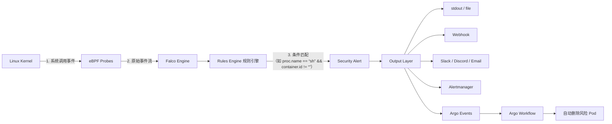
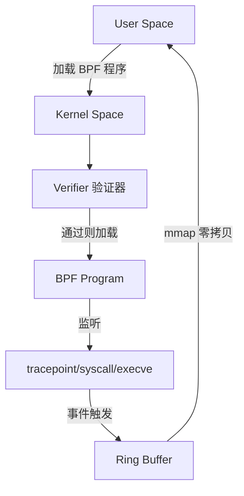
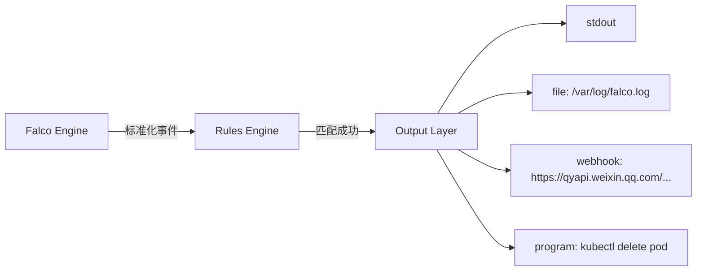
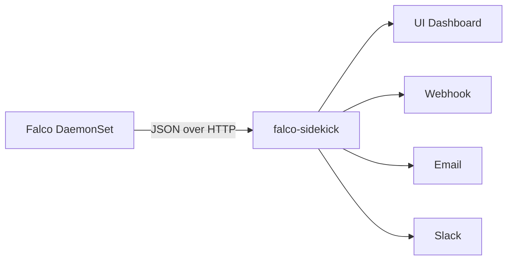
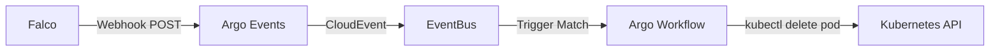

# 基于 eBPF 与 Falco 实现 Kubernetes 实时安全威胁检测


## 一、整体架构概览：eBPF + Falco 安全监测系统工作流

Falco 是 CNCF 毕业项目，是**首个开源的运行时容器安全检测引擎**。其核心能力依赖于 Linux 内核的 eBPF（extended Berkeley Packet Filter）技术，实现**无侵入、低开销、高精度的系统调用级行为捕获**。不同于传统基于日志或代理的方案，Falco 直接在内核态过滤进程行为，毫秒级响应恶意操作。



> **图解说明**：  
>
> - `A→B`：eBPF 在内核中挂载 tracepoint/kprobe，监听 `execve`, `openat`, `connect` 等敏感系统调用；  
> - `B→C`：事件经 ring buffer 零拷贝传递至用户态 Falco；  
> - `C→D`：Falco 加载 YAML 规则文件，对每个事件字段（`proc.name`, `container.id`, `user.name`, `evt.type`）做布尔逻辑匹配；  
> - `D→E`：命中规则即触发告警；  
> - `F→G`：输出层支持 10+ 种通知方式，国内可对接企业微信 Webhook（需自定义适配）；  
> - `G5→H→I`：通过 Argo Events 捕获 Falco Webhook 事件，驱动 Argo Workflow 执行 `kubectl delete pod`，实现**全自动隔离**。

## 二、核心知识点详解

### 1、知识点 1：eBPF 是什么？为什么它是安全监测的基石？

eBPF（extended Berkeley Packet Filter）是 Linux 内核自 3.18 版本起内置的**安全沙箱虚拟机**，允许用户态程序向内核注入受限的 C 代码（编译为 BPF 字节码），在不修改内核源码、不加载内核模块的前提下，安全高效地拦截和分析网络包、系统调用、内核函数等事件。它通过严格验证器（Verifier）确保代码无循环、无内存越界、无非法指针解引用，从根本上杜绝内核崩溃风险。Falco 利用 eBPF 的 `tracepoint` 类型探针，精准捕获容器进程的 `execve()` 调用，从而识别 `sh -c "rm -rf /"` 等高危命令。



> **理解**：eBPF 就像给内核装了一个“透明显微镜”，无需重启系统、不改一行内核代码，就能实时看到每个容器里执行了什么命令——这是传统工具完全做不到的。

### 2、知识点 2：Falco 架构三组件——Engine / Rules Engine / Output Layer

Falco 不是一个单体进程，而是三层解耦设计：  

- **Falco Engine**：核心事件采集与分发引擎，基于 libscap（system call capture library）从 ring buffer 读取原始事件，并补充上下文（如容器 ID、Pod 名、节点名）。它将原始事件标准化为统一结构体（含 `evt.time`, `proc.pid`, `container.id`, `k8s.pod.name` 等 50+ 字段）。  
- **Rules Engine**：基于 YAML 的声明式规则引擎。每条规则包含 `rule`（名称）、`desc`（描述）、`condition`（布尔表达式）、`output`（告警模板）、`priority`（等级）。例如检测容器内执行 `sh`：`condition: evt.type = execve and proc.name in (sh, bash, dash) and container.id != host`。  
- **Output Layer**：事件输出管道，支持同步/异步模式。默认输出到 stdout，但可通过 `-o "json_output: true"` 启用 JSON 格式，供下游系统解析；亦可配置 `webhook` 输出至任意 HTTP 接口。



> 💡 **理解**：Engine 是“眼睛”，Rules 是“大脑（判断标准）”，Output 是“嘴巴（喊出来）”。三者分离，便于规则热更新、输出渠道灵活切换。

### 3、知识点 3：Falco Rules 编写规范与实战示例（含完整 YAML）

Falco 规则文件（`.yaml`）必须遵循严格语法。以下为视频中触发告警的 `Terminal shell in container` 规则完整版（来自官方 `rules/falco_rules.yaml`）：

```yaml
- rule: Terminal shell in container
  desc: A shell was spawned by a non-shell program in a container (e.g. via exec or run)
  condition: >
    evt.type = execve and
    proc.name in (sh, bash, dash, zsh, ksh, csh, tcsh, fish) and
    container.id != host and
    not proc.name in (dockerd, containerd, runc, cri-o, kata-runtime)
  output: "A shell was spawned by a non-shell program in a container (user=%user.name %container.info shell=%proc.name parent=%proc.pname cmdline=%proc.cmdline)"
  priority: CRITICAL
  tags: [container, shell, mitre_execution]
```

> **字段详解**：  
>
> - `evt.type = execve`：仅捕获进程创建事件；  
> - `proc.name in (...)`：匹配所有常见 Shell 解释器；  
> - `container.id != host`：排除宿主机进程，只关注容器内；  
> - `not proc.name in (...)`：白名单过滤容器运行时自身调用，避免误报；  
> - `output` 中 `%container.info` 自动展开为 `k8s.ns=kube-system k8s.pod=nginx-7c8f9b6d5-2xwzg container.id=abc123`；  
> - `tags` 支持 MITRE ATT&CK 映射，便于安全运营归类。

> **理解**：写规则就像写“if 条件 then 告警”，但条件必须用 Falco 预定义字段（不能自己造），且逻辑要严谨（否则漏报/误报）。

### 4、知识点 4：Sidekick 组件——Falco 的可视化与告警中枢

Falco 本身无 UI，`falco-sidekick` 是官方推荐的轻量级 Sidecar，承担三大职责：  

1. **HTTP Server**：提供 `/metrics`（Prometheus）、`/healthz`（K8s Probe）；  
2. **UI Dashboard**：内置 Vue.js 前端，通过 `/` 访问，展示实时告警列表、统计图表、规则启用状态；  
3. **多通道告警网关**：将 Falco JSON 事件转换为 Slack、Email、Webhook、Kafka、Redis 等格式。例如发送至企业微信：

```yaml
# falco-sidekick-config.yaml
webhook:
  address: "https://qyapi.weixin.qq.com/cgi-bin/webhook/send?key=xxx"
  template: |
    {
      "msgtype": "text",
      "text": {
        "content": "🚨 Falco Alert\nRule: {{ .Rule }}\nTime: {{ .Time }}\nContainer: {{ .OutputFields.container.name }}\nCommand: {{ .OutputFields.proc.cmdline }}"
      }
    }
```

> **部署命令**

```bash
# 1. 添加 Helm 仓库
helm repo add falcosecurity https://falcosecurity.github.io/charts
helm repo update

# 2. 安装 Falco（启用 eBPF 驱动 + Sidekick UI）
helm install falco falcosecurity/falco \
  --namespace falco \
  --create-namespace \
  --set driver.kind=ebpf \
  --set sidekick.enabled=true \
  --set ui.enabled=true

# 3. 端口转发访问 UI
kubectl port-forward svc/falco-ui -n falco 2802:2802
# 浏览器打开 http://localhost:2802，账号 admin/admin
```



> **理解**：Sidekick 就是 Falco 的“秘书+喇叭+显示器”——它把 Falco 的原始告警翻译成人类能看懂的语言，并推送到你指定的地方。

### 5、 知识点 5：自动化响应闭环——Falco + Argo Events + Argo Workflow

视频最后提出的高级用法，构建 **Detection → Alert → Response** 无人值守闭环：  

1. Falco 检测到 `sh in container`，通过 Webhook 发送事件至 `argo-events` 的 EventSource；  
2. Argo Events 将事件解析为 CloudEvent 格式，触发预定义的 `EventBus`；  
3. EventBus 匹配 `trigger`，启动 `Argo Workflow`；  
4. Workflow 执行 `kubectl delete pod --namespace <ns> <pod-name>`，立即终止风险容器。



> **Workflow 示例片段**（`delete-pod.yaml`）：

```yaml
apiVersion: argoproj.io/v1alpha1
kind: Workflow
metadata:
  generateName: delete-pod-
spec:
  entrypoint: delete-pod
  arguments:
    parameters:
    - name: pod-name
      value: "{{workflow.parameters.pod-name}}"
    - name: namespace
      value: "{{workflow.parameters.namespace}}"
  templates:
  - name: delete-pod
    container:
      image: bitnami/kubectl:1.28
      command: [sh, -c]
      args:
      - kubectl delete pod "{{workflow.parameters.pod-name}}" -n "{{workflow.parameters.namespace}}"
```

> **理解**：这相当于给 Falco 装上了“自动手”，发现黑客进来了，不用人点鼠标，系统自己就把门锁死并报警。

## 三、总结：K8s 安全监测的工业化实践路径

| 阶段           | 工具                                  | 能力                                              | 小白起步建议                                |
| -------------- | ------------------------------------- | ------------------------------------------------- | ------------------------------------------- |
| **基础检测**   | Falco + eBPF                          | 实时捕获容器内 `execve`, `open`, `connect` 等行为 | 直接 `helm install`，观察 `uptime` 触发告警 |
| **可观测增强** | Falco + Sidekick + Prometheus/Grafana | 告警聚合、趋势分析、SLA 统计                      | 配置 `/metrics`，接入 Grafana Dashboard     |
| **告警协同**   | Falco + Sidekick + 企业微信 Webhook   | 一线运维即时响应                                  | 复制视频中 Webhook 模板，替换 key 即可      |
| **自动响应**   | Falco + Argo Events + Argo Workflow   | 检测即处置，RTO < 5 秒                            | 先在测试集群演练 `kubectl delete` Workflow  |

> **提醒**：安全不是功能，而是持续过程。Falco 规则需随业务演进持续优化——新增中间件？加 `redis-server` 进白名单；上线新数据库？补充 `pg_dump` 检测规则。**真正的安全能力，始于部署，成于运营。**

